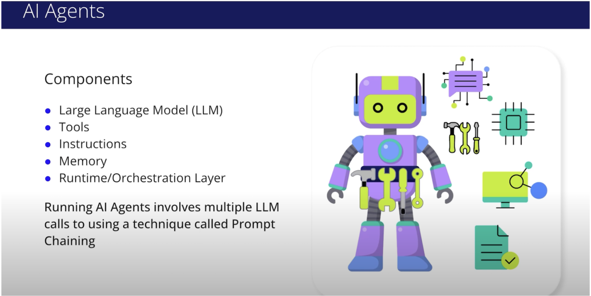

# 4. Chaining Prompts for Agentic Reasoning

$${\color{red}The \space content \space here \space corresponds \space to \space Sec. \space 9-10 \space of \space Udacity \space **Agentic \space AI** \space course.}$$

Recall the common components of an AI Agent:
* **Large Language Model (LLM)**: The "brain" for understanding, reasoning, acting.
* **Tools**: External functions, APIs for interaction and enhanced capabilities.
* **Instructions**: Guidelines (system prompts) defining behavior and goals.
* **Memory**: Short-term (context) & Long-term (history) for learning and consistency.
* **Runtime/Orchestration Layer**: Manages execution flow, tool usage, observation processing.

At its core, prompt chaining is simply about managing strings and making sequential API calls. We're going to build a complete prompt chain from scratch using basic Python to show you how it works. 

We’ll cover:
* **Sequential Prompting**: Using it for multi-step reasoning.
* **Task Chaining**: Connecting prompts by feeding one step's output to the next's input.
* **Gate Checks**: Using programmatic validation between steps for quality control.
* **Implementing Gate Checks**: Writing code for automatic verification.
* **Examples**: A prompt chain for a multi-part coding assignment (outline, code generation, validation, refinement).

## Prompt Chaining

A single, massive prompt for a complex task often leads to confusion and missed details
Sequential Prompting, or multi-step reasoning, is breaking down a complex task into a series of smaller, manageable sub-tasks (Task 1, Task 2, Task 3). Each sub-task is handled by its own prompt. This is fundamental to agentic workflows. Instead of: "Research AI agents, summarize the key concepts, and write a LinkedIn post about them.", break it down:
Prompt 1: "Research key concepts of AI agents." (Get response)
Prompt 2: "Summarize the output from the previous step." (Get response)
Prompt 3: "Draft a LinkedIn post based on the summary from the previous step."
You can do this with chatbots like ChatGPT by including a large document, extracting information, then summarizing, then drafting a post, all in the same chat history. This mirrors human problem-solving,

