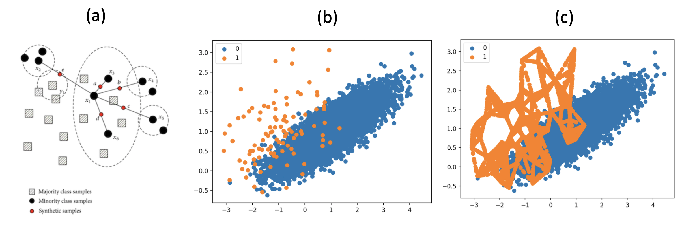
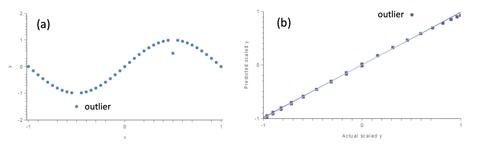
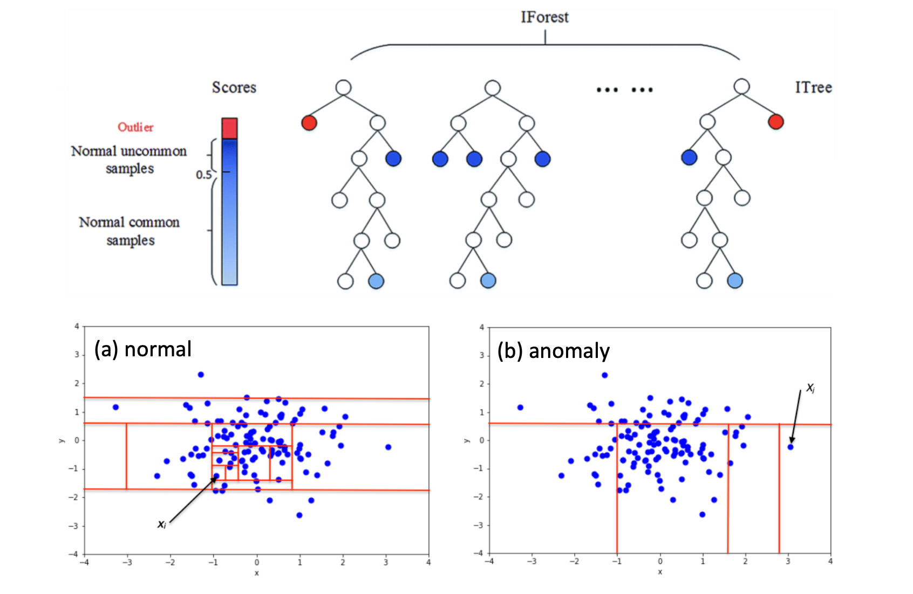

# ANOMALY DETECTION STUDY NOTE (AND BLOGS)


## 1. Is it not just Classification?

The answer is yes if the following three conditions are met. See [Introduction to Anomaly Detection: Concepts and Techniques][Introduction to Anomaly Detection: Concepts and Techniques].

 1. You have labeled training data
 2. Anomalous and normal classes are balanced ( say at least 1:5)
 3. Data is not autocorrelated. (Data point does not depend on earlier data points. Often breaks in time series data).
     
If all of above is true, we can just use an algorithm like Random Forests or Support Vector Machines (SVM). However, most anomaly problems have anomaly-normality 1:1000 to 1:10^6 where classes are highly imbalanced.

## 2. Three types of Anomalies or outliers

  1. Point Anomalies. If an individual data instance can be considered as anomalous with respect to the rest of the data (e.g. purchase with large transaction value)
  2. Contextual Anomalies. If a data instance is anomalous in a specific context, but not otherwise ( anomaly if occur at a certain time or a certain region. e.g. large spike at the middle of the night)
  3. Collective Anomalies. If a collection of related data instances is anomalous with respect to the entire dataset, but not individual values. They have two variations: 1) Events in unexpected order ( ordered. e.g. breaking rhythm in ECG) 2) Unexpected value combinations ( unordered. e.g. buying a large number of expensive items).

## 3. Metrics

Anomaly detection problems have to deal with trade-off between **recall**  and **precision**. In situations where we want to detect instances of a minority class, we are usually concerned more so with recall than precision, since it is usually **more costly to miss a positive instance than to falsely label a negative instance**. See Blog [[Devin Soni]][Dealing with Imbalanced Classes in Machine Learning].

Thus, when comparing approaches to imbalanced classification problems, consider using metrics beyond accuracy such as **recall, precision, and AUROC** [[Syed Sadat Nazrul]][Fraud Detection Under Extreme Class Imbalance]. It may be that switching the metric you optimize for during parameter selection or model selection is enough to provide desirable performance detecting the minority class.

However, there are some discussion [[Quora: What is the difference between a ROC curve and a precision-recall curve?]][What is the difference between a ROC curve and a precision-recall curve?] and [[log0]][Differences between Receiver Operating Characteristic AUC (ROC AUC) and Precision Recall AUC (PR AUC)] about the difference using **AUPR** and **AUROC**. Sometimes the area under the precision-recall curve **AUPR** is more useful in imblanced data. 

ROC curve plot True Positive Rate Vs. False Positive Rate; Whereas, PR curve plot Precision Vs. Recall. If the class is highly imbalanced and positive samples are very rare, then use PR-curve. One example may be fraud detection, where non-fraud sample may be 10000 and fraud sample may be below 100. In other cases, ROC curve will be more helpful.

Let’s take an example of fraud detection problem where there are 100 frauds out of 2 million samples [[Quora: What is the difference between a ROC curve and a precision-recall curve?]][What is the difference between a ROC curve and a precision-recall curve?].

    Algorithm 1: 90 relevant out of 100 identified (predicted positive = 100, so FP = 10)
    Algorithm 2: 90 relevant out of 1000 identified (predicted positive = 1000, so FP = 910)
 
    Evidently,  algorithm 1 is more preferable because it identified less number of false positive. 
    In the context of ROC curve,
    Algorithm 1: TPR=90/100=0.9, FPR= 10/1,999,900=0.00000500025
    Algorithm 2: TPR=90/100=0.9, FPR=910/1,999,900=0.00045502275
    The FPR difference is 0.0004500225

    For PR, Curve
    Algorithm 1: precision=0.9, recall=0.9
    Algorithm 2: Precision=90/1000=0.09, recall= 0.9
    Precision difference= 0.81

Thus, in this case, the difference is more apparent in **PR curve**.

If we wanted a balance between precision and recall then we’d look at F1 score [[Numal Jayawardena]][How to Deal with Imbalanced Data]
```
F1 = 2 * precsion * recall/(precsion + recall)
```

**Kappa (or Cohen’s kappa)**: Classification accuracy normalized by the imbalance of the classes in the data [[Numal Jayawardena]][How to Deal with Imbalanced Data].


## 4. Data Preprocess

A simple way to fix imbalanced data-sets is simply to balance them, either by oversampling the minority class or undersampling the majority class. See Blogs: [[Devin Soni]][Dealing with Imbalanced Classes in Machine Learning], [[Syed Sadat Nazrul]][Fraud Detection Under Extreme Class Imbalance] and 
[[Elite Data Science]][How to Handle Imbalanced Classes in Machine Learning].

### 4.1 Undersample: Down-sample Majority Class

Undersampling involves randomly removing observations from the majority class. The most common heuristic for doing so is resampling without replacement. Generating centroid based on a clustering method (e.g. K-Means) is a common strategy for this.

You may wonder and worry why downsampling works. Is it realistic if we downsample majority class? The point is that we train a classifier to learn pattern. To predict new data, we determine a threshold value for decision. See [Cross Validated: Why downsample?](https://stats.stackexchange.com/questions/122409/why-downsample)


### 4.2 Oversample: Up-sample Minority Class

Oversampling is the process of randomly duplicating observations from the minority class. We'll resample the minority class **with replacement**, setting the number of samples to match that of the majority class.

Note both oversample and undersample changes data distribution [[Silicon Valley Data Science]][Learning from Imbalanced Classe]. Oversample makes variables appear to have lower variance than they do. Conversely, undersampling can make the independent variables look like they have a higher variance than they do. 

### 4.3 Synthesize Minor Samples

Rather than randomly duplicating minority class, creating synthetic samples is a close cousin of up-sampling. For example, the **SMOTE** [(Synthetic Minority Oversampling TEchnique)](https://www.cs.cmu.edu/afs/cs/project/jair/pub/volume16/chawla02a-html/chawla2002.html) and **ADASYN** algorithms [[Digital Catapult]][Dealing with Imbalanced Data] are methods of resampling from the minority class while slightly perturbing feature values, thereby creating "new" samples. The blog [[Devin Soni]][Dealing with Imbalanced Classes in Machine Learning] simply interprets how to synthesize minority class. SMOTE was generally successful and led to many variants, extensions, and adaptations to different concept learning algorithms [[Silicon Valley Data Science]][Learning from Imbalanced Classe].

**SMOTE** creates new instances of the minority class by forming convex combinations of neighboring instances. [[Devin Soni]][Dealing with Imbalanced Classes in Machine Learning] As the graphic below shows (credit: (a) from [[Devin Soni]][Dealing with Imbalanced Classes in Machine Learning] and (b,c) from [[Jason Brownlee]][SMOTE for Imbalanced Classification with Python]), it effectively draws lines between minority points in the feature space, explained in (a), and samples along these lines. This allows us to balance our data-set without as much overfitting, as we create new synthetic examples rather than using duplicates. 



Above (c) shows generated SMOTE data from (b). The blog [[Cornellius Yudha Wijaya]][5 SMOTE Techniques for Oversampling your Imbalance Data] discussed more extension about SMOTE.


However, Marco, brought up a great point about the risks of using SMOTE without proper cross-validation. See Blog [[Marco Altini]][DEALING WITH IMBALANCED DATA: UNDERSAMPLING, OVERSAMPLING AND PROPER CROSS-VALIDATION].


## 5. Anomaly Detection Techniques

According to the [KDD article](https://www.kdnuggets.com/2017/01/3-methods-deal-outliers.html), 3 different methods to use and clean it from the data set:

* **Univariate method**: One of the simplest methods for detecting outliers is the use of box plots, below (a).
* **Multivariate method**:  solve that by building a model using all the data available, below (b).
* **Minkowski error**: Unlike the univariate and multivariate methods, it doesn’t detect and clean the outliers. Instead, it reduces the impact that outliers will have in the model, i.e. reduces the contribution of outliers to the total error.

 


### 5.1 Inference: Z score and Modified Z score
The z-score or standard score of an observation is a metric that indicates how many standard deviations a data point is from the sample’s mean, assuming a gaussian distribution [[Sergio Santoyo]][A Brief Overview of Outlier Detection Techniques]. The z-score of any data point can be calculated as
    
<a href="https://www.codecogs.com/eqnedit.php?latex=z&space;=&space;\frac{x-\bar{x}}{\sigma}" target="_blank"></a>

The modified Z score `M` is defined as [[NIST/SEMATECH e-Handbook of Statistical Methods]][Detection of Outliers]

<a href="https://www.codecogs.com/eqnedit.php?latex=\textrm{M}&space;=&space;\frac{0.6745(x-\widetilde{x})}{\textrm{MAD}}" target="_blank"></a>
     
where `MAD` denoting the median absolute deviation and `x̃`  denoting the median. The modified Z-scores with an absolute value of greater than 3.5 is labeled as potential outliers.

The cons for the Z scores are that it is only convenient to use in a low dimensional feature space, in a small to medium sized dataset and not recommended when distributions can not be assumed to be parametric [[Sergio Santoyo]][A Brief Overview of Outlier Detection Techniques].

### 5.2 Supervised Learning

Generally, the class imbalance is solved using an ensemble built by resampling data many times.  The idea is to first create new datasets by taking **all anomalous data points** and **adding a subset of normal data points** (e.g. as 4 times as anomalous data points). Then a classifier is built for each data set using SVM or Random Forest, and those classifiers are combined using ensemble learning. This approach has worked well and produced very good results [[Srinath Perera]][Introduction to Anomaly Detection: Concepts and Techniques].

#### 5.2.1 Use Tree-Based Algorithms
We can also consider tree-based algorithms. Decision trees often perform well on imbalanced datasets because their hierarchical structure allows them to learn signals from both classes. In modern applied machine learning, tree ensembles (Random Forests, Gradient Boosted Trees, etc.) almost always outperform singular decision trees [[Elite Data Science]][How to Handle Imbalanced Classes in Machine Learning].

#### 5.2.2 Penalize Algorithms (Cost-Sensitive Training)

Another tactic is to use penalized learning algorithms that increase the cost of classification mistakes on the minority class [[Devin Soni]][Dealing with Imbalanced Classes in Machine Learning] and [[Elite Data Science]][How to Handle Imbalanced Classes in Machine Learning].
In regular learning, we treat all misclassifications equally, which causes issues in imbalanced classification problems, as there is no extra reward for identifying the minority class over the majority class. 

Cost-sensitive learning allows us to **penalize misclassifications of the minority class** more heavily than we do with misclassifications of the majority class, in hopes that this increases the true positive rate. A common scheme for this is to have the cost equal to the inverse of the proportion of the data-set that the class makes up. This increases the penalization as the class size decreases.

A popular algorithm for this technique is Penalized-SVM, During training, we can use the argument `class_weight='balanced'` to penalize mistakes on the minority class by an amount proportional to how under-represented it is. Another penalized algorithms is penalized-LDA [[Syed Sadat Nazrul]][Fraud Detection Under Extreme Class Imbalance].


### 5.3 Unsupervised Learning

If your training data does not have label, using unsupervised learning and semi-supervised learning. However, after building the model, you will have no idea how well it is doing as you have nothing to test it against. Hence, the results of those methods need to be tested in the field before placing them in the critical path.

#### 5.3.1 Dbscan (Density Based Spatial Clustering) [[Sergio Santoyo]][A Brief Overview of Outlier Detection Techniques]

Dbscan is a density based clustering algorithm, focusing on finding neighbors by density (MinPts) on an ‘n-dimensional sphere’ with radius ɛ. A cluster can be defined as the maximal set of ‘density connected points’ in the feature space. The complexity of dbscan is of O(n log n). Outliers (noise) will be assigned to the -1 cluster. 

After **rescaling (standardize)** the features, choose the spatial metric on which dbscan will perform the clustering. The metric must be chosen depending on the problem, an euclidean metric works well for 2 or 3 dimensions, the manhattan metric can also be useful when dealing with higher dimensional feature spaces 4 or more dimensions.

The parameter `eps (ɛ)` must be chosen accordingly to perform clustering. If `ɛ` is too big many points will be density connected, if its too small the clustering will result in many meaningless clusters. A good approach is to try values ranging from 0.25 to 0.75.

The cons of Dbscan are that selecting the optimal parameters eps, MinPts and metric can be difficult since it is very sensitive to any of the three params [[Sergio Santoyo]][A Brief Overview of Outlier Detection Techniques].

#### 5.3.2 Isolation Forests [[Sergio Santoyo]][A Brief Overview of Outlier Detection Techniques]

One of approaches to solving the imbalance problem is to discard the minority examples and treat it as a single-class (or anomaly detection) problem. Isolation forest implemented the concept.

Isolation forest’s basic principle is that outliers are few and far from the rest of the observations. For prediction, it compares an observation against that splitting value in a “node”, that node will have two node children on which another **random** comparisons will be made.  In these trees, partitions are created by first **randomly selecting a feature** and then **selecting a random split** value between the minimum and maximum value of the selected feature. 

In the isolation forest method, an outlier score can computed for each observation (from [wiki](https://en.wikipedia.org/wiki/Isolation_forest)):

<a href="https://www.codecogs.com/eqnedit.php?latex=s(x,&space;n)&space;=&space;2^{-\frac{E(h(x))}{c(n)}}" target="_blank"></a>

where `E(h(x))` is the average value of `h(x)` from a collection of iTrees; `h(x)` is the "path length" of the sample `x`, and `c(n)` is the ‘unsuccessful length search’ of a binary tree (the maximum path length of a binary tree from root to external node) `n` is the number of external nodes. 


“path length” is defined as the number of “splittings” made by the algorithm for an instance. As shown below, outliers will have shorter path lengths than the rest of the observations (pictures from [wiki](https://en.wikipedia.org/wiki/Isolation_forest) and [[Sergio Santoyo]][A Brief Overview of Outlier Detection Techniques]). Also see the [notebook example](https://github.com/HsiangHung/Machine_Learning_Note/blob/master/Anomaly_Detection/outlier_methods_sklearn.ipynb).



If the outlier score `s(x,n)` is close to 1, then `x` is very likely to be an anomaly. On the other hand, if the score is smaller than 0.5, then `x` is likely to be a normal value. Thus smaller `E(h(x))` (shorter path length) and larger `c(n)` cause a larger outleir score. 

The determination threshold can be specified, i.e. 0.55 or 0.60, not just at 0.5.

In [scikit-learn](https://scikit-learn.org/stable/modules/generated/sklearn.ensemble.IsolationForest.html), the method `predict(X)` predicts if a `X` is an outlier or not `{1,-1}`. `score_samples(X)` gives **opposite** of the anomaly score defined in the original paper: the lower, the more abnormal.

The anomaly score of an input sample is computed as the mean anomaly score of the trees in the forest.


The cons of isolation forest include that visualizing results is complicated, and if not correctly optimized, training time can be very long and computationally expensive [[Sergio Santoyo]][A Brief Overview of Outlier Detection Techniques].


## 6. Time-Series Anomaly Detection

[Oracle article: Introduction: Anomaly Detection](https://www.datascience.com/blog/python-anomaly-detection)

## Reference


[5 SMOTE Techniques for Oversampling your Imbalance Data]: https://towardsdatascience.com/5-smote-techniques-for-oversampling-your-imbalance-data-b8155bdbe2b5
[[Cornellius Yudha Wijaya] 5 SMOTE Techniques for Oversampling your Imbalance Data](https://towardsdatascience.com/5-smote-techniques-for-oversampling-your-imbalance-data-b8155bdbe2b5)


[Dealing with Imbalanced Classes in Machine Learning]: https://towardsdatascience.com/dealing-with-imbalanced-classes-in-machine-learning-d43d6fa19d2
[[Devin Soni] Dealing with Imbalanced Classes in Machine Learning](https://towardsdatascience.com/dealing-with-imbalanced-classes-in-machine-learning-d43d6fa19d2)


[Dealing with Imbalanced Data]: https://medium.com/digital-catapult/dealing-with-imbalanced-data-8b21e6deb6cd
[[Digital Catapult] Dealing with Imbalanced Data](https://medium.com/digital-catapult/dealing-with-imbalanced-data-8b21e6deb6cd)


[How to Handle Imbalanced Classes in Machine Learning]: https://elitedatascience.com/imbalanced-classes
[[Elite Data Science] How to Handle Imbalanced Classes in Machine Learning](https://elitedatascience.com/imbalanced-classes)


[Outlier Detection with Isolation Forest]: https://towardsdatascience.com/outlier-detection-with-isolation-forest-3d190448d45e
[[Eryk Lewinson] Outlier Detection with Isolation Forest](https://towardsdatascience.com/outlier-detection-with-isolation-forest-3d190448d45e)


[SMOTE for Imbalanced Classification with Python]: https://machinelearningmastery.com/smote-oversampling-for-imbalanced-classification/
[[Jason Brownlee] SMOTE for Imbalanced Classification with Python](https://machinelearningmastery.com/smote-oversampling-for-imbalanced-classification/)


[Differences between Receiver Operating Characteristic AUC (ROC AUC) and Precision Recall AUC (PR AUC)]: http://www.chioka.in/differences-between-roc-auc-and-pr-auc/
[[log0] Differences between Receiver Operating Characteristic AUC (ROC AUC) and Precision Recall AUC (PR AUC)](http://www.chioka.in/differences-between-roc-auc-and-pr-auc/)


[DEALING WITH IMBALANCED DATA: UNDERSAMPLING, OVERSAMPLING AND PROPER CROSS-VALIDATION]: https://www.marcoaltini.com/blog/dealing-with-imbalanced-data-undersampling-oversampling-and-proper-cross-validation
[[Marco Altini] DEALING WITH IMBALANCED DATA: UNDERSAMPLING, OVERSAMPLING AND PROPER CROSS-VALIDATION](https://www.marcoaltini.com/blog/dealing-with-imbalanced-data-undersampling-oversampling-and-proper-cross-validation)


[Detection of Outliers]: https://www.itl.nist.gov/div898/handbook/eda/section3/eda35h.htm
[[NIST/SEMATECH e-Handbook of Statistical Methods] Detection of Outliers](https://www.itl.nist.gov/div898/handbook/eda/section3/eda35h.htm)


[How to Deal with Imbalanced Data]: https://towardsdatascience.com/how-to-deal-with-imbalanced-data-34ab7db9b100
[[Numal Jayawardena] How to Deal with Imbalanced Data](https://towardsdatascience.com/how-to-deal-with-imbalanced-data-34ab7db9b100)


[What is the difference between a ROC curve and a precision-recall curve?]: https://www.quora.com/What-is-the-difference-between-a-ROC-curve-and-a-precision-recall-curve-When-should-I-use-each
[[Quora: What is the difference between a ROC curve and a precision-recall curve?] What is the difference between a ROC curve and a precision-recall curve?](https://www.quora.com/What-is-the-difference-between-a-ROC-curve-and-a-precision-recall-curve-When-should-I-use-each)


[A Brief Overview of Outlier Detection Techniques]: https://towardsdatascience.com/a-brief-overview-of-outlier-detection-techniques-1e0b2c19e561
[[Sergio Santoyo] A Brief Overview of Outlier Detection Techniques](https://towardsdatascience.com/a-brief-overview-of-outlier-detection-techniques-1e0b2c19e561)


[Learning from Imbalanced Classe]: https://www.svds.com/learning-imbalanced-classes/
[[Silicon Valley Data Science] Learning from Imbalanced Classe](https://www.svds.com/learning-imbalanced-classes/)


[Introduction to Anomaly Detection: Concepts and Techniques]: https://iwringer.wordpress.com/2015/11/17/anomaly-detection-concepts-and-techniques/
[[Srinath Perera] Introduction to Anomaly Detection: Concepts and Techniques](https://iwringer.wordpress.com/2015/11/17/anomaly-detection-concepts-and-techniques/)


[Fraud Detection Under Extreme Class Imbalance]: https://towardsdatascience.com/fraud-detection-under-extreme-class-imbalance-c241854e60c
[[Syed Sadat Nazrul] Fraud Detection Under Extreme Class Imbalance](https://towardsdatascience.com/fraud-detection-under-extreme-class-imbalance-c241854e60c)


