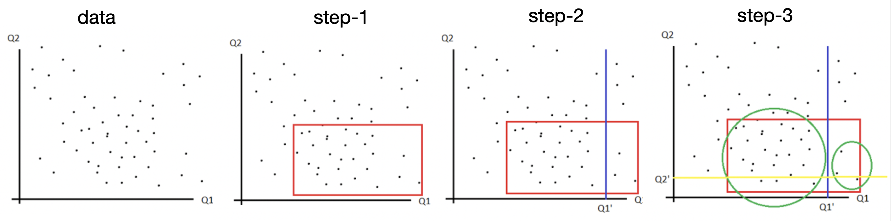

# Isolation Forest

This session is dedicated to deep understanding on isolation forest model. “Fewer and different” data points are the main idea; outliers ar more isolated than others; in other words, outliers takes less path for them to be isolated.


Table of Contents:

* [1. Isolation tree and forest](https://github.com/HsiangHung/Machine_Learning_Note/tree/master/Anomaly_Detection/isolation_forest#1-isolation-tree-and-forest)
     * [1.A The algorithm](https://github.com/HsiangHung/Machine_Learning_Note/tree/master/Anomaly_Detection/isolation_forest#1a-the-algorithm) 
     * [1.B Interpretation](https://github.com/HsiangHung/Machine_Learning_Note/tree/master/Anomaly_Detection/isolation_forest#1b-interpretation)
* [2. Algorithm main points/summary](https://github.com/HsiangHung/Machine_Learning_Note/tree/master/Anomaly_Detection/isolation_forest#2-algorithm-main-pointssummary)
     


## Isolation Forest From Scratch

The following Python follows the blog: [[Carlos Mougan]][Isolation Forest from Scratch] and [[Hyunsu Kim]][Isolation Forest Step by Step].

## 1. Isolation tree and forest

### 1.A The algorithm

This session explains how to build an isolation forest step by step [[Hyunsu Kim]][Isolation Forest Step by Step]

* **Step 1** — Subsampling data for training

* **Step 2** — Making binary decision tree: Suppose we have two attributes (i.e. Q1 or Q2) as shown below, random choice of an attribute and random choice of a Q1 or Q2 value between its min and max (i.e. Q1’)

* **Step 3** — Repeat step 2 Iteratively until each data is isolated as a leaf or specified maximum depth is reached.

So far the step 1-3 can be summarized below



* **Step 4** — Feeding data set and calculating anomaly score, which is defined as 

$$S(x, n) = 2^{-\frac{\mathbb{E}[h(x)]}{c(n)}}$$

Given a data point, we have an anomaly score for each tree and get the final anomaly score for an entire forest by the mean value across different trees. $h(x)$ is the path length for $x$, and $\mathbb{E}[h(x)]$ denotes mean path length. 


5. **Step 5** - Compute anomaly score: We calculate this anomaly score for each tree and average them out across different trees and get the final anomaly score for an entire forest for a given data point

### 1.B Interpretation

We show how the isolation forest works step by step using the above code. Suppose we have five 2D data instances like

| | feat1 | feat2|
|:-:|:-:| :-:|
|A|  3.300000 | 3.500000 |
|B| -0.397208 | 0.431104 |
|C|  0.749262 |-0.372847 |
|D|  0.167278 |-0.045711 |
|E|  1.752083 | 2.873332 |

Obviously `A` is the outlier and others are normal.

Next we train 3 isolation trees in the forest:
```Python 
iForest = isolation_forest(X, n_trees=3, max_depth=100)
```
After training, we can print out the trees:
```
{'feat1 <= 2.2181214836809806': [{'feat1 <= 1.7389572375053777': [{'feat1 <= 0.18538491015441844': [{'feat2 <= 0.39944974852534676': [-0.04571121291250773, 0.4311043323198237]}, -0.3728472765820943]}, 2.8733315826978525]}, 3.5]}

{'feat2 <= 1.587423467387756': [{'feat2 <= 0.31144846892514394': [{'feat2 <= -0.12499170741512142': [-0.3728472765820943, -0.04571121291250773]}, 0.4311043323198237]}, {'feat1 <= 3.248530739825105': [2.8733315826978525, 3.5]}]}

{'feat2 <= 0.1706085041001812': [{'feat1 <= 0.21151501086291638': [-0.04571121291250773, -0.3728472765820943]}, {'feat1 <= 0.3953008359360611': [0.4311043323198237, {'feat1 <= 2.438234497822728': [2.8733315826978525, 3.5]}]}]}
```
The trees are illustrated below:
```
                  tree-1   |                    tree-2               |                 tree-3
                   ABCDE   |                    ABCDE                |                 ABCDE
feat1 < 2.22      /    \   | feat2 < 1.59      /   \                 | feat2 < 0.17   /    \
                 BCDE   A  |                  BCD   AE               |               CD    ABE
feat1 < 1.74     /   \     | feat2 < 0.31    / \    / \ feat1 > 3.25 | feat1 < 0.21  /\    / \  feat1 > 0.39           
                BCD   E    |                CD  B  E   A             |              D  C  B  AE
feat1 < 0.19   / \         | feat2 < -0.13  / \                      | feat1 < 2.44          /\
              BD  C        |               D   C                     |                      E  A
feat2 < 0.4  / \           |                                         |
            D   B          |                                         |
```


**An outlier is more isolated, and have shorter path length**. The path length for data `A` on each tree is [1,2,3], meaning avg path length = 2. On the other hand, path lengths `B`: [4,2,2], `C`: [3,3,2], `D`: [4,3,2], `E`: [2,2,3] are all larger than 2, which indicate normal data points.


   
## 2. Algorithm main points/summary

The blog [[Andrew Young]][Isolation Forest is the best Anomaly Detection Algorithm for Big Data Right Now] provided a grossly simplified summary of the 10 page paper with the following overview:

1. Most other outlier detection (OD) algorithms seek to **build a profile of “normal” instances then flag instances** that don’t fit that profile of normality. iForest explicitly isolates anomalous records by taking advantage of inherent properties of anomalies: they have unusual values for the set of covariates.

2. Existing methods are constrained to low dimensional data and small data size due to computational expense.

3. Additionally, iForest has “a low constant and low memory requirement” i.e. low overhead. Specifics: the number of external nodes is n since each observation, n, is isolated by itself. The total number of internal nodes is clearly n-1, and the total number nodes is 2n-1. Hence, we see why the **memory requirement** is bounded and **grows linearly with n**.

4. Isolation tree node definition: T is either a childless external node or an internal node with one test and exactly two daughter nodes $(T_l, T_r)$. To build an iTree, we recursively divide X by randomly selecting an attribute q and a split value p until either: 
   *  the tree reaches a height limit
   *  all observations are isolated at their own external node
   *  all data have the same values for all attributes.

5. Path length. The path length $h(x)$ of an observation $x$ is measured by the number of edges that $x$ traverses an iTree from the root node until transversal is terminated at an external node. $\mathbb{E}[h(x)]$ is the average of $h(x)$ from a collection of isolation trees. An anomaly score $S(x, n)$ is derived from the **average** path length, $\mathbb{E}[h(x)]: S(x, n) = 2^{− \mathbb{E}[h(x)] / c(n)}$. Basically, there is a monotonic relationship between $S(x,n)$ and $\mathbb{E}[h(x)]$ and the term $c(n)$ is a constant for any given static dataset.

6. Only requires user to set two variables in isolation forest: **the number of trees** to build and the **sub-sampling size**. 

7. Small subsampling (sample of a sample) size addresses swamping and masking issues. Swamping and masking are caused by input data that is too large for the purposes of anomaly detection. Swamping is when an “normal” observation is mistaken for an “anomalous” one because it is surrounded by anomalies and masking is the opposite. In other words, when a tree is fed a sample consisting of a majority of anomalies, a normal data point might look anomalous. 

8. **Small subsamples** allows each isolation tree to be specialized, as each sub-sample includes a different set of anomalies or even no anomaly

9. iForest does **NOT** depend on any **distance** or **density-based** measures to identify anomalies so it is fast and computationally inexpensive, which leads to the next point

10. **Linear time complexity, O(n)**. Informally, this means that the running time increases at most linearly with the size of the input. 


### Reference

* [Isolation Forest is the best Anomaly Detection Algorithm for Big Data Right Now]: https://towardsdatascience.com/isolation-forest-is-the-best-anomaly-detection-algorithm-for-big-data-right-now-e1a18ec0f94f
[[Andrew Young] Isolation Forest is the best Anomaly Detection Algorithm for Big Data Right Now](https://towardsdatascience.com/isolation-forest-is-the-best-anomaly-detection-algorithm-for-big-data-right-now-e1a18ec0f94f)
* [Isolation Forest from Scratch]: https://towardsdatascience.com/isolation-forest-from-scratch-e7e5978e6f4c
[[Carlos Mougan] Isolation Forest from Scratch](https://towardsdatascience.com/isolation-forest-from-scratch-e7e5978e6f4c)
* [Outlier Detection with Extended Isolation Forest]: https://towardsdatascience.com/outlier-detection-with-extended-isolation-forest-1e248a3fe97b
[[Eryk Lewinson] Outlier Detection with Extended Isolation Forest](https://towardsdatascience.com/outlier-detection-with-extended-isolation-forest-1e248a3fe97b)
* [Isolation Forest Step by Step]: https://hyunsukim-9320.medium.com/isolation-forest-step-by-step-341b82923168
[[Hyunsu Kim] Isolation Forest Step by Step](https://hyunsukim-9320.medium.com/isolation-forest-step-by-step-341b82923168)
* [Anomaly Detection Using Isolation Forest Algorithm]: https://medium.com/analytics-vidhya/anomaly-detection-using-isolation-forest-algorithm-8cf36c38d6f7
[[Saurabh Singh] Anomaly Detection Using Isolation Forest Algorithm](https://medium.com/analytics-vidhya/anomaly-detection-using-isolation-forest-algorithm-8cf36c38d6f7)

