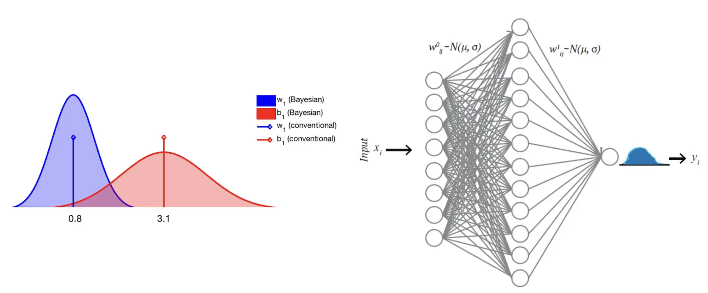

# Bayesian Neural Network

**Content**

[1. Bayesian Statistics](https://github.com/HsiangHung/MachineLearningNote/tree/master/Bayesian%20and%20MCMC#1-bayesian-statistics)

[2. Maximum Likelihood/a Posteriori Estimation](https://github.com/HsiangHung/MachineLearningNote/tree/master/Bayesian%20and%20MCMC#2-maximum-likelihooda-posteriori-estimation)

[3. Markov Chain Monte Carlo for Bayesian Inference](https://github.com/HsiangHung/MachineLearningNote/tree/master/Bayesian%20and%20MCMC#3-markov-chain-monte-carlo-for-bayesian-inference)

# 1. Bayesian Neural Networks (BNN)

In a traditional neural network, weights $\bf{w}$ = $(w_1, w_2, \cdots, b_1, b_2, \cdots)$ are assigned as a single value or point estimate, whereas in BNN, weights are considered a probability distribution. These probability distributions of network weights are used to estimate the **uncertainty** in weights and predictions. 

The figure below shows a schematic diagram of a BNN [[Stefano Cosentino]][Deep Bayesian Neural Networks], [[Sabber Ahamed]][Bayesian Neural network].

The left hand panel shows the idea where $(w_1, b_1)$ truns from single values to distributions [[Stefano Cosentino]][Deep Bayesian Neural Networks]. The right hand panel describes in the networks all weights are described by normal distributions [[Sabber Ahamed]][Bayesian Neural network]. Thus, it becomes possible to sample from a distribution many many times and see how this affects the predictions of the model. If it gives consistent predictions, sampling after sampling, then the net is said to be “confident” about its predictions.

Given data $\bf{X}$, the likelihood of observing $\bf{X}$, given weights $\bf{w}$ is calculated using Bayes theorem as:

$$p(\bf{w}|\bf{X}) = \frac{p(\bf{X}|\bf{x})p(\bf{w})}{p(\bf{w})},$$

where $p(\bf{w})$ is the prior belief of the weights as known as `model evidence`, equals to the integration over all possible values of the weights as:

$$p(\bf{w}) = \int p(\bf{X}|\bf{x})p(\bf{w}) d\bf{w}.$$

Integrating all over the indefinite weights in evidence makes it hard to find a closed-form analytical solution. Therefore we resort to pseudo-numerical approaches to solve the integration [[Stefano Cosentino]][Deep Bayesian Neural Networks]:

1. Approximating the integral with MCMC
2. Using black-box variational inference VI, (with edward)
3. Using MC dropout

Usually MCMC sampling is slow for large datasets or complex models. Variational inference (VI), on the other hand, is faster than other methods. It has also been applied to solve many large-scale computationally expensive neuroscience and computer vision problems.

## 2 MCMC

## 3 Variational Inference (VI)

VI considers a new distribution $q(w|\theta)$ to approximates the true posterior $p(w|\bf{X})$. VI finds the right set of that minimizes the divergence of two distributions through optimization [[Sabber Ahamed]][Bayesian Neural network]

$$q^*(w|\theta) = \textrm{argmin}_{\theta} \bf{KL}\left[ q(w|\theta) || p(w|\bf{X}) \right],$$

where **KL** means Kullback–Leibler divergence which is used to describe information-theoretic measure of similarity (relative entropy) between true and approximated distributions. The KL divergence is defined as 

$$ \bf{KL}\left[ q(w|\theta) || p(w|\bf{X}) \right] &=& \int q(w|\theta) \log \left( \frac{q(w|\theta)}{p(w|\bf{X})} \right) dw \nn \ &=& a $$

[Bayesian Neural network]: https://towardsdatascience.com/bayesian-neural-network-7041dd09f2cc
[[Sabber Ahamed] Bayesian Neural network](https://towardsdatascience.com/bayesian-neural-network-7041dd09f2cc)

[Deep Bayesian Neural Networks]: https://stefano-cosentino.medium.com/deep-bayesian-neural-networks-952763a9537
[[Stefano Cosentino] Deep Bayesian Neural Networks](https://stefano-cosentino.medium.com/deep-bayesian-neural-networks-952763a9537)

