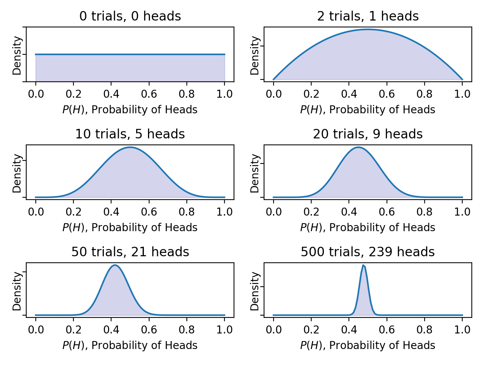

# Bayesian Statistics, MLE/MAP and Markov Chain Monte Carlo

**Content**

[1. Bayesian Statistics](https://github.com/HsiangHung/MachineLearningNote/tree/master/Bayesian%20and%20MCMC#1-bayesian-statistics)

[2. Maximum Likelihood/a Posteriori Estimation](https://github.com/HsiangHung/MachineLearningNote/tree/master/Bayesian%20and%20MCMC#2-maximum-likelihooda-posteriori-estimation)


[3. Markov Chain Monte Carlo for Bayesian Inference](https://github.com/HsiangHung/MachineLearningNote/tree/master/Bayesian%20and%20MCMC#3-markov-chain-monte-carlo-for-bayesian-inference)


# 1. Bayesian Statistics

## 1.1 Frequentist and Bayesian

There are two very different approaches of statistical inference from probabilistic systems - frequentist and Bayesian, with very different philosophies [[QuantStart Team, 1]][Bayesian Statistics: A Beginner's Guide].

Frequentist statistics tries to eliminate uncertainty by providing estimates and probabilities are the long-run frequency of random events in repeated trials. Bayesian statistics tries to preserve and refine uncertainty by adjusting individual **beliefs** in light of new evidence.

Thus in the Bayesian interpretation a probability is a summary of an individual's opinion. A key point is that different (intelligent) individuals can have different opinions (and thus different prior beliefs), since they have differing access to data and ways of interpreting it. This philosophy is similar to a random forest, which does not give a definitive value but a collection of values (by Nando de Freita's MCMC lecture [[Nando de Freitas]][Machine learning - Importance sampling and MCMC I]) However, as both of these individuals come across new data that they both have access to, their (potentially differing) **prior beliefs** will lead to posterior beliefs that will begin converging towards each other, under the rational updating procedure of Bayesian inference.

In order to carry out Bayesian inference, we need to utilise a famous theorem in probability known as Bayes' rule and interpret it in the correct fashion.


## 1.2 Bayes' Rule for Bayesian Inference


### An example: Coin flips

A natural example question to ask is "What is the probability of seeing 3 heads in 8 flips (8 Bernoulli trials), given a fair coin?".

The coin flip obeys a **binomial distribution**, a collection of **Bernoulli trials**. A Bernoulli trial is a random experiment with only two outcomes, usually labelled as "success" or "failure", in which the probability of the success is given by θ, i.e. P(Head) = θ, where `0 <= θ <= 1`, for each trail.  A fair coin gives θ = 0.5, otherwise unfair. The values of θ itself follows a distribution (like Gaussian), P(θ), called a prior.

Through coin flip experiments (by repeated Bernoulli trials) we will generate some data, D, about heads or tails. We are interested in the probability distribution which reflects our belief about different possible values of θ, given that we have observed some data D, denoted by P(θ|D). The probability of seeing data D given θ is P(D|θ).


### Bayes' rule

The way to calculate P(θ|D), called posterior, is 

<a href="http://www.codecogs.com/eqnedit.php?latex=P(\theta&space;|D)&space;=&space;\frac{P(D|&space;\theta)P(\theta)}{P(D)}&space;=&space;\frac{\textrm{likelihood}&space;\times&space;\textrm{prior}}{\textrm{evidence}}" target="_blank"></a>

where:

`P(θ) is the prior`. This is the strength in our **belief** of θ without considering the evidence D. Our prior view on the probability of how fair the coin is.

`P(θ|D) is the posterior`. This is the (refined) strength of our belief of θ **once the evidence D has been taken into account**. After seeing 4 heads out of 8 flips, say, this is our updated view on the fairness of the coin.
   
`P(D|θ) is the likelihood`. This is the probability of **seeing the data D as generated by a model with parameter θ**. If we knew the coin was fair, this tells us the probability of seeing a number of heads in a particular number of flips.

`P(D) is the evidence`. This is the probability of the data as determined by summing (or integrating) across all possible values of θ, weighted by how strongly we believe in those particular values of θ, i.e.

<a href="http://www.codecogs.com/eqnedit.php?latex=P(D)&space;=&space;\int&space;P(D|\theta)P(\theta)d\theta" target="_blank"></a>

Note since θ is continuous, we implement integral rather than summation. If we had multiple views of what the fairness of the coin is (but didn't know for sure), then this tells us the probability of seeing a certain sequence of flips for all possibilities of our belief in the coin's fairness.


### Coin-flipping example I: A fair coin [[QuantStart Team, 1]][Bayesian Statistics: A Beginner's Guide]

In this example we are going to consider multiple coin-flips of a coin with unknown fairness. Now, suppse we have data `D`, which are generated by 1000 Bernoulli trials and θ = 0.5 (but, keep in mind we actually don't know θ = 0.5)
```Python
data = stats.bernoulli.rvs(0.5, size=1000)
``` 
Our goal is to learn from data and posterior density. We use a Beta distribution as prior. The Beta prior is called a [conjugate prior](https://en.wikipedia.org/wiki/Conjugate_prior), since the posterior distributions p(θ|x) are in the same probability distribution family as the prior probability distribution p(θ), the prior and posterior are then called conjugate distributions.

Once we know the number of heads within the number of trails, the posterior P(θ|D) can be modelled as a beta distribution

<a href="http://www.codecogs.com/eqnedit.php?latex=P(\theta|D)&space;=&space;\textrm{Beta}(x,&space;N_{H},&space;N_{T})&space;\propto&space;x^{N_{H}-1}&space;(1-x)^{N_{T}-1}" target="_blank"></a>

Uisng Scipy, we can model the posterior density as 
```Python
x = np.linspace(0, 1, 100) 
y = stats.beta.pdf(x, heads, N - heads)
```

Before any trials, 0 trials and 0 heads, our posterior density is a uniform distribution. We can interpret it as which due to the unknown fairness, the uniform distribution states that each level of fairness (or each value of θ) to be equally likely.



Next panel shows 2 trials and 1 head. By this data, we have symmetric posterior density pattern, but θ = P(H) = 0.2 and θ = 0.8 still have comparable densities to that at θ = 0.5. The uncertainty of θ is wide. However, by more and more trails in the data, we can see posterior density has a prominent peak at θ=0.5, and the uncertainty shrinks.

Here we borrow the code from the blog [[QuantStart Team, 1]][Bayesian Statistics: A Beginner's Guide] shown [here](https://github.com/HsiangHung/MachineLearningNote/blob/master/Bayesian%20and%20MCMC/code/coin_filp_update.py) too.

### Coin-flipping example II: An unfair coin

Now what will we see if the data implicitly hints the coin is unfair? Suppose we have data generated from 1000 Bernoulli trials but θ = 0.8:
```Python
data = stats.bernoulli.rvs(0.8, size=1000)
``` 

By the similar procesures, we can see the posterior is learned to have peak nearby θ = 0.8:


# 2. Maximum Likelihood/a Posteriori Estimation

In Bayesian framework, maximum Likelihood Estimation (MLE) and Maximum A Posteriori (MAP), are both methods for estimating some variable in the setting of probability distributions or graphical models [[Agustinus Kristiadi]][MLE vs MAP: the connection between Maximum Likelihood and Maximum A Posteriori Estimation].

In short words, MLE is 

<a href="https://www.codecogs.com/eqnedit.php?latex=\theta_{\textrm{MLE}}=&space;\underset{\theta}{\textrm{argmax}}P(D|&space;\theta)" target="_blank"></a>

and MAP is

<a href="https://www.codecogs.com/eqnedit.php?latex=\theta_{\textrm{MAP}}=&space;\underset{\theta}{\textrm{argmax}}P(&space;\theta&space;|D)" target="_blank"></a>

## 2.1 MLE


We actually use MLE without knowing it in our common life. For example, when fitting a Gaussian to our dataset, we immediately take the sample mean and sample variance, and use it as the parameter of our Gaussian. This is MLE, as, if we **take the derivative of the Gaussian function with respect to the mean and variance and setting the derivative to zero** [[Agustinus Kristiadi]][MLE vs MAP: the connection between Maximum Likelihood and Maximum A Posteriori Estimation]. This step is to maximize the likelihood. Another example is Naive Bayes spam filter. We can comute the likelihood of a specific word appearing in a spam. Thus, given an email, the probability of the email being spam is the naive mulitplication of the individual likelihoods whose words appear in the email. 

**Most of the optimization in Machine Learning and Deep Learning (neural net, etc), could be interpreted as MLE**. Given model parameters θ, the probability to get data or dataset `D` is the likelihood `P(D|θ)`. The parameters are determined by maximizing the likelihood function. In comparison, MLE is

<a href="https://www.codecogs.com/eqnedit.php?latex=\theta_{\textrm{MLE}}=&space;\underset{\theta}{\textrm{argmax}}P(D|&space;\theta)&space;=&space;\underset{\theta}{\textrm{argmax}}\prod^{n}_{i=1}P(x_i,&space;y_i|\theta)" target="_blank"></a>

which gives us an estimate on `θ`. On other had, MAP is 

<a href="https://www.codecogs.com/eqnedit.php?latex=\theta_{\textrm{MAP}}=&space;\underset{\theta}{\textrm{argmax}}P(&space;\theta&space;|D)" target="_blank"></a>

which gives us a distribution of `θ`.

### Linear regression

To provide more concrete examples, in linear regression, we make an assumption that the likelihood is a normal distribution (both `θ` and `x` are multi-dimensional)

<a href="https://www.codecogs.com/eqnedit.php?latex=P(\bold{x}_i,&space;y_i|\theta)&space;\sim&space;\exp{\frac{(y_i-\bold{\theta}^T&space;\bold{x}_i)^2}{2\sigma^2}}" target="_blank"></a>

then the likelihood is 

<a href="https://www.codecogs.com/eqnedit.php?latex=L(\bold{\theta})&space;=&space;P(\bold{X}|\theta)&space;=&space;\prod^n_{i=1}&space;\frac{1}{\sqrt{2&space;\pi&space;\sigma^2}}e^{-\frac{(y_i&space;-\bold{\theta}^T&space;\bold{x}_i)^2}{2\sigma^2}}" target="_blank"></a>

Note that maximizing the likelihood functions is equal to maximizing the log of these functions. Therefore, We usually denote MLE as

<a href="https://www.codecogs.com/eqnedit.php?latex=\theta_{\textrm{MLE}}&space;=&space;\underset{\theta}{\textrm{argmax}}\log&space;\Big(&space;\prod_{i}P(\bold{x}_i,&space;y_i|&space;\theta)&space;\Big)&space;=&space;\underset{\theta}{\textrm{argmax}}&space;\sum_{i}&space;\log&space;P(\bold{x}_i,&space;y_i|&space;\theta)" target="_blank"></a>


Thus the problem is equivalent to optimizing the cost functions  

<a href="https://www.codecogs.com/eqnedit.php?latex=C(D)&space;=&space;\sum^n_{i=1}&space;(y_i&space;-&space;\bold{\theta}^T&space;\bold{x}_i)^2" target="_blank"></a>


### Logistic regression

On the other hand, in logistic regression (binary classification), the likelihood is a Bernoulli distribution

<a href="https://www.codecogs.com/eqnedit.php?latex=P(\bold{x}_i,&space;y_i|\theta)&space;=&space;h_{\theta}^{y_i}&space;(1-h_{\theta})^{1-y_i}&space;=&space;\Big(&space;\frac{1}{1&plus;e^{-\bold{\theta}^T&space;\bold{x}_i}}\Big)^{y_i}\Big(&space;1-&space;\frac{1}{1&plus;e^{-\bold{\theta}^T&space;\bold{x}_i}}&space;\Big)^{1-y_i}" target="_blank"></a>


Then similarly, we convert maximizing the log of the likelihood to optimizing the cost functions  

<a href="https://www.codecogs.com/eqnedit.php?latex=C(D)&space;=&space;\sum^n_{i=1}&space;\Big(&space;y_i&space;\log&space;\big(&space;\frac{1}{1&plus;e^{-\bold{\theta}^T&space;\bold{x}_i}}\big)&space;&plus;&space;(1-y_i)&space;\log&space;\big(&space;1-&space;\frac{1}{1&plus;e^{-\bold{\theta}^T&space;\bold{x}_i}}&space;\big)&space;\Big)" target="_blank"></a>


## 2.2 MAP

On the other hand, MAP usually comes up in Bayesian setting. It works on a posterior distribution `P(θ|D)`, not only the likelihood `P(D|θ)`

<a href="http://www.codecogs.com/eqnedit.php?latex=\theta_{\textrm{MAP}}=&space;\underset{\theta}{\textrm{argmax}}P(&space;\theta&space;|D)&space;=&space;\underset{\theta}{\textrm{argmax}}\frac{P(D|\theta)P(\theta)}{P(D)}&space;\propto&space;\underset{\theta}{\textrm{argmax}}P(D|\theta)P(\theta)" target="_blank"></a>

Using the log trick, we can rewrite the above expression as

<a href="https://www.codecogs.com/eqnedit.php?latex=\theta_{\textrm{MAP}}&space;=&space;\underset{\theta}{\textrm{argmax}}&space;\sum^n_{i=1}&space;\log&space;P(\bold{x}_i,&space;y_i|&space;\theta)P(\theta)" target="_blank"></a>


What it means is that, the likelihood is now weighted with some weight coming from the prior [[Agustinus Kristiadi]][MLE vs MAP: the connection between Maximum Likelihood and Maximum A Posteriori Estimation]. When the prior is uniform, i.e. we assign equal weights everywhere, on all possible values of the `θ`, MLE and MAP have same estimate. When we know parameter distribution, MAP could be more helpful [[Mary Mcglohon]][MLE, MAP, AND NAIVE BAYES].

### Prior plays a role as regularization

Instead, if we implement Gaussian distribution to the prior `P(θ)`, 


<a href="http://www.codecogs.com/eqnedit.php?latex=\log&space;P(\theta)&space;\sim&space;\log&space;\Big(&space;\exp{\frac{(\theta&space;-&space;\mu_{\theta})^2}{2\sigma^2}}&space;\Big)&space;=&space;\frac{1}{2\sigma^2}&space;(\theta&space;-&space;\mu_{\theta})^2" target="_blank"></a>

which can be identify to a **regularization term** (if <a href="http://www.codecogs.com/eqnedit.php?latex=\mu_{\theta}=0" target="_blank"></a> ) commonly seen in regression [[Nando de Freitas]][Machine learning - Importance sampling and MCMC I]. 


MLE is that it overfits the data, meaning that the variance of the parameter estimates is high, or put another way, that the outcome of the parameter estimate is sensitive to random variations in data (by James McInerney, [[Quora]][What is the difference between Maximum Likelihood (ML) and Maximum a Posteriori (MAP) estimation?]). Maximizing MAP can be regarded as adding regularisation to MLE. 

The prior beliefs about the parameters determine what this random process looks like. If the prior beliefs are strong, then the observed data have relatively little impact on the parameter estimates, (i.e., low variance but high bias), while if the prior beliefs are weak, then the outcome is more like standard MLE (i.e., low bias but high variance).


## 2.3 Examples of MLE and MAP

First let's come back to the coin-flip problem; the outcome is either head or tail. The likelihood of each sample is a Bernoulli distribution (or entire dataset is a binomial distribution) [[Barnabás Póczos & Aarti Singh]][MLE, MAP, Bayes classifications]

<a href="http://www.codecogs.com/eqnedit.php?latex=P(D|\theta)&space;=&space;\prod_{i}P(d_i|\theta)&space;=&space;\theta^{N_H}(1-\theta)^{N_T}" target="_blank"></a>

Now suppose we observed data `X = {1,1,1,1,1,1}`, what is a good guess of `θ`?

### MLE

Here we denote `N_H` is the number of heads and θ is the probability to have heads. Now we are looking for θ which maximizes the probability of observed data

<a href="https://www.codecogs.com/eqnedit.php?latex=\theta_{\textrm{MLE}}&space;=&space;\underset{\theta}{\textrm{argmax}}&space;P(D|\theta)&space;=&space;\underset{\theta}{\textrm{argmax}}&space;\Big(&space;\theta^{N_H}(1-\theta)^{N_T}&space;\Big)&space;=&space;\underset{\theta}{\textrm{argmax}}&space;\&space;L(\theta)" target="_blank"></a>

To do it, we differentiate l(θ) with respect to θ and make it equal to zero. Then we obtain the MLE estimate

<a href="https://www.codecogs.com/eqnedit.php?latex=\theta_{\textrm{MLE}}&space;=&space;\frac{N_H}{N_H&plus;N_T}&space;=&space;\frac{6}{6}&space;=&space;1" target="_blank"></a>

which is consistent with our intution. 

### MAP 

For MAP, we need to look for Bayesian posterior `P(θ|D)`:

<a href="https://www.codecogs.com/eqnedit.php?latex=\theta_{\textrm{MAP}}=&space;\underset{\theta}{\textrm{argmax}}P(&space;\theta&space;|D)&space;\propto&space;\underset{\theta}{\textrm{argmax}}P(D|\theta)P(\theta)" target="_blank"></a>

if we implement Beta distribution (which is a conjugate prior for binomal distribution) as part of the prior 

<a href="https://www.codecogs.com/eqnedit.php?latex=P(\theta)=&space;\frac{\Gamma(\alpha&space;&plus;&space;\beta)}{\Gamma(\alpha)&space;\Gamma(\beta)}\theta^{\alpha-1}&space;(1-\theta)^{\beta-1}&space;=&space;\frac{1}{B(\alpha,&space;\beta)}\theta^{\alpha-1}&space;(1-\theta)^{\beta-1}" target="_blank"></a>


then we can see the posterior and prior has same form

<a href="http://www.codecogs.com/eqnedit.php?latex=p(\theta|D)&space;\sim&space;\textrm{Beta}(N_H&plus;\beta_H,&space;N_T&plus;\beta_T)" target="_blank"></a>

By maximizing P(θ|D), we have 

<a href="http://www.codecogs.com/eqnedit.php?latex=\theta_{\textrm{MAP}}&space;=&space;\frac{N_H&plus;\beta_H-1}{N_H&plus;\beta_H&plus;N_T&plus;\beta_T-2}" target="_blank"></a>


We can see when the number sample goes to infinity, the two estimates are equal.


### Multinomial outcome

Second example is to extend binomial outcome to multinomial. Let's say if now we have a dice, then the likelihood function becomes 

<a href="http://www.codecogs.com/eqnedit.php?latex=P(D|\theta)&space;=\theta^{N_1}_1&space;\theta^{N_2}_2&space;\cdots&space;\theta^{N_6}_6" target="_blank"></a>

If we use Dirichlet distribution as the prior

<a href="http://www.codecogs.com/eqnedit.php?latex=P(\theta)&space;=&space;\frac{\theta^{\beta_1}_1&space;\theta^{\beta_2}_2&space;\cdots&space;\theta^{\beta_6}_6}{B(\beta_1,&space;\cdots,&space;\beta_6)}&space;\sim&space;\textrm{Dirichlet}(\beta_1,&space;\cdots,&space;\beta_6)" target="_blank"></a>

then we have the posterior as Dirichlet distribution 

<a href="http://www.codecogs.com/eqnedit.php?latex=P(\theta|D)&space;\sim&space;\textrm{Dirichlet}(N_1&plus;\beta_1,&space;\cdots,&space;N_6&plus;\beta_6)" target="_blank"></a>

and we still can maximize the term to estimate θ.


# 3. Markov Chain Monte Carlo for Bayesian Inference

In the above coin-flip exmaple, we infer a binomial proportion using the concept of conjugate priors. However, not all models can make use of conjugate priors. In such cases, calculation of the posterior distribution would need to be approximated numerically. Recall 

<a href="http://www.codecogs.com/eqnedit.php?latex=P(D)&space;=&space;\int&space;P(D,&space;\theta)d\theta&space;=&space;\int&space;P(D|\theta)P(\theta)d\theta" target="_blank"></a>

To infer a coin flippinh, we have one varable and use the conjugate prior such that both prior and posterior have same probability distribution. 

But in reality, both p(D|θ) and p(θ) could be high-dimensional, so the integral is difficult to evaluate. This means we are in a situation often described as the **Curse of Dimensionality**: the volume of a high-dimensional space is so vast that any available data becomes extremely sparse within that space and hence leads to problems of statistical significance. 

To be more concrete, let's look at Bayesian logisitic regression [[Nando de Freitas]][Machine learning - Importance sampling and MCMC I].


## 3.1 Bayesian logisitic regression

Given data D = (X, y), the logisitic regression model specifies a probability of a binary output `y = 0, 1` given input X:

<a href="http://www.codecogs.com/eqnedit.php?latex=P(y|X,&space;\theta)&space;=&space;\prod_{i=1}^{n}&space;\textrm{Ber}(y_i&space;|\textrm{sigmoid}(\theta^Tx_i))&space;=&space;\prod_{i=1}^n&space;\Big(&space;\frac{1}{1&plus;e^{\theta^Tx_i}}\Big)^{y_i}\Big(&space;1-&space;\frac{1}{1&plus;e^{\theta^Tx_i}}&space;\Big)^{1-y_i}" target="_blank"></a>

here P(y|θ,X) is the likelihood. We can assume the prior is a Gaussian:

<a href="http://www.codecogs.com/eqnedit.php?latex=P(\theta)&space;=&space;\frac{1}{\sqrt{2\pi}\sigma}\exp{\Big(-\frac{\theta^T&space;\theta}{2\sigma^2}&space;\Big)}" target="_blank"></a>

Our goal is to look for find optimal values of θ. Given the posterior density

<a href="http://www.codecogs.com/eqnedit.php?latex=P(\theta|X,y)&space;=&space;\frac{P(y|X,&space;\theta)P(\theta)}{\int&space;P(y|X,&space;\theta)P(\theta)d\theta}" target="_blank"></a>

The optimal values of θ can be found by maximizing the likelihood of P(θ|X,y)

<a href="http://www.codecogs.com/eqnedit.php?latex=L(\theta,&space;X,&space;Y)&space;=&space;\log&space;P(\theta|X,y)&space;\propto&space;\sum^n_{i=1}&space;\Big(&space;y_i&space;\log{\big(&space;\frac{1}{1&plus;e^{\theta^T&space;x_i}&space;}\big)}&space;&plus;&space;(1-y_i)&space;\log{\big(&space;1-\frac{1}{1&plus;e^{\theta^T&space;x_i}&space;}\big)&space;\Big)}" target="_blank"></a>

which is equivalent to minimizing the cross-entropy loss function using gradient descent in logistic regression. 


On the other hand, We can image it will become very difficult to solve the integral since if we have 100 features, there are 100 variables in the integral! In Bayesian framework, we are also interested in evaluating expectation value:


## 3.2 Markov Chain Monte Carlo Algorithms

As above example, we have difficulty to perform high-dimensional integral. The motivation behind Markov Chain Monte Carlo methods is that they perform an intelligent search of the parameters, `θ`,  within a high dimensional space and thus Bayesian Models in high dimensions become tractable. It is to sample from the posterior distribution by combining a "random search" (the `Monte Carlo` aspect) with a mechanism for intelligently "jumping" around, but in a manner that ultimately doesn't depend on where we started from (the `Markov Chain` aspect). Hence Markov Chain Monte Carlo methods are memoryless searches performed with intelligent jumps [[QuantStart Team, 2]][Markov Chain Monte Carlo for Bayesian Inference - The Metropolis Algorithm]. Here Ben Shaver provided a good introudction. [[Ben Shaver]][A Zero-Math Introduction to Markov Chain Monte Carlo Methods]


Markov Chain Monte Carlo is a family of algorithms, rather than one particular method.  There are **Metropolis**, **Metropolis-Hastings**, **the Gibbs Sampler**, **Hamiltonian MCMC** and the **No-U-Turn Sampler** (NUTS). The main difference among the MCMC algorithms is how you update the 


The basic recipes for most MCMC algorithms tend to follow this pattern:

    1. Begin the algorithm at the current position θ_current in parameter space

    2. Propose a "jump" to a new position θ_new in parameter space

    3. Accept or reject the jump probabilistically using the prior information and available data

         If the jump is accepted, move to the new position θ_current = θ_new and return to step 1

         If the jump is rejected, stay unchanged in θ_current and return to step 1
    
    4. After a set number of jumps have occurred, return all of the accepted positions


### The Metropolis Algorithm

The Metropolis algorithm uses a normal distribution to propose a jump. This normal distribution has a mean value μ
 which is equal to the current position and takes a updating step (the blog [[QuantStart Team, 2]][Markov Chain Monte Carlo for Bayesian Inference - The Metropolis Algorithm] uses "proposal width") for its standard deviation σ.

The updating step is a parameter of the Metropolis algorithm and has a significant impact on convergence. A larger step jumps parameter further but is easy to miss higher probability areas. However, a smaller step could take longer to converge.


## Reference


[MLE vs MAP: the connection between Maximum Likelihood and Maximum A Posteriori Estimation]: 
https://wiseodd.github.io/techblog/2017/01/01/mle-vs-map/
[[Agustinus Kristiadi] MLE vs MAP: the connection between Maximum Likelihood and Maximum A Posteriori Estimation](https://wiseodd.github.io/techblog/2017/01/01/mle-vs-map/)


[MLE, MAP, Bayes classifications]: http://www.cs.cmu.edu/~aarti/Class/10701_Spring14/slides/MLE_MAP_Part1.pdf
[[Barnabás Póczos & Aarti Singh] MLE, MAP, Bayes classifications](http://www.cs.cmu.edu/~aarti/Class/10701_Spring14/slides/MLE_MAP_Part1.pdf)


[A Zero-Math Introduction to Markov Chain Monte Carlo Methods]: https://towardsdatascience.com/a-zero-math-introduction-to-markov-chain-monte-carlo-methods-dcba889e0c50
[[Ben Shaver] A Zero-Math Introduction to Markov Chain Monte Carlo Methods](https://towardsdatascience.com/a-zero-math-introduction-to-markov-chain-monte-carlo-methods-dcba889e0c50)


[MLE, MAP, AND NAIVE BAYES]: https://www.cs.cmu.edu/~tom/10601_sp08/slides/recitation-mle-nb.pdf
[[Mary Mcglohon] MLE, MAP, AND NAIVE BAYES](https://www.cs.cmu.edu/~tom/10601_sp08/slides/recitation-mle-nb.pdf)


[Machine learning - Importance sampling and MCMC I]: https://www.youtube.com/watch?v=TNZk8lo4e-Q&list=PLE6Wd9FR--EdyJ5lbFl8UuGjecvVw66F6&index=20
[[Nando de Freitas] Machine learning - Importance sampling and MCMC I](https://www.youtube.com/watch?v=TNZk8lo4e-Q&list=PLE6Wd9FR--EdyJ5lbFl8UuGjecvVw66F6&index=20)


[Bayesian Statistics: A Beginner's Guide]: https://www.quantstart.com/articles/Bayesian-Statistics-A-Beginners-Guide
[[QuantStart Team, 1] Bayesian Statistics: A Beginner's Guide](https://www.quantstart.com/articles/Bayesian-Statistics-A-Beginners-Guide)

[Markov Chain Monte Carlo for Bayesian Inference - The Metropolis Algorithm]: https://www.quantstart.com/articles/Markov-Chain-Monte-Carlo-for-Bayesian-Inference-The-Metropolis-Algorithm
[[QuantStart Team, 2] Markov Chain Monte Carlo for Bayesian Inference - The Metropolis Algorithm](https://www.quantstart.com/articles/Markov-Chain-Monte-Carlo-for-Bayesian-Inference-The-Metropolis-Algorithm)


[What is the difference between Maximum Likelihood (ML) and Maximum a Posteriori (MAP) estimation?]: https://www.quora.com/What-is-the-difference-between-Maximum-Likelihood-ML-and-Maximum-a-Posteriori-MAP-estimation
[[Quora] What is the difference between Maximum Likelihood (ML) and Maximum a Posteriori (MAP) estimation?](https://www.quora.com/What-is-the-difference-between-Maximum-Likelihood-ML-and-Maximum-a-Posteriori-MAP-estimation)
