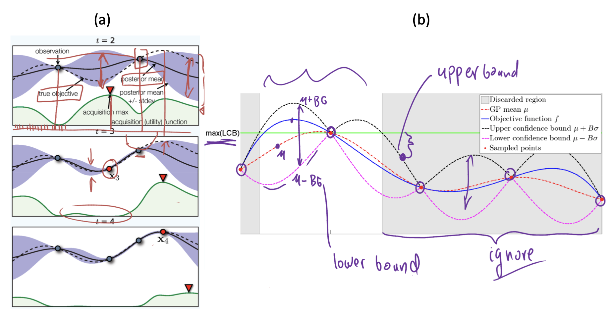

# Bayesian Optimization

Bayesian Optimization is useful to help us search optiaml hyperparameters. It is particularly important in machine learnin; sometimes we need to fine tune hyperparameter to find optimal solution. Bayesian Optimization use **historical** information to efficiently find solution rather than grid search and random search.[[Mike Kraus]][Using Bayesian Optimization to reduce the time spent on hyperparameter tuning], [[Martin Krasser]][Bayesian optimization], [[Will Koehrsen]][A Conceptual Explanation of Bayesian Hyperparameter Optimization for Machine Learning], [[Matti Karppanen]][Bayesian Hyperparameter Optimization], [[Apoorv Agnihotri and Nipun Batra]][Exploring Bayesian Optimization].


The one-sentence summary of Bayesian hyperparameter optimization is: build a probability model of the objective function and use it to select the most promising hyperparameters to evaluate in the true objective function. In the following, we mainly follow [[Will Koehrsen]][A Conceptual Explanation of Bayesian Hyperparameter Optimization for Machine Learning].


### Hyperparameter Optimization

Hyperparameter optimization is represented

<a href="https://www.codecogs.com/eqnedit.php?latex=x^{*}&space;=&space;\textrm{argmin}_{x&space;\in&space;X}&space;f(x)" target="_blank"></a>

 `f(x)` represents an objective score to minimize, such as RMSE or error rate, evaluated on the validation set; `x*` is the set of hyperparameters that yields the lowest value of the score, and x can take on any value in the hyperparameter space. In simple terms, we want to find the model hyperparameters that yield the best score on the validation set metric.

With a large number of hyperparameters and complex models such as ensembles or deep neural networks, evaluating the objective function to find the score is extremely expensive. Grid and random search are completely uninformed by past evaluations and pay no attention to past results.[[Will Koehrsen]][A Conceptual Explanation of Bayesian Hyperparameter Optimization for Machine Learning]

### Bayesian Optimization

Bayesian Optimization forms a probabilistic model mapping hyperparameters to a probability of a score on the objective function:

```
P(score|hyperparameters)
```
The probability model is called a **surrogate** for the objective function. Bayesian methods work by finding the next set of hyperparameters to evaluate on the actual objective function by selecting hyperparameters that perform best on the surrogate function. 

The process is as follows (credit from Nando de Freitas's [UBC machine learning class](https://www.cs.ubc.ca/~nando/540-2013/lectures.html)): 



The black dash line is the true object function we are looking for. The black solid line is mean of posterior. The purple region covers confidence intervals and defines upper/lower bounds. The green line denotes acquisition function. Our goal is to find the **maximum** of the true objective.

@t=2, we have two trial observations. With these two points `(x1, y1)` and `(x2, y2)`, we can use **Gaussian Process** to infer the purple area. Next point is to look for **high-mean** regions (**exploitation**) and **high-variance** regions (**exploration**). So we only look regions where the objective is higher than the right (and right `(x2, y2)` > left `(x1, y1)`), and also purple area is wide, as well as the maximum on acquisition function. Here it is labeled by the red triangle at `x3`.

@t=3, the uncertiantity of objective function nearby `x3` diminishes, so the purple area shrinks, and the bloack solid line moves closer to the dash line. Note meanwhile the acquisition function also drop. `(x2, y2)` still higher objective, so next step looks for it's right with wide purple area, with maximum acquisition function.

@t=4, now we can see the mean of posterior is close to the true objective line.

## HyperOpt Code Example for LGBM

There are [code examples](https://www.programcreek.com/python/example/98788/hyperopt.Trials) showing how to use hyperopt. Also an introduction [Jupyter Notebook](https://github.com/WillKoehrsen/hyperparameter-optimization/blob/master/Introduction%20to%20Bayesian%20Optimization%20with%20Hyperopt.ipynb)  (by Will Koehrsen). 

For LightGBM, please look for Project: **kddcup2019-automl**, Author: **shuyao95**, File: **automl.py** (example number may vary).

```Python
def hyperopt_lightgbm(X: pd.DataFrame, y: pd.Series, params: Dict, config: Config):
    X_train, X_val, y_train, y_val = data_split(X, y, test_size=0.5)
    train_data = lgb.Dataset(X_train, label=y_train)
    valid_data = lgb.Dataset(X_val, label=y_val)

    space = {
        "max_depth": hp.choice("max_depth", np.arange(2, 10, 1, dtype=int)),
        # smaller than 2^(max_depth)
        "num_leaves": hp.choice("num_leaves", np.arange(4, 200, 4, dtype=int)),
        "feature_fraction": hp.quniform("feature_fraction", 0.2, 0.8, 0.1),
        # "bagging_fraction": hp.quniform("bagging_fraction", 0.2, 0.8, 0.1),
        # "bagging_freq": hp.choice("bagging_freq", np.linspace(0, 10, 2, dtype=int)),
        # "scale_pos_weight":hp.uniform('scale_pos_weight',1.0, 10.0),
        # "colsample_by_tree":hp.uniform("colsample_bytree",0.5,1.0),
        "min_child_weight": hp.quniform('min_child_weight', 2, 50, 2),
        "reg_alpha": hp.uniform("reg_alpha", 2.0, 8.0),
        "reg_lambda": hp.uniform("reg_lambda", 2.0, 8.0),
        "learning_rate": hp.quniform("learning_rate", 0.05, 0.4, 0.01),
        # "learning_rate": hp.loguniform("learning_rate", np.log(0.04), np.log(0.5)),
        #
        "min_data_in_leaf": hp.choice('min_data_in_leaf', np.arange(200, 2000, 100, dtype=int)),
        #"is_unbalance": hp.choice("is_unbalance", [True])
    }

    def objective(hyperparams):
        model = lgb.train({**params, **hyperparams}, train_data, 300,
                          valid_data, early_stopping_rounds=45, verbose_eval=0)

        score = model.best_score["valid_0"][params["metric"]]

        # in classification, less is better
        return {'loss': -score, 'status': STATUS_OK}

    trials = Trials()
    best = hyperopt.fmin(fn=objective, space=space, trials=trials,
                         algo=tpe.suggest, max_evals=150, verbose=1,
                         rstate=np.random.RandomState(1))

    hyperparams = space_eval(space, best)
    log(f"auc = {-trials.best_trial['result']['loss']:0.4f} {hyperparams}")
    return hyperparams 
```


## Summary


## Reference


[Exploring Bayesian Optimization]: https://distill.pub/2020/bayesian-optimization/
[[Apoorv Agnihotri and Nipun Batra] Exploring Bayesian Optimization](https://distill.pub/2020/bayesian-optimization/)


[Bayesian optimization]: http://krasserm.github.io/2018/03/21/bayesian-optimization/
[[Martin Krasser] Bayesian optimization](http://krasserm.github.io/2018/03/21/bayesian-optimization/)


[Bayesian Hyperparameter Optimization]: https://towardsdatascience.com/bayesian-hyperparameter-optimization-17dc5834112d
[[Matti Karppanen] Bayesian Hyperparameter Optimization](https://towardsdatascience.com/bayesian-hyperparameter-optimization-17dc5834112d)


[Using Bayesian Optimization to reduce the time spent on hyperparameter tuning]: https://medium.com/vantageai/bringing-back-the-time-spent-on-hyperparameter-tuning-with-bayesian-optimisation-2e21a3198afb
[[Mike Kraus] Using Bayesian Optimization to reduce the time spent on hyperparameter tuning](https://medium.com/vantageai/bringing-back-the-time-spent-on-hyperparameter-tuning-with-bayesian-optimisation-2e21a3198afb)


[A Conceptual Explanation of Bayesian Hyperparameter Optimization for Machine Learning]: https://towardsdatascience.com/a-conceptual-explanation-of-bayesian-model-based-hyperparameter-optimization-for-machine-learning-b8172278050f
[[Will Koehrsen] A Conceptual Explanation of Bayesian Hyperparameter Optimization for Machine Learning](https://towardsdatascience.com/a-conceptual-explanation-of-bayesian-model-based-hyperparameter-optimization-for-machine-learning-b8172278050f)


