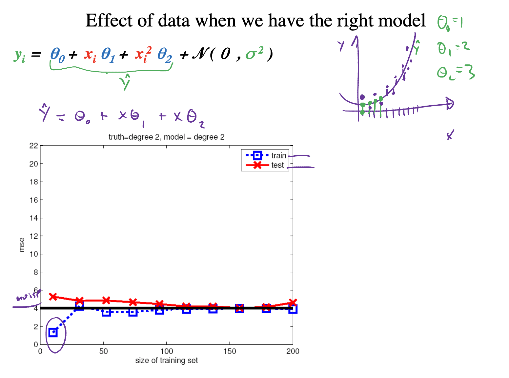
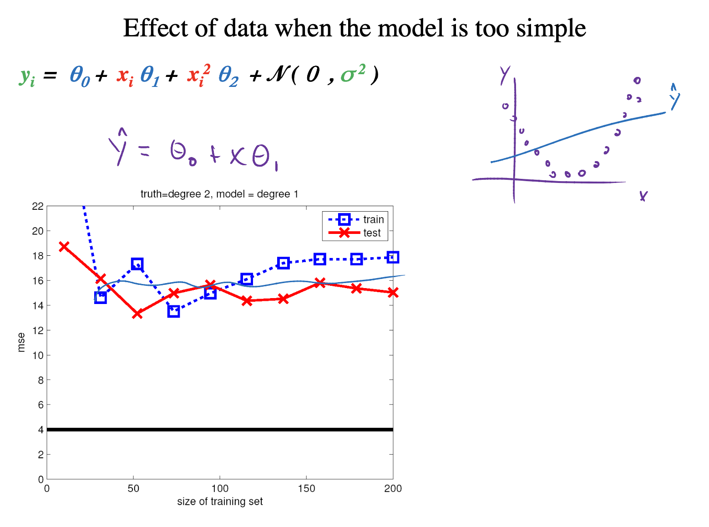
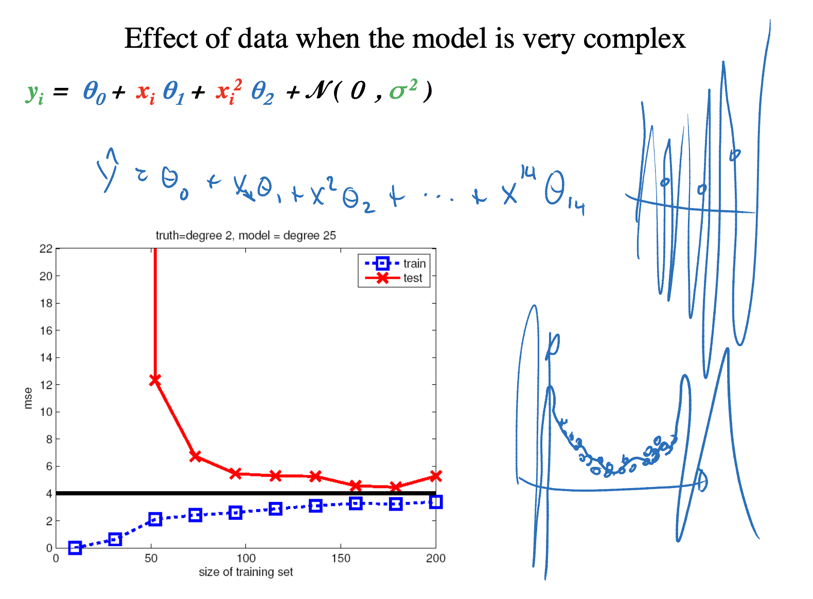

# Bias-Variance Tradeoff

## Final Model

Once you have discovered which model and model hyperparameters result in the best skill on your dataset, you’re ready to prepare a final model.
A final model is trained on all available data, e.g. the training and the test sets.

It is the model that you will use to make predictions on new data were you do not know the outcome. A problem with most final models is that they suffer variance in their predictions.

The bias-variance trade-off is a conceptual idea in applied machine learning to help understand the sources of error in models.

## Bias 

The bias is error from erroneous assumptions in the learning algorithm. High bias can cause an algorithm to miss the relevant relations between features and target outputs (**underfitting**) [[1]][What are the differences between Random Forest and Gradient Tree Boosting algorithms?].

Generally, **parametric algorithms** have a **high bias** making them fast to learn and easier to understand but generally less flexible [[2]][Gentle Introduction to the Bias-Variance Trade-Off in Machine Learning]. In turn, they have **lower predictive performance**. In Blog [[2]][Gentle Introduction to the Bias-Variance Trade-Off in Machine Learning], Jason interpreted Low-Bias/High-Bias as less/more assumptions about the form of the target function (`y = f(x)`). 

Examples of low-bias ML algorithms are **Decision Trees**, **k-Nearest Neighbors** and **Support Vector Machines**, where high-bias algorithms are **Linear Regression**, **Linear Discriminant Analysis** and **Logistic Regression**. Note random forest and boosting are non-parametric; do not confuse the hyperparameters. The parameters in the parametrical models point to the assumptions regarding the data distribution. The post [[3]][Are Random Forest and Boosting parametric or non-parametric?] has clearified the concept. Peter even further explain: In statistical sense, the model is parametric, if **parameters are learned** or **inferred** based on the **data**. A tree in this sense is nonparametric. Of course the tree depth is a parameter of the algorithm, but it is not inherently derived from the data, but rather an input parameter that has to be provided by the user.

## Variance

n the other hand, the variance is error from sensitivity to small fluctuations in the training set. High variance can cause **overfitting**: modeling the random noise in the training data, rather than the intended outputs [[2]][Gentle Introduction to the Bias-Variance Trade-Off in Machine Learning]. 

Low/High Variance suggests small/large changes to the estimate of the target function with changes to the training dataset.
Generally, nonparametric machine learning algorithms that have a lot of flexibility have a high variance. For example, decision trees have a high variance, that is even higher if the trees are not pruned before use. The high-bias models are usually low-variance models; examples include: Linear Regression, Linear Discriminant Analysis and Logistic Regression. On the other hand, examples of high-variance machine learning algorithms include: Decision Trees, k-Nearest Neighbors and Support Vector Machines.

## Learning Curve

MSE (error) vs the size of training set.

### About Right

### Underfit 

### Overfit

## Measuring Bias and Variance

   The presentation [Bias-Variance in Machine
Learning](http://www.cs.cmu.edu/~wcohen/10-601/bias-variance.pdf) shows a way to measure bias and variance, separately. The mean sqaure error (MSE) for a given `x` is written as
  

Note `f(x)` denotes a possible best model, and the true target value from data, `y = f(x) + `, where  is irreducible error. In other words, there are always irreducible errors we cannot interpret. Each learner gives predictions , and
 is the long-term expectation of learners' predictions on `x` averaged over more data from `D`.

So the MSE is

The first term is **Bias square**. If our model reaches the best possible model, then the first term is determined by the irreducible errors only and should be minimized, denoting that our model is low-bias. 

On the other hand, the second term descibes **Variance**. If it is small, it means that all various learners will gives  close to `h`, the long-term expectation, denoting low-variance.

## Bias-Variance Tradeoff by Hyperparameters Tuning

As we discussed above, parametric (linear) ML algorithms often have a high bias but a low variance, whereas
non-parametric (non-linear) algorithms often have a low bias but a high variance.

Tuning bias-variance tradeoff is hard, however. Increasing the bias will decrease the variance and increasing the variance will decrease the bias.

Below are two examples of configuring the bias-variance trade-off for specific algorithms: 

(1) The k-nearest neighbors algorithm has low bias and high variance, but the trade-off can be changed by increasing the value of k which increases the number of neighbors that contribute to the prediction and in turn increases the bias of the model 

(2) The support vector machine algorithm has low bias and high variance, but the trade-off can be changed by increasing the C parameter that influences the number of violations of the margin allowed in the training data which increases the bias but decreases the variance.

(3) For linear regression and logistic regression, we can add regularization. By increasing the regularization strength, we move from high variance to low variance. However, in the large limit of the regularization strength, we reach high bias. The tradeoff should be chosen at best performance using cross validation dataset.

## Reference

[What are the differences between Random Forest and Gradient Tree Boosting algorithms?]: https://www.quora.com/What-are-the-differences-between-Random-Forest-and-Gradient-Tree-Boosting-algorithms
[[1] What are the differences between Random Forest and Gradient Tree Boosting algorithms?](https://www.quora.com/What-are-the-differences-between-Random-Forest-and-Gradient-Tree-Boosting-algorithms)

[Gentle Introduction to the Bias-Variance Trade-Off in Machine Learning]: https://machinelearningmastery.com/gentle-introduction-to-the-bias-variance-trade-off-in-machine-learning/
[[2] Gentle Introduction to the Bias-Variance Trade-Off in Machine Learning](https://machinelearningmastery.com/gentle-introduction-to-the-bias-variance-trade-off-in-machine-learning/)

[Are Random Forest and Boosting parametric or non-parametric?]: https://stats.stackexchange.com/questions/147587/are-random-forest-and-boosting-parametric-or-non-parametric
[[3] Are Random Forest and Boosting parametric or non-parametric?](https://stats.stackexchange.com/questions/147587/are-random-forest-and-boosting-parametric-or-non-parametric)

[MLE vs MAP: the connection between Maximum Likelihood and Maximum A Posteriori Estimation]: https://wiseodd.github.io/techblog/2017/01/01/mle-vs-map/
[[4] MLE vs MAP: the connection between Maximum Likelihood and Maximum A Posteriori Estimation](https://wiseodd.github.io/techblog/2017/01/01/mle-vs-map/)