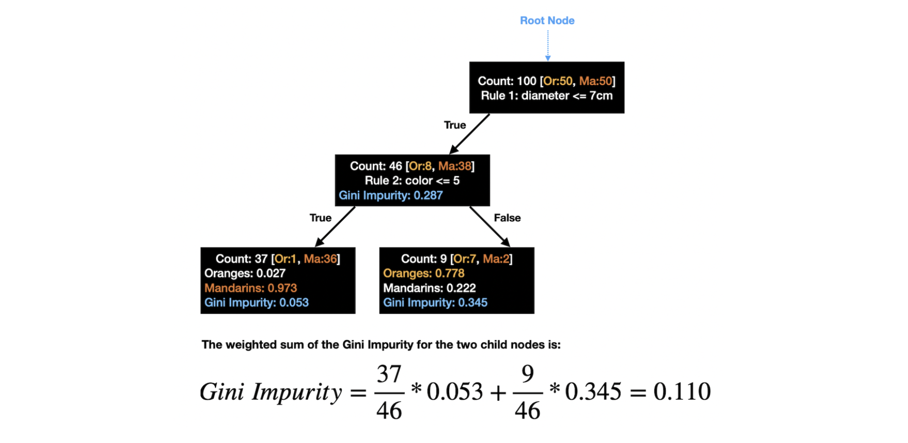
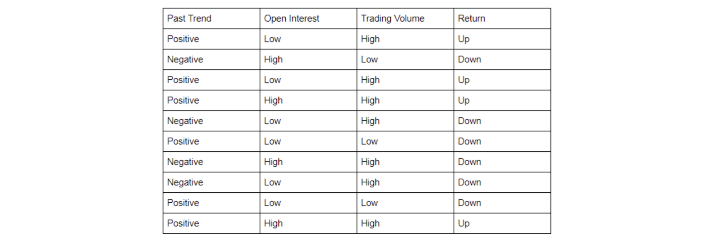
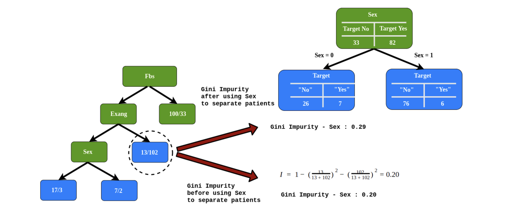

# Decision Tree 

Table of Contents:

* [1. Tree algorithms: ID3, C4.5 and CART](https://github.com/HsiangHung/Machine_Learning_Note/tree/master/Classification/Decison%20Tree#1-tree-algorithms-id3-c45-and-cart)
* [2. How To Interpret Probability in Tree?](https://github.com/HsiangHung/Machine_Learning_Note/tree/master/Classification/Decison%20Tree#2-how-to-interpret-probability-in-tree)
* [3. How to Select Feature for Split?](https://github.com/HsiangHung/Machine_Learning_Note/tree/master/Classification/Decison%20Tree#3-how-to-select-feature-for-split)
     * [3.A - Information gain](https://github.com/HsiangHung/Machine_Learning_Note/tree/master/Classification/Decison%20Tree#3a---information-gain)
     * [3.B - Gini index](https://github.com/HsiangHung/Machine_Learning_Note/tree/master/Classification/Decison%20Tree#3b---gini-index)
     * [3.C - Numeric Attribute](https://github.com/HsiangHung/Machine_Learning_Note/tree/master/Classification/Decison%20Tree#3c---numeric-attribute)
     * [3.D - Criterion to stop splitting leaf node](https://github.com/HsiangHung/Machine_Learning_Note/tree/master/Classification/Decison%20Tree#3d---criterion-to-stop-splitting-leaf-node)
* [4. Decision Tree Regression](https://github.com/HsiangHung/Machine_Learning_Note/tree/master/Classification/Decison%20Tree#4-decision-tree-regression)
* [5. Feature Importance](https://github.com/HsiangHung/Machine_Learning_Note/tree/master/Classification/Decison%20Tree#5-feature-importance)
* [6. How To Deal with Missing Values](https://github.com/HsiangHung/Machine_Learning_Note/tree/master/Classification/Decison%20Tree#6-how-to-deal-with-missing-values)

## 1. Tree algorithms: ID3, C4.5 and CART

Decision tree algorithms [[synergy37AI]][Tree algorithms: ID3, C4.5, C5.0 and CART]:

* **ID3 (Iterative Dichotomiser 3)** creates a multiway tree, finding for each node (i.e. in a greedy manner) the categorical feature that will yield the largest information gain for **categorical** targets.

* **C4.5** is the successor to ID3 and removed the restriction that features must be categorical by dynamically defining a discrete attribute (based on **numerical** variables) that partitions the continuous attribute value into a discrete set of intervals.

* **CART (Classification and Regression Trees)** is very similar to C4.5, but it differs in that it supports numerical target variables (regression) and does not compute rule sets. CART constructs binary trees using the feature and threshold that yields the largest information gain at each node.

Nearly every decision tree example I've come across happens to be a binary tree. There seems an exception, CHAID, is not limited to binary trees. The reason is mainly a technical issue: if you don't restrict to binary choices, there are simply too many possibilities for the next split in the tree [[Cross Validated: Are decision trees almost always binary trees?]][Are decision trees almost always binary trees?].

## 2. How To Interpret Probability in Tree?

In Prof. Nando de Freitas [UBC Machine Learning class](https://www.youtube.com/watch?v=pLzE2Oh9QDI&list=PLE6Wd9FR--Ecf_5nCbnSQMHqORpiChfJf&index=31), he shows a picture how probability works in a given decision tree:

**NOTE**: 
1. The above picture explicitly describes that tree-based algorithm is available **multi-class classification**.
2. Even on the leaves, there exists data noise so we still see various class distribution.

## 3. How to Select Feature for Split?

Each time when we need to split, we need to choose an optimal attribute which can perform best. There are two ways to select optimal attributes:

1. Information gain 
2. Gini index

**Higher information gain** (entropy reduction) and **lower Gini index** mean a better attribute used for split.

Note that there is no reason to use the same feature split on each level. See [[Cross Validated: Does decision tree need to use the same feature to split in the same layer?]][Does decision tree need to use the same feature to split in the same layer?]

### 3.A - Information gain

Given a split way of features, calculate entropy for root and its childs. The tree split is to **maximize reduction of the entropy**, which is defined as **information gain**. Given a class, the entropy defines

$$H(p,n) = -p\log p -n\log n$$

where $p$ and $n$ are probability of positive and negative events

$$p = \frac{N_p}{N_p+N_n}, \ n = \frac{N_n}{N_p+N_n}.$$

Then we can calculate **Expected Entropy** (EH) remaining after trying attribute $A$ (with branches i=1,2,...,K types) in childs as

$$EH(A) = \sum^K_{i=1} H(p_i, n_i).$$

The information gain is 

$$ I(A) = H(p,n) - EH(A),$$

for attribute $A$, where $H(p,n)$ is on root.

#### Example

Below is an example (from Prof. Nando de Freitas UBC Machine Learning class). From the root to next level, which attribute should we use? `patrons` or food `type`?

We can see `I(patrons) > I(type)`, so we choose `patrons` to split data for enxt step (using `type` is not helpful to classification).

Later information gain leads to less homogeneity on class distributions. See examples below: 

We can see the larger information gain split makes better classification.

### 3.B - Gini index

The Gini index of a leaf node is defined as [[Jason Brownlee]][Classification And Regression Trees for Machine Learning]:

$$G = 1- \sum^K_{i=1} p^2_i.$$

A **Smaller Gini index** means better attribute used to split tree. For binary classification, two extremes to think about:
* The leaf node only positive events, then `G = 0`.
* The leaf node still has 50 positive - 50 negative. `G = 0.5`.

The Gini index calculation for each node is weighted by the total number of instances in the parent node. Therefore, for a split, the Gini index in a **binary classification** problem is therefore calculated as follows: 

$$G = \frac{N_1}{N} \big( 1 - [(p_1)^2 + (n_1)^2] \big) + \frac{N_2}{N} \big( 1 - [(p_2)^2 + (n_2)^2] \big),$$

where $p_1$ and $n_1$ are proportion of positive and negative units; $N_1$ and $N_2$ are the total number of instances in leaf node 1 and leaf node 2, and $N$ are the total number of instances from the parent node.

The following picture explains how to evaluate the gini impirty in a split (credit from [CART: Classification and Regression Trees for Clean but Powerful Models](https://towardsdatascience.com/cart-classification-and-regression-trees-for-clean-but-powerful-models-cc89e60b7a85)):

#### Example

Here is an example followed the post: [Gini Index For Decision Trees](https://blog.quantinsti.com/gini-index/), by Shagufta Tahsildar. Assume we have data below:

In this example, we can regard return = `up`/`down` as `p`/`n`. We need to calculate gini indices if using `Past Trend`, `Open Interest`, `Trading Volume` to split node.

* First use attribute `Past Trend` to split:

|  | Return = up | Return = down | P(trend) | Gini |
| --- | --- | --- | --- | --- |
| Past Trend = positive | P(pos, up) = 4/6 | P(pos, down) = 2/6 | P(pos) = 6/10 | 1 - ((4/6)^2 + (2/6)^2) = 0.45 |
| Past Trend = negative | P(neg, up) = 0 | P(neg, down) = 4/4 | P(neg) = 4/10 | 1 - ((0)^2 + (4/4)^2) = 0 |

Gini Index for `Past Trend` is the weighted sum of the Gini Indices: (6/10)0.45 + (4/10)0 = 0.27.

* Second use attribute `Open Interest` to split:

|  | Return = up | Return = down | P(interest) | Gini |
| --- | --- | --- | --- | --- |
| Open Interest = high | P(high, up) = 2/4 | P(high, down) = 2/4 | P(high) = 4/10 | 1 - ((2/4)^2 + (2/4)^2) = 0.5 |
| Open Interest = low | P(low, up) = 2/6 | P(low, down) = 4/6 | P(low) = 6/10 | 1 - ((2/6)^2 + (4/6)^2) = 0.45 |

Gini Index for `Open Interest` is the weighted sum of the Gini Indices: (4/10)0.5 + (6/10)0.45 = 0.47.

* Third use attribute `Trading Volume` to split:

|  | Return = up | Return = down | P(volume) | Gini |
| --- | --- | --- | --- | --- |
| Trading Volume = high | P(high, up) = 4/7 | P(high, down) = 3/7 | P(high) = 7/10 | 1 - ((4/7)^2 + (3/7)^2) = 0.49 |
| Trading Volume = low | P(low, up) = 0 | P(low, down) = 3/3 | P(low) = 3/10 | 1 - ((0)^2 + (1)^2) = 0 |

Gini Index for `Trading Volume` is the weighted sum of the Gini Indices: (7/10)0.49 + (3/10)0 = 0.34.

From the above, we observe that **Past Trend** has the lowest Gini Index and hence it will be chosen as the root node for how decision tree works.

### 3.C - Numeric Attribute

For numeric attributes, how do we determine the value to split in the decision tree? As a concrete example, supposed we have a dataset like

| humidity | play | 
| --- | --- | 
| 60  | yes |
| 80  | yes |
| 63  | no  |
| 81  | yes |
| 92  | no  |
| ... | ... |

For numeric attributes, we sort the attribute by value. Then above data become

| humidity | play|
| --- | --- |
|  54 | yes |
|  58 | yes |
|  59 | yes |
|  60 | yes |
|  60 | yes |
|  62 | yes |
|  63 | no  |
|  80 | yes |
|  81 | yes |
|  89 | yes |
|  90 | no  |
|  90 | no  |
|  90 | no  |
|  92 | no  |

At root, the entropy (9 positive, 5 negative) is

$$H(\frac{9}{14},\frac{5}{14})= -\left( \frac{9}{14}\log{\frac{9}{14}} + \frac{5}{14}\log{\frac{5}{14}} \right) = 0.94 \ \textrm{bits}$$

Suppose we are going to determine the humidity threshold split, and we have two ways:

* **way A**: if humidity > 62 
* **way B**: if humidity > 89

For **way A**, if humidity <= 62, 6 positive; humidity > 62, 3 positive and 5 negative

$$H_A = \frac{6}{14}H(\frac{6}{6}, 0) + \frac{8}{14}H(\frac{3}{8}, \frac{5}{8}) = \frac{6}{14} \times 0 + \frac{8}{14}\times 0.95 = 0.54 \ \textrm{bits}$$

For **way B**, if humidity <= 89, 9 positive and 1 negative; humidity > 89, 4 negative

$$H_B = \frac{10}{14}H(\frac{9}{10}, \frac{1}{10}) + \frac{4}{14}H(0, \frac{4}{4}) = \frac{10}{14}\times 0.47 + \frac{4}{14} \times 0 = 0.33 \ \textrm{bits}$$

We can see $I(B) = 0.94 - HB = 0.61 > I(A) = 0.94 - HA = 0.4$, so we choose **way B**, humidity=0.89 to split at this step.

### 3.D - Criterion to stop splitting leaf node

How do we determine a final leaf nodes on this branch (before using all attributes)? See the graph below (credit from [[Arif R]][Classification in Decision Tree — A Step by Step CART (Classification And Regression Tree)]). The leaf node `13/102` circled by the dash line does not need further separate:

If the Gini Impurity before using `sex` to separate patients is lowest, so we don’t separate this node using `sex`. The leaf node is concluded as the final node.

## 4. Decision Tree Regression

Detail refer to [here](https://github.com/HsiangHung/Machine_Learning_Note/tree/master/Regression/Decision%20Tree) and the post [[Saed Sayad]][Decision Tree - Regression].

## 5. Feature Importance 

To evaluate feature importance, we calculate feature importance for each split, and sum of them. For `attribute A`, we look for all splits which use `A` to split. The invidual feature importance is  [[Sefik Ilkin Serengil]][Feature Importance in Decision Trees], [[Stacey Ronaghan]][The Mathematics of Decision Trees, Random Forest and Feature Importance in Scikit-learn and Spark]

where `Nc` means the number of instances on the "current" node or level, and `N` is the total number of instances. `l` and `r` denote left and right child nodes. We can simply calculate as 

and eventually all are divided by `N`. The `impurity` metric is **entropy** if **C4.5** algorithm adopted. It would be **Gini** if the algorithm were **CART** [[Sefik Ilkin Serengil]][Feature Importance in Decision Trees]. 

Keep in mind for lower impurity (say, the majority is positive), both entropy and Gini index are lower. If `attribute A` works well to split, parent has higher impurity whereas child has lower impurity, then higher `FI(A|c)`.  

As a concrete example, suppose we have built the following tree (using C4.5 algorithm with entropy) (credit from [[Sefik Ilkin Serengil]][Feature Importance in Decision Trees]):

Notice that a feature can appear several times in a decision tree as a decision point. For example, the feature outlook appears 2 times in the decision tree in 2nd and 3rd level. sum of those individual decision points will be the feature importance of Outlook.

We follow the procedures from [[Sefik Ilkin Serengil]][Feature Importance in Decision Trees]

* 1st level of the decision tree: FI(**Humidity**|1st level) = 14x0.940 – 7×0.985 – 7×0.591 = 2.121.
* 2nd level of the decision tree: FI(**Outlook**|2nd level) = 7×0.985 – 4×0.811 = 3.651; FI(**Wind**|2nd level) = 7×0.591 – 3×0.918 = 1.390
* 3rd level of the decision tree: FI(**Wind**|3rd level) = 4×0.811 = 3.244, FI(**Outlook**|3rd level) = 3×0.918 = 2.754
* Results: 

  FI(**Humidity**) = FI(**Humidity**|1st level) = 2.121

  FI(**Outlook**) = FI(**Outlook**|2nd level) + FI(**Outlook**|3rd level) = 3.651 + 2.754 = 6.405

  FI(**Wind**) = FI(**Wind**|2nd level) + FI(**Wind**|3rd level) = 1.390 + 3.244 = 4.634

Then normalize FI by diving `N=14`. We have feature importance: `"Outlook" > "Wind" > "Humidity"`.

**NOTE** [[Tim Bock]][Decision Trees Are Usually Better Than Logistic Regression]: decision trees have their own potential for misinterpretation, with many people incorrectly assuming that the order with which predictors appear in a tree tells you something about their importance. Unfortunately, this is often not the case. For example, if you have two highly correlated predictors, only one of them may appear in the tree and which one it is will be a bit of a fluke.

The consequence of all of these strengths of logistic regression is that if you are doing an academic study and wanting to make conclusions about what **causes** what, logistic regression is often much better than a decision tree. However, if instead the goal is to either make a prediction, or describe the data, then logistic regression is often a poor choice.

## 6. How To Deal with Missing Values

There are several methods used by various decision trees. Simply **ignoring the missing values** (like ID3 and other old algorithms does) or **treating the missing values as another category** (in case of a nominal feature) are not real handling missing values [[Cross Validated: How do decision tree learning algorithms deal with missing values]][How do decision tree learning algorithms deal with missing values]. 

By Towfik Alrazihi [[Quora: In simple language, how does C4.5 deal with missing values?]][In simple language, how does C4.5 deal with missing values?], the missing values:
* goes to the node which already has the biggest number of instances.
* goes to all children with diminished weights.
* Goes randomly to only single chlid node.

## Reference

* [Classification in Decision Tree — A Step by Step CART (Classification And Regression Tree)]: https://medium.com/analytics-vidhya/classification-in-decision-tree-a-step-by-step-cart-classification-and-regression-tree-8e5f5228b11e
[[Arif R] Classification in Decision Tree — A Step by Step CART (Classification And Regression Tree)](https://medium.com/analytics-vidhya/classification-in-decision-tree-a-step-by-step-cart-classification-and-regression-tree-8e5f5228b11e)

* [Are decision trees almost always binary trees?]: https://stats.stackexchange.com/questions/12187/are-decision-trees-almost-always-binary-trees#:~:text=Nearly%20every%20decision%20tree%20example,to%20be%20a%20binary%20tree.&text=From%20what%20I%20gather%2C%20CHAID,a%20single%20three%2Dway%20split.
[[Cross Validated: Are decision trees almost always binary trees?] Are decision trees almost always binary trees?](https://stats.stackexchange.com/questions/12187/are-decision-trees-almost-always-binary-trees#:~:text=Nearly%20every%20decision%20tree%20example,to%20be%20a%20binary%20tree.&text=From%20what%20I%20gather%2C%20CHAID,a%20single%20three%2Dway%20split.)

* [Does decision tree need to use the same feature to split in the same layer?]: https://stats.stackexchange.com/questions/354030/does-decision-tree-need-to-use-the-same-feature-to-split-in-the-same-layer/451780#451780
[[Cross Validated: Does decision tree need to use the same feature to split in the same layer?] Does decision tree need to use the same feature to split in the same layer?](https://stats.stackexchange.com/questions/354030/does-decision-tree-need-to-use-the-same-feature-to-split-in-the-same-layer/451780#451780)

* [How do decision tree learning algorithms deal with missing values]: https://stats.stackexchange.com/questions/96025/how-do-decision-tree-learning-algorithms-deal-with-missing-values-under-the-hoo
[[Cross Validated: How do decision tree learning algorithms deal with missing values] How do decision tree learning algorithms deal with missing values](https://stats.stackexchange.com/questions/96025/how-do-decision-tree-learning-algorithms-deal-with-missing-values-under-the-hoo)

* [Classification And Regression Trees for Machine Learning]: https://machinelearningmastery.com/classification-and-regression-trees-for-machine-learning/
[[Jason Brownlee] Classification And Regression Trees for Machine Learning](https://machinelearningmastery.com/classification-and-regression-trees-for-machine-learning/)

* [In simple language, how does C4.5 deal with missing values?]: https://www.quora.com/In-simple-language-how-does-C4-5-deal-with-missing-values
[[Quora: In simple language, how does C4.5 deal with missing values?] In simple language, how does C4.5 deal with missing values?](https://www.quora.com/In-simple-language-how-does-C4-5-deal-with-missing-values)

* [Decision Tree - Regression]: https://www.saedsayad.com/decision_tree_reg.htm#:~:text=Decision%20tree%20builds%20regression%20or,decision%20nodes%20and%20leaf%20nodes.
[[Saed Sayad] Decision Tree - Regression](https://www.saedsayad.com/decision_tree_reg.htm#:~:text=Decision%20tree%20builds%20regression%20or,decision%20nodes%20and%20leaf%20nodes.)

* [Feature Importance in Decision Trees]: https://sefiks.com/2020/04/06/feature-importance-in-decision-trees/
[[Sefik Ilkin Serengil] Feature Importance in Decision Trees](https://sefiks.com/2020/04/06/feature-importance-in-decision-trees/)

* [The Mathematics of Decision Trees, Random Forest and Feature Importance in Scikit-learn and Spark]: https://towardsdatascience.com/the-mathematics-of-decision-trees-random-forest-and-feature-importance-in-scikit-learn-and-spark-f2861df67e3
[[Stacey Ronaghan] The Mathematics of Decision Trees, Random Forest and Feature Importance in Scikit-learn and Spark](https://towardsdatascience.com/the-mathematics-of-decision-trees-random-forest-and-feature-importance-in-scikit-learn-and-spark-f2861df67e3)

* [Tree algorithms: ID3, C4.5, C5.0 and CART]: https://medium.datadriveninvestor.com/tree-algorithms-id3-c4-5-c5-0-and-cart-413387342164
[[synergy37AI] Tree algorithms: ID3, C4.5, C5.0 and CART](https://medium.datadriveninvestor.com/tree-algorithms-id3-c4-5-c5-0-and-cart-413387342164)

* [Decision Trees Are Usually Better Than Logistic Regression]: https://www.displayr.com/decision-trees-are-usually-better-than-logistic-regression/
[[Tim Bock] Decision Trees Are Usually Better Than Logistic Regression](https://www.displayr.com/decision-trees-are-usually-better-than-logistic-regression/)