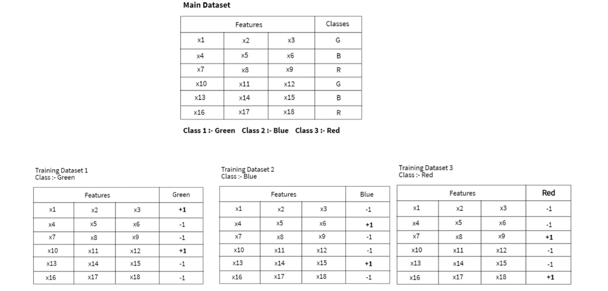
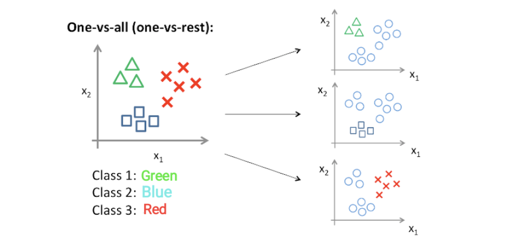
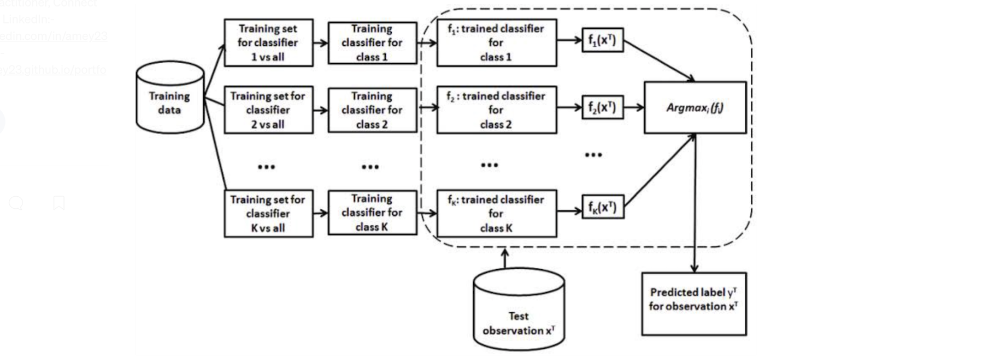

# Multiclass Classification 

The comparison summary between binary and mutliclass classification [[Amey Band]][Multi-class Classification — One-vs-All & One-vs-One]

| Binary Classification |  Multiclass Classification |  
| --- | --- | 
| two class | Multiple classes | 
| one classifier | 1. One vs. All: `N` classifier |
|    | 2. One vs. One: `N(N-1)/2` classifier | 
|    | 3. softmax regression | 
| `2 x 2` Confusion Matrix | `N x N` Confusion matrix  | 

Table of Contents:

* [1. Multiclass Classification Models](https://github.com/HsiangHung/Machine_Learning_Note/tree/master/Classification/Multiclass%20Classification#1-multiclass-classification-models)
     * [1.A) One vs. All (One-vs-Rest)](https://github.com/HsiangHung/Machine_Learning_Note/tree/master/Classification/Multiclass%20Classification#1a)-one-vs-all-one-vs-rest)
     * [1.B) One vs. One](https://github.com/HsiangHung/Machine_Learning_Note/tree/master/Classification/Multiclass%20Classification#1b)-one-vs-one)
     * [1.C) A Single Multi-Class Classifier](https://github.com/HsiangHung/Machine_Learning_Note/tree/master/Classification/Multiclass%20Classification#1c-a-single-multi-class-classifier)
* [2. Metrics](https://github.com/HsiangHung/Machine_Learning_Note/tree/master/Classification/Multiclass%20Classification#2-metrics)
     * [2.A) Macro-averged](https://github.com/HsiangHung/Machine_Learning_Note/tree/master/Classification/Multiclass%20Classification#1a)-one-vs-all-one-vs-rest)
     * [2.B) Micro-averged](https://github.com/HsiangHung/Machine_Learning_Note/tree/master/Classification/Multiclass%20Classification#1b)-one-vs-one)
     * [2.C) Weighted-average](https://github.com/HsiangHung/Machine_Learning_Note/tree/master/Classification/Multiclass%20Classification#1c-a-single-multi-class-classifier)

## 1. Multiclass Classification Models

Assume we have data like below (N=3):

### 1.A) One vs. All (One-vs-Rest)

For the N-class instances dataset, we have to generate the N-binary classifier models (credit from [[Amey Band]][Multi-class Classification — One-vs-All & One-vs-One]).

By analyzing the probability scores, we predict the result as the class index having a **maximum** probability score [[Amey Band]][Multi-class Classification — One-vs-All & One-vs-One]. 

As an example on Green-blue-red calss, if we have a test case with a probability score of (0.9) from the Green class classifier, probability score of (0.4) from the Blue classifier, but a negative classification score from the remaining Red classifier. Based on the probability scores, we predict the test input belongs to the Green class.

The biggest issue with one-vs-all classification is **Class Imbalance**. Consider we have 5 classes, and even number of samples of each class i.e. each class makes up 20% of the data. When you do a one-vs-all classification, you convert the problem into 5 binary classification problems, and in each of the 5 cases you end up with a 20-80 distribution. See the [Quora post: What are the issues with one vs all classification approach?](https://www.quora.com/What-are-the-issues-with-one-vs-all-classification-approach).

### 1.B) One vs. One

In One-vs-One classification, for the N-class instances dataset, we have to generate the `N(N-1)/2` binary classifier models. 

Taking the above example, we divide this problem into N* (N-1)/2 = 3 binary classifier problems:
* Classifier 1: Green vs. Blue
* Classifier 2: Green vs. Red
* Classifier 3: Blue vs. Red

Each binary classifier predicts one class label. When we input the test data to the classifier, then the model with the **majority counts** is concluded as a result.

### 1.C) A Single Multi-Class Classifier 

The [comparison](https://stats.stackexchange.com/questions/318520/many-binary-classifiers-vs-single-multiclass-classifier) between multiple classifiers is:

| One-vs-All classifiers |  Multi-class classifiers |  
| --- | --- | 
| usually faster to converge | usually slower than binary classifiers | 
| hard to deal with when many classes | great when many classes | 
| class imbalances that introduce bias |  For high-dimensional problems it is pretty slow | 
| SVMs, ensemble methods, Tree-based | neural networks ([softmax](https://github.com/HsiangHung/Machine_Learning_Note/tree/master/Classification/Multiclass%20Classification/Softmax%20Regression)), Tree-based, Naive Bayes|

The decision boundaries between multiple binary classifier models and a multinomial classifier which learns directly all the classes (credit from [Quora: In multi-class classification, what are pros and cons of "One-to-Rest" and "One-to-One"?](https://www.quora.com/In-multi-class-classification-what-are-pros-and-cons-of-One-to-Rest-and-One-to-One)): 

The softmax function creates a probability distribution over K classes, and produces an output vector of length K. Each element of the vector is the probability that the input belongs to the corresponding class (see [here](https://stats.stackexchange.com/questions/108236/softmax-regression-or-k-binary-logistic-regression)). The most likely class is chosen by selecting the index of that vector having the highest probability [[Algorithmia]][Multiclass classification in machine learning].

In the Naive Bayes classifier, we use Bayes’ theorem to break down the joint probability of membership in a class into a series of conditional probabilities [[Algorithmia]][Multiclass classification in machine learning]. 

SVMs are inherently two-class classifiers. In the multiclass SVM, if it is built as one-versus-rest classifiers, choose the class which classifies the test datum with greatest margin. If built as one-vs-one classifiers, still choose the class that is selected by the most classifiers [[Stanford NLP]][Multiclass SVMs].

## 2. Metrics

For binary classification, a confusion matrix has two rows and two columns. For multi-class classification problem, we categorize each sample into 1 of K classes to make `K x K` confusion matrix. In each class, we can still compute precision and recall on each class [[Boaz Shmueli-1]][Multi-Class Metrics Made Simple, Part I: Precision and Recall].

Given P and R for each class, how can we compare performance on various classifiers? We can macro avergae [[Boaz Shmueli-2]][Multi-Class Metrics Made Simple, Part II: the F1-score], weighted average [[Boaz Shmueli-3]][A Tale of Two Macro-F1's] and micro average scores.

### 2.A) Macro-averged

For example, macro-averged Precision defines as

### 2.B) Micro-averged

### 2.C) Weighted-average

The weight-averaged Precision is defined as (using `classification_report` from [sklearn](https://scikit-learn.org/stable/modules/generated/sklearn.metrics.precision_recall_fscore_support.html#sklearn.metrics.precision_recall_fscore_support))

#### Example

[[Boaz Shmueli-2]][Multi-Class Metrics Made Simple, Part II: the F1-score] show an example for three classes. The 3 x 3 confusion matrix is 

|  |  True cat |  True fish | True han |
| --- | --- | --- | --- |
| pred cat | 4 | 6 | 3 | 
| pred fish | 1 | 2 | 0 | 
| pred han | 1 | 2 | 6 | 
| total | 6 | 10 | 9 | 

For each class, we can have precision, recall and F1 score like

|  |  precision |  recall | F1 score |
| --- | --- | --- | --- |
| cat | 0.308 (4/13) | 0.667 (4/6) | 0.421 (2x0.308x0.667/(0.308+0.667))| 
| fish | 0.667 (2/3)| 0.20 (2/10) | 0.308 (2x0.667x0.3/(0.667+0.3)) | 
| han | 0.667 | 0.667 | 0.667 | 

|  |  precision |  recall | F1 score |
| --- | --- | --- | --- |
| Macro | 0.547 | 0.511 | 0.465 | 
| Micro | 0.48 | 0.48 |  | 
| Weighted | 0.58 | | |

* Macro-precision = (0.31 + 0.67 + 0.67) / 3 = 0.547.
* Micro-precision = (4 + 2 + 6) / (4 + 2 + 6 + 9 + 1 + 3) = 0.48.
* Weight-precision = (0.31 * 6 + 0.67 * 10 + 0.67 * 9) / (6+10+9) = 0.58.
* Macro-F1 = (0.421 + 0.308 + 0.667) / 3 = 0.465.

There are totally 4+2+6=12 TP, and totally 6+3+1+0+1+2=13 FP. Thus the micro-average precision is 12/(12+13)= 0.48. In the example, we can see total FN = FP. Therefore micro-averaged recall is the same as micro-averaged precision [[Boaz Shmueli-2]][Multi-Class Metrics Made Simple, Part II: the F1-score]. 

## Reference

[Multiclass classification in machine learning]: https://algorithmia.com/blog/multiclass-classification-in-machine-learning
[[Algorithmia] Multiclass classification in machine learning](https://algorithmia.com/blog/multiclass-classification-in-machine-learning)

[Multi-class Classification — One-vs-All & One-vs-One]: https://towardsdatascience.com/multi-class-classification-one-vs-all-one-vs-one-94daed32a87b
[[Amey Band] Multi-class Classification — One-vs-All & One-vs-One](https://towardsdatascience.com/multi-class-classification-one-vs-all-one-vs-one-94daed32a87b)

[Multi-Class Metrics Made Simple, Part I: Precision and Recall]: https://towardsdatascience.com/multi-class-metrics-made-simple-part-i-precision-and-recall-9250280bddc2
[[Boaz Shmueli-1] Multi-Class Metrics Made Simple, Part I: Precision and Recall](https://towardsdatascience.com/multi-class-metrics-made-simple-part-i-precision-and-recall-9250280bddc2)

[Multi-Class Metrics Made Simple, Part II: the F1-score]: https://towardsdatascience.com/multi-class-metrics-made-simple-part-ii-the-f1-score-ebe8b2c2ca1
[[Boaz Shmueli-2] Multi-Class Metrics Made Simple, Part II: the F1-score](https://towardsdatascience.com/multi-class-metrics-made-simple-part-ii-the-f1-score-ebe8b2c2ca1)

[A Tale of Two Macro-F1's]: https://towardsdatascience.com/a-tale-of-two-macro-f1s-8811ddcf8f04
[[Boaz Shmueli-3] A Tale of Two Macro-F1's](https://towardsdatascience.com/a-tale-of-two-macro-f1s-8811ddcf8f04)

[Many binary classifiers vs. single multiclass classifier]: https://stats.stackexchange.com/questions/318520/many-binary-classifiers-vs-single-multiclass-classifier
[[Cross Validated: Many binary classifiers vs. single multiclass classifier] Many binary classifiers vs. single multiclass classifier](https://stats.stackexchange.com/questions/318520/many-binary-classifiers-vs-single-multiclass-classifier)

[Multiclass SVMs]: https://nlp.stanford.edu/IR-book/html/htmledition/multiclass-svms-1.html
[[Stanford NLP] Multiclass SVMs](https://nlp.stanford.edu/IR-book/html/htmledition/multiclass-svms-1.htmlr)

