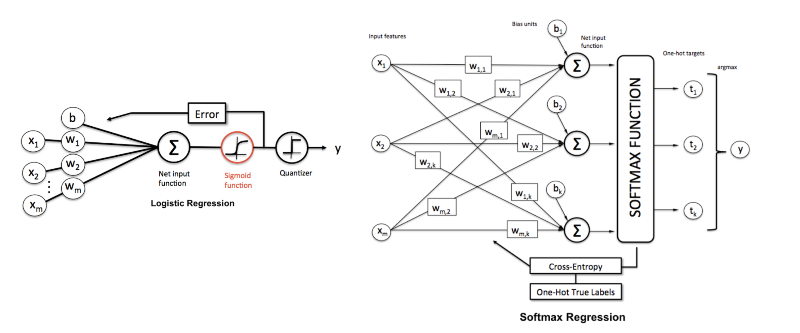

# Softmax Regression

Softmax regression (or **Multinomial Logistic Regression**, **Maximum Entropy Classifier**, or just **Multi-class Logistic Regression** [[KDNuggets]][What is Softmax Regression and How is it Related to Logistic Regression?]) is a generalization of logistic regression to the case where we want to handle multiple classes. In logistic regression we assumed that the labels were binary: $y_i \in \lbrace 0, 1 \rbrace$. We used such a classifier to distinguish between two kinds of hand-written digits. Softmax regression allows us to handle $y_i \in \lbrace 1, \cdots,K \rbrace$ where K is the number of classes, i.e. multi-class classification.

The following content are from [[UFLDL Tutorial]][Softmax Regression].

## Binary Classification

For binary case, the hypothesis in logistic regression is

$$h_{\theta}(\symbf{x}_i) = P(y_i|\theta, \symbf{x}_i) =\frac{1}{1+e^{-\theta^T \symbf{x}_i}}.$$

The cost fucntion is cross entropy

$$C(\theta) = - \sum^m_{i=1} \Big[ y_i \log h_{\theta}(\symbf{x}_i) + (1-y_i) \log (1-h_{\theta}(\symbf{x}_i)) \Big]$$

## Multiclass Classification

In the softmax regression setting, the hypothesis hθ(x) takes the following form:

<a href="https://www.codecogs.com/eqnedit.php?latex=h_{\theta}(x_i)&space;=&space;\begin{bmatrix}&space;P(y_i=1|\theta,&space;\bold{x}_i)&space;\\&space;P(y_i=2|\theta,&space;\bold{x}_i)&space;\\&space;\vdots&space;\\&space;P(y_i=K|\theta,&space;\bold{x}_i)&space;\end{bmatrix}&space;=&space;\frac{1}{\sum^K_{j=1}&space;\exp{&space;\big(&space;\theta^{(j)T}&space;\bold{x}_i&space;\big)}&space;}\begin{bmatrix}&space;\exp{\big(&space;\theta^{(1)T}&space;\bold{x}_i&space;\big)}&space;\\&space;\exp{&space;\big(&space;\theta^{(2)T}&space;\bold{x}_i&space;\big)&space;}&space;\\&space;\vdots&space;\\&space;\exp{&space;\big(&space;\theta^{(K)T}&space;\bold{x}_i&space;\big)&space;}&space;\end{bmatrix}" target="_blank"></a>

Now `θ` is a n-by-K matrix (`n` features and `K` classes) obtained by

The cost function is

where `I = 1` for y = j; otherwise `I=0`. 

The high-level workflow of logisitc and softmax regressions are summarized below (credit from [[KDNuggets]][What is Softmax Regression and How is it Related to Logistic Regression?])

## Reference

[What is Softmax Regression and How is it Related to Logistic Regression?]: https://www.kdnuggets.com/2016/07/softmax-regression-related-logistic-regression.html#:~:text=Softmax%20Regression%20(synonyms%3A%20Multinomial%20Logistic,the%20classes%20are%20mutually%20exclusive).
[[KDNuggets] What is Softmax Regression and How is it Related to Logistic Regression?](https://www.kdnuggets.com/2016/07/softmax-regression-related-logistic-regression.html#:~:text=Softmax%20Regression%20(synonyms%3A%20Multinomial%20Logistic,the%20classes%20are%20mutually%20exclusive).)

[Softmax Regression]: http://deeplearning.stanford.edu/tutorial/supervised/SoftmaxRegression/support-vector-machines-in-machine-learning
[[UFLDL Tutorial] Softmax Regression](http://deeplearning.stanford.edu/tutorial/supervised/SoftmaxRegression/)

