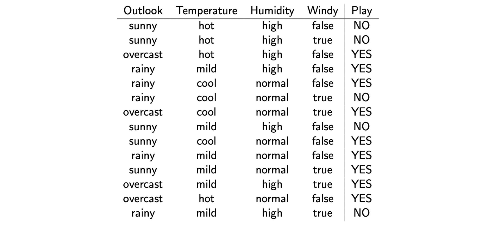

# Naive Bayes Classifier


The Naive Bayes classifier is based on the Bayes theorem

<a href="https://www.codecogs.com/eqnedit.php?latex=P(B|A)&space;=&space;\frac{P(A|B)P(B)}{P(A)}" target="_blank"></a>


[[Zixuan Zhang]][Naive Bayes Explained]


Given dataset `X=(x1, x2, .... xf), y`, there are `f` features for each event. We predict `y` as

<a href="https://www.codecogs.com/eqnedit.php?latex=P(y|X)&space;=&space;\frac{P(X|y)P(y)}{P(X)}&space;\propto&space;P(X|y)P(y)" target="_blank"></a>

The assumption in the Naive Bayes classifier is, the features `x1, x2...` are independent each other [[Rohith Gandhi]][Naive Bayes Classifier]. Therfore, we can rewrite the above posterior as

<a href="https://www.codecogs.com/eqnedit.php?latex=P(y|X)&space;=&space;P(y|x_1,x_2,\cdots,&space;x_f)&space;=&space;\frac{P(y)&space;P(x_1|y)P(x_2|y)\cdots&space;P(x_f|y)}{P(x_1)P(x_2)\cdots&space;P(x_f)}&space;\propto&space;P(y)\prod^f_{i=1}&space;P(x_i|y)" target="_blank"></a>

The class `y` is determined by maximum probability

<a href="https://www.codecogs.com/eqnedit.php?latex=y&space;=&space;\textrm{argmax}_y&space;P(y)&space;\prod^f_{i=1}&space;P(x_i|y)" target="_blank"></a>

Given `x`, if `y=1` has higher probability than `y=0`, we assign y=1 for the event.

## Example

As a concrete example, we use the weather data (from [University of Edinburgh lecture](http://www.inf.ed.ac.uk/teaching/courses/inf2b/learnSlides/inf2b12-learnlec06.pdf)) as follows



The features are `x1=Outlook`, `x2=Temperature`, `x3=Humidity`, `x4=Windy`, and `y=Play`. We will have prior

<a href="https://www.codecogs.com/eqnedit.php?latex=P(\textrm{play})&space;=&space;\frac{\textrm{count&space;of&space;play}}{\textrm{total&space;count}}&space;=&space;\frac{9}{14}," target="_blank"></a>

and the likelihood as 

<a href="https://www.codecogs.com/eqnedit.php?latex=P(\textrm{play})&space;=&space;\frac{\textrm{count&space;of&space;play}}{\textrm{total&space;count}}&space;=&space;\frac{9}{14},&space;\&space;P(\textrm{sunny}|\textrm{play})&space;=&space;\frac{\textrm{count&space;of&space;sunny&space;and&space;play}}{\textrm{count&space;of&space;play}}=\frac{2}{9}" target="_blank"></a>
## Metric

### Silhouette Score

The silhouette value is a measure of how similar an object is to its own cluster (cohesion) compared to other clusters (separation). The silhouette ranges from −1 to +1, where a **high** value indicates that the object is **well matched to its own cluster and poorly matched to neighboring clusters**. If most objects have a high value, then the clustering configuration is appropriate. If many points have a low or negative value, then the clustering configuration may have too many or too few clusters [[wiki]][Silhouette (clustering)].

Assume we cluster data into k clusters, for any `i` in the cluster `C_i`, we can define the mean distance `a(i)` between `i` and all other data points `j` in the same cluster, where `d(i,j)` is the distance between `i` and `j`.

<a href="https://www.codecogs.com/eqnedit.php?latex=a(i)&space;=&space;\frac{1}{|C_i|-1}&space;\sum_{j\in&space;C_{i},i\neq&space;j}d(i,j)" target="_blank"></a>

`a(i)` can be interpreted as **similarity**; the smaller value, the better the clustering.

Next we can define **dissimilarity** by considering the mean distance from `i` to all points in other clusters where `i` is not in:

<a href="https://www.codecogs.com/eqnedit.php?latex={\displaystyle&space;b(i)=\min&space;_{k\neq&space;i}{\frac&space;{1}{|C_{k}|}}\sum&space;_{j\in&space;C_{k}}d(i,j)}" target="_blank"></a>

Note here we have `min`, meaning the cluster with this smallest mean dissimilarity is said to be the "neighboring cluster" of `C_i`.

We now define a silhouette (value) of one data point `i`

<a href="https://www.codecogs.com/eqnedit.php?latex=s(i)={\frac&space;{b(i)-a(i)}{\max\{a(i),b(i)\}}},&space;\textrm{if&space;}&space;|C_{i}|>1" target="_blank">1" title="s(i)={\frac {b(i)-a(i)}{\max\{a(i),b(i)\}}}, \textrm{if } |C_{i}|>1" /></a>

From the above definition it is clear that `s(i) = [-1, 1]`.

The silhouette score can be computed using Scikit-learn. [The sklearn page](https://scikit-learn.org/stable/auto_examples/cluster/plot_kmeans_silhouette_analysis.html) shows an excellent example. From our bare eyes, the best outcome is given by 4 clusters. We can visualize silhouette score `s(i)` for each data point in different clusters:


and we see the 4 clusters (execpet for 2 clusters) certainly gives the highest silhouette score from the page.
```
For n_clusters = 2 The average silhouette_score is : 0.7049787496083262 
For n_clusters = 3 The average silhouette_score is : 0.5882004012129721
For n_clusters = 4 The average silhouette_score is : 0.6505186632729437
For n_clusters = 5 The average silhouette_score is : 0.56376469026194
For n_clusters = 6 The average silhouette_score is : 0.4504666294372765
```


## Reference


[Naive Bayes Explained]: https://towardsdatascience.com/naive-bayes-explained-9d2b96f4a9c0
[[Zixuan Zhang] Naive Bayes Explained](https://towardsdatascience.com/naive-bayes-explained-9d2b96f4a9c0)


[Naive Bayes Classifier]: https://towardsdatascience.com/naive-bayes-classifier-81d512f50a7c
[[Rohith Gandhi] Naive Bayes Classifier](https://towardsdatascience.com/naive-bayes-classifier-81d512f50a7c)


