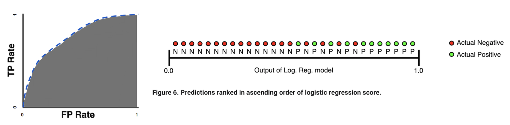

# Classification 

Table of Contents:

* [1. Binary Classification Models](https://github.com/HsiangHung/Machine_Learning_Note/tree/master/Classification#1-binary-classification-models)
     * [1.A - Logistic regression vs decision trees](https://github.com/HsiangHung/Machine_Learning_Note/tree/master/Classification#1a---logistic-regression-vs-decision-trees)
     * [1.B - Other classification model comparisons](https://github.com/HsiangHung/Machine_Learning_Note/tree/master/Classification#1b---other-classification-model-comparisons)
     * [1.C - Compare describe Tree, SVM and random forest](https://github.com/HsiangHung/Machine_Learning_Note/tree/master/Classification#1c---compare-describe-tree-svm-and-random-forest)
* [2. Binary Classification Metric](https://github.com/HsiangHung/Machine_Learning_Note/tree/master/Classification#2-binary-classification-metric)
     * [2.A - Precision and Recall](https://github.com/HsiangHung/Machine_Learning_Note/tree/master/Classification#2a---precision-and-recall)
     * [2.B - AUC](https://github.com/HsiangHung/Machine_Learning_Note/tree/master/Classification#2b---auc)
     * [2.C - Selection of precision or recall](https://github.com/HsiangHung/Machine_Learning_Note/tree/master/Classification#2c---selection-of-precision-or-recall)
* [3. Loss Function: Cross-Entropy](https://github.com/HsiangHung/Machine_Learning_Note/tree/master/Classification#3-loss-function-cost-function-cross-entropy)
     * [3.A - Binary](https://github.com/HsiangHung/Machine_Learning_Note/tree/master/Classification#3a-binary)
     * [3.B - Multiclass](https://github.com/HsiangHung/Machine_Learning_Note/tree/master/Classification#3b-multiclass)
     

## 1. Binary Classification Models

The summary of Advantages and Disadvantages of different Classification Models [[GeeksForGeeks]][Advantages and Disadvantages of different Classification Models]:

| model | linear? | bias |  variance | pro | con |
| --- | --- | --- | --- | --- | --- | 
| Logistic regression | linear| high | low | probabilistic approach | assume linear decision boundary | 
| [Naive bayes](https://github.com/HsiangHung/Machine_Learning_Note/tree/master/Classification/Naive%20Bayes) | nonlinear | high | low | probabilistic approach, efficient, not biased by outliers, also works for nonlinear problems | assume no interaction between features|
| [Tree](https://github.com/HsiangHung/Machine_Learning_Note/tree/master/Classification/Decison%20Tree) | nonlinear | low | high | Interpretability, no need for feature scaling. | Poor results on very small datasets, overfitting can easily occur. |
| [SVM](https://github.com/HsiangHung/Machine_Learning_Note/tree/master/Classification/Support%20Vector%20Machine) | by kernel | low | high | not biased by outliers, not sensitive to overfitting | Not good choice for large number of features and size  |
| kNN | nonlinear | low | high | Simple to understand, fast and efficient. | tune the number of neighbours ‘k’ |
| Emsemble | nonlinear | low | high | Powerful and accurate, good performance. |  No interpretability, overfitting can easily occur, need hyperparameter tuning|


### 1.A - Logistic regression vs decision trees

Summarize as follows (from [Big Data Zone: Logistic Regression vs. Decision Tree](https://dzone.com/articles/logistic-regression-vs-decision-tree))

|  |  Logistic Regression |  Decision Tree | 
| --- | --- | --- | 
| decision boundary  | linear (b, d), works well if classes are not well-separated | non-linear (a,c) | 
| relatively small data size | Yes | No |
| categorical data | need to Enumeration or OHE | Yes |
| data skewed | need to increase weight to the minority class or balance. | grow full tree |
| outlier | change decision boundary | at the initial stage, won't be affected, but later potentially yes |
| missing value | need to impute by mean, mode, and median | Yes. see [How do decision tree learning algorithms deal with missing values](https://stats.stackexchange.com/questions/96025/how-do-decision-tree-learning-algorithms-deal-with-missing-values-under-the-hoo) |
| online learning | Use SGD| No|

Comparison can be visualized below (credit from [Logistic Regression versus Decision Trees](https://blog.bigml.com/2016/09/28/logistic-regression-versus-decision-trees/#:~:text=Decision%20Boundaries&text=Decision%20Trees%20bisect%20the%20space,the%20space%20exactly%20into%20two.&text=A%20single%20linear%20boundary%20can%20sometimes%20be%20limiting%20for%20Logistic%20Regression.))


### 1.B - Other classification model comparisons

* For “relatively” very small dataset sizes, compare the performance of a discriminative Logistic Regression model to a related Naive Bayes classifier (a generative model) or SVMs, where the later may be less susceptible to noise and outlier points. Even so, logistic regression is a great, robust model for simple classification tasks. (by [Sebastian Raschka](https://sebastianraschka.com/faq/docs/logisticregr-neuralnet.html#what-is-the-relation-between-logistic-regression-and-neural-netw)).
* Logistic regression can be regarded as a one layer neural network (by [Sebastian Raschka](https://sebastianraschka.com/faq/docs/logisticregr-neuralnet.html#what-is-the-relation-between-logistic-regression-and-neural-netw)).
* One of the nice properties of logistic regression is that the logistic cost function (or max-entropy) is convex, and thus we are guaranteed to find the global cost minimum (by [Sebastian Raschka](https://sebastianraschka.com/faq/docs/logisticregr-neuralnet.html#what-is-the-relation-between-logistic-regression-and-neural-netw)).


### 1.C - Compare describe Tree, SVM and random forest
[Amazon’s Data Scientist Interview Practice Problems](https://towardsdatascience.com/amazon-data-scientist-interview-practice-problems-15b9b86e86c6) 

**Decision Trees**: a tree-like model used to model decisions based on one or more conditions.
* Pros: easy to implement, intuitive, handles missing values
* Cons: high variance, inaccurate

**Support Vector Machines**: a classification technique that finds a hyperplane or a boundary between the two classes of data that maximizes the margin between the two classes. There are many planes that can separate the two classes, but only one plane can maximize the margin or distance between the classes.

* Pros: accurate in high dimensionality
* Cons: prone to over-fitting, does not directly provide probability estimates

**Random Forests**: an ensemble learning technique that builds off of decision trees. Random forests involve creating multiple decision trees using bootstrapped datasets of the original data and randomly selecting a subset of variables at each step of the decision tree. The model then selects the mode of all of the predictions of each decision tree.

* Pros: can achieve higher accuracy, handle missing values, feature scaling not required, can determine feature importance.
* Cons: black box, computationally intensive


## 2. Binary Classification Metric

### 2.A - Precision and Recall

In most cases, there are no perfect classifiers. A good common question is which metric should we use for model selection, precision or recall? Classifier to have high True Positive Rate (TPR) or False Positive Rate (FPR)? It depends on domain and our business goal.

Recall the **confusion matrix**:

|    |  actual positive |  actual negative | 
| --- | --- | --- | 
|  **predicted positive** | TP | FP | 
|  **predicted negative** | FP | TN | 


The relevant metrics are 
```
precision = TP/(TP+FP), recall = TP/(TP+FN)
```
and
```
TPR = recall, FPR = FP/(FP+TN)
```
Each probability threshold in a classifier determiones a set of the above metrics. The relation between probability threshold and the metrics are 
```
  large threshold -> less positive predicted -> less TP -> lower TPR (recall), higher FPR -> higher precision
  small threshold -> more positive predicted -> more TP -> higher TPR (recall), lower FPR -> higher recall
```
Also we can define review rate 
```
review rate = N(prob > threshold)/N
```
where `N` is the number of data points.

### 2.B - AUC

AUC stands for "Area under the ROC Curve." That is, AUC measures the entire two-dimensional area underneath the entire ROC curve (think integral calculus) from (0,0) to (1,1).

Interpretation: **AUC represents the probability that a random positive (green) example is positioned to the right of a random negative (red) example.**

AUC provides an **aggregate** measure of performance across all possible classification thresholds. One way of interpreting AUC is as the probability that the model ranks a random positive example more highly than a random negative example. For example, given the following examples, which are arranged from left to right in ascending order of logistic regression predictions (from [Classification: ROC Curve and AUC](https://developers.google.com/machine-learning/crash-course/classification/roc-and-auc)):




### 2.C - Selection of precision or recall

#### 2.C.1 Business concern

Below there are some examples to ask: when precision is important and when recall is important ? [[Data Science: When is precision more important over recall?]][When is precision more important over recall?] [[Cross Validated: How to determine the optimal threshold for a classifier and generate ROC curve?]][How to determine the optimal threshold for a classifier and generate ROC curve?]. The answer depends on which we want to minimize, FP or FN costs more? Note it has been mentioned in the post that you could have 100% recall yet have a useless model: if your model always outputs a positive prediction, it would have 100% recall but be completely uninformative.

Here I summarize the cases from the above posts and list in the following:

1. For rare cancer data modeling, a false negative is usually more disastrous than a false positive for preliminary diagnoses. We want to minimize FN to have higher recall. So **Recall** is a better measure than precision.

2. For YouTube recommendations, FN is less of a concern. **Precision** is better here (if too many FP, users feel annoyed, so minimize FP).

3. Imagine a lot of free customers register in our websites every daily. The customer call center team doesn't care to call a guy that is not going to buy (so FP is not important) but for us is very important that all of them with high temperature are always in my selection. That means that a model needs to have a high **Recall**.

4. For spam filtering, a FP occurs when spam filtering or spam blocking techniques wrongly classify a legitimate email message as spam and, as a result, interferes with its delivery and we may lose important messgaes. Therefore we prefer more FN over many FP, and **Precision** is more important.

5. Let us say that a machine learning model is created to predict whether a certain day is a good day to launch satellites or not based on the weather. If the model accidentally predicts that a good day to launch satellites is bad (FN), we miss the chance to launch. This is not such a big deal. However, if the model predicts that it is a good day, but it is actually a bad day to launch the satellites (FP) then the satellites may be destroyed and the cost of damages will be in the billions. This is a case **Precision** is more important.

6. In the case of airport security, where a safety risk is the positive class, we want to make sure that every potential safety risk is investigated. In this case, we will have high **Recall** at the expense of precision (a lot of bags where there are no safety hazards will be investigated).

7. Imagine that we want to make sure that our web site blocker for our child only allows 'safe' websites to be shown. In this case, a 'safe' website is the positive class. Here, we want the blocker to be absolutely certain that the website is safe, even if some safe websites are predicted to be part of the negative or unsafe class and are consequently blocked. That is, we want high precision at the expense of recall.

#### 2.C.2 If no business concern

If there is no external business concern about low TPR or high FPR, one option is to weight them equally by choosing the threshold: 
* which is a `median value` of probability distribution, 
* which maximizes `TPR-FPR`, 
* which has optimal `F1 score` [[Cross Validated: How to determine the optimal threshold for a classifier and generate ROC curve?]][How to determine the optimal threshold for a classifier and generate ROC curve?]: 

 <a href="https://www.codecogs.com/eqnedit.php?latex=F_1&space;=&space;\frac{2\textrm{P}\textrm{R}}{\textrm{P}&plus;\textrm{R}}" target="_blank"></a>

where P = Precision and R = Recall.

#### 3. Fraud rate to precision, recall, AUC

In the imbalanced cases, how do fraud rates (proportion of positive events) influence the metrics? The post [[Sin-Yi Chou]][Precision - Recall Curve, a Different View of Imbalanced Classifiers] has very wonderful disucssion about it and we can have intuition as follows. 

Suppose for same amount of positive cases and model performance, lower fraud rate means more negative events. Thus precision may drop if recall keeps the same. The False positive rate doesn't change. Then we can expect 
ROC curve remains similar, but precision-recall curve will change.

[[Sin-Yi Chou]][Precision - Recall Curve, a Different View of Imbalanced Classifiers] shows comparison on ROC and PR curves at various positive rates: 0.5, 0.1, 0.01 below. We can see in (a) ROC patterns are roughly irrespective of the positive rates. 


However, in (b), we can see the PR curves show significant difference. When positive rates descrease, the PR curves shift downward. At the same recall, precision drops. This is consistent with our expectation.

On the other side, the author also shows PR curves is more useful to compare model performance in imbalanced cases. At different positive rates, all ROC AUC are 0.8 on example A and B (see below). But in PR curves, we can obviously see the difference between the examples. Thus in the highly-imbalanced case, the **PR curve** is a better indication.


## 3. Loss Function (Cost Function): Cross-Entropy


The cross-entropy of the generic form given a data record is 

<a href="https://www.codecogs.com/eqnedit.php?latex=\textrm{Cross-Entropy}&space;=&space;-\sum_c&space;p_c&space;\log&space;q_c" target="_blank"></a>

where `c` denotes class labels. `p` is the probability of **target** having class = c, and `q` is the probability of **prediction** as class = c. In classification, cross-entropy is used to be loss to optimize.

The cross-entropy can be used as loss to optimize using gradient descent in classification.

### 3.A - Binary 

For binary classification `c = {0, 1}`, if using one-hot representation to `p`, i.e. `p = [1 0]` for y = 1; `p = [0 1]` for y = 0, and prediction `q` is a sigmoid function, it arrives at the commonly-seen cross-entropy (`h` is the hypothesis function)

<a href="https://www.codecogs.com/eqnedit.php?latex=L(\theta,&space;\bold{x})&space;=&space;-y&space;\big(&space;\log(h_{\theta}(\bold{x}))&space;&plus;&space;(1-y)\log{(1-h_{\theta}(\bold{x}))}&space;\big)" target="_blank"></a>


The hypothesis function for binary case is sigmoid:

<a href="https://www.codecogs.com/eqnedit.php?latex=L(\theta,&space;\bold{x})&space;=&space;-&space;\Big[&space;y&space;\log&space;\Big(\frac{1}{1&plus;e^{-\theta^T&space;\bold{x}}}&space;\Big)&space;&plus;&space;(1-y)&space;\log&space;\Big(1-&space;\frac{1}{1&plus;e^{-\theta^T&space;\bold{x}}}&space;\Big)&space;\Big]" target="_blank"></a>


Note that the **loss function of logistic regression model is convex**. The followings are some detailed discussion:

* [Why is the error function minimized in logistic regression convex?](http://mathgotchas.blogspot.com/2011/10/why-is-error-function-minimized-in.html#:~:text=is%20essentially%20a%20linear%2Dcombination,of%20logistic%20regression%20is%20convex.)

* [Logistic regression - Prove That the Cost Function Is Convex](https://math.stackexchange.com/questions/1582452/logistic-regression-prove-that-the-cost-function-is-convex?newreg=f747e67287724e7eb4ea0fa8deab128c)

* [Quora: Is logistic regression cost function convex?](https://www.quora.com/Is-logistic-regression-cost-function-convex)

In short, we can roighly argue that the second derivatives of the loss are positive semi-definite, and the linear-combination of two or more convex functions (`log(h)` and `log(1-h)`) is also convex.


### 3.B - Multiclass

For multiclass, `c = {1, ...K}`, K classes. `p = [1 0 ... 0]` for y = 1,...  and `p = [0 0 ... 1]` for y = K, we arrive at the multiclassification cost function [[UFLDL Tutorial]][Softmax Regression]:

<a href="https://www.codecogs.com/eqnedit.php?latex=L(\theta,&space;\bold{x})&space;=&space;-&space;\sum^K_{j=1}\bold{I}(y=j)\log\big(&space;h_{\theta}(\bold{x})&space;\big)&space;=&space;-&space;\sum^K_{j=1}&space;\bold{I}(y=j)\log\big(&space;\frac{e^{\theta^{(j)T}\bold{x}}}{\sum^K_{j=1}e^{\theta^{(j)T}\bold{x}}}&space;\big)" target="_blank"></a>


where `I = 1` for y = j; otherwise `I=0`. 


## Reference


* [Precision - Recall Curve, a Different View of Imbalanced Classifiers]: https://sinyi-chou.github.io/classification-pr-curve/
[[Sin-Yi Chou] Precision - Recall Curve, a Different View of Imbalanced Classifiers](https://sinyi-chou.github.io/classification-pr-curve/)
* [How to determine the optimal threshold for a classifier and generate ROC curve?]: https://stats.stackexchange.com/questions/123124/how-to-determine-the-optimal-threshold-for-a-classifier-and-generate-roc-curve#:~:text=A%20really%20easy%20way%20to,positive%20rate(fpr)%20overlap.
[[Cross Validated: How to determine the optimal threshold for a classifier and generate ROC curve?] How to determine the optimal threshold for a classifier and generate ROC curve?](https://stats.stackexchange.com/questions/123124/how-to-determine-the-optimal-threshold-for-a-classifier-and-generate-roc-curve#:~:text=A%20really%20easy%20way%20to,positive%20rate(fpr)%20overlap.)
* [When is precision more important over recall?]: https://datascience.stackexchange.com/questions/30881/when-is-precision-more-important-over-recall
[[Data Science: When is precision more important over recall?] When is precision more important over recall?](https://datascience.stackexchange.com/questions/30881/when-is-precision-more-important-over-recall)
* [Advantages and Disadvantages of different Classification Models]: https://www.geeksforgeeks.org/advantages-and-disadvantages-of-different-classification-models/
[[GeeksForGeeks] Advantages and Disadvantages of different Classification Models](https://www.geeksforgeeks.org/advantages-and-disadvantages-of-different-classification-models/)
* [Softmax Regression]: http://deeplearning.stanford.edu/tutorial/supervised/SoftmaxRegression/support-vector-machines-in-machine-learning
[[UFLDL Tutorial] Softmax Regression](http://deeplearning.stanford.edu/tutorial/supervised/SoftmaxRegression/)


