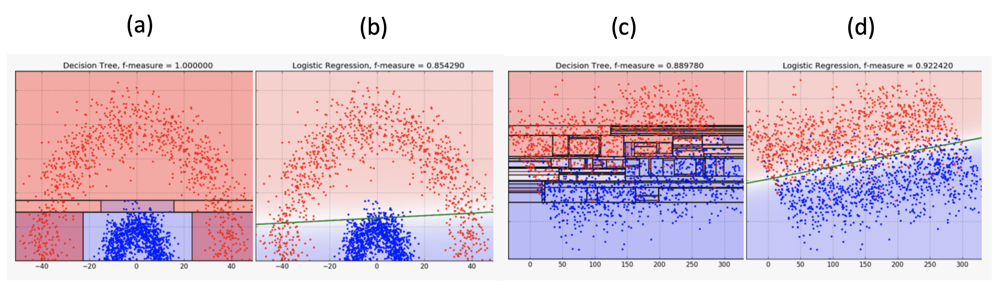
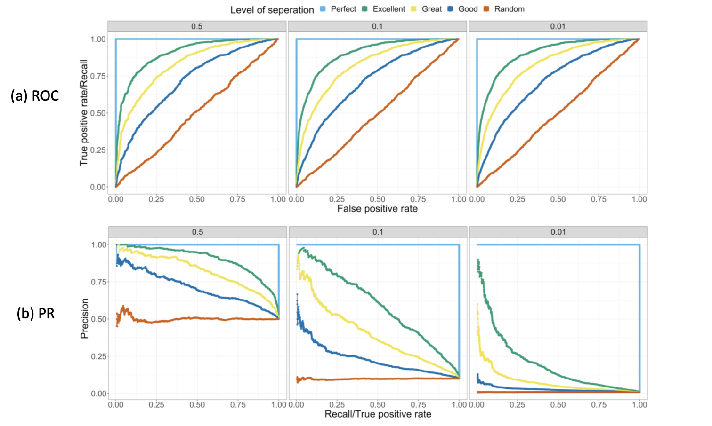
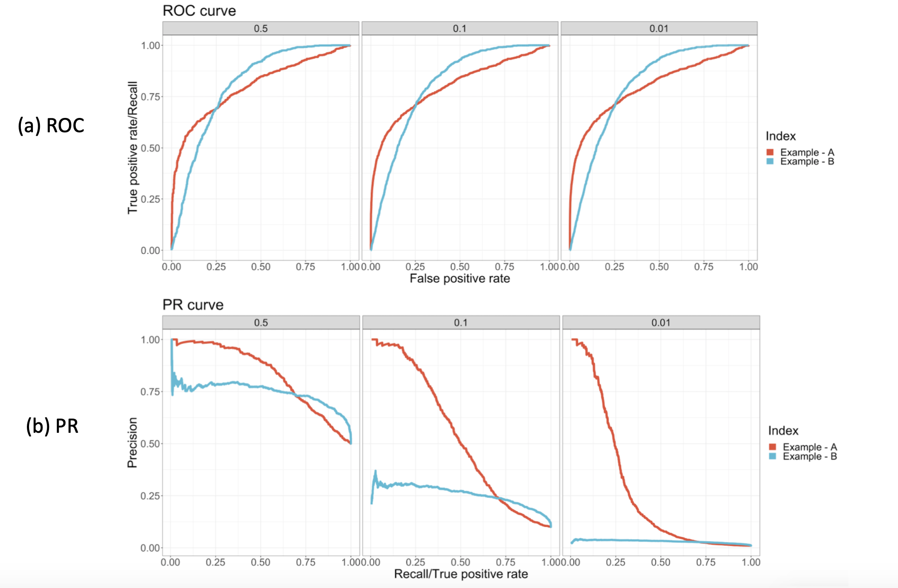

# Classification 

## Binary Models


| model |  bias |  variance | 
| --- | --- | --- | 
| [Naive bayes](https://github.com/HsiangHung/Machine_Learning_Note/tree/master/Classification/Naive%20Bayes)  | high | low | 
| Logistic regression| high | low|
| [Tree](https://github.com/HsiangHung/Machine_Learning_Note/tree/master/Classification/Decison%20Tree) | low | high |
| [SVM](https://github.com/HsiangHung/Machine_Learning_Note/tree/master/Classification/Support%20Vector%20Machine) | low | high |

### Logistic Regression (LR) versus Decision Trees (DT)


Summarize as follows (from [Big Data Zone: Logistic Regression vs. Decision Tree](https://dzone.com/articles/logistic-regression-vs-decision-tree))

|  |  Logistic Regression |  Decision Tree | 
| --- | --- | --- | 
| decision boundary  | linear (b, d), works well if classes are not well-separated | non-linear (a,c) | 
| categorical data | need to Enumeration or OHE | Yes |
| data skewed | need to increase weight to the minority class or balance. | geow full tree |
| outlier | change decision boundary | at the initial stage, won't be affected |
| missing value | need to impute by mean, mode, and median | [Yes](https://stats.stackexchange.com/questions/96025/how-do-decision-tree-learning-algorithms-deal-with-missing-values-under-the-hoo) |
| online learning | Use SGD| No|

Comparison can be visualized below (credit from [Logistic Regression versus Decision Trees](https://blog.bigml.com/2016/09/28/logistic-regression-versus-decision-trees/#:~:text=Decision%20Boundaries&text=Decision%20Trees%20bisect%20the%20space,the%20space%20exactly%20into%20two.&text=A%20single%20linear%20boundary%20can%20sometimes%20be%20limiting%20for%20Logistic%20Regression.))




## Binary Classification Metric

### Precision and Recall

In most cases, there are no perfect classifiers. A good common question is which metric should we use for model selection, precision or recall? Classifier to have high True Positive Rate (TPR) or False Positive Rate (FPR)? It depends on domain and our business goal.

Recall the **confusion matrix**:

| predicted \ actual |  positive |  negative | 
| --- | --- | --- | 
|  positive | TP | FP | 
|  negative | FP | TN | 


The relevant metrics are 
```
precision = TP/(TP+FP), recall = TP/(TP+FN)
```
and
```
TPR = recall, FPR = FP/(FP+TN)
```
Each probability threshold in a classifier determiones a set of the above metrics. The relation between probability threshold and the metrics are 
```
  large threshold -> less positive predicted -> less TP -> lower TPR (recall), higher FPR -> higher precision
  small threshold -> more positive predicted -> more TP -> higher TPR (recall), lower FPR -> higher recall
```
Also we can define review rate 
```
review rate = N(prob > threshold)/N
```
where `N` is the number of data points.

### A. Business concern

Below there are some examples to ask: when precision is important and when recall is important ? [[Data Science: When is precision more important over recall?]][When is precision more important over recall?] [[Cross Validated: How to determine the optimal threshold for a classifier and generate ROC curve?]][How to determine the optimal threshold for a classifier and generate ROC curve?]. The answer depends on which we want to minimize, FP or FN costs more? Note it has been mentioned in the post that you could have 100% recall yet have a useless model: if your model always outputs a positive prediction, it would have 100% recall but be completely uninformative.

Here I summarize the cases from the above posts and list in the following:

1. For rare cancer data modeling, a false negative is usually more disastrous than a false positive for preliminary diagnoses. We want to minimize FN to have higher recall. So **Recall** is a better measure than precision.

2. For YouTube recommendations, FN is less of a concern. **Precision** is better here (if too many FP, users feel annoyed, so minimize FP).

3. Imagine a lot of free customers register in our websites every daily. The customer call center team doesn't care to call a guy that is not going to buy (so FP is not important) but for us is very important that all of them with high temperature are always in my selection. That means that a model needs to have a high **Recall**.

4. For spam filtering, a FP occurs when spam filtering or spam blocking techniques wrongly classify a legitimate email message as spam and, as a result, interferes with its delivery and we may lose important messgaes. Therefore we prefer more FN over many FP, and **Precision** is more important.

5. Let us say that a machine learning model is created to predict whether a certain day is a good day to launch satellites or not based on the weather. If the model accidentally predicts that a good day to launch satellites is bad (FN), we miss the chance to launch. This is not such a big deal. However, if the model predicts that it is a good day, but it is actually a bad day to launch the satellites (FP) then the satellites may be destroyed and the cost of damages will be in the billions. This is a case **Precision** is more important.

6. In the case of airport security, where a safety risk is the positive class, we want to make sure that every potential safety risk is investigated. In this case, we will have high **Recall** at the expense of precision (a lot of bags where there are no safety hazards will be investigated).

7. Imagine that we want to make sure that our web site blocker for our child only allows 'safe' websites to be shown. In this case, a 'safe' website is the positive class. Here, we want the blocker to be absolutely certain that the website is safe, even if some safe websites are predicted to be part of the negative or unsafe class and are consequently blocked. That is, we want high precision at the expense of recall.

### B. If no business concern

If there is no external business concern about low TPR or high FPR, one option is to weight them equally by choosing the threshold: (a) is a `median value` of probability distribution, (2) maximizes `TPR-FPR`, (3) has optimal `F1 score` [[Cross Validated: How to determine the optimal threshold for a classifier and generate ROC curve?]][How to determine the optimal threshold for a classifier and generate ROC curve?]: 

 <a href="https://www.codecogs.com/eqnedit.php?latex=F_1&space;=&space;\frac{2\textrm{P}\textrm{R}}{\textrm{P}&plus;\textrm{R}}" target="_blank"></a>

where P = Precision and R = Recall.

### C. Fraud rat to precision, recall, AUC

In the imbalanced cases, how do fraud rates (or downsampling rate) influence the metrics? The post [[Sin-Yi Chou]][Precision - Recall Curve, a Different View of Imbalanced Classifiers] has very wonderful disucssion about it and we can have intuition as follows. 

Suppose for same amount of positive cases and model performance, lower fraud rate means more negative events. Thus precision may drop and recall keeps the same. The False positive rate doesn't change. Then we can expect 
ROC curve remains similar, but precision-recall curve will change.

[[Sin-Yi Chou]][Precision - Recall Curve, a Different View of Imbalanced Classifiers] shows comparison on ROC and PR curves at various positive rates: 0.5, 0.1, 0.01 below. We can see in (a) ROC patterns are roughly irrespective of the positive rates. 



However, in (b), we can see the PR curves show significant difference. When positive rates descrease, the PR curves shift downward. At the same recall, precision drops. This is consistent with our expectation.

On the other side, the author also shows PR curves is more useful to compare model performance in imbalanced cases. At different positive rates, all ROC AUC are 0.8 on example A and B (see below). But in PR curves, we can obviously see the difference between the examples. Thus in the highly-imbalanced case, the **PR curve** is a better indication.





## Multi-class Classification Metric


For binary classification, a confusion matrix has two rows and two columns. For multi-class classification problem, we categorize each sample into 1 of K classes to make `K x K` confusion matrix. In each class, we can still compute precision and recall on each class [[Boaz Shmueli-1]][Multi-Class Metrics Made Simple, Part I: Precision and Recall].

Given P and R for each class, how can we compare performance on various classifiers? We can macro avergae [[Boaz Shmueli-2]][Multi-Class Metrics Made Simple, Part II: the F1-score], weighted average [[Boaz Shmueli-3]][A Tale of Two Macro-F1's] and micro average scores.

For example, macro-averged Precision defines as

<a href="https://www.codecogs.com/eqnedit.php?latex=\textrm{Macro-P}&space;=&space;\frac{P_1&space;&plus;&space;P_2&space;&plus;&space;\cdots&space;P_K}{K}" target="_blank"></a>

and micro-averged Precision defines as

<a href="https://www.codecogs.com/eqnedit.php?latex=\textrm{Micro-P}&space;=&space;\frac{\textrm{TP}_1&space;&plus;\cdots&space;&plus;&space;\textrm{TP}_K}{\textrm{TP}_1&space;&plus;\cdots&space;&plus;&space;\textrm{TP}_K&space;&plus;&space;\textrm{FP}_1&space;&plus;\cdots&space;&plus;&space;\textrm{FP}_K}" target="_blank"></a>


[[Boaz Shmueli-2]][Multi-Class Metrics Made Simple, Part II: the F1-score] show an example for three classes. The confusion matrix is 
```
              --  True  --
          | cat | fish | han |
pred cat  |  4  |   6  |  3  |
pred fish |  1  |   2  |  0  |
pred han  |  1  |   2  |  6  |
```
For each class, we can have precision, recall and F1 score like
```
     precision | recall | F1 score
cat    0.308   |  0.667 |  0.421
fish   0.667   |  0.20  |  0.308
han    0.667   |  0.667 |  0.667
```

Macro-F1 = (0.421 + 0.308 + 0.667) / 3 = 0.465, Macro-precision = (0.31 + 0.67 + 0.67) / 3 = 0.547, Macro-recall = (0.67 + 0.20 + 0.67) / 3 = 0.511.


There are totally 4+2+6=12 TP, and totally 6+3+1+0+1+2=13 FP. Thus the micro-average precision is 12/(12+13)= 0.48. In the example, we can see total FN = FP. Therefore micro-averaged recall is the same as micro-averaged precision [[Boaz Shmueli-2]][Multi-Class Metrics Made Simple, Part II: the F1-score]. 


## Loss Function: Cross-Entropy


The cross-entropy of the generic form given a data record is 

<a href="https://www.codecogs.com/eqnedit.php?latex=\textrm{Cross-Entropy}&space;=&space;-\sum_c&space;p_c&space;\log&space;q_c" target="_blank"></a>

where `c` denotes class labels. `p` is the probability of target having class = c, and `q` is the probability of prediction as class = c. In classification, cross-entropy is used to be loss to optimize.

The cross-entropy can be used as loss to optimize using gradient descent in classification.

### a. binary 

For binary classification `c = {0, 1}`, if using one-hot representation to `p`, i.e. `p = [1 0]` for y = 1; `p = [0 1]` for y = 0, and prediction `q` is a sigmoid function, it arrives at the commonly-seen cross-entropy 

<a href="https://www.codecogs.com/eqnedit.php?latex=L(\theta,&space;\bold{x})&space;=&space;-&space;\big[&space;y&space;\log&space;\Big(\frac{1}{1&plus;e^{-\theta^T&space;\bold{x}}}&space;\Big)&space;&plus;&space;(1-y)&space;\log&space;\Big(1-&space;\frac{1}{1&plus;e^{-\theta^T&space;\bold{x}}}&space;\Big)&space;\big]" target="_blank"></a>

### b. multiclass

For multiclass, `c = {1, ...K}`, `p = [1 0 ... 0]` for y = K,... `p = [0 0 ... 1]` for y = 1..., we arrive at the multiclassification cost function [[UFLDL Tutorial]][Softmax Regression]:

<a href="https://www.codecogs.com/eqnedit.php?latex=L(\theta,&space;\bold{x})&space;=&space;-&space;\sum^K_{j=1}\bold{I}(y=j)\log\big(&space;h_{\theta}(\bold{x})&space;\big)&space;=&space;-&space;\sum^K_{j=1}&space;\bold{I}(y=j)\log\big(&space;\frac{e^{\theta^{(j)T}\bold{x}}}{\sum^K_{j=1}e^{\theta^{(j)T}\bold{x}}}&space;\big)" target="_blank"></a>


where `I = 1` for y = j; otherwise `I=0`. 


## Reference


[Multi-Class Metrics Made Simple, Part I: Precision and Recall]: https://towardsdatascience.com/multi-class-metrics-made-simple-part-i-precision-and-recall-9250280bddc2
[[Boaz Shmueli-1] Multi-Class Metrics Made Simple, Part I: Precision and Recall](https://towardsdatascience.com/multi-class-metrics-made-simple-part-i-precision-and-recall-9250280bddc2)


[Multi-Class Metrics Made Simple, Part II: the F1-score]: https://towardsdatascience.com/multi-class-metrics-made-simple-part-ii-the-f1-score-ebe8b2c2ca1
[[Boaz Shmueli-2] Multi-Class Metrics Made Simple, Part II: the F1-score](https://towardsdatascience.com/multi-class-metrics-made-simple-part-ii-the-f1-score-ebe8b2c2ca1)


[A Tale of Two Macro-F1's]: https://towardsdatascience.com/a-tale-of-two-macro-f1s-8811ddcf8f04
[[Boaz Shmueli-3] A Tale of Two Macro-F1's](https://towardsdatascience.com/a-tale-of-two-macro-f1s-8811ddcf8f04)


[Precision - Recall Curve, a Different View of Imbalanced Classifiers]: https://sinyi-chou.github.io/classification-pr-curve/
[[Sin-Yi Chou] Precision - Recall Curve, a Different View of Imbalanced Classifiers](https://sinyi-chou.github.io/classification-pr-curve/)


[How to determine the optimal threshold for a classifier and generate ROC curve?]: https://stats.stackexchange.com/questions/123124/how-to-determine-the-optimal-threshold-for-a-classifier-and-generate-roc-curve#:~:text=A%20really%20easy%20way%20to,positive%20rate(fpr)%20overlap.
[[Cross Validated: How to determine the optimal threshold for a classifier and generate ROC curve?] How to determine the optimal threshold for a classifier and generate ROC curve?](https://stats.stackexchange.com/questions/123124/how-to-determine-the-optimal-threshold-for-a-classifier-and-generate-roc-curve#:~:text=A%20really%20easy%20way%20to,positive%20rate(fpr)%20overlap.)


[When is precision more important over recall?]: https://datascience.stackexchange.com/questions/30881/when-is-precision-more-important-over-recall
[[Data Science: When is precision more important over recall?] When is precision more important over recall?](https://datascience.stackexchange.com/questions/30881/when-is-precision-more-important-over-recall)


[Softmax Regression]: http://deeplearning.stanford.edu/tutorial/supervised/SoftmaxRegression/support-vector-machines-in-machine-learning
[[UFLDL Tutorial] Softmax Regression](http://deeplearning.stanford.edu/tutorial/supervised/SoftmaxRegression/)


