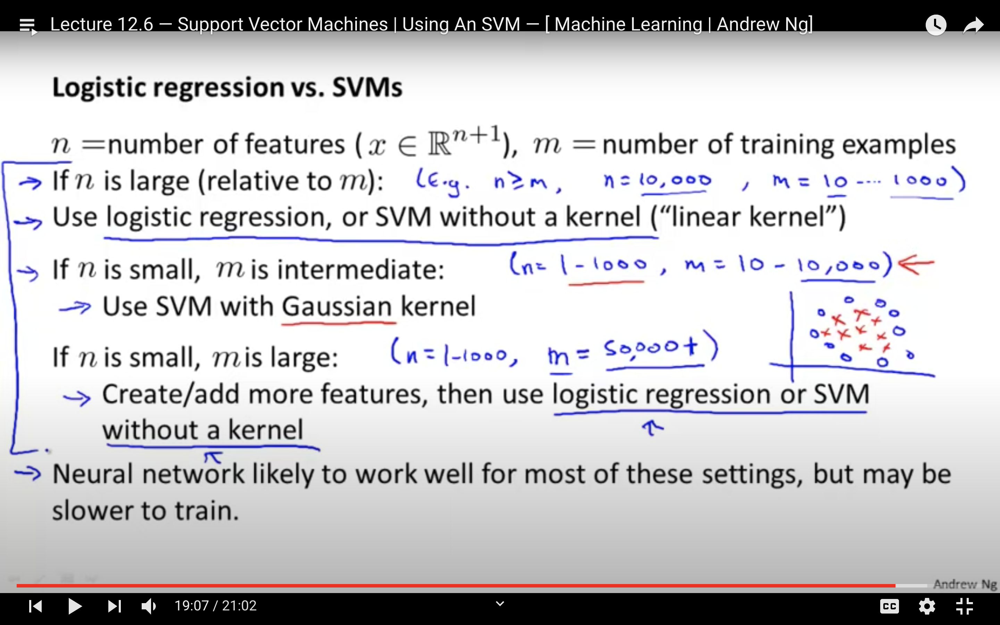

# Support Vector Machine

Table of Contents:

* [1. What are Support Vectors and SVM Classifier?](https://github.com/HsiangHung/Machine_Learning_Note/tree/master/Classification/Support%20Vector%20Machine#1-what-are-support-vectors-and-svm-classifier)
* [2. Cost Function](https://github.com/HsiangHung/Machine_Learning_Note/tree/master/Classification/Support%20Vector%20Machine#3-cost-function)
* [3. Non-Linear SVM](https://github.com/HsiangHung/Machine_Learning_Note/tree/master/Classification/Support%20Vector%20Machine#4-non-linear-svm)
* [4. SVM vs Logistic Regression](https://github.com/HsiangHung/Machine_Learning_Note/tree/master/Classification/Support%20Vector%20Machine#5-svm-vs-logistic-regression)

## 1. What are Support Vectors and SVM Classifier?

### Support vectors

Support vectors are data points that are closer to the hyperplane and influence the position and orientation of the hyperplane. Using these support vectors, we maximize the margin of the classifier. The boundary to separate classes is called **maximum margin**. Deleting the support vectors will change the position of the hyperplane. These are the points that help us build our SVM [[Rohith Gandhi]][Support Vector Machine — Introduction to Machine Learning Algorithms], [[Shuyu Luo]][Loss Function(Part III): Support Vector Machine], [[Priyankur Sarkar]][Support Vector Machines in Machine Learning]
(credit from [Wiki](https://en.wikipedia.org/wiki/Support-vector_machine) and [[Rohith Gandhi]][Support Vector Machine — Introduction to Machine Learning Algorithms]).

The support vectors are formed by the data laying along the margin.

In the upper right panel, we classify blue instances as positives 

$$\vec{w}\cdot \vec{x}_{+} -b \geq 1,$$

and green instances as negatives 

$$\vec{w}\cdot \vec{x}_{-} -b \leq -1.$$

The margin width is given

$$ {\displaystyle ( \vec{x}_+  -  \vec{x} ) \cdot \frac{\vec{w} }{||\vec{w} ||} = \frac{(1+b)-(-1+b)}{||\vec{w}||} = \frac{2}{||\vec{w}||}}.$$

Maximize the margin width is equivalent to minimize $||\vec{w}||$.

### SVM Classifier

The following is the best description for SVM I heard so far (from [[GeeksForGeeks]][Advantages and Disadvantages of different Classification Models]):

**SVM is used as a linear or non-linear classifier based on the kernel used. If we use a linear kernel, then the classifier and hence the prediction boundary are linear. SVMs **learn from the support vectors**, unlike other machine learning models that learn from the correct and incorrect data. For example, suppose we have two classes – apples and oranges. In that case, SVM learns those examples which are rightmost in apples (an apple resembling an orange) and leftmost in oranges (an orange resembling an apple); that is, they look at the extreme cases**.

Therefore, they perform better most of the time. Therefore, SVM is `less biased by outliers`, and less sensitive to overfitting [[GeeksForGeeks]][Advantages and Disadvantages of different Classification Models].

Kernel SVM is particularly useful when the data is not linearly separable. Therefore, we take our non–linearly separable dataset, map it to a higher dimension, get a linearly separable dataset, invoke SVM classifier, build a decision boundary for the data [[GeeksForGeeks]][Advantages and Disadvantages of different Classification Models].

## 2. Cost Function

The cost function of SVM is very similar to that of Logistic Regression. Looking at it by $y = 1$ and $y = \theta$ separately in below plot (credit from [[Shuyu Luo]][Loss Function(Part III): Support Vector Machine]), the black line is the cost function of Logistic Regression, and the red line is for SVM. Please note that the x axes in the plots are the raw model output, $z = \theta^T \mathbf{x}$. 

Suppose $m$ is the data size, and there are $n$ features, we can write the following generic form (with regularization)

$$C(\symbf{\theta}) = C \sum^m_{i=1} \big[ y_i \textrm{Cost}_1(\theta^T \symbf{x}_i) + (1-y_i) \textrm{Cost}_0 (\theta^T \symbf{x}_i ) \big] + \frac{1}{2} \sum^n_j |\theta_j| ^2$$

What is the hypothesis for SVM? It’s simple and straightforward. When θᵀx ≥ 0, predict 1, otherwise, predict 0. Then we can use the hinge loss function (**Hinge Loss**)

$$C(\symbf{\theta}) = C \sum^m_{i=1} \Big[ y_i \max \big(0, 1- \theta^T \symbf{x}_i)  + (1-y_i) \max \big(0, 1 + \theta^T \mathbf{x}_i \big)  \Big] + \frac{1}{2} \sum^n_j |\theta_j|^2$$

With a very large value of $C$ (similar to no regularization), this large margin classifier will be very sensitive to outliers. On the other hand, When $C$ is small, we start to allow misclassified staying in the margin. We called it **Soft-margin**.

## 3. Non-Linear SVM

The non-linear boundary problem can be solved if we introduce a kernel [[Priyankur Sarkar]][Support Vector Machines in Machine Learning]. The cost function turns to 

$$C(\symbf{\theta}) = C \sum^m_{i=1} \Big[ y_i \max ( 0, 1- \theta^T \symbf{f}_i )  + (1-y_i) \max (0, 1 + \theta^T \symbf{f}_i ) \Big] + \frac{1}{2}\sum^n_j |\theta_j|^2$$

where $f$ is **Kernel Function**. In Andrew's Ng's Machine learning class, they are described as similarity function: 

$$ f_1 =  \textrm{Similarity}(x, l^{(1)}), \ f_2 = \textrm{Similarity}(x, l^{(2)}), \cdots$$ 

and so on, where $l^{(j)}$ are $j$ th-landmarks. He used **Gaussian Kernel** to describe proximity. In Scikit-learn SVM package, Gaussian Kernel is mapped to ‘rbf’ , **Radial Basis Function** Kernel, the only

$$f_j = \textrm{similarity}(x, l^{(j)}) = \exp{\Big(-\frac{||x-l^{(j)}||^2}{2\sigma^2} \Big)}$$

We can map model as each data point represents a landmark. In this case, we turn $n$ features to $m$ features.
Since it turns to the data size as number of features, SVM is probably not suitable for large size data.

We also have **Sigmoid Kernel**, **Polynomial Kernel**.

## 4. SVM vs Logistic Regression

Many SVM packages have built in **multi-class classification**. Otherwise use **one-vs-all** method. For $K$ classes, train $K$ SVMs, each identifies if $y = 1$ for class ${1,2,...K}$. We pick class  for largest $\theta^T \mathbf{x}_i$.

The main differences between SVM and Logistic regression (LR) [[Georgios Drakos]][Support Vector Machine vs Logistic Regression]:

* SVM try to maximize the margin between the closest support vectors while LR optimizes the posterior class probability (log likelihood function). Thus, SVM find a solution which is as fare as possible for the two categories while LR has not this property.
* LR is more sensitive to outliers than SVM because the cost function of LR diverges faster than those of SVM.
* Logistic Regression produces probabilistic values while SVM produces 1 or 0.

Try logistic regression first and see how you do with that simpler model. If logistic regression fails and you have reason to believe your data won’t be linearly separable, try an SVM with a non-linear kernel like a **Radial Basis Function** (RBF). See the comparison provided by Andrew's Ng's Machine learning coursera class

## Quiz

[25 Questions to test a Data Scientist on Support Vector Machines](https://www.analyticsvidhya.com/blog/2017/10/svm-skilltest/)

## Reference

* [Support Vector Machine vs Logistic Regression]: https://www.knowledgehut.com/blog/data-science/support-vector-machines-in-machine-learning
[[Georgios Drakos] Support Vector Machine vs Logistic Regression](https://www.knowledgehut.com/blog/data-science/support-vector-machines-in-machine-learning)
* [Advantages and Disadvantages of different Classification Models]: https://www.geeksforgeeks.org/advantages-and-disadvantages-of-different-classification-models/
[[GeeksForGeeks] Advantages and Disadvantages of different Classification Models](https://www.geeksforgeeks.org/advantages-and-disadvantages-of-different-classification-models/)
* [Support Vector Machines in Machine Learning]: https://www.knowledgehut.com/blog/data-science/support-vector-machines-in-machine-learning
[[Priyankur Sarkar] Support Vector Machines in Machine Learning](https://www.knowledgehut.com/blog/data-science/support-vector-machines-in-machine-learning)
* [Support Vector Machine — Introduction to Machine Learning Algorithms]: https://towardsdatascience.com/support-vector-machine-introduction-to-machine-learning-algorithms-934a444fca47
[[Rohith Gandhi] Support Vector Machine — Introduction to Machine Learning Algorithms](https://towardsdatascience.com/support-vector-machine-introduction-to-machine-learning-algorithms-934a444fca47)
* [Loss Function(Part III): Support Vector Machine]: https://towardsdatascience.com/optimization-loss-function-under-the-hood-part-iii-5dff33fa015d
[[Shuyu Luo] Loss Function(Part III): Support Vector Machine](https://towardsdatascience.com/optimization-loss-function-under-the-hood-part-iii-5dff33fa015d)

