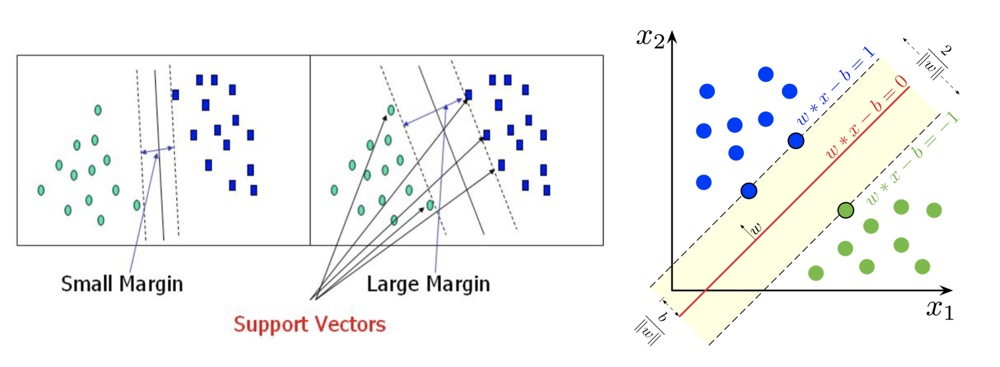
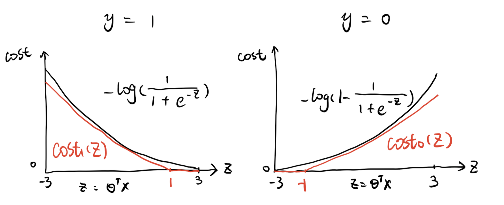

# Support Vector Machine

## What are Support Vectors?

Support vectors are data points that are closer to the hyperplane and influence the position and orientation of the hyperplane. Using these support vectors, we maximize the margin of the classifier. Deleting the support vectors will change the position of the hyperplane. These are the points that help us build our SVM [[Rohith Gandhi]][Support Vector Machine — Introduction to Machine Learning Algorithms], [[Shuyu Luo]][Loss Function(Part III): Support Vector Machine]
.
(credit from Wiki and [[Rohith Gandhi]][Support Vector Machine — Introduction to Machine Learning Algorithms])

## SVM Cost Function

The loss function of SVM is very similar to that of Logistic Regression. Looking at it by y = 1 and y = 0 separately in below plot, the black line is the cost function of Logistic Regression, and the red line is for SVM. Please note that the X axis here is the raw model output, θᵀx. 

Therefore we can write the following generic form

What is the hypothesis for SVM? It’s simple and straightforward. When θᵀx ≥ 0, predict 1, otherwise, predict 0. To extend SVM to cases in which the data are not linearly separable, the hinge loss function is helpful

## Summary

## Reference

[Support Vector Machine — Introduction to Machine Learning Algorithms]: https://towardsdatascience.com/support-vector-machine-introduction-to-machine-learning-algorithms-934a444fca47
[[Rohith Gandhi] Support Vector Machine — Introduction to Machine Learning Algorithms](https://towardsdatascience.com/support-vector-machine-introduction-to-machine-learning-algorithms-934a444fca47)

[Loss Function(Part III): Support Vector Machine]: https://towardsdatascience.com/optimization-loss-function-under-the-hood-part-iii-5dff33fa015d
[[Shuyu Luo] Loss Function(Part III): Support Vector Machine](https://towardsdatascience.com/optimization-loss-function-under-the-hood-part-iii-5dff33fa015d)

