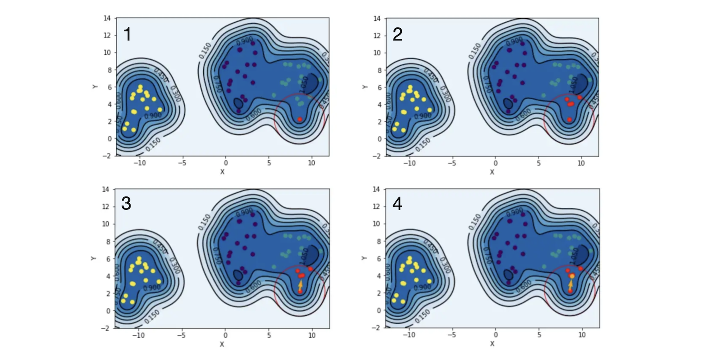

# 1D Clustering

* [1. Kernel Density Estimate (KDE)](https://github.com/HsiangHung/Machine_Learning_Note/tree/master/Clustering/1D_clustering#1-kernel-density-estimate)
* [2. Gaussina Mixture Model (GMM)](https://github.com/HsiangHung/Machine_Learning_Note/tree/master/Clustering/1D_clustering#2-gaussina-mixture-model-gmm)
* [3. Validation of Brutal Searching Epsilon in DBSCAN](https://github.com/HsiangHung/Machine_Learning_Note/tree/master/Clustering/DBSCAN#3-validation-of-brutal-searching-epsilon-in-dbscan)


## 1. Kernel Density Estimate (KDE)


How to use KDE for 1D clustering? Mainly refer the stackoverflow post: [Stackoverflow: How would one use Kernel Density Estimation as a 1D clustering method in scikit learn?](https://stackoverflow.com/questions/35094454/how-would-one-use-kernel-density-estimation-as-a-1d-clustering-method-in-scikit).

First fit the 1D density using KDE:
```Python
from sklearn.neighbors.kde import KernelDensity
a = array([10,11,9,23,21,11,45,20,11,12]).reshape(-1, 1)
kde = KernelDensity(kernel='gaussian', bandwidth=3).fit(a)
```
Then prepare profile based on the data range to identfiy local minima and maxima:
```Python
from scipy.signal import argrelextrema
s = linspace(np.min(a), np.max(a))
e = kde.score_samples(s.reshape(-1,1))
mi, ma = argrelextrema(e, np.less)[0], argrelextrema(e, np.greater)[0]
```
`mi` returns `[17.34693878, 33.67346939]`. 

Then we can simply cluster the 1D data as 
1. a < 17.347 (`mi[0]`)
2. 17.347 (`mi[0]`) < a < 33.673 (`mi[1]`)
3. a > 33.673 (`mi[1]]`)

### Hyperparameters in KDE

Two important hyperparameters in KDE:
1. Kernel
2. bandwidth

The 1D clustering using KDE is sensitive to bandwidth selection. There are some easy rules of thumb for determining bandwidth [[Andrey Akinshin]][The importance of kernel density estimation bandwidth]:

* Scott’s rule of thumb: $h \sim 1.06 \sigma n^{-1/5}$
* Silverman’s rule of thumb: $h = 0.9 \min(\sigma, \frac{IQR}{1.35})n^{-1/5}$, where $IQR = (Q_3 - Q_1)/2$ [Interquartile Range](https://byjus.com/maths/interquartile-range/). Using ``` scipy.stats.iqr```


Optimization approach [[Niranjan Pramanik]][Kernel Density Estimation]:
* Maximum likelihood cross- validation (MLCV)
* The Improved Sheather-Jones algorithm [[KDEpy]][KDEpy Bandwidth], [[Eduardo García-Portugués]][A Short Course on Nonparametric Curve Estimation: Bandwidth selection]
* others: [[Andrey Akinshin]][The importance of kernel density estimation bandwidth], [[Crossvalidated]][Methods to Find the Best Bandwidth for Kernel Density Estimation]


#### Reference

* [The importance of kernel density estimation bandwidth]: https://aakinshin.net/posts/kde-bw/
[[Andrey Akinshin] The importance of kernel density estimation bandwidth](https://aakinshin.net/posts/kde-bw/)
* [Kernel Density Estimation]: https://medium.com/analytics-vidhya/kernel-density-estimation-kernel-construction-and-bandwidth-optimization-using-maximum-b1dfce127073
[[Niranjan Pramanik] Kernel Density Estimation](https://medium.com/analytics-vidhya/kernel-density-estimation-kernel-construction-and-bandwidth-optimization-using-maximum-b1dfce127073)
* [KDEpy Bandwidth]: https://kdepy.readthedocs.io/en/latest/bandwidth.html
[[KDEpy] KDEpy Bandwidth](https://kdepy.readthedocs.io/en/latest/bandwidth.html)
* [A Short Course on Nonparametric Curve Estimation: Bandwidth selection]: https://bookdown.org/egarpor/NP-EAFIT/dens-bwd.html
[[Eduardo García-Portugués] A Short Course on Nonparametric Curve Estimation: Bandwidth selection](https://bookdown.org/egarpor/NP-EAFIT/dens-bwd.html)
* [Methods to Find the Best Bandwidth for Kernel Density Estimation]: https://stats.stackexchange.com/questions/229743/methods-to-find-the-best-bandwidth-for-kernel-density-estimation
[[Crossvalidated] Methods to Find the Best Bandwidth for Kernel Density Estimation](https://stats.stackexchange.com/questions/229743/methods-to-find-the-best-bandwidth-for-kernel-density-estimation)
* [How would one use Kernel Density Estimation as a 1D clustering method in scikit learn?]: https://stackoverflow.com/questions/35094454/how-would-one-use-kernel-density-estimation-as-a-1d-clustering-method-in-scikit
[[Stackoverflow] How would one use Kernel Density Estimation as a 1D clustering method in scikit learn?](https://stackoverflow.com/questions/35094454/how-would-one-use-kernel-density-estimation-as-a-1d-clustering-method-in-scikit)

## 2. Gaussina Mixture Model (GMM)


In the GMM model, the prior distribution on the vector $\bf{\mu}$ and $\Sigma$ of estimates given data $\bf{X}$ is 

$$ p(\bf{X}) = \sum^K_{n=1} \omega_n \mathcal{N}(\bf{X}|\bf{\mu}_n, \Sigma_n), $$

where index $n$ goes over distribution component, $K$ is the number of components, and $\mathcal{N}(X|\bf{\mu}_n, \Sigma_n)$ is the $n$-th component multivariate **Guassian** distribution $\mathcal{N}_n$ with means $\bf{\mu_n}$ and covariance matrices $\Sigma_n$, which reads as

$$ \mathcal{N}_n = \mathcal{N}(\bf{X}|\bf{\mu}_n, \Sigma_n) = \frac{1}{ (2\pi)^{\frac{n}{2}} |\Sigma|^{\frac{1}{2}}}\exp \left( -\frac{1}{2} (\bf{X}- \bf{\mu}_n)^T \Sigma_n^{-1}(\bf{X}- \bf{\mu}_n) \right).$$

Given a predetermining parameter, $K$, the number of Gaussian distributions, we need to perform iterative processes, called **Expectation–maximization** (EM) algorithm to update ($\omega_n$, $\mu_n$, $\Sigma_n$). In the following, we follow the introductionary youtube: [Unsupervised Learning: Gaussian Mixture Model (1D GMM)](https://www.youtube.com/watch?v=fVsmnZqrBUs).


At first we initialize the weights $\omega_n = 1/K$ and split points which define the range of Gaussian distrubutions, e.g. x < $s^0$ for $\mathcal{N}_0$, $s^0 \le$ x < $s^1$ for $\mathcal{N}_1$ ... etc. Then from data, we can determine means $\mu_n$ and covariance matrices $\Sigma_n$, as well as  $\mathcal{N}_n = \mathcal{N}(\bf{X}|\bf{\mu}_n, \Sigma_n)$ for each component $n$.

Next step is to compute new weight as 

$$ \omega_n^{\textrm{new}} = \frac{1}{N} \sum^N_{i=1} \frac{\mathcal{N}(\bf{X}_i |\bf{\mu}_n, \Sigma_n)}{\sum_{n=1, 2 \cdots K} \mathcal{N}(\bf{X}_i |\bf{\mu}_n, \Sigma_n)}, $$

and the new means and covariance matrices are updated by 

$$ \mu^{\textrm{new}}_n = \sum^N_{i=1} p(\bf{X}_i) \bf{X}_i = \sum^N_{i=1} \frac{ \omega_n \mathcal{N} (\bf{X}_i |\bf{\mu}_n, \Sigma_n) \bf{X}_i }{\sum_n \omega_n \mathcal{N}  (\bf{X}_i |\bf{\mu}_n, \Sigma_n)},$$

and 

$$ \Sigma^{\textrm{new}}_n = \sum^N_{i=1} p(\bf{X}_i) || \bf{X}_i - \mu_n ||^2 .$$

This completes an iteration. We replace ($\omega^{\textrm{new}}_n$, $\mu^{\textrm{new}}_n$, $\Sigma^{\textrm{new}}_n$) to ($\omega_n$, $\mu_n$, $\Sigma_n$) and continue the process until the changes on the parameters are less some threshold.

The example Python code is as follows [[AstroML]][1D Gaussian Mixture Example]:

```Python
from sklearn.mixture import GaussianMixture

K = 11

models = []
for n in range(2, len(K)):
    models.append(GaussianMixture(n).fit(X)) # grid search number of components

# compute the AIC and the BIC
AIC = [m.aic(X) for m in models]
BIC = [m.bic(X) for m in models]

best_GMM = models[np.argmin(AIC)]
```
Above example run grid search on $n=2, 3... 10$ components, and choose the model with lowest AIC as optimal model.


#### Reference

* [1D Gaussian Mixture Example]: https://www.astroml.org/book_figures/chapter4/fig_GMM_1D.html
[[AstroML] 1D Gaussian Mixture Example](https://www.astroml.org/book_figures/chapter4/fig_GMM_1D.html)
* [Youtube: Unsupervised Learning: Gaussian Mixture Model (1D GMM)]: https://www.youtube.com/watch?v=fVsmnZqrBUs
[[ADipLearn] Youtube: Unsupervised Learning: Gaussian Mixture Model (1D GMM)](https://www.youtube.com/watch?v=fVsmnZqrBUs)


## 3. Meanshift

**Mean shift** is an unsupervised learning algorithm that is mostly used for clustering. It is widely used in real-world data analysis (e.g., image segmentation)because it’s **non-parametric** and doesn’t require any predefined shape of the clusters in the feature space.

Simply speaking, “mean shift” is an iterative method to seek cluster centroids, and the density gradient “mean shift vector” is determined by the kernel density gradient. Assume the data density can be described by multiple kernel density functions $\mathcal{K}_n$: 

$$p(\bf{X}) = \sum_n \omega_n \mathcal{K}_n(\bf{X}) = \sum_n \omega_n \mathcal{K}_n( \frac{|| \bf{X} - \bf{x}_n||^2}{\sigma}),$$

where $\bf{x}_n$ denotes the centroid of the $n$-th Kernel. The gradient of 
 
$$ \nabla p(\bf{X}) = \sum_n \frac{2 \omega_n}{\sigma^d} \left( \bf{X} - \bf{x}_n \right) \mathcal{K}^{\prime}_n( \frac{|| \bf{X} - \bf{x}_n||^2}{\sigma})$$


Pro:
* Clustering can be any shape
* No need to predetermine the number of clusters
* Implement k-nearest neighbor method to determine bandwidth

Con:
* Time complexity is $O(kn^2)$, where $n$ is the data size and $k$ is the number of iterations for data points.
* May be unable to identify clutsering outlier data.


### Algorithm 

The process is described as below (c.f. [[Yuki Liu]][Clustering method 2 - Mean Shift])



```Python
from sklearn.cluster import MeanShift, estimate_bandwidth

X = data.reshape(-1, 1)
#estimate bandwidth
bandwidth = estimate_bandwidth(X, quantile=0.2, n_samples=len(data))

#Mean Shift method
model = MeanShift(bandwidth=bandwidth, bin_seeding=True)
model.fit(X)
labels = model.predict(X)
```


#### Reference

* [Clustering method 2 - Mean Shift]: https://medium.com/ai-academy-taiwan/clustering-method-2-cd9bb883a0cb
[[Yuki Liu] Clustering method 2 - Mean Shift](https://medium.com/ai-academy-taiwan/clustering-method-2-cd9bb883a0cb)
* [Mean Shift, Mode Seeking, and Clustering]: http://home.ku.edu.tr/mehyilmaz/public_html/mean-shift/00400568.pdf
[[Yizong Cheng] Mean Shift, Mode Seeking, and Clustering](http://home.ku.edu.tr/mehyilmaz/public_html/mean-shift/00400568.pdf)
* [Understanding Mean Shift Clustering and Implementation with Python]: https://towardsdatascience.com/understanding-mean-shift-clustering-and-implementation-with-python-6d5809a2ac40
[[Yufeng] Understanding Mean Shift Clustering and Implementation with Python](https://towardsdatascience.com/understanding-mean-shift-clustering-and-implementation-with-python-6d5809a2ac40)


