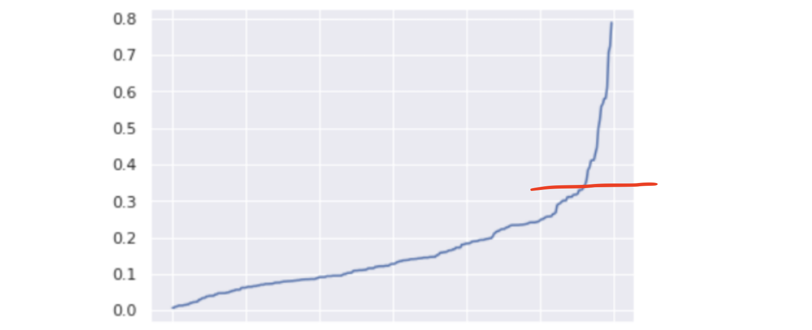

# DBSCAN

* [1. Introduction](https://github.com/HsiangHung/Machine_Learning_Note/tree/master/Clustering/DBSCAN#1-introduction)
* [2. Hyperparameters in DBSCAN](https://github.com/HsiangHung/Machine_Learning_Note/tree/master/Clustering/DBSCAN#2-hyperparameters-in-dbscan)
     * [2.1 Choosing Epsilon](https://github.com/HsiangHung/Machine_Learning_Note/tree/master/Clustering/DBSCAN#21-choosing-epsilon)
     * [2.2 Choosing MinPt](https://github.com/HsiangHung/Machine_Learning_Note/tree/master/Clustering/DBSCAN#22-choosing-minpt)
* [3. Validation of Brutal Searching Epsilon in DBSCAN](https://github.com/HsiangHung/Machine_Learning_Note/tree/master/Clustering/DBSCAN#3-validation-of-brutal-searching-epsilon-in-dbscan)
* [4. Disadvanatge in DBSCAN](https://github.com/HsiangHung/Machine_Learning_Note/tree/master/Clustering/DBSCAN#4-disadvanatge-in-dbscan)


## 1. Introduction

DBSCAN is a popular clustering algorithm which is fundamentally very different from k-means. The comparison is summarized by [[Chris McCormick]][DBSCAN Clustering].

* In k-means clustering, each cluster is represented by a **centroid**, and points are assigned to whichever centroid they are closest to. In DBSCAN, there are no centroids, and clusters are formed by linking nearby points to one another.

* k-means requires specifying **the number of clusters**, `k`. DBSCAN does not, but does require specifying two parameters, a distance threshold, “epsilon”, and “MinPts”, minimum number of points in a cluster.

* k-means runs over many iterations to converge on a good set of clusters, and cluster assignments can change on each iteration. DBSCAN makes only a single pass through the data,

There are also few other apsects:

* Since there is no centroid in DBSCAN, the clusters can be any shape.
* DBSCAN does not require a pe-set number of clusters at all. 
* It also identifies outliers as noises.
* DBSCAN is scabable.


## 2. Hyperparameters in DBSCAN

Two important hyperparameters in DBSCAN:
1. eps
2. MinPt

### 2.1 Choosing Epsilon

The selection of eps is extremely important. Therefore, we need more efficient schemes to determine the value of eps.

### 2.1.1 Find Elbow Point

The Stackover flow blog, [find the "elbow point" on an optimization curve with Python](https://stackoverflow.com/questions/51762514/find-the-elbow-point-on-an-optimization-curve-with-python), suggests to implement [Kneedle algorithm](https://kneed.readthedocs.io/en/stable/parameters.html) find the "elbow point" on an optimization curve with Python. It shows ploting cost function vs number of cluster k and elblow point is at $k=5$.

DBSCAN can used for outlier detection, but need to choose optimal eps. The paper [[Mohammed T. H. Elbatta and Wesam M. Ashour]][A dynamic Method for Discovering Density Varied Clusters] and [[Amir Masoud]][How to determine epsilon and MinPts parameters of DBSCAN clustering] proposed:
 1. Calculate paired distances among all the data points
 2. Sort the distances in ascending order.
 2. Look for the elbow in the plot (use Kneedle algorithm).

If there are no outliers, the paired distances prefer to have uniform distribution. But if there exist outliers, the outlier should be relatively far away from the normal points. Therefore, there may exist elbow in the pair distance distribution, and the optimal value for eps will be found at the point of maximum curvature.



As shown above, if pair distances are sorted, and there exist an outlier, the curve will show a elbow, as indicated by the red line. Thus we can determine the $eps = 0.32$. 

The Python sample code
```Python
from scipy.spatial import distance_matrix
from kneed import KneeLocator

def estimate_eps_pairdistance(X, metric="euclidean"):    
    pair_distance = distance_matrix(np.array(X).reshape(-1, 1), np.array(X).reshape(-1, 1))
    pair_distance = sorted([x for x in pair_distance.reshape((pair_distance.size, ))])
    
    num_pair_dist = len(pair_distance)
    
    print("size of pair distance:", num_pair_dist)
    plt.figure(figsize=(8,2))
    plt.plot(range(num_pair_dist), pair_distance)
    plt.show()
    
    kn = KneeLocator(range(num_pair_dist), pair_distance, curve="convex", interp_method="polynomial", polynomial_degree=4, direction="increasing")
    kn.plot_knee()
    print(kn.elbow)
    return pair_distance[kn.elbow-1]
```

### 2.1.2 NearestNeighbor Method

One technique to automatically determine the optimal ε value is described in the paper [[Nadia Rahmah and Imas Sukaesih Sitanggang]][Determination of Optimal Epsilon (Eps) Value on DBSCAN Algorithm to Clustering Data on Peatland Hotspots in Sumatra]. 

This technique calculates the average distance between each point and its k nearest neighbors, where k is the MinPts value you selected. The average k-distances are then plotted in ascending order on a k-distance graph [[Amir Masoud]][How to determine epsilon and MinPts parameters of DBSCAN clustering].


The ideal value for ε will be equal to the distance value at the “crook of the elbow”, or the point of maximum curvature. This point represents the optimization point where diminishing returns are no longer worth the additional cost. [[Amir Masoud]][How to determine epsilon and MinPts parameters of DBSCAN clustering] shows that while increasing the number of clusters will always improve the fit of the model, it also increases the risk that overfitting will occur.

The sample code  [[Amir Masoud]][How to determine epsilon and MinPts parameters of DBSCAN clustering]:
```Python
from sklearn.neighbors import NearestNeighbors

def estimate_eps_neighbor(data, metric="euclidean", min_samples=3):
    neighbors = NearestNeighbors(n_neighbors=4)
    neighbors_fit = neighbors.fit(data)
    distances, indices = neighbors_fit.kneighbors(data)
    distances = np.sort(distances, axis=0)
    distances = distances[:,1]
    
    print("size of distance:", len(distances))
    kn = KneeLocator(range(len(distances)), distances, curve="convex", interp_method="polynomial", polynomial_degree=4, direction="increasing")
    kn.plot_knee()
    print(kn.elbow)
    return distances[kn.elbow-1] 
```

We can try from `n_neighbors=2`. It calculates distance from each point to its nearest neighbor within the same partition, so, for a small fraction of points this distance will not be accurate. (cf github post [[Alitouka]][Github: Choosing parameters of DBSCAN algorithm])

Through my test result, the pair distance scheme is slightly better.

### 2.2 Choosing MinPt

Some general rules for determining Minimum Samples (“MinPts”). The MinPts value is better to be set using domain knowledge and familiarity with the data set. Here are a few rules of thumb for selecting the MinPts value (by [[Amir Masoud]][How to determine epsilon and MinPts parameters of DBSCAN clustering]]:

* The larger the data set, the larger the value of MinPts should be
* If the data set is noisier, choose a larger value of MinPts
* Generally, MinPts should be greater than or equal to the dimensionality of the data set
* For 2-dimensional data, use DBSCAN’s default value of MinPts = 4 (Ester et al., 1996).
* If your data has more than 2 dimensions, choose MinPts = 2*dim, where dim= the dimensions of your data set (Sander et al., 1998).

#### Reference


* [Github: Choosing parameters of DBSCAN algorithm]: https://github.com/alitouka/spark_dbscan/wiki/Choosing-parameters-of-DBSCAN-algorithm
[[Alitouka] Github: Choosing parameters of DBSCAN algorithm](https://github.com/alitouka/spark_dbscan/wiki/Choosing-parameters-of-DBSCAN-algorithm)

* [A dynamic Method for Discovering Density Varied Clusters]: https://www.researchgate.net/publication/256706346_A_dynamic_Method_for_Discovering_Density_Varied_Clusters
[[Mohammed T. H. Elbatta and Wesam M. Ashour] A dynamic Method for Discovering Density Varied Clusters](https://www.researchgate.net/publication/256706346_A_dynamic_Method_for_Discovering_Density_Varied_Clusters)


* [A Modified DBSCAN Algorithm for Anomaly Detection in Time-series Data with Seasonality]: https://iajit.org/portal/images/Year2022/No.1/19023.pdf
[[Praphula Jain, Mani Shankar Bajpai, and Rajendra Pamula] A Modified DBSCAN Algorithm for Anomaly Detection in Time-series Data with Seasonality](https://iajit.org/portal/images/Year2022/No.1/19023.pdf)


* [DBSCAN Python Example: The Optimal Value For Epsilon (EPS)]: https://towardsdatascience.com/machine-learning-clustering-dbscan-determine-the-optimal-value-for-epsilon-eps-python-example-3100091cfbc
[[Cory Maklin] DBSCAN Python Example: The Optimal Value For Epsilon (EPS)](https://towardsdatascience.com/machine-learning-clustering-dbscan-determine-the-optimal-value-for-epsilon-eps-python-example-3100091cfbc)

* [How to determine epsilon and MinPts parameters of DBSCAN clustering]: http://www.sefidian.com/2020/12/18/how-to-determine-epsilon-and-minpts-parameters-of-dbscan-clustering/
[[Amir Masoud] How to determine epsilon and MinPts parameters of DBSCAN clustering](http://www.sefidian.com/2020/12/18/how-to-determine-epsilon-and-minpts-parameters-of-dbscan-clustering/)

* [A NEW METHOD FOR AUTOMATIC DETERMINING OF THE DBSCAN PARAMETERS]: https://sciendo.com/pdf/10.2478/jaiscr-2020-0014
[[Artur Starczewski, Piotr Goetzen, Meng Joo Er] A NEW METHOD FOR AUTOMATIC DETERMINING OF THE DBSCAN PARAMETERS](https://sciendo.com/pdf/10.2478/jaiscr-2020-0014)

* [Determination of Optimal Epsilon (Eps) Value on DBSCAN Algorithm to Clustering Data on Peatland Hotspots in Sumatra]: https://iopscience.iop.org/article/10.1088/1755-1315/31/1/012012/pdf
[[Nadia Rahmah and Imas Sukaesih Sitanggang] Determination of Optimal Epsilon (Eps) Value on DBSCAN Algorithm to Clustering Data on Peatland Hotspots in Sumatra](https://iopscience.iop.org/article/10.1088/1755-1315/31/1/012012/pdf)


## 3. Validation of Brutal Searching Epsilon in DBSCAN

Validation to choose epsilon in DBSCAN. [[Davoud Moulavi et al.]][Density-Based Clustering Validation]


   
## 4. Disadvanatge in DBSCAN

In **higher dimensional spaces** because  `curse of dimensionality`  the euclidean distance is not a very good metric for distance measurement. It may be helpful to change the distance metric to the cosine similarity [[Quora2]][Why DBSCAN clustering will not work in high dimensional space?], [[George Seif]][The 5 Clustering Algorithms Data Scientists Need to Know].

DBSCAN doesn’t perform as well as others when the clusters are of **varying density** [[George Seif]][The 5 Clustering Algorithms Data Scientists Need to Know]. This is because the setting of the distance threshold `ε` and minPoints for identifying the neighborhood points will vary from cluster to cluster when the density varies.

## HDBSCAN

[HDBSCAN](https://hdbscan.readthedocs.io/en/latest/comparing_clustering_algorithms.html#hdbscan) is a recent algorithm developed to allow varying density clusters. The algorithm starts off much the same as DBSCAN: we transform the space according to density, exactly as DBSCAN does, and perform single linkage clustering on the transformed space. Instead of taking an epsilon value as a cut level for the dendrogram however, a different approach is taken: the dendrogram is condensed by viewing splits that result in a small number of points splitting off as points ‘falling out of a cluster’. This results in a smaller tree with fewer clusters that ‘lose points’. Also see [[Pepe Berba]][A gentle introduction to HDBSCAN and density-based clustering]


## Summary


## Reference


* [DBSCAN Clustering]:http://mccormickml.com/2016/11/08/dbscan-clustering/
[[Chris McCormick] DBSCAN Clustering](http://mccormickml.com/2016/11/08/dbscan-clustering/)

* [Density-Based Clustering Validation]: http://www.dbs.ifi.lmu.de/~zimek/publications/SDM2014/DBCV.pdf
[[Davoud Moulavi et al.] Density-Based Clustering Validation](http://www.dbs.ifi.lmu.de/~zimek/publications/SDM2014/DBCV.pdf)

* [The 5 Clustering Algorithms Data Scientists Need to Know]:https://towardsdatascience.com/the-5-clustering-algorithms-data-scientists-need-to-know-a36d136ef68
[[George Seif] The 5 Clustering Algorithms Data Scientists Need to Know](https://towardsdatascience.com/the-5-clustering-algorithms-data-scientists-need-to-know-a36d136ef68)

* [A gentle introduction to HDBSCAN and density-based clustering]:https://towardsdatascience.com/a-gentle-introduction-to-hdbscan-and-density-based-clustering-5fd79329c1e8
[[Pepe Berba] A gentle introduction to HDBSCAN and density-based clustering](https://towardsdatascience.com/a-gentle-introduction-to-hdbscan-and-density-based-clustering-5fd79329c1e8)

* [How do I choose value of epsilon in DBSCAN?]: https://www.quora.com/How-do-I-choose-value-of-epsilon-in-DBSCAN
[[Quora1] How do I choose value of epsilon in DBSCAN?](https://www.quora.com/How-do-I-choose-value-of-epsilon-in-DBSCAN)

* [Why DBSCAN clustering will not work in high dimensional space?]: https://www.quora.com/Why-DBSCAN-clustering-will-not-work-in-high-dimensional-space
[[Quora2] Why DBSCAN clustering will not work in high dimensional space?](https://www.quora.com/Why-DBSCAN-clustering-will-not-work-in-high-dimensional-space)

