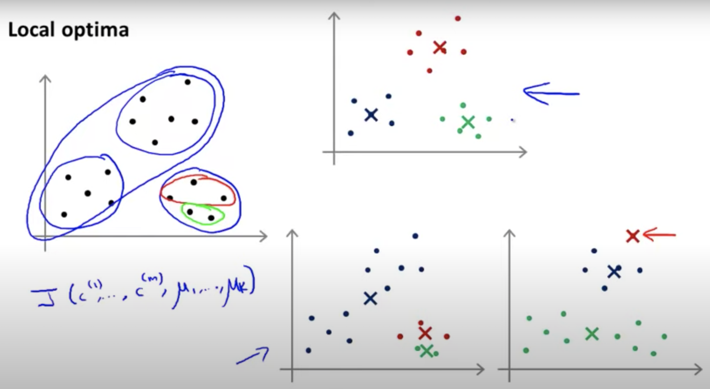
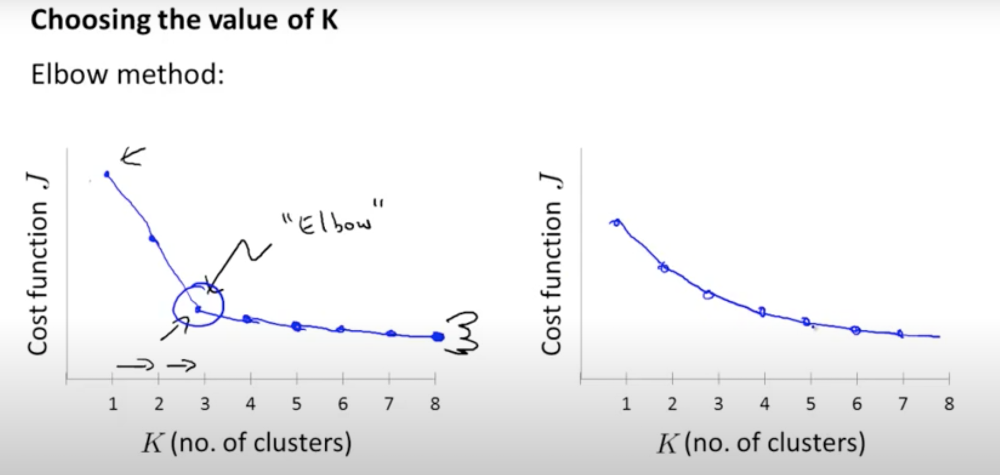
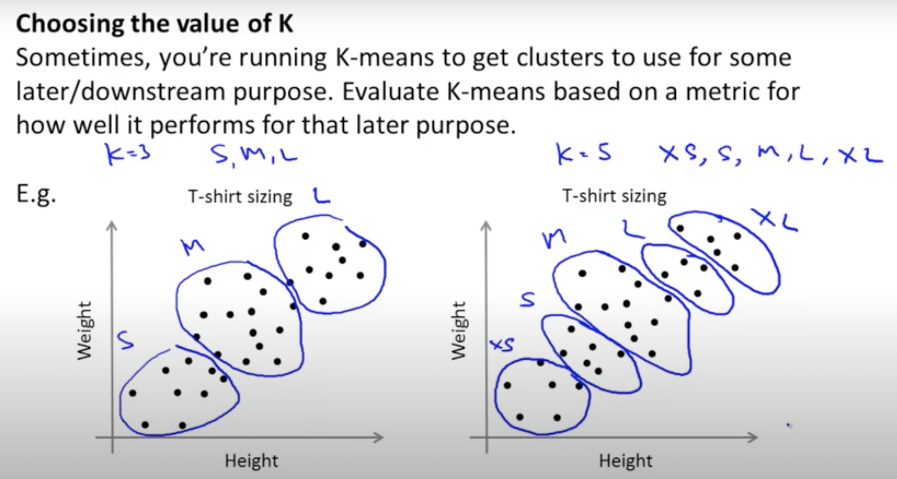

# K-means Clustering 


## A. Procedures

Assume there are `m` data points

```
For each K{

    Randomly initialize K cluster centorids μ1, μ2,... μK,

    Repeat{
          a. for i = 1, ...m, each data point, assign c(i), where the centroid μc is the closest to x(i).
          b. for j = 1, ...K, each centroid μj is updated by average of data points which are labeled to c(j)
          }
}
```

### Stop Criterion

See [[Azika Amelia]][K-Means Clustering: From A to Z] and [[Pulkit Sharma]][The Most Comprehensive Guide to K-Means Clustering You’ll Ever Need]:
1. The datapoints assigned to specific cluster remain the same.
2. Centroids remain the same ([Stanford course](https://stanford.edu/~cpiech/cs221/handouts/kmeans.html) used this criterion).
3. The distance of datapoints from their centroid is minimum.
4. Fixed number of iterations have reached (insufficient iterations → poor results, choose max iteration wisely).


### Randomly Initialize Centroids

For each K, randomly initial centroids many times to avoid K-means traps in local optima (see below examples, credit from Andrew Ng's ML class), and pick clustering profile with lowest cost `J(..)`.




## B. Optimization Objectives (Distortion)

The cost function in K-means is also called **distortion** function. The distortion function is helpful to understand if K-means converges in learning curves. 

<a href="https://www.codecogs.com/eqnedit.php?latex=J(c^{(1)},\cdots&space;,&space;c^{(m)},&space;\mu_1,&space;\cdots&space;,&space;\mu_K)&space;=&space;\frac{1}{m}\sum^m_{i=1}&space;||x^{(i)}-\mu_{c^{(i)}}||^2" target="_blank"></a>

K-means is an algorithm to minimize `J(..)`:

* The above procedure a is the cluster assignment step, to minimize `J(..)` by updating c(1), c(2),.. ,c(m).
* The above procedure b is the move centroid step, to minimize `J(..)` by updating μ1, μ2,... μK.


## C. Some Notes

It’s important to preprocess your data before performing K-Means. You would have to convert your dataset into numerical values if it is not already, so that calculations can be performed. Also, applying feature reduction techniques would speed up the process, and also improve the results. These steps are important to follow because K-Means is sensitive to outliers, just like every other algo that uses average/mean values. Following these steps alleviate these issues.

### Chooseing the value of K
Elbow method (credit from Andrew Ng's ML class)



The right panel is hard to determine value of K. Then we can evaluate cluster quality.

Sometimes K-means is used to helpful to give business purpose, e.g. if we decide to make T-shirt in 5 sizes, the size range:



### Evaluating the cluster quality 

see [[Azika Amelia]][K-Means Clustering: From A to Z] and [[Pulkit Sharma]][The Most Comprehensive Guide to K-Means Clustering You’ll Ever Need]

1. **Inertia**: Inertia actually calculates the sum of distances of all the points within a cluster from the centroid of that cluster. Therefore, a small of inertia is aimed for. The range of inertia’s value starts from zero and goes up.

2. **Silhouette score**: Silhouette score tells how far away the datapoints in one cluster are, from the datapoints in another cluster. The range of silhouette score is from -1 to 1. Score should be closer to 1 than -1.


## Reference


[K-Means Clustering: From A to Z]: https://towardsdatascience.com/k-means-clustering-from-a-to-z-f6242a314e9a
[[Azika Amelia] K-Means Clustering: From A to Z](https://towardsdatascience.com/k-means-clustering-from-a-to-z-f6242a314e9a)


[The Most Comprehensive Guide to K-Means Clustering You’ll Ever Need]: https://www.analyticsvidhya.com/blog/2019/08/comprehensive-guide-k-means-clustering/
[[Pulkit Sharma] The Most Comprehensive Guide to K-Means Clustering You’ll Ever Need](https://www.analyticsvidhya.com/blog/2019/08/comprehensive-guide-k-means-clustering/)
