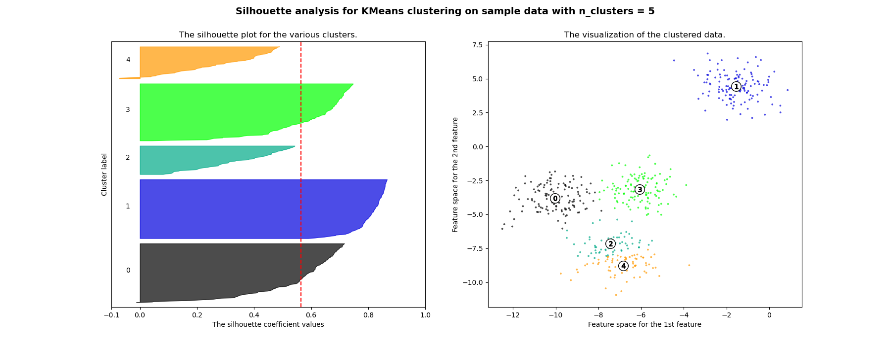

# Unsupervised Clustering 

DBSCAN, HDBSCAN [[Pepe Berba]][A gentle introduction to HDBSCAN and density-based clustering], K-means, Expectation–Maximization (EM) Clustering [[George Seif]][The 5 Clustering Algorithms Data Scientists Need to Know], Deep Embedded Clustering (DEC) [[Yuefeng Zhang]][Deep Clustering for Financial Market Segmentation] and [[Chengwei]][How to do Unsupervised Clustering with Keras], Clustering for Topic Modelling [[Syed Sadat Nazrul]][Clustering Based Unsupervised Learning].

The clustering comparison (credit from scikit-learn):


## 1. Metric

### 1.1 Silhouette Score

The silhouette value is a measure of how similar an object is to its own cluster (cohesion) compared to other clusters (separation). The silhouette ranges from `−1` to `+1`, where a **high** value indicates that the object is **well matched to its own cluster and poorly matched to neighboring clusters**. If most objects have a high value, then the clustering configuration is appropriate. If many points have a low or negative value, then the clustering configuration may have too many or too few clusters [[wiki]][Silhouette (clustering)].

Assume we cluster data into $k$ clusters, for any $i$ in the cluster $C_i$, we can define the **mean** distance $a(i)$ between $i$ and all other data points $j$ in the same cluster, where $d(i,j)$ is the distance between $i$ and $j$.

$$a(i) = \frac{1}{|C_i|-1} \sum_{j\in C_{i},i\neq j}d(i,j)$$

here $|C_i|-1$ because we do not include the distance $d(i,i)$ in the sum. $a(i)$ can be interpreted as **similarity**; the smaller value, the better the clustering.

Next we can define **dissimilarity** by considering the mean distance from $i$ to all points in other clusters where $i$ is not in:

$${\displaystyle b(i)= \min_{k\neq i} \frac{1}{|C_{k}|} \sum_{j \in C_{k}}d(i,j)}.$$

Note here we have `min`, meaning the cluster with this smallest mean dissimilarity is said to be the "neighboring cluster" of $C_i$.

We now define a silhouette (value) of one data point $i$

$$s(i)={\frac{b(i)-a(i)}{\max \lbrace a(i),b(i) \rbrace }}, \textrm{if } \ |C_{i}|>1.$$

<a href="https://www.codecogs.com/eqnedit.php?latex=s(i)={\frac&space;{b(i)-a(i)}{\max\{a(i),b(i)\}}},&space;\textrm{if&space;}&space;|C_{i}|>1" target="_blank">1" title="s(i)={\frac {b(i)-a(i)}{\max\{a(i),b(i)\}}}, \textrm{if } |C_{i}|>1" /></a>

From the above definition it is clear that $s(i) = [-1, 1]$.

The silhouette score can be computed using Scikit-learn. [The sklearn page](https://scikit-learn.org/stable/auto_examples/cluster/plot_kmeans_silhouette_analysis.html) shows an excellent example. From our bare eyes, the best outcome is given by 4 clusters. We can visualize silhouette score `s(i)` for each data point in different clusters:





and we see the 4 clusters (execpet for 2 clusters) certainly gives the highest silhouette score from the page, and 4 clusters certianly looks like an optimal result.
```
For n_clusters = 2 The average silhouette_score is : 0.7049787496083262 
For n_clusters = 3 The average silhouette_score is : 0.5882004012129721
For n_clusters = 4 The average silhouette_score is : 0.6505186632729437
For n_clusters = 5 The average silhouette_score is : 0.56376469026194
For n_clusters = 6 The average silhouette_score is : 0.4504666294372765
```


## 1.2 Reference


* [How to do Unsupervised Clustering with Keras]: https://www.dlology.com/blog/how-to-do-unsupervised-clustering-with-keras/
[[Chengwei] How to do Unsupervised Clustering with Keras](https://www.dlology.com/blog/how-to-do-unsupervised-clustering-with-keras/)
* [The 5 Clustering Algorithms Data Scientists Need to Know]:https://towardsdatascience.com/the-5-clustering-algorithms-data-scientists-need-to-know-a36d136ef68
[[George Seif] The 5 Clustering Algorithms Data Scientists Need to Know](https://towardsdatascience.com/the-5-clustering-algorithms-data-scientists-need-to-know-a36d136ef68)
* [A gentle introduction to HDBSCAN and density-based clustering]:https://towardsdatascience.com/a-gentle-introduction-to-hdbscan-and-density-based-clustering-5fd79329c1e8
[[Pepe Berba] A gentle introduction to HDBSCAN and density-based clustering](https://towardsdatascience.com/a-gentle-introduction-to-hdbscan-and-density-based-clustering-5fd79329c1e8)
* [Clustering Based Unsupervised Learning]: https://towardsdatascience.com/clustering-based-unsupervised-learning-8d705298ae51
[[Syed Sadat Nazrul] Clustering Based Unsupervised Learning](https://towardsdatascience.com/clustering-based-unsupervised-learning-8d705298ae51)
* [Deep Clustering for Financial Market Segmentation]: https://towardsdatascience.com/deep-clustering-for-financial-market-segmentation-2a41573618cf
[[Yuefeng Zhang] Deep Clustering for Financial Market Segmentation](https://towardsdatascience.com/deep-clustering-for-financial-market-segmentation-2a41573618cf)
* [Silhouette (clustering)]: https://en.wikipedia.org/wiki/Silhouette_(clustering)
[[wiki] Silhouette (clustering)](https://en.wikipedia.org/wiki/Silhouette_(clustering))


## 2. 1D Kernel Density Estimate

For a one-dimensional problem, don't use multidimensional clustering algorithms. A single dimension is much more special than you naively think, because you can actually sort it, which makes things a lot easier [[Cross validation-3]][1D Number Array Clustering]. Also use [Simple 1D Kernel Density Estimation in Sklearn](https://scikit-learn.org/stable/auto_examples/neighbors/plot_kde_1d.html).

* [Clustering 1D data]: https://stats.stackexchange.com/questions/13781/clustering-1d-data/13782
[[Cross validation-1] Clustering 1D data](https://stats.stackexchange.com/questions/13781/clustering-1d-data/13782)
* [Determine different clusters of 1d data from database]: https://stats.stackexchange.com/questions/40454/determine-different-clusters-of-1d-data-from-database
[[Cross validation-2] Determine different clusters of 1d data from database](https://stats.stackexchange.com/questions/40454/determine-different-clusters-of-1d-data-from-database)
* [1D Number Array Clustering]: https://stackoverflow.com/questions/11513484/1d-number-array-clustering
[[Cross validation-3] 1D Number Array Clustering](https://stackoverflow.com/questions/11513484/1d-number-array-clustering)
 