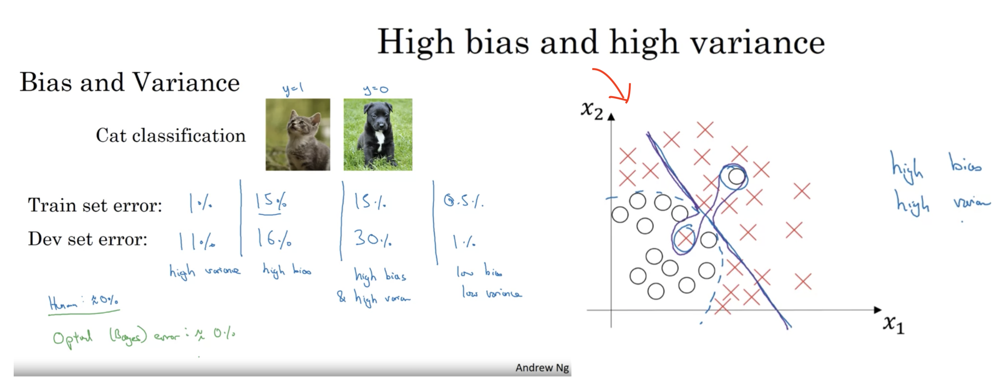
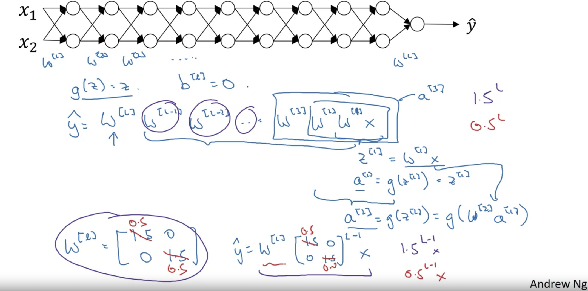

# Deep Learning

Contents:

* [Hyperparameter in DL](https://github.com/HsiangHung/Machine_Learning_Note/tree/master/Deep_Learning#hyperparameter-in-dl)
* [Bias/Variance](https://github.com/HsiangHung/Machine_Learning_Note/tree/master/Deep_Learning#biasvariance)
* [Activation Function](https://github.com/HsiangHung/Machine_Learning_Note/tree/master/Deep_Learning#activation-function)
* [Dropout Regularization](https://github.com/HsiangHung/Machine_Learning_Note/tree/master/Deep_Learning#dropout-regularization)
* [Vanishing/Exploding Gradients](https://github.com/HsiangHung/Machine_Learning_Note/tree/master/Deep_Learning#vanishingexploding-gradients)
* [Batch Normalization](https://github.com/HsiangHung/Machine_Learning_Note/tree/master/Deep_Learning#batch-normalization)
* [Data Augmentation](https://github.com/HsiangHung/Machine_Learning_Note/tree/master/Deep_Learning#data-augmentation)

## Hyperparameter in DL

Learning rate, number of iteration, number of hidden layers, number of hidden layer units, choice of activation functions, momentum, mini-batch size, regularization.

## Bias/Variance

Check training/dev error and compare to **optimal Bayes error**: the lowest possible prediction error that can be achieved and is the same as irreducible error [[Cross Validated: What is Bayes Error in machine learning?]][What is Bayes Error in machine learning?]. Note here in DL, we may high bias & high variance models. As shown below on the right, the classifier only capture linear decision boundary but overfitting on several data instances (credit from Andrew's Ng's **Improve deep neural networks: Tuning, Regularization and Optimization** coursera class).

The expected value of errors is ([Wiki: Bias–variance tradeoff](https://en.wikipedia.org/wiki/Bias%E2%80%93variance_tradeoff))

where  is the Bayes error [[Cross Validated: What is Bayes Error in machine learning?]][What is Bayes Error in machine learning?].

## Activation Function

### A. Linear activation

For classificastion, output layer uses sigmoid activation; for regression, uses linear activation.

However, if **only** using linear activation in hidden layers, the neural network is equivalent to logisitc regression. Therefore it is critical for deep learning using non-linear activation functions.

### B. ReLu and Leaky ReLu

Due to this leak, the problem of dead neurons is avoided. Further, a research has found that Leaky ReLU activation functions outperformed the ReLU activation function. Further, Leaky ReLU activation functions with a higher value of leak perform better than those with lower value of leak [[Saurabh Singh]][Leaky ReLU as an Activation Function in Neural Networks].

#### Pros to use ReLu and Leaky ReLu
* Performs better as compared to traditionally used activation functions such as Sigmoid and Hyperbolic-Tangent functions and even ReLU.
* It is fast and easy to calculate. The same applies to it’s derivative which is calculated during the backpropagation.
* It does not saturate for positive values of input and hence does not run into problems related to exploding/vanishing gradients during Gradient Descent.
* Does not suffer from dying ReLU problem.

#### Cons to use ReLu and Leaky ReLu
* Though the function is continuous at all points, it is not differentiable at the point x=0, i.e, at the point x=0, the slope of the graph changes abruptly as can be seen in the graph. Due to this, during the gradient descent its value will ‘bounce around’. Despite this fact, Leaky ReLU works very well in practice.
* Unlike the Parameterised ReLU or PReLU, the value of α is defined prior to the training and hence cannot be adjusted during the training time. The value of α hence chosen might not be the most optimal value.

[Leaky ReLU as an Activation Function in Neural Networks]: https://deeplearninguniversity.com/leaky-relu-as-an-activation-function-in-neural-networks/#:~:text=Cons,value%20will%20'bounce%20around'.
[[Saurabh Singh] Leaky ReLU as an Activation Function in Neural Networks](https://deeplearninguniversity.com/leaky-relu-as-an-activation-function-in-neural-networks/#:~:text=Cons,value%20will%20'bounce%20around'.)

## Dropout Regularization

Dropout is used to prevent over-fitting in deep learning.

It involves going over all the layers in a neural network and setting probability of keeping certain nodes or not. (Of course, the input layer and the output layer are kept the same.)[[Marco Peixeiro]][How to Improve a Neural Network With Regularization] and [[Jaime Durán]][A Quick Guide on Basic Regularization Methods for Neural Networks]

The probability of keeping each node is set **at random**. You only decide the **threshold**: a value that will determine if the node is kept or not. For example, if you set the threshold = 0.7, then there is a probability of 30% that a node will be removed from the network.

Therefore, this will result in a much smaller and simpler neural network, as shown below.

### Why randomly removing nodes from a neural network works?

Dropout is a widely used method and it was proven to greatly improve the performance of neural network.

It means that the neural network cannot rely on any input node, since each have a random probability of being removed. Therefore, the neural network will be reluctant to give high weights to certain features, because they might disappear [[Marco Peixeiro]][How to Improve a Neural Network With Regularization].
Consequently, the weights are spread across all features, making them smaller. This effectively shrinks the model and regularizes it.

#### Some observations using dropout:

From the post [[Amar Budhiraja]][Dropout in (Deep) Machine learning]:

1. Dropout forces a neural network to learn more robust features that are useful in conjunction with many different random subsets of the other neurons.
2. Dropout roughly doubles the number of iterations required to converge. However, training time for each epoch is less.
3. With `H` hidden units, each of which can be dropped, we have `2^H` possible models. In testing phase, the entire network is considered and each activation is reduced by a factor p.

### Note from Andrew Ng's class

Dropout is used in computer vision field to prevent overfitting if there is no enough data. 

Meanwhile, the hyperparameter, the probability threshold to keep neurons trigger, **keep_prob**, could be layer-dependent. 

As a concrete example, suppose we have a neural netwrok below. There are 7 x 7 + 7 parameters between the first hidden layer to the second hidden layer, which are more than others. Thus we can assign smaller **keep_prob** to the second hidden later, and larger **keep_prob** in other layers. 

The drawback for dropout is difficult to define cost function. **While doing prediction on test datasets, don't use dropout**.

## Vanishing/Exploding Gradients

In very deep neural networks, we may meet vanishing and exploding gradient issue. Andrew Ng's deep learning class provided some intuition:

We can see if the parameter `w > 1` in very deep network, the multiplication of parameters grow exponentially and the value of `y` will explode. On the other hand, multiplication of parameter `w < 1` may lead to vanishing `y`. 

### Solution to vanishing gradients
 
 
1. A partial solution to the problems of vanishing and exploding gradients (doesn't solve it entirely but helps a lot) is better or more careful choice of the **random initialization** for your neural network (Andrew Ng's class). 

2. Another simple solution is to use other activation functions, such as **ReLU**, which doesn’t cause a small derivative. See Joe Liu's explanation in [Quora: How does the ReLu solve the vanishing gradient problem?](https://www.quora.com/How-does-the-ReLu-solve-the-vanishing-gradient-problem): 

    It’s because the gradient or **slope** of **RELU activation** is **0 or 1**. Sigmoid derivative has a maximum slope of .25, which means that during the backward pass, you are multiplying gradients with values less than 1, and if you have more and more layers, you are multiplying it with values less than 1, making gradients smaller and smaller. RELU activation solves this by having a gradient slope of 1, so during backpropagation, there isn’t gradients passed back that are progressively getting smaller and smaller. but instead they are staying the same, which is how RELU solves the vanishing gradient problem.

3. **Batch normalization**. Batch normalization reduces this problem by simply normalizing the input so the gradient has less chance to reach the outer edges of the sigmoid function [[Chi-Feng Wang]][The Vanishing Gradient Problem]. 

## Batch Normalization

While using gradient descent, one can normalize/standardize input data. The advantage for doing this is to make cost function more spatially homogeneous and speed up model training. In this case we have some pictures like (credit from Andrew Ng's class)

to explain gradient descent with data normalization benefiting faster converge. 

In DL, we can do the similar normalization processes, not only data in input layer, but also in **hidden layers**. This is called **batch normalization** (BN) [[Manish Chablani]][Batch Normalization]. BN can be implemented before and after activation. In the coursera DL class, Andrew suggested batch norm before applying to activation function.

Given an intermediate hidden layer, we first normalize as 

where  denote the number of units in the hidden layer `l` and the value on the i-th unit in the hidden layer `l`. For notation simplicity, we drop the layer label `l`, but `n`, `zi`, `μ` and `σ` are layer dependent.

Then we can rescale the values in hiddent units with a shift as

  

where

`β` and `γ` are now parameters and can be determined by gradient descent. The overall processes are as follows (credit from Andrew Ng's courser class)

BN also has other advantages like: enabling the utilization of larger learning rates and reducing the common problem of vanishing gradients. BN also has a slight regularization effect. [[Manish Chablani]][Batch Normalization], [[Richmond Alake]][Batch Normalization In Neural Networks Explained (Algorithm Breakdown)].

The mini-batch gradient descent can also implement BN. However, if the neural networks are trained by mini-batch and we perform prediction on test dataset, we need to determine `μ` and `σ` from training data, and then rescale the test data. We can simply compute the average `μ` from all mini-batch, or using exponentially weight average (mentioned in Andre Ng's class).

## Data Augmentation

From [wiki](https://en.wikipedia.org/wiki/Data_augmentation): data augmentation in data analysis are techniques used to increase the amount of data by adding slightly **modified copies** of already existing data or newly created synthetic data from existing data. It acts as a regularizer and helps reduce overfitting when training a machine learning model. It is closely related to **oversampling** in data analysis.

A convolutional neural network (CNN) that can robustly classify objects even if its placed in different orientations is said to have the property called invariance. More specifically, a CNN can be invariant to translation, viewpoint, size or illumination. We account for these situations by training our neural network with additional synthetically modified data. This essentially is the premise of data augmentation [[Arun Gandhi]][Data Augmentation | How to use Deep Learning when you have Limited Data — Part 2].

## Reference

[Dropout in (Deep) Machine learning]: https://medium.com/@amarbudhiraja/https-medium-com-amarbudhiraja-learning-less-to-learn-better-dropout-in-deep-machine-learning-74334da4bfc5
[[Amar Budhiraja] Dropout in (Deep) Machine learning](https://medium.com/@amarbudhiraja/https-medium-com-amarbudhiraja-learning-less-to-learn-better-dropout-in-deep-machine-learning-74334da4bfc5)

[Data Augmentation | How to use Deep Learning when you have Limited Data — Part 2]: https://nanonets.com/blog/data-augmentation-how-to-use-deep-learning-when-you-have-limited-data-part-2/
[[Arun Gandhi] Data Augmentation | How to use Deep Learning when you have Limited Data — Part 2](https://nanonets.com/blog/data-augmentation-how-to-use-deep-learning-when-you-have-limited-data-part-2/)

[The Vanishing Gradient Problem]: https://towardsdatascience.com/optimizers-be-deeps-appetizers-511f3706aa67
[[Chi-Feng Wang] The Vanishing Gradient Problem](https://towardsdatascience.com/optimizers-be-deeps-appetizers-511f3706aa67)

[What is Bayes Error in machine learning?]: https://stats.stackexchange.com/questions/302900/what-is-bayes-error-in-machine-learning
[[Cross Validated: What is Bayes Error in machine learning?] What is Bayes Error in machine learning?](https://stats.stackexchange.com/questions/302900/what-is-bayes-error-in-machine-learning)

[A Quick Guide on Basic Regularization Methods for Neural Networks]: https://medium.com/yottabytes/a-quick-guide-on-basic-regularization-methods-for-neural-networks-e10feb101328
[[Jaime Durán] A Quick Guide on Basic Regularization Methods for Neural Networks](https://medium.com/yottabytes/a-quick-guide-on-basic-regularization-methods-for-neural-networks-e10feb101328)

[How to Improve a Neural Network With Regularization]: https://towardsdatascience.com/how-to-improve-a-neural-network-with-regularization-8a18ecda9fe3
[[Marco Peixeiro] How to Improve a Neural Network With Regularization](https://towardsdatascience.com/how-to-improve-a-neural-network-with-regularization-8a18ecda9fe3)

[Batch Normalization]: https://towardsdatascience.com/batch-normalization-8a2e585775c9
[[Manish Chablani] Batch Normalization](https://towardsdatascience.com/batch-normalization-8a2e585775c9)

[Batch Normalization In Neural Networks Explained (Algorithm Breakdown)]: https://towardsdatascience.com/batch-normalization-explained-algorithm-breakdown-23d2794511c
[[Richmond Alake] Batch Normalization In Neural Networks Explained (Algorithm Breakdown)](https://towardsdatascience.com/batch-normalization-explained-algorithm-breakdown-23d2794511c)
