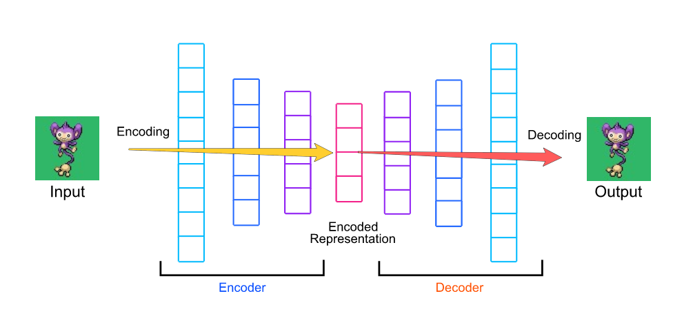

# Dimensionality reduction using Keras AutoEncoder

The autoencoder used for dimensionality reduction is an undercomplete autoencoder. The size of hidden layer is smaller than the input layer. By reducing the hidden layer size we force the network to learn the important features of the dataset. [[Varun Kruthiventi]][Dimensionality reduction using Keras Auto Encoder].

Autoencoders are neural network models used to learn efficient data patterns in an unsupervised manner. An autoencoder ideally consists of an **encoder** and a **decoder**. The encoder is designed **compress** data, whereas the decoder will try to **uncompress** the data. The illustration of an autoencoder workflow is (credit from [Niyas Mohammed: How to autoencode your Pokémon](https://hackernoon.com/how-to-autoencode-your-pokémon-6b0f5c7b7d97))

An original neural network (supervised) model is trained as 

`model.fit(X, y)`

But an autocorder is trained as

`model.fit(X, X)`

In other words, we build a model to predict output with the same dimension as input and minimum loss on information [[Elior Cohen]][Reducing Dimensionality from Dimensionality Reduction Techniques]. The values of the parameters in the hidden layers is updated by back-progagation.

## Interpretation of AutoEncoders

The autoencoder learns an approximation for the identity function, and by placing constraints on the network, such as by limiting the number of hidden units, we can discover interesting structure about the data [[UFLDL Tutorial]][Autoencoders].

As a concrete example, suppose the inputs x are the pixel intensity values from a 10×10 image (100 pixels) so n=100, and there are 50 hidden units in layer L2, and we still have output layer n=100. Since there are only 50 hidden units, the network is forced to learn a ”compressed” representation of the input, i.e. **reconstruct** the 100-pixel input x. If the input were completely random—say, each `x_i` comes from an iid Gaussian independent of the other features—then this compression task would be very difficult. But if there is structure in the data, for example, if some of the input features are correlated, then this algorithm will be able to discover some of those correlations [[UFLDL Tutorial]][Autoencoders].

## Cost (Loss) Function

Our overall cost function for the autoencoder is [[UFLDL Tutorial]][Autoencoders][[Jermey Jordan]][Introduction to autoencoders]

The first term comes the reconstruction cost `C(x,x̂)`, which is the same as the cost function in [supervised neural networks](http://ufldl.stanford.edu/tutorial/supervised/MultiLayerNeuralNetworks/). If followed Andrew Ng's Machine Learning class's notation, it reads

The second is the regularization term to penalize the activations of hidden units

KL is the Kullback-Leibler (KL) divergence between a Bernoulli random variable with mean ρ and a Bernoulli random variable with mean ρ̂_j. KL-divergence is a standard function for measuring how different two different distributions are.

## Summary

## Reference

[Building Autoencoders in Keras]: https://blog.keras.io/building-autoencoders-in-keras.html
[Building Autoencoders in Keras](https://blog.keras.io/building-autoencoders-in-keras.html)

[Applied Deep Learning - Part 3: Autoencoders]: https://towardsdatascience.com/applied-deep-learning-part-3-autoencoders-1c083af4d798
[[Arden Dertat] Applied Deep Learning - Part 3: Autoencoders](https://towardsdatascience.com/applied-deep-learning-part-3-autoencoders-1c083af4d798)

[Dimension Reduction - Autoencoders]: https://blog.paperspace.com/dimension-reduction-with-autoencoders/
[[ASHWINI KUMAR PAL] Dimension Reduction - Autoencoders](https://blog.paperspace.com/dimension-reduction-with-autoencoders/)

[Reducing Dimensionality from Dimensionality Reduction Techniques]: https://towardsdatascience.com/reducing-dimensionality-from-dimensionality-reduction-techniques-f658aec24dfe
[[Elior Cohen] Reducing Dimensionality from Dimensionality Reduction Techniques](https://towardsdatascience.com/reducing-dimensionality-from-dimensionality-reduction-techniques-f658aec24dfe)

[Introduction to autoencoders]: https://www.jeremyjordan.me/autoencoders/
[[Jermey Jordan] Introduction to autoencoders](https://www.jeremyjordan.me/autoencoders/)

[How to autoencode your Pokémon]: https://hackernoon.com/how-to-autoencode-your-pokémon-6b0f5c7b7d97
[[Niyas Mohammed] How to autoencode your Pokémon](https://hackernoon.com/how-to-autoencode-your-pokémon-6b0f5c7b7d97)

[Autoencoders]: http://ufldl.stanford.edu/tutorial/unsupervised/Autoencoders/
[[UFLDL Tutorial] Autoencoders](http://ufldl.stanford.edu/tutorial/unsupervised/Autoencoders/)

[Dimensionality reduction using Keras Auto Encoder]: https://www.kaggle.com/saivarunk/dimensionality-reduction-using-keras-auto-encoder
[[Varun Kruthiventi] Dimensionality reduction using Keras Auto Encoder](https://www.kaggle.com/saivarunk/dimensionality-reduction-using-keras-auto-encoder)
