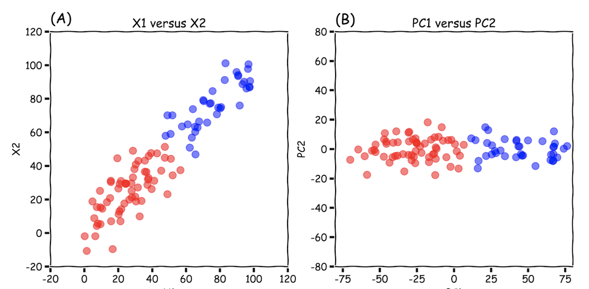

# Dimensionality Reduction 

Here is the note I read many blogs or posts about dimensionality reduction methods. There is a comprehensive post about all dimensionality reduction methods. [[Elior Cohen]][Reducing Dimensionality from Dimensionality Reduction Techniques]

## PCA

PCA is a commonly used algorithm in data science to compresses your data from a higher dimension to a lower dimension based on the eigenvector of the variance in your dataset, by linear transformation. The post [[Syed Sadat Nazrul]][The DOs and DON’Ts of Principal Component Analysis] lists DO’s and DON'ts points. 

The common applications (or DO’s) are (1) **Data compression in machine learning**: We often wish to decompose the features into a lower dimension, without a significant loss in variance, (2) **Visualization of higher dimensions**: In particular, we can visualize classe or cluster spatial distributions of my higher dimension dataset, (3) **Feature selection**. 

The common mistakes (or DON’Ts) are (1) **Fixing overfitting** : Overfitting is usually caused by having too many features. The large amount of features results in the rise in cross validation error due to to high variance on our training data. People assume that reducing the number of dimensions will automatically reduce the influence of certain features and hence fix overfitting. However, we still need feature selection and regularization to fix overfitting, (2) **Set standard**: Another common mistake people make is that we **HAVE TO USE PCA** for every machine learning application. This is a false assumption.

In machine learning, the assumption why PCA works is that the interclass variance is larger than the intraclass variance. However, it is not always true. Roberto Reif gave an example to interpret it. [[Roberto Reif]][Limitations of Applying Dimensionality Reduction using PCA]

In the following case, the data variance occurs on different classes. Therefore, the PCA is still useful for machine learning.

On the other hand, if the data variance occurs on both classes, the PCA is not useful for machine learning.

## ICA

## t-SNE

## Autoencoder
   

An ensemble is just a **collection of predictors** which come together (e.g. mean of all predictions) to give a final prediction.
[[Arden Dertat]][Applied Deep Learning - Part 3: Autoencoders]

## Summary

The blog [Gradient Boosting from scratch](https://medium.com/mlreview/gradient-boosting-from-scratch-1e317ae4587d) 

## Reference

[Reducing Dimensionality from Dimensionality Reduction Techniques]: https://towardsdatascience.com/reducing-dimensionality-from-dimensionality-reduction-techniques-f658aec24dfe
[[1] Elior Cohen, Reducing Dimensionality from Dimensionality Reduction Techniques](https://towardsdatascience.com/reducing-dimensionality-from-dimensionality-reduction-techniques-f658aec24dfe)

[The DOs and DON’Ts of Principal Component Analysis]: https://medium.com/@sadatnazrul/the-dos-and-donts-of-principal-component-analysis-7c2e9dc8cc48
[[2] Syed Sadat Nazrul, The DOs and DON’Ts of Principal Component Analysis](https://medium.com/@sadatnazrul/the-dos-and-donts-of-principal-component-analysis-7c2e9dc8cc48)

[Limitations of Applying Dimensionality Reduction using PCA]: https://www.robertoreif.com/blog/2018/1/9/pca
[[3] Roberto Reif, Limitations of Applying Dimensionality Reduction using PCA](https://www.robertoreif.com/blog/2018/1/9/pca)

[Applied Deep Learning - Part 3: Autoencoders]: https://towardsdatascience.com/applied-deep-learning-part-3-autoencoders-1c083af4d798
[[4] Arden Dertat, Applied Deep Learning - Part 3: Autoencoders](https://towardsdatascience.com/applied-deep-learning-part-3-autoencoders-1c083af4d798)

