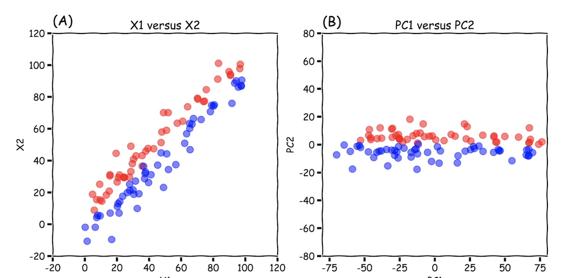

# Dimensionality Reduction 

Here is the note I read many blogs or posts about dimensionality reduction methods. There is a comprehensive post about all dimensionality reduction methods. [[Elior Cohen]][Reducing Dimensionality from Dimensionality Reduction Techniques]


## PCA

PCA is a commonly used algorithm in data science to compresses your data from a higher dimension to a lower dimension based on the eigenvector of the variance in your dataset, by **linear orthogonal transformation** [[Quroa: What are some of the limitations of principal component analysis?]][What are some of the limitations of principal component analysis?]. The post [[Syed Sadat Nazrul]][The DOs and DON’Ts of Principal Component Analysis] lists DO’s and DON'ts points. 

The common applications (or DO’s) are (1) **Data compression in machine learning**: We often wish to decompose the features into a lower dimension, without a significant loss in variance, (2) **Visualization of higher dimensions**: In particular, we can visualize classe or cluster spatial distributions of my higher dimension dataset, (3) **Feature selection**. 

The common mistakes (or DON’Ts) are (1) **Fixing overfitting** : Overfitting is usually caused by having too many features. The large amount of features results in the rise in cross validation error due to to high variance on our training data. People assume that reducing the number of dimensions will automatically reduce the influence of certain features and hence fix overfitting. However, we still need feature selection and regularization to fix overfitting, (2) **Set standard**: Another common mistake people make is that we **HAVE TO USE PCA** for every machine learning application. This is a false assumption.

In machine learning, the assumption why PCA works is that the interclass variance is larger than the intraclass variance. However, it is not always true. Roberto Reif gave an intutive example to interpret it. [[Roberto Reif]][Limitations of Applying Dimensionality Reduction using PCA]

In the following case, the data variance along the first principal component occurs on different classes. Therefore, after PCA, the first principal component is useful for classification.


On the other hand, if the data variance along the first principal component occurs evenly in both classes, the PCA is not useful for classification.


### When to use PCA? Before or After Train-Test Split?

Here there is a blog to discuss the time to use PCA [[Divyesh Aegis]][When to use PCA before or after a train-test split?]. Before fitting PCA, remember to standardize data. The code shows below
```Python
## Performing standardization before applying PCA
scaler = StandardScaler()
scaler.fit(X_train)
X_train = scaler.transform(X_train)

pca = PCA(n_components = 5)
pca.fit(X_train)
print(pca.explained_variance_)
X_train_pca = pca.transform(X_train)
X_test_pca = pca.transform(X_test)
```


## Autoencoder
   

An autoencoder is a dimensionality reduction method using nonlinear transformation. The model is constructed by neural networks and need training. The detail could be found [here](https://github.com/HsiangHung/Machine_Learning_Note/tree/master/Dimensionality_Reduction/Autoencoder), and [[Arden Dertat]][Applied Deep Learning - Part 3: Autoencoders].


## Curse of Dimensionality 


[[Vincent Spruyt]][The Curse of Dimensionality in classification]


## Summary


## Reference


[Applied Deep Learning - Part 3: Autoencoders]: https://towardsdatascience.com/applied-deep-learning-part-3-autoencoders-1c083af4d798
[[Arden Dertat] Applied Deep Learning - Part 3: Autoencoders](https://towardsdatascience.com/applied-deep-learning-part-3-autoencoders-1c083af4d798)


[When to use PCA before or after a train-test split?]: https://www.codementor.io/@divyeshaegis/when-to-use-pca-before-or-after-a-train-test-split-vxdrlu6ci
[[Divyesh Aegis] When to use PCA before or after a train-test split?](https://www.codementor.io/@divyeshaegis/when-to-use-pca-before-or-after-a-train-test-split-vxdrlu6ci)

[Reducing Dimensionality from Dimensionality Reduction Techniques]: https://towardsdatascience.com/reducing-dimensionality-from-dimensionality-reduction-techniques-f658aec24dfe
[[Elior Cohen] Reducing Dimensionality from Dimensionality Reduction Techniques](https://towardsdatascience.com/reducing-dimensionality-from-dimensionality-reduction-techniques-f658aec24dfe)


[What are some of the limitations of principal component analysis?]: https://www.quora.com/What-are-some-of-the-limitations-of-principal-component-analysis
[]Quroa] What are some of the limitations of principal component analysis?](https://www.quora.com/What-are-some-of-the-limitations-of-principal-component-analysis)


[Limitations of Applying Dimensionality Reduction using PCA]: https://www.robertoreif.com/blog/2018/1/9/pca
[[Roberto Reif] Limitations of Applying Dimensionality Reduction using PCA](https://www.robertoreif.com/blog/2018/1/9/pca)


[The DOs and DON’Ts of Principal Component Analysis]: https://medium.com/@sadatnazrul/the-dos-and-donts-of-principal-component-analysis-7c2e9dc8cc48
[[Syed Sadat Nazrul] The DOs and DON’Ts of Principal Component Analysis](https://medium.com/@sadatnazrul/the-dos-and-donts-of-principal-component-analysis-7c2e9dc8cc48)


[The Curse of Dimensionality in classification]: http://www.visiondummy.com/2014/04/curse-dimensionality-affect-classification/
[[Vincent Spruyt] The Curse of Dimensionality in classification](http://www.visiondummy.com/2014/04/curse-dimensionality-affect-classification/)


