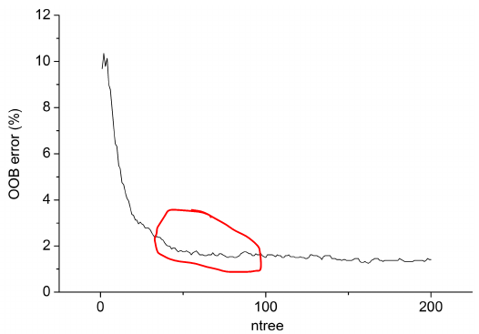

# Random Forest

Suppose our training data set is represented by `T` and suppose data set has `M` features (or attributes or variables) [[Stackoverflow, What is out of bag error in Random Forests?]][What is out of bag error in Random Forests?].

    T = {(X1,y1), (X2,y2), ... (Xn, yn)}

and `Xi` is input vector `{xi1, xi2, ... xiM}`, `yi` is the label (or output or class). 

Random Forests algorithm is a classifier based on primarily two methods - Bagging and Random subspace method.

Suppose we decide to have `S` number of trees in our forest, then we first create `S` datasets of "same size as original" created from random resampling of data in `T` with-replacement (`n` times for each dataset). This will result in `{T1, T2, ... TS}` datasets. Each of these is called a **bootstrap** dataset. Due to "with-replacement", every dataset `Ti` can have duplicate data records and `Ti` can be missing several data records from original datasets. The procedure to generate the datasets is called [Bootstrapping](https://en.wikipedia.org/wiki/Bootstrapping_(statistics)).

**Bagging** is the process of taking bootstraps & then aggregating the models learned on each bootstrap.

Now, RF creates `S` trees and uses `m (=sqrt(M) or =floor(lnM+1))` random subfeatures out of `M` possible features to create any tree. This is called **random subspace method**.

So for each `Ti` bootstrap dataset you create a tree `Ki`. If you want to classify some input data `D = {x1, x2, ..., xM}`, you let it pass through each tree and produce `S` outputs (one for each tree) which can be denoted by `Y = {y1, y2, ..., ys}`. Final prediction is a majority vote on this set.

## Out-of-Bag Errors

After creating the classifiers (`S` trees), for each `(Xi,yi)` in the original training set i.e. `T`, select all `Tk` which does **NOT** include `(Xi,yi)`. This subset, pay attention, is a set of boostrap datasets which does not contain a particular record from the original dataset. This set is called out-of-bag examples. There are `n` such subsets (one for each data record in original dataset `T`). OOB classifier is the aggregation of votes ONLY over `Tk` such that it does not contain `(xi,yi)`.

Out-of-bag estimate for the generalization error is the error rate of the out-of-bag classifier on the training set (compare it with known `yi`'s).

Why is it important? The study of error estimates for bagged classifiers in Breiman [1996b], gives empirical evidence to show that the out-of-bag estimate is as accurate as using a test set of the same size as the training set. Therefore, using the out-of-bag error estimate removes the need for a set aside test set.

## Hyperparameter Fine Tuning

Some good sources about hyperparameter fine tuning: [[Mohtadi Ben Fraj]][In Depth: Parameter tuning for Random Forest].

1. `n_estimators`: usually higher the number of trees the better to learn the data.
2. `max_depth`: max_depth represents the depth of each tree in the forest. The deeper the tree, the more splits it has but gets overfitting.
3. `min_samples_split`: min_samples_split represents the minimum number of samples required to split an internal node. Higher indicates underfitting case.
4. `min_samples_leaf`: min_samples_leaf is The minimum number of samples required to be at a leaf node. Increasing this value can cause underfitting.
5. `max_features`: max_features represents the number of features to consider when looking for the best split. Higher max_features indicates an overfitting case. 

In discussion of [[Stackoverflow, Random forest tuning - tree depth and number of trees]][Random forest tuning - tree depth and number of trees], more trees also mean more computational cost and after a certain number of trees, the improvement is negligible.

## Reference

[In Depth: Parameter tuning for Random Forest]: https://medium.com/all-things-ai/in-depth-parameter-tuning-for-random-forest-d67bb7e920d
[[Mohtadi Ben Fraj] In Depth: Parameter tuning for Random Forest](https://medium.com/all-things-ai/in-depth-parameter-tuning-for-random-forest-d67bb7e920d)

[Random forest tuning - tree depth and number of trees]: https://stackoverflow.com/questions/34997134/random-forest-tuning-tree-depth-and-number-of-trees
[[Stackoverflow, Random forest tuning - tree depth and number of trees] Random forest tuning - tree depth and number of trees](https://stackoverflow.com/questions/34997134/random-forest-tuning-tree-depth-and-number-of-trees)

[What is out of bag error in Random Forests?]: https://stackoverflow.com/questions/18541923/what-is-out-of-bag-error-in-random-forests
[[Stackoverflow, What is out of bag error in Random Forests?] What is out of bag error in Random Forests?](https://stackoverflow.com/questions/18541923/what-is-out-of-bag-error-in-random-forests)

