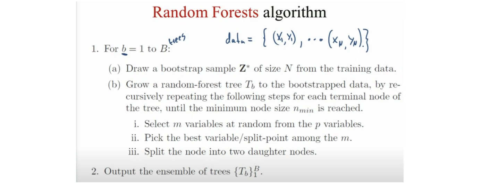

# Random Forest

Suppose our training data set is represented by $D$ and suppose data set has $M$ features (or attributes or variables) [[Stackoverflow: What is out of bag error in Random Forests?]][What is out of bag error in Random Forests?]

$$D = \big[ (\mathbf{X}_1,y_1), (\mathbf{X}_2,y_2), ... (\mathbf{X}_n, y_n) \big],$$

where $\mathbf{X}_i$ is an $M$-dimensional input vector, $\mathbf{X}_i = (x^1_i, x^2_i, ... x^M_i)$ and $y_i$ is the label (or output or class). 

Random Forests algorithm is a classifier based on primarily two methods - **Bagging** and **Random subspace method**.

Suppose we decide to have $S$ number of trees in our forest, then we first create $S$ datasets of "same size as original" created from random resampling of data in $D$ **with-replacement** (n times for each dataset). This will result in $(D_1, D_2, ... D_S)$ datasets. Each of these is called a **bootstrap** dataset. Due to "with-replacement", every dataset $D_i$ can have duplicate data records and $D_i$ can be missing several data records from original datasets. The procedure to generate the datasets is called [Bootstrapping](https://en.wikipedia.org/wiki/Bootstrapping_(statistics)).

**Bagging** is the process of taking bootstraps & then aggregating the models learned on each bootstrap. The random forests algorithm summary:

Now, RF creates $S$ trees and uses $m (=\sqrt(M)$ or =floor(lnM+1)) random subfeatures out of $M$ possible features to create any tree. This is called **random subspace method**.

So for each $D_i$ bootstrap dataset you create a tree $T_i$. If you want to classify some input data $d = (x^1, x^2, ..., x^M)$, you let it pass through each tree and produce $S$ outputs (one for each tree) which can be denoted by $Y = (y_1, y_2, ..., y_s)$. Final prediction is a **majority vote** on this set, or **mean probability** for each class (credit from Prof. Nando de Freitas's [UBC Machine Learning class](https://www.youtube.com/watch?v=aXqICfH4ZlA&list=PLE6Wd9FR--Ecf_5nCbnSQMHqORpiChfJf&index=33))

Or the predictive probability can be computed by counting individual class assignments from the trees of the forest and then normalize by dividing by the total number of trees. (see Olivier Grisel's answer @[Quora: What are some proved methods to get probability values from Random Forests?](https://www.quora.com/What-are-some-proved-methods-to-get-probability-values-from-Random-Forests))

## Out-of-Bag (OOB) Sample and Errors

After creating the classifiers (are $S$ trees), for each $(\mathbf{X}_i, y_i)$ in the original training set i.e. $D$, select all $D_k$ which does **NOT** include $(\mathbf{X}_i, y_i)$. This subset, pay attention, is a set of boostrap datasets which does not contain a particular record from the original dataset. This set is called out-of-bag examples. There are $n$ such subsets (one for each data record in original dataset $T$). OOB classifier is the aggregation of votes ONLY over $D_k$ such that it does not contain $(\mathbf{X}_i,y_i)$.

Let’s take a concrete example. Assume there are five trees in the random forest ensemble labeled from 1 to 5. For simplicity, suppose we have a simple original training data set as below (credit from [[Navnina Bhatia]][What is Out of Bag (OOB) score in Random Forest?]):

Now the tree $T_1$ used the first three rows (green box below) as the bootstrap sample. Then the last row that is “left out” (row in the red box) is known as OOB sample. After the RF was trained, the OOB sample (leftout row) is unseen in $T_1$.

Let’s assume that apart from $T_1$, $T_3$ and $T_5$ also did not have this row in their bootstrap training data. The preidctions of the OOB sample on the trees are $y=1$, $0$, $1$, respectively. By majority vote, for the OOB smaple $y =1$. Therefore, we have a correct prediction.

The **OOB score** is computed as the number of correctly predicted rows from the out of bag sample. Out-of-bag estimate for the generalization error is the error rate of the out-of-bag classifier on the training set (compare it with known $y_i$'s).

The validation score uses a part of the original training dataset before training the models, whereas the OOB score is calculated using only a subset of the random forest not containing the OOB sample in their bootstrap training dataset.

Why is it important? The study of error estimates for bagged classifiers in Breiman [1996b], gives empirical evidence to show that the out-of-bag estimate is as accurate as using a test set of the same size as the training set. Therefore, using the out-of-bag error estimate removes the need for a set aside test set.

## Hyperparameter Fine Tuning

There are good articles talking about hyperparameter fine tuning in random forest: [[Mohtadi Ben Fraj]][In Depth: Parameter tuning for Random Forest], [[Will Koehrsen]][Hyperparameter Tuning the Random Forest in Python], [[Cross Validated: Practical questions on tuning Random Forests]][Practical questions on tuning Random Forests] and [[Kaggle, Random Forest using GridSearchCV]][Random Forest using GridSearchCV]. We have attached the script in this folder.

In the followings, we show how the hyperparameter influences the performance. The results are all from [[Mohtadi Ben Fraj]][In Depth: Parameter tuning for Random Forest] or [[Jason Brownlee]][How to Develop a Random Forest Ensemble in Python].

1. `max_samples`: Each decision tree in the ensemble is fit on a bootstrap sample drawn from the training dataset. More sample data for training, better accuracy. “max_samples” argument can be set to a float between 0 and 1 to control the percentage of the size of the training dataset to make the bootstrap sample used to train each decision tree. Below is the box plot of Random Forest Bootstrap Sample Size vs. Classification Accuracy [[Jason Brownlee]][How to Develop a Random Forest Ensemble in Python].

2. `n_estimators`: is the **number of trees** in the forest. Usually higher the number of trees the better to learn the data [[Mohtadi Ben Fraj]][In Depth: Parameter tuning for Random Forest]:

However, more trees also mean more computational cost. In discussion of [[Stackoverflow: Random forest tuning - tree depth and number of trees]][Random forest tuning - tree depth and number of trees], after a certain number of trees, the improvement is negligible. Meanwhile, we can also visualize how the "forest" plays the role on classification (credit from Prof. Nando de Freitas's [UBC Machine Learning class](https://www.youtube.com/watch?v=aXqICfH4ZlA&list=PLE6Wd9FR--Ecf_5nCbnSQMHqORpiChfJf&index=33)).

3. `max_depth`: max_depth represents the **depth** of each tree in the forest. The deeper the tree, the more splits it has but gets overfitting. We can also visualize how depth infleunces the classification (credit from Prof. Nando de Freitas's [UBC Machine Learning class](https://www.youtube.com/watch?v=aXqICfH4ZlA&list=PLE6Wd9FR--Ecf_5nCbnSQMHqORpiChfJf&index=33)).

<!--  -->

4. `min_samples_split`: min_samples_split represents the minimum number of samples required to split an internal node. Higher indicates underfitting case. When we increase this parameter, each tree in the forest becomes more constrained as it has to consider more samples at each node [[Mohtadi Ben Fraj]][In Depth: Parameter tuning for Random Forest]. 

We can clearly see that when we require all of the samples at each node, the model cannot learn enough about the data. This is an underfitting case.

5. `min_samples_leaf`: min_samples_leaf is the minimum number of samples required to be at a **leaf node**. Increasing this value can cause underfitting [[Mohtadi Ben Fraj]][In Depth: Parameter tuning for Random Forest].

6. `max_features`: max_features represents the number of features to consider when looking for the best split. Higher max_features indicates an overfitting case [[Mohtadi Ben Fraj]][In Depth: Parameter tuning for Random Forest]. 

## Reference

* [Practical questions on tuning Random Forests]: https://stats.stackexchange.com/questions/53240/practical-questions-on-tuning-random-forests
[[Cross Validated: Practical questions on tuning Random Forests] Practical questions on tuning Random Forests](https://stats.stackexchange.com/questions/53240/practical-questions-on-tuning-random-forests)
* [How to Develop a Random Forest Ensemble in Python]: https://machinelearningmastery.com/random-forest-ensemble-in-python/
[[Jason Brownlee] How to Develop a Random Forest Ensemble in Python](https://machinelearningmastery.com/random-forest-ensemble-in-python/)
* [Random Forest using GridSearchCV]: https://www.kaggle.com/sociopath00/random-forest-using-gridsearchcv
[[Kaggle, Random Forest using GridSearchCV] Random Forest using GridSearchCV](https://www.kaggle.com/sociopath00/random-forest-using-gridsearchcv)
* [In Depth: Parameter tuning for Random Forest]: https://medium.com/all-things-ai/in-depth-parameter-tuning-for-random-forest-d67bb7e920d
[[Mohtadi Ben Fraj] In Depth: Parameter tuning for Random Forest](https://medium.com/all-things-ai/in-depth-parameter-tuning-for-random-forest-d67bb7e920d)
* [What is Out of Bag (OOB) score in Random Forest?]: https://towardsdatascience.com/what-is-out-of-bag-oob-score-in-random-forest-a7fa23d710
[[Navnina Bhatia] What is Out of Bag (OOB) score in Random Forest?](https://towardsdatascience.com/what-is-out-of-bag-oob-score-in-random-forest-a7fa23d710)
* [Random forest tuning - tree depth and number of trees]: https://stackoverflow.com/questions/34997134/random-forest-tuning-tree-depth-and-number-of-trees
[[Stackoverflow: Random forest tuning - tree depth and number of trees] Random forest tuning - tree depth and number of trees](https://stackoverflow.com/questions/34997134/random-forest-tuning-tree-depth-and-number-of-trees)
* [What is out of bag error in Random Forests?]: https://stackoverflow.com/questions/18541923/what-is-out-of-bag-error-in-random-forests
[[Stackoverflow: What is out of bag error in Random Forests?] What is out of bag error in Random Forests?](https://stackoverflow.com/questions/18541923/what-is-out-of-bag-error-in-random-forests)
* [Hyperparameter Tuning the Random Forest in Python]: https://towardsdatascience.com/hyperparameter-tuning-the-random-forest-in-python-using-scikit-learn-28d2aa77dd74
[[Will Koehrsen] Hyperparameter Tuning the Random Forest in Python](https://towardsdatascience.com/hyperparameter-tuning-the-random-forest-in-python-using-scikit-learn-28d2aa77dd74)

