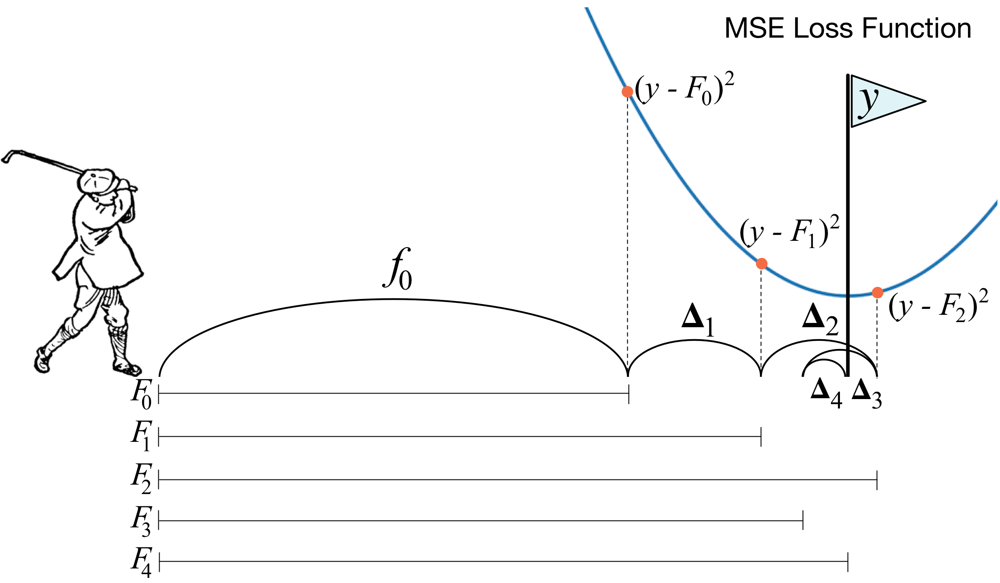
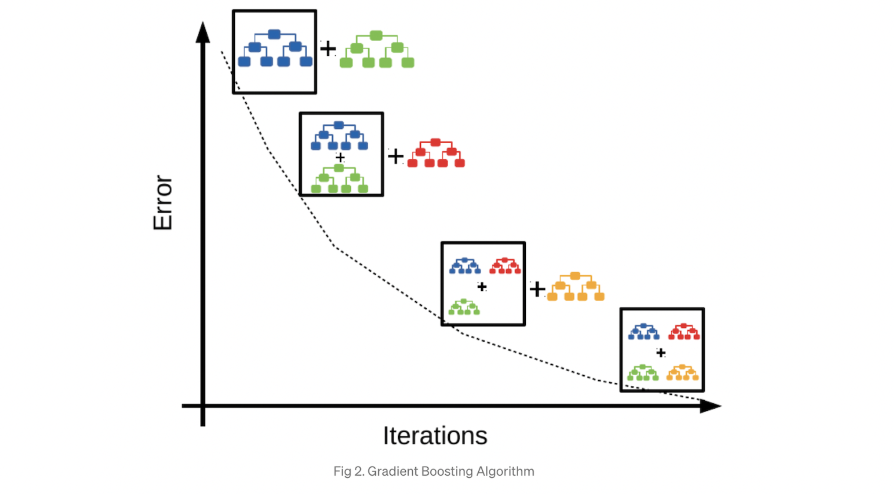

# Gradient Boosting Extension - MART

 Boosting is a method of converting weak learners into strong learners. 

Tne idea of boosting regression trees can be mapping to classification and ranking problems. It is called MART(Multiple Additive Regression Trees), where the output of the model is a linear combination of the outputs of a set of regression trees.

The following content follows Chris Burge's review paper: [From RankNet to LambdaRank to LambdaMART: An Overview](https://www.microsoft.com/en-us/research/uploads/prod/2016/02/MSR-TR-2010-82.pdf). The LambdaMART is particularly designed as MART + LambdaRank.

Here is Prof. Tom´aˇs Tunys' lecture slide: [LambdaMART Demystified](https://staff.fnwi.uva.nl/e.kanoulas/wp-content/uploads/Lecture-8-1-LambdaMart-Demystified.pdf).

## Boosting regression

The procedures of building a boosting regression tree are summarize below (given (`x`, `y`))

....

As explained by Pulkit Bansal in the [Quora post](https://www.quora.com/What-is-an-intuitive-explanation-of-Gradient-Boosting), we are modeling `F = f0 + f1 + f2  + .. + fn`,  where each of these is a decision tree, and each new tree is a fit on a modified version of the original data set. The following picture also provides a good interpretation about the gradient boosting process:

or 

and each tree `f1`, `f2`, .... provides approaching results toward to the true target. The collection of the trees forms an ensemble.

Note the cost function for regression is 

therefore residuals is equivalent to finding the gradient of the cost function [[Cross Validated: Gradient in Gradient Boosting]][Gradient in Gradient Boosting]

and responses in the boosting machine are updated as 

### Binary classification using MART

 

## Reference

[Gradient in Gradient Boosting]: https://stats.stackexchange.com/questions/338658/gradient-in-gradient-boosting/340376#340376
[[Cross Validated: Gradient in Gradient Boosting] Gradient in Gradient Boosting](https://stats.stackexchange.com/questions/338658/gradient-in-gradient-boosting/340376#340376)

