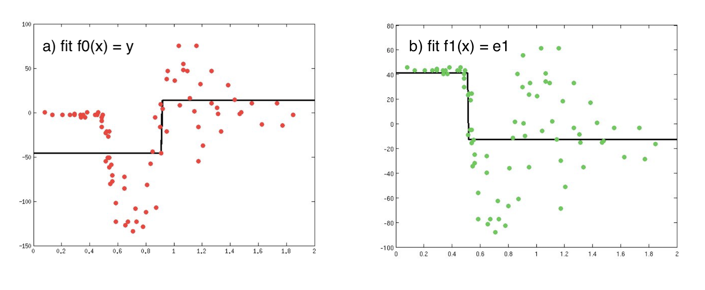
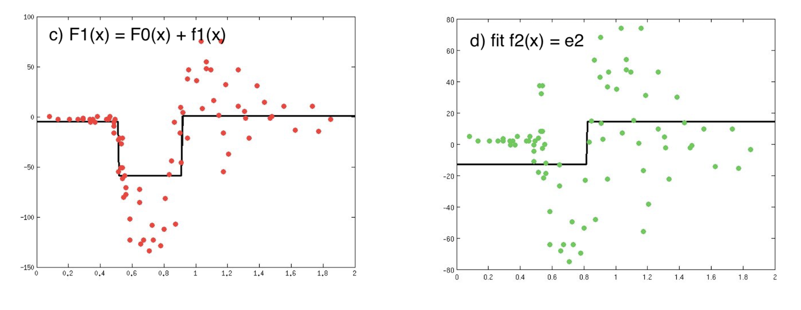
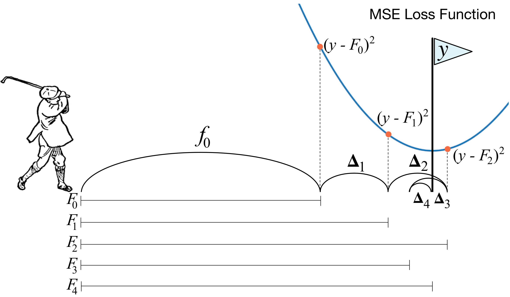

# Gradient Boosting and Adaboost

An ensemble is just a **collection of predictors (learners)** which come together (e.g. mean of all predictions) to give a final prediction. 

Boosting is one of ensemble techniques to **sequentially** generate predictors. The subsequent predictors learn from the mistakes of the previous predictors. Therefore, the observations have an **unequal probability of appearing in subsequent models** and ones with the **highest error appear most**. The predictors can be chosen from a range of models like decision trees, regressors, classifiers etc. One can interpret boosting as trying to **minimize bias** of the overall predictor. So when you use boosting, you’re incentivized to use low-variance and high-bias estimators (e.g. shallow decision trees). However, it could lead to **overfitting** on training data. 

There are mainly two boosting algorithms: Gradient Boosting (GBM) and Adaptive Boosting (Adaboost). XGBoost is a brand new tool developed by Tianran Chen by optimizing GBM.

## 1. Gradient Boosting

 A GBM will start with a not very deep tree and will model the original target. Then it takes the errors from the first round of predictions, and passes the errors as a new target to a second tree. The second tree will model the error from the first tree, record the new errors and pass that as a target to the third tree. And so forth. Essentially it focuses on modelling errors from previous trees. It is high bias-low variance algorithm, and aims to decrease bias not variance. An excellent notebook [[1]][Gradient Boosting from scratchs] demonstrates how a GBM minimizes bias during training (also see [[2]][Gradient boosting simplified]).
   
In the following, we explain the boosting pictures using the figures depicted from [Prof. Ihler's lecture slides](http://sli.ics.uci.edu/Classes/2012F-273a?action=download&upname=10-ensembles.pdf) (also the [lecture video](https://www.youtube.com/watch?v=sRktKszFmSk)). Ben Gorman, a Kaggle master also provided a comprehensive description to interpret the math behind GBM in [[3]][A Kaggle Master Explains Gradient Boosting]. 

### Boosting steps in GBM

We usually start with a very simple estimator, say one-layer decision tree to fit the data `(x1, y1), (x2, y2),...`. In the following panels, the red points denote the data points and green dots are reisduals. We build the first regressor by fitting

    F1(x) = y

In the above left plot, the black line indicates the `F1(x)` predictor (model). Then we compute the residuals `e1 = y - y1` (`y1` is given by the `F1(x)`) shown as green dots on the right hand plot. Next we build another model to fit the **residuals** 

    h1(x) = e1

Similarly, the black line in the above right plot indicates the `h1(x)` predictor. Now we can combine the predictors `F2(x) = F1(x) + h1(x)` and the resulting predictor is the black line shown in the left hand plot below

Now we see the `F2(x)` is a better regressor than `F1(x)` to fit the data, and leave residuals `e2 = y - y2` as shown on the right. Then we still fit the residuals `e2`

    h2(x) = e2

and so on. In this case, mathmetically we have an iterative relation

and the residual fitting model is given by   . Prof. Ihler gave a [comprehensive description](http://sli.ics.uci.edu/Classes/2012F-273a?action=download&upname=10-ensembles.pdf) about the boosting steps in his lecture and here we borrow to show below

Upper panel shows data and fitting models `F1(x)`, `F2(x)`, ....`Fm(x)` and lower shows the residuals. The first estimator is built on the leftmost, whereas the rightmost shows the last iteration. We can see by boosting, the predictors are becoming more and more complex but fit the data better and better. Meanwhile, the residuals are moving toward to smaller values (if you zoom in).

### Math Intuition of GBM

Previous description assumes all learners in the same weight. Where is the `gradient`? A GBM creates a set of predictors `F(x)`, and for a regression problem, the loss function is given by  

The boosting process is equivalent to minimizing `Loss` by sequentially generating models `F1(x)`, `F2(x)`, .... Therefore, we can add a superscript on the `Loss` function to represent the `Loss` function in `m`-th iteration

where `m=1,2,3...` From the gradient descent aspect, the `Loss` is minimized as

where `\alpha` is the learning rate. From the expression, we can see the gradient is equal to the errors, and the predicted value `ym` is updated by multiplying the learning rate to the errors. This is why at each step we fit the residuals, where equivalently we are computing the gradient of `J`. The posts [[2]][Gradient boosting simplified], [[3]][A Kaggle Master Explains Gradient Boosting] and [Prof. Ilher's lecture video](https://www.youtube.com/watch?v=sRktKszFmSk) have more detailed interpretation.

Terence Parr in a Quora post [[4]][What is an intuitive explanation of Gradient Boosting?] offered a very interesting picture, which explian the procedures very well.

## 2. AdaBoost

On the other hand, adaptive boosting **changes sample distribution** by **modifying the weights** attached to each of the instances at each iteration. It increases the weights of the wrongly predicted instances and decreases the ones of the correctly predicted instances. The weak learner thus focuses more on the difficult instances [[5]][What is the difference between gradient boosting and adaboost?].

On the other hand, gradient boosting doesn’t modify the sample distribution. 

## 3. XGBoost

XGBoost (Chen) was developed to put this on a more formal footing. In XGBoost the size of the tree and the magnitude of the weights are controlled by standard regularization parameters. This leads to a ‘mostly’ parameter-free optimization routine. In theory that is, as in practice a plethora of parameters are used, still to control the size and shape of the trees. Regularization did however prove to be very powerful and made the algorithm much more robust [[6]][What is the difference between eXtreme Gradient Boosting (XGBoost), AdaBoost, and Gradient Boosting?].

## Reference

[Gradient Boosting from scratchs]: https://medium.com/mlreview/gradient-boosting-from-scratch-1e317ae4587d
[[1] Gradient Boosting from scratchs](https://medium.com/mlreview/gradient-boosting-from-scratch-1e317ae4587d)

[Gradient boosting simplified]: https://www.kaggle.com/grroverpr/gradient-boosting-simplified/
[[2] Gradient boosting simplified](https://www.kaggle.com/grroverpr/gradient-boosting-simplified/)

[A Kaggle Master Explains Gradient Boosting]: http://blog.kaggle.com/2017/01/23/a-kaggle-master-explains-gradient-boosting/
[[3] A Kaggle Master Explains Gradient Boosting](http://blog.kaggle.com/2017/01/23/a-kaggle-master-explains-gradient-boosting/)

[What is an intuitive explanation of Gradient Boosting?]: https://www.quora.com/What-is-an-intuitive-explanation-of-Gradient-Boosting
[[4] What is an intuitive explanation of Gradient Boosting?](https://www.quora.com/What-is-an-intuitive-explanation-of-Gradient-Boosting)

[What is the difference between gradient boosting and adaboost?]: https://www.quora.com/What-is-the-difference-between-gradient-boosting-and-adaboost#
[[5] What is the difference between gradient boosting and adaboost?](https://www.quora.com/What-is-the-difference-between-gradient-boosting-and-adaboost#)

[What is the difference between eXtreme Gradient Boosting (XGBoost), AdaBoost, and Gradient Boosting?]: https://www.quora.com/What-is-the-difference-between-eXtreme-Gradient-Boosting-XGBoost-AdaBoost-and-Gradient-Boosting
[[6] What is the difference between eXtreme Gradient Boosting (XGBoost), AdaBoost, and Gradient Boosting?](https://www.quora.com/What-is-the-difference-between-eXtreme-Gradient-Boosting-XGBoost-AdaBoost-and-Gradient-Boosting)

