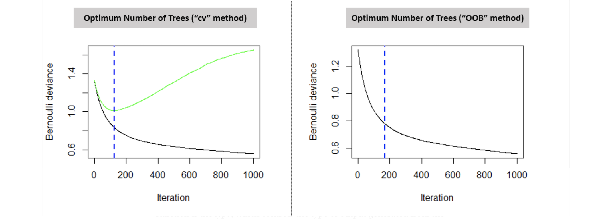

# Gradient Boosting and Adaboost


An ensemble is just a **collection of predictors (learners)** which come together (e.g. mean of all predictions) to give a final prediction. 

Boosting is one of ensemble techniques to **sequentially** generate predictors. The subsequent predictors learn from the mistakes of the previous predictors. Therefore, the observations (data) have an **unequal probability of appearing in subsequent models** and ones with the **highest error appear most**. The predictors can be chosen from a range of models like decision trees, regressors, classifiers etc. One can interpret boosting as trying to **minimize bias** of the overall predictor. So when you use boosting, you’re incentivized to use **low-variance and high-bias estimators** (e.g. shallow decision trees. In LGBM, tree depth > 5 may be too deep). However, it could lead to **overfitting** on training data. 

A larger number of gradient boosting iterations reduces training set errors. Raising the number of gradients boosting iterations too high increases overfitting. Therefore the number of iterations (trees) is a hyperparameter needed to tune ([Gradient Boosting: Gradient Boosting Regularization](https://corporatefinanceinstitute.com/resources/knowledge/other/gradient-boosting/)).

There are mainly two boosting algorithms: (1) Adaptive Boosting (Adaboost), (2) Gradient Boosting (GBM). [XGBoost](https://xgboost.readthedocs.io/en/latest/tutorials/model.html#tree-boosting) (Tianran Chen by optimizing GBM) and LightGBM are brand new GBM-extension tools developed more recently.

Table of Contents:

* [1. AdaBoost](https://github.com/HsiangHung/Machine_Learning_Note/tree/master/Ensemble/Boosting#1-adaboost)
* [2. Gradient Boosting](https://github.com/HsiangHung/Machine_Learning_Note/tree/master/Ensemble/Boosting#2-gradient-boosting)
     * [2.A - Boosting steps in GBM](https://github.com/HsiangHung/Machine_Learning_Note/tree/master/Ensemble/Boosting#2a---boosting-steps-in-gbm)
     * [2.B - Math Intuition of GBM](https://github.com/HsiangHung/Machine_Learning_Note/tree/master/Ensemble/Boosting#2b---math-intuition-of-gbm)
     * [2.C - MART](https://github.com/HsiangHung/Machine_Learning_Note/tree/master/Ensemble/Boosting#2c---mart)
* [3. XGBoost](https://github.com/HsiangHung/Machine_Learning_Note/tree/master/Ensemble/Boosting#3-xgboost)
* [4. LightGBM](https://github.com/HsiangHung/Machine_Learning_Note/tree/master/Ensemble/Boosting#4-lightgbm)
* [5. Comparison LighGBM vs XGboost](https://github.com/HsiangHung/Machine_Learning_Note/tree/master/Ensemble/Boosting#5-comparison-lighgbm-vs-xgboost)


## 1. AdaBoost

Adaptive boosting **changes sample distribution** by **modifying the weights** attached to each of the instances at each iteration. It increases the weights of the wrongly predicted instances and decreases the ones of the correctly predicted instances. The weak learner thus focuses more on the difficult instances [[Quora: What is the difference between gradient boosting and adaboost?]][What is the difference between gradient boosting and adaboost?].


We first train a decision tree in which each observation is assigned an equal weight. After evaluating the first tree, we increase the weights of those observations which have significant calssificstion errors. The second tree is therefore grown on this weighted data. Our new model is therefore Tree 1 + Tree 2. We then compute the classification error from this new 2-tree **ensemble** model and grow a third tree to predict the revised residuals. Predictions of the final ensemble model is therefore the weighted sum of the predictions made by the previous tree models [[Harshdeep Singh]][Understanding Gradient Boosting Machines].


As a concrete example, we follow Josh Starmer's video lecture: [Adaboost, clearly explained](https://www.youtube.com/watch?v=LsK-xG1cLYA) below. Suppose we have data if patients have heart disease as follows (**chest** = if chest pain,**weight** = patient weight, **disease** = heart disease and **sample weight**):
```
 # | chest | weight | disease | sample weight|
--------------------------------------------
 1 |  Yes  |  205   |   Yes   |  1/8  |
 2 |  No   |  180   |   Yes   |  1/8  |
 3 |  Yes  |  210   |   Yes   |  1/8  |
 4 |  Yes  |  167   |   Yes   |  1/8  |
 5 |  No   |  156   |   No    |  1/8  |
 6 |  No   |  125   |   No    |  1/8  |
 7 |  Yes  |  168   |   No    |  1/8  |
 8 |  Yes  |  172   |   No    |  1/8  |
```
At the beginning each data has same sample weight = 1/8.

Suppose we select weight = 176 to split node, patients' weight > 176 as `Yes` and patients' weight < as `No`.
For `Yes` we have 3 correct, 0 incorrect and for `No` we have 4 correct and 1 incorrect (#4). Then next step we reweigh #4 data with higher sample weight than others since it is misclassified
```
 # | chest | weight | disease | new sample weight|
--------------------------------------------
 1 |  Yes  |  205   |   Yes   |  0.07  |
 2 |  No   |  180   |   Yes   |  0.07  |
 3 |  Yes  |  210   |   Yes   |  0.07  |
 4 |  Yes  |  167   |   Yes   |  0.49  |
 5 |  No   |  156   |   No    |  0.07  |
 6 |  No   |  125   |   No    |  0.07  |
 7 |  Yes  |  168   |   No    |  0.07  |
 8 |  Yes  |  172   |   No    |  0.07  |
```
Then we reconstruct data in next forest by the new sample weights. For example, given random numbers r: if r < 0.07 we pick #1, if 0.07 <= r < 0.14 we pick #2,..., if 0.21 <= r < 0.7 pick #4,.... As a result, we will have more #4 than others in the new constructed data.


## 2. Gradient Boosting


Adaboost was the original implementation of boosting with a single cost function, but wasn’t that efficient.

On the other hand, gradient boosting doesn’t modify the sample distribution, and it can be used for different cost functions [[Quora: What is the difference between eXtreme Gradient Boosting (XGBoost), AdaBoost, and Gradient Boosting?]][What is the difference between eXtreme Gradient Boosting (XGBoost), AdaBoost, and Gradient Boosting?].

A GBM will start with a not very deep tree and will model the original target. Then it takes the errors from the first round of predictions, and passes the errors as a new target to a second tree. The second tree will model the error from the first tree, record the new errors and pass that as a target to the third tree. And so forth. Essentially it focuses on modelling errors from previous trees. It is high bias-low variance algorithm, and aims to decrease bias not variance. An excellent notebook [[Prince Grover-1]][Gradient Boosting from scratchs] demonstrates how a GBM minimizes bias during training (also see [[Prince Grover-2]][Gradient boosting simplified]).
   
In the following, we explain the boosting pictures using the figures depicted from [Prof. Ihler's lecture slides](http://sli.ics.uci.edu/Classes/2012F-273a?action=download&upname=10-ensembles.pdf) (also the [lecture video](https://www.youtube.com/watch?v=sRktKszFmSk)). Ben Gorman, a Kaggle master also provided a comprehensive description to interpret the math behind GBM in [[3]][A Kaggle Master Explains Gradient Boosting]. 


### 2.A - Boosting steps in GBM


We usually start with a very simple estimator, say one-layer decision tree (called a stump) to fit the data `(x1, y1), (x2, y2),...`. In the following panels, the red points denote the data points and green dots are reisduals. We build the first regressor by fitting 

    f0(x) = y


In the above left plot (a), the black line indicates `F0(x) = f0(x)`, the **first** predictor (model). Then we compute the residuals `e1 = y - y0` (where `y0 = f0(x)`), shown as green dots on the right hand plot (b). Next we build another regressor model but fit the **residuals** 

    f1(x) = e1

In (b), the black line indicates the `f1(x)` predictor. Now we can combine the predictors `F1(x) = F0(x) + f1(x)` and the resulting predictor is the black line shown in below left (c)


Now we see the `F1(x)` is a better regressor than `F0(x)` to fit the data. 

We then compute residuals `e2 = y - y1`, where `y1 = F1(x)`, and denote the residuals as green dots in (d). Then we still fit the residuals `e2`

    f2(x) = e2

and so on. In this case, mathmetically we have an iterative relation

<a href="https://www.codecogs.com/eqnedit.php?latex=F_t&space;(x)&space;=&space;F_{t-1}(x)&space;&plus;&space;f_t(x)" target="_blank"></a>

and the residual fitting model is given by   

<a href="https://www.codecogs.com/eqnedit.php?latex=f_t&space;(x)&space;=&space;y&space;-&space;F_{t-1}(x)" target="_blank"></a>

Prof. Ihler gave a [comprehensive description](http://sli.ics.uci.edu/Classes/2012F-273a?action=download&upname=10-ensembles.pdf) about the boosting steps in his lecture and here we borrow to show below


Upper panel shows data and fitting models `F0(x)`, `F1(x)`, `F2(x)`, ....`Fm(x)` and lower shows the residuals. The first estimator is built on the leftmost, whereas the rightmost shows the last iteration. We can see by boosting, the predictors are becoming more and more complex but fit the data better and better. Meanwhile, the residuals are moving toward to smaller values (if you zoom in).


### 2.B - Math Intuition of GBM

Previous description assumes all learners in the same weight. Where is the `gradient`? A GBM creates a set of predictors `F(x)`. The comprehensive tutorial on introduction to the model, [Introduction to Boosted Trees](https://xgboost.readthedocs.io/en/latest/tutorials/model.html#tree-boosting) explained more detailed steps in math[[Data Science: GBM vs XGBOOST? Key differences?]][GBM vs XGBOOST? Key differences?]:

In the boosting processes, we start with a baseline model `F0(x)` by fitting `f0(x) = y`,

<a href="https://www.codecogs.com/eqnedit.php?latex=F_0(x_i)&space;=&space;0&space;&plus;&space;f_0(x_i)" target="_blank"></a>

Then compute residuals `e1 = y - F0(x)`and fit `f1(x) = e1`. Now we have

<a href="https://www.codecogs.com/eqnedit.php?latex=F_1(x_i)&space;=&space;F_0(x_i)&space;&plus;&space;f_1(x_i)&space;=&space;f_0(x_i)&space;&plus;&space;f_1(x_i)" target="_blank"></a>

where `F1(x)` is a better model than `F0(x)`. Next step compute residuals `e2 = y - F1(x)` and fit the second model `f2(x) = e1`:

<a href="https://www.codecogs.com/eqnedit.php?latex=F_2(x_i)&space;=&space;F_1(x_i)&space;&plus;&space;f_2(x_i)&space;=&space;f_0(x_i)&space;&plus;&space;f_1(x_i)&space;&plus;&space;f_2(x_i)" target="_blank"></a>

where `F2(x)` is a better model than `F1(x)`. Keep doing the procedures, eventually we have the following relation


<a href="https://www.codecogs.com/eqnedit.php?latex=F_t(x_i)&space;=&space;F_{t-1}(x_i)&space;&plus;&space;f_{t}(x_i)&space;=&space;\sum^{t}_{m=0}&space;f_m(x_i)" target="_blank"></a>


For a regression problem, the loss function is given by  

<a href="https://www.codecogs.com/eqnedit.php?latex=\textrm{Loss}&space;=&space;J(y,&space;\hat{y})&space;=&space;\sum_i&space;\big(&space;y_i&space;-&space;\hat{y}_i&space;\big)^2" target="_blank"></a>


The boosting process is equivalent to minimizing `Loss` by sequentially generating models `F0(x)`, `F1(x)`, .... Therefore, we can add a superscript on the `Loss` function to represent the `Loss` function in `t`-th iteration

<a href="https://www.codecogs.com/eqnedit.php?latex=J_t(y,&space;\&space;\hat{y})&space;=&space;\sum_i&space;\big(&space;y_i&space;-&space;\hat{y}^t_i&space;\big)^2&space;=&space;\sum_i&space;\big(&space;y_i&space;-&space;F_t(x_i)&space;\big)^2" target="_blank"></a>


where `t = 1, 2, 3...` From the gradient descent aspect, the `Loss` is minimized as

<a href="https://www.codecogs.com/eqnedit.php?latex=\hat{y}^{t&plus;1}&space;:=\hat{y}^t&space;&plus;&space;\alpha&space;\frac{\partial&space;J_t(y,&space;\hat{y})}{\partial&space;\hat{y}^t}&space;=&space;y&space;&plus;&space;\alpha&space;\Big(&space;2&space;\sum_i&space;(y_i&space;-&space;\hat{y}^t_i)&space;\Big)" target="_blank"></a>

where `α` is the learning rate. From the expression, we can see the gradient is equal to the errors, and the predicted value `ym` is updated by multiplying the learning rate to the errors. This is why at each step we fit the residuals, where equivalently we are computing the gradient of `J`. The posts [[Prince Grover
-2]][Gradient boosting simplified], [[Kaggle]][A Kaggle Master Explains Gradient Boosting] and [Prof. Ilher's lecture video](https://www.youtube.com/watch?v=sRktKszFmSk) have more detailed interpretation.

Terence Parr in a Quora post [[Quora: What is an intuitive explanation of Gradient Boosting?]][What is an intuitive explanation of Gradient Boosting?] offered a very interesting picture, which explian the procedures very well.


### 2.C - MART 

The boosting regression trees can be extended to **classification** and even **learning to rank** problems. See more detail on the [Github page](https://github.com/HsiangHung/Machine_Learning_Note/tree/master/Ensemble/Boosting/MART) and Chris Burges' [paper](https://www.microsoft.com/en-us/research/uploads/prod/2016/02/MSR-TR-2010-82.pdf) for detail.


## 3. XGBoost

XGBoost (Chen) was developed to put this on a more formal footing. Both xgboost and gbm follows the principle of gradient boosting, but in XGBoost the **size of the tree** and the magnitude of the weights are controlled by standard **regularization** parameters. This leads to a ‘mostly’ parameter-free optimization routine. In theory that is, as in practice a plethora of parameters are used, still to control the size and shape of the trees. Regularization did however prove to be very powerful and made the algorithm much more robust [[Quora: What is the difference between eXtreme Gradient Boosting (XGBoost), AdaBoost, and Gradient Boosting?]][What is the difference between eXtreme Gradient Boosting (XGBoost), AdaBoost, and Gradient Boosting?], [[Gabriel Tseng]][Gradient Boosting and XGBoost] and [the stackexchange blog](https://datascience.stackexchange.com/questions/16904/gbm-vs-xgboost-key-differences#:~:text=Quote%20from%20the%20author%20of,which%20gives%20it%20better%20performance.).

The comprehensive tutorial on introduction to the model, [Introduction to Boosted Trees](https://xgboost.readthedocs.io/en/latest/tutorials/model.html#tree-boosting) explained more detailed [[Data Science: GBM vs XGBOOST? Key differences?]][GBM vs XGBOOST? Key differences?]. In comparison to boosted tree, the cost function in XGBoost has **regularization** on the `f` functions at `t`-th iteration [Introduction to Boosted Trees](https://xgboost.readthedocs.io/en/latest/tutorials/model.html#tree-boosting), 

<a href="https://www.codecogs.com/eqnedit.php?latex=J_t&space;=&space;\sum^n_{i=1}&space;\big(&space;y_i&space;-&space;\hat{y}^t_i&space;\big)^2&space;&plus;&space;\Omega(f_t)&space;=&space;\sum^n_{i=1}&space;C(&space;y_i&space;,&space;\&space;\hat{y}^t_i&space;)&space;&plus;&space;\Omega(f_t)" target="_blank"></a>


Note that we can rewrite the cost function as

<a href="https://www.codecogs.com/eqnedit.php?latex=J_t&space;=&space;\sum^n_{i=1}&space;C&space;\big(&space;y_i&space;,&space;\&space;\hat{y}^{t-1}_i&space;&plus;&space;f_t(x_i)&space;\big)&space;&plus;&space;\Omega(f_t)" target="_blank"></a>

Using Taylor expansion, we can approximate the cost function up to the second order of `f`:

<a href="https://www.codecogs.com/eqnedit.php?latex=J_t&space;=&space;\sum^n_{i=1}&space;\big[&space;C(&space;y_i&space;,&space;\&space;\hat{y}^{t-1}_i)&space;&plus;&space;g_i&space;f_t(x_i)&space;&plus;&space;\frac{1}{2}h_i&space;f^2_t(x_i)&space;\big]&space;&plus;&space;\Omega(f_t)" target="_blank"></a>


where the first/second order gradients are

<a href="https://www.codecogs.com/eqnedit.php?latex=g_i&space;=&space;\partial_{y^{t-1}_i}C(y_i,&space;\&space;\hat{y}^{t-1}_i),&space;\&space;h_i&space;=&space;\partial^2_{y^{t-1}_i}C(y_i,&space;\&space;\hat{y}^{t-1}_i)" target="_blank"></a>


Thus the specific objective at step `t` becomes

<a href="https://www.codecogs.com/eqnedit.php?latex=\sum^n_{i=1}&space;\big[&space;g_i&space;f_t(x_i)&space;&plus;&space;\frac{1}{2}h_i&space;f^2_t(x_i)&space;\big]&space;&plus;&space;\Omega(f_t)" target="_blank"></a>

This becomes our optimization goal for the new tree. One important advantage of this definition is that the value of the objective function only depends on `g_i` and `h_i`. This is how XGBoost supports custom loss functions. We can optimize every loss function, including logistic regression and pairwise ranking, using exactly the same solver that takes `g_i` and `h_i` as input!

XGBoost define the tree `f(x)` as (cf [Introduction to Boosted Trees](https://xgboost.readthedocs.io/en/latest/tutorials/model.html#tree-boosting))

<a href="https://www.codecogs.com/eqnedit.php?latex=f_t(x)&space;=&space;\omega_{q(x)},&space;\&space;\omega&space;\in&space;R^T,&space;\&space;q:&space;R^d&space;\to&space;\lbrace&space;1,2,\cdots,&space;T&space;\rbrace" target="_blank"></a>

and the complexity of the regularization term as

<a href="https://www.codecogs.com/eqnedit.php?latex=\Omega(f)&space;=&space;\gamma&space;T&space;&plus;&space;\frac{1}{2}\lambda&space;\sum^T_{j=1}&space;\omega^2_j" target="_blank"></a>

where `ω` is the vector of scores on leaves, and `T` is the number of leaves. 

Here is the article: [Light GBM model vs XGBoost Model Parameter Tuning and Examples](https://pyligent.github.io/2019-08-20-lightGBM_XGBoost/) to show hyperparameters in XGBoost.


### Enhancement of XGBoost Over GBM

#### Similarities of XGBoost and GBM

Since XGBoost is child of GBM, there are many similarities between the algorithms and their tuning parameters. Here is a short list of ways in which both algorithms are similar:

* Offer implementations of Classification and Regression Tree (CART) model framework.
* Inclusion of a form of gradient descent in minimizing the loss function
* Apply a learning rate to the loss function to optimize the path to the minimum loss (this is also known as shrinkage)
* Include base set of hyper parameters such as:
    *  Minimum sample size of features included in each split
Minimum sample of size of each leaf
Max depth of the trees also known as stump size
Minimum sample size required in each node for splitting
Number of trees to include
Learning rate
The ability to subsample the data for the creation of each tree (this is the stochastic part of stochastic gradient descent)


## 4. LightGBM

LightGBM (LGBM) model is a relatively new model. Rather than **level-wise** (**depth-first**) tree growth in regular decision tree algorithms (credit from [here](https://github.com/Microsoft/LightGBM/blob/master/docs/)), 


LGBM is **leaf-wise** (**best-first**) tree growth, 


which shows faster performance [[Analytics Vidhya]][Which algorithm takes the crown: Light GBM vs XGBOOST?], [[Harry Moreno]][Gradient Boosting Decision trees: XGBoost vs LightGBM (and catboost)], [[Aman Cyberia]][Good summary of XGBoost vs CatBoost vs LightGBM], [[Sai Nikhilesh Kasturi]][XGBOOST vs LightGBM: Which algorithm wins the race !!!], [[Alvira Swalin]][CatBoost vs. Light GBM vs. XGBoost], [[Jason Brownlee]][Gradient Boosting with Scikit-Learn, XGBoost, LightGBM, and CatBoost], [[Github]][Github: LGBM]. Leaf-wise algorithms tend to achieve lower loss than level-wise algorithms. However, Leaf-wise may cause over-fitting when the data size is small, so LightGBM includes the max_depth parameter to limit tree depth. 

Another good introduction blogs are given by [[Andrich van Wyk]][An Overview of LightGBM] and [[Neptune.ai]][Understanding LightGBM Parameters (and How to Tune Them)]. The model API can be found [here](https://lightgbm.readthedocs.io/en/latest/Python-Intro.html) as well as [the model hyperparameter list](https://lightgbm.readthedocs.io/en/latest/Parameters.html). How to avoid overfitting in LGBM? The guide page [Parameters Tuning](https://lightgbm.readthedocs.io/en/latest/Parameters-Tuning.html#deal-with-over-fitting) and [[Andrich van Wyk]][An Overview of LightGBM] show how to tune hyperparameter. 

Below is the summary:

1. `num_leaves`: This is the main parameter to control the complexity of the tree model. Theoretically, we can set `num_leaves = 2^(max_depth)` to obtain the same number of leaves as depth-wise tree. However, this simple conversion is not good in practice. The reason is that a leaf-wise tree is typically much deeper than a depth-wise tree for a fixed number of leaves. Unconstrained depth can induce over-fitting. Thus, when trying to tune the num_leaves, we should let it be **smaller than** `2^(max_depth)`. `Smaller` num_leaves reduces overfitting.
2. `min_data_in_leaf`: This is a very important parameter to prevent over-fitting in a leaf-wise tree. Its optimal value depends on the number of training samples and num_leaves. Setting it to a `large` value can avoid growing too deep a tree, but may cause under-fitting. In practice, setting it to hundreds or thousands is enough for a large dataset.
3. `max_depth`: You also can use max_depth to limit the tree depth explicitly. `Shallower` trees reduce overfitting.


4. `max_bin`: the maximum numbers bins that feature values are bucketed in. A `smaller` max_bin reduces overfitting.
5. `min_child_weight`: the minimum sum hessian for a leaf. In conjuction with min_child_samples, `larger` values reduce overfitting.
6. `bagging_fraction` and `bagging_freq`: enables bagging (subsampling) of the training data. Both values need to be set for bagging to be used. The frequency controls how often (iteration) bagging is used. `Smaller` fractions and frequencies reduce overfitting .
7. `feature_fraction`: controls the subsampling of features used for training (as opposed to subsampling the actual training data in the case of bagging). `Smaller fractions` reduce overfitting.
8. `lambda_l1` (`reg_aplha`) and `lambda_L2` (`reg_lambda`): controls L1 and L2 regularization.


#### Use Early Stopping

If early stopping is enabled and the model’s accuracy fails to improve for some number of consecutive rounds, LightGBM stops the training process. That “number of consecutive rounds” is controlled by the parameter `early_stopping_rounds`. See [here](https://lightgbm.readthedocs.io/en/latest/Parameters-Tuning.html#use-early-stopping).

Early stopping can be based either on an **out of bag** sample set (“OOB”) or **cross-validation (“cv”)**. Like mentioned above, the ideal time to stop training the model is when the validation error is decreasing yet started to stabilise before it starts increasing due to overfitting [[Harshdeep Singh]][Understanding Gradient Boosting Machines].

In the [blog](https://towardsdatascience.com/understanding-gradient-boosting-machines-9be756fe76ab), the author showed two plots indicating the optimum number of trees based on the respective technique used. The graph on the left indicates the error on test (green line) and train data set (black line). The blue dotted line points the optimum number of iterations. One can also clearly observe that the beyond a certain a point (169 iterations for the “cv” method), the error on the test data appears to increase because of overfitting. Hence, our model will stop the training procedure on the given optimum number of iterations.




## 5. Comparison LighGBM vs XGboost

Here is the deeper description about LighGBM (best-first) and XGboost (depth-first):

If you grow the full tree, `best-first (leaf-wise)` and `depth-first (level-wise)` will result in the same tree. The difference is in the order in which the tree is expanded. Since we don't normally grow trees to their full depth, order matters: application of early stopping criteria and pruning methods can result in very different trees. Because **leaf-wise** chooses splits based on their contribution to the `global loss` and not just the loss along a particular branch, it often (not always) will learn lower-error trees "faster" than level-wise. i.e. for a small number of nodes, leaf-wise will probably out-perform level-wise. As you add more nodes, without stopping or pruning they will converge to the same performance because they will literally build the same tree eventually [[Data Science: Decision trees: leaf-wise (best-first) and level-wise tree traverse]][Decision trees: leaf-wise (best-first) and level-wise tree traverse].

**LightGBM grows trees leaf-wise (best-first). It will choose the leaf with max delta loss to grow. Holding number of leaf fixed, leaf-wise algorithms tend to achieve lower loss than level-wise algorithms. However, the leaf-wise growth may be over-fitting if not used with the appropriate parameters.** [[Tao Lin]][Light GBM model vs XGBoost Model Parameter Tuning and Examples]


### Advantages of Light GBM:

 [[Sai Nikhilesh Kasturi]][XGBOOST vs LightGBM: Which algorithm wins the race !!!]

* Faster training speed and higher efficiency: Light GBM use **histogram based algorithm** i.e it **buckets continuous** feature values into **discrete bins** which fasten the training procedure. LightGBM is almost 10 times faster than XGBoost based on experiments by [[Sefik Ilkin Serengil]][XGBoost vs LightGBM]). Even using recent XGBoost version, LightGBM is still 1.3X — 1.5X the speed of XGBoost (see [LightGBM Classifier in Python](https://www.kaggle.com/prashant111/lightgbm-classifier-in-python/notebook))
* Lower memory usage: Replaces continuous values to discrete bins which result in lower memory usage.
* Better accuracy than any other boosting algorithm: It produces much **more complex trees** by following leaf-wise split approach rather than a level-wise approach which is the main factor in achieving higher accuracy. However, it can sometimes lead to overfitting which can be avoided by setting the max_depth parameter.
* Compatibility with large datasets: It is capable of performing equally good with large datasets with a significant reduction in training time as compared to XGBOOST.

LightGBM uses a novel technique of Gradient-based One-Side Sampling (GOSS) to filter out the data instances for finding a split value while **XGBoost uses pre-sorted algorithm** & Histogram-based algorithm for computing the best split. In a nutshell, GOSS retains instances with large gradients while performing random sampling on instances with small gradients [[Sai Nikhilesh Kasturi]][XGBOOST vs LightGBM: Which algorithm wins the race !!!].

LightGBM can also handle categorical feature. XGBoost cannot handle categorical features by itself, it only accepts numerical values similar to Random Forest [[Alvira Swalin]][CatBoost vs. Light GBM vs. XGBoost], [[Sefik Ilkin Serengil]][XGBoost vs LightGBM]. 

XGBoost supports on GPU more than LightGBM [[Sefik Ilkin Serengil]][XGBoost vs LightGBM]. 

### Handling Missing Values

LightGBM and XGBoost Libraries can handle missing values [[Data Science: Which models can handle null values?]][Which models can handle null values?]

* `LightGBM`: will ignore missing values during a split, then allocate them to whichever side reduces the loss the most. LightGBM can also handles null values by setting them to zero, `zero_as_missing=true`.
* `XGBoost`: the instance is classified into a default direction (the optimal default directions are learnt from the data somehow).


## Reference


[CatBoost vs. Light GBM vs. XGBoost]: https://towardsdatascience.com/catboost-vs-light-gbm-vs-xgboost-5f93620723db
[[Alvira Swalin] CatBoost vs. Light GBM vs. XGBoost](https://towardsdatascience.com/catboost-vs-light-gbm-vs-xgboost-5f93620723db)


[An Overview of LightGBM]: https://www.avanwyk.com/an-overview-of-lightgbm/#:~:text=%2Dlightgbm%2Doverview.-,LightGBM,%2DSide%20Sampling%20(Goss).
[[Andrich van Wyk] An Overview of LightGBM](https://www.avanwyk.com/an-overview-of-lightgbm/#:~:text=%2Dlightgbm%2Doverview.-,LightGBM,%2DSide%20Sampling%20(Goss).)


[Good summary of XGBoost vs CatBoost vs LightGBM]: https://www.kaggle.com/c/LANL-Earthquake-Prediction/discussion/89909
[[Aman Cyberia] Good summary of XGBoost vs CatBoost vs LightGBM](https://www.kaggle.com/c/LANL-Earthquake-Prediction/discussion/89909)


[Which algorithm takes the crown: Light GBM vs XGBOOST?]: https://www.analyticsvidhya.com/blog/2017/06/which-algorithm-takes-the-crown-light-gbm-vs-xgboost/
[[Analytics Vidhya] Which algorithm takes the crown: Light GBM vs XGBOOST?](https://www.analyticsvidhya.com/blog/2017/06/which-algorithm-takes-the-crown-light-gbm-vs-xgboost/)


[Decision trees: leaf-wise (best-first) and level-wise tree traverse]:https://datascience.stackexchange.com/questions/26699/decision-trees-leaf-wise-best-first-and-level-wise-tree-traverse
[[Data Science: Decision trees: leaf-wise (best-first) and level-wise tree traverse] Decision trees: leaf-wise (best-first) and level-wise tree traverse](https://datascience.stackexchange.com/questions/26699/decision-trees-leaf-wise-best-first-and-level-wise-tree-traverse)


[GBM vs XGBOOST? Key differences?]: https://datascience.stackexchange.com/questions/16904/gbm-vs-xgboost-key-differences
[[Data Science: GBM vs XGBOOST? Key differences?] GBM vs XGBOOST? Key differences?](https://datascience.stackexchange.com/questions/16904/gbm-vs-xgboost-key-differences)

[Which models can handle null values?]: https://datascience.stackexchange.com/questions/67167/which-models-can-handle-null-values
[[Data Science: Which models can handle null values?] Which models can handle null values?](https://datascience.stackexchange.com/questions/67167/which-models-can-handle-null-values)


[Gradient Boosting and XGBoost]: https://medium.com/@gabrieltseng/gradient-boosting-and-xgboost-c306c1bcfaf5
[[Gabriel Tseng] Gradient Boosting and XGBoost](https://medium.com/@gabrieltseng/gradient-boosting-and-xgboost-c306c1bcfaf5)


[Github: LGBM]: https://github.com/Microsoft/LightGBM/blob/master/docs/Features.rst#leaf-wise-best-first-tree-growth
[[Github] Github: LGBM](https://github.com/Microsoft/LightGBM/blob/master/docs/Features.rst#leaf-wise-best-first-tree-growth)


[Gradient Boosting Decision trees: XGBoost vs LightGBM (and catboost)]: https://medium.com/kaggle-nyc/gradient-boosting-decision-trees-xgboost-vs-lightgbm-and-catboost-72df6979e0bb#:~:text=In%20summary%2C%20LightGBM%20improves%20on,fraction%20of%20the%20whole%20dataset.
[[Harry Moreno] Gradient Boosting Decision trees: XGBoost vs LightGBM (and catboost)](https://medium.com/kaggle-nyc/gradient-boosting-decision-trees-xgboost-vs-lightgbm-and-catboost-72df6979e0bb#:~:text=In%20summary%2C%20LightGBM%20improves%20on,fraction%20of%20the%20whole%20dataset.)


[Understanding Gradient Boosting Machines]: https://towardsdatascience.com/understanding-gradient-boosting-machines-9be756fe76ab
[[Harshdeep Singh] Understanding Gradient Boosting Machines](https://towardsdatascience.com/understanding-gradient-boosting-machines-9be756fe76ab)


[Gradient Boosting with Scikit-Learn, XGBoost, LightGBM, and CatBoost]: https://machinelearningmastery.com/gradient-boosting-with-scikit-learn-xgboost-lightgbm-and-catboost/
[[Jason Brownlee] Gradient Boosting with Scikit-Learn, XGBoost, LightGBM, and CatBoost](https://machinelearningmastery.com/gradient-boosting-with-scikit-learn-xgboost-lightgbm-and-catboost/)


[A Kaggle Master Explains Gradient Boosting]: http://blog.kaggle.com/2017/01/23/a-kaggle-master-explains-gradient-boosting/
[[Kaggle] A Kaggle Master Explains Gradient Boosting](http://blog.kaggle.com/2017/01/23/a-kaggle-master-explains-gradient-boosting/)


[Light GBM model vs XGBoost Model Parameter Tuning and Examples]: https://pyligent.github.io/2019-08-20-lightGBM_XGBoost/
[[Tao Lin] Light GBM model vs XGBoost Model Parameter Tuning and Examples](https://pyligent.github.io/2019-08-20-lightGBM_XGBoost/)


[Understanding LightGBM Parameters (and How to Tune Them)]: https://neptune.ai/blog/lightgbm-parameters-guide
[[Neptune.ai] Understanding LightGBM Parameters (and How to Tune Them)](https://neptune.ai/blog/lightgbm-parameters-guide)


[What is an intuitive explanation of Gradient Boosting?]: https://www.quora.com/What-is-an-intuitive-explanation-of-Gradient-Boosting
[[Quora: What is an intuitive explanation of Gradient Boosting?] What is an intuitive explanation of Gradient Boosting?](https://www.quora.com/What-is-an-intuitive-explanation-of-Gradient-Boosting)


[What is the difference between gradient boosting and adaboost?]: https://www.quora.com/What-is-the-difference-between-gradient-boosting-and-adaboost#
[[Quora: What is the difference between gradient boosting and adaboost?] What is the difference between gradient boosting and adaboost?](https://www.quora.com/What-is-the-difference-between-gradient-boosting-and-adaboost#)


[What is the difference between eXtreme Gradient Boosting (XGBoost), AdaBoost, and Gradient Boosting?]: https://www.quora.com/What-is-the-difference-between-eXtreme-Gradient-Boosting-XGBoost-AdaBoost-and-Gradient-Boosting
[[Quora: What is the difference between eXtreme Gradient Boosting (XGBoost), AdaBoost, and Gradient Boosting?] What is the difference between eXtreme Gradient Boosting (XGBoost), AdaBoost, and Gradient Boosting?](https://www.quora.com/What-is-the-difference-between-eXtreme-Gradient-Boosting-XGBoost-AdaBoost-and-Gradient-Boosting)


[Gradient Boosting from scratchs]: https://medium.com/mlreview/gradient-boosting-from-scratch-1e317ae4587d
[[Prince Grover-1] Gradient Boosting from scratchs](https://medium.com/mlreview/gradient-boosting-from-scratch-1e317ae4587d)


[Gradient boosting simplified]: https://www.kaggle.com/grroverpr/gradient-boosting-simplified/
[[Prince Grover-2] Gradient boosting simplified](https://www.kaggle.com/grroverpr/gradient-boosting-simplified/)


[XGBOOST vs LightGBM: Which algorithm wins the race !!!]: https://towardsdatascience.com/lightgbm-vs-xgboost-which-algorithm-win-the-race-1ff7dd4917d#:~:text=The%20development%20of%20Boosting%20Machines,because%20it%20is%20extremely%20powerful.
[[Sai Nikhilesh Kasturi] XGBOOST vs LightGBM: Which algorithm wins the race !!!](https://towardsdatascience.com/lightgbm-vs-xgboost-which-algorithm-win-the-race-1ff7dd4917d#:~:text=The%20development%20of%20Boosting%20Machines,because%20it%20is%20extremely%20powerful.)


[XGBoost vs LightGBM]: https://sefiks.com/2020/05/13/xgboost-vs-lightgbm/
[[Sefik Ilkin Serengil] XGBoost vs LightGBM](https://sefiks.com/2020/05/13/xgboost-vs-lightgbm/)
