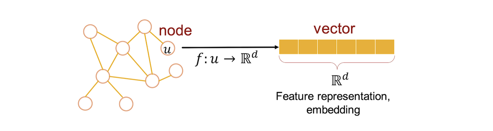
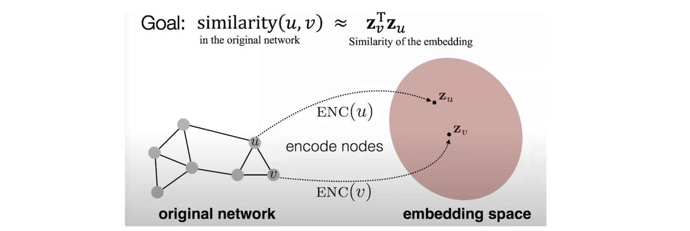
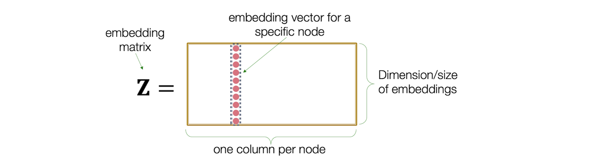
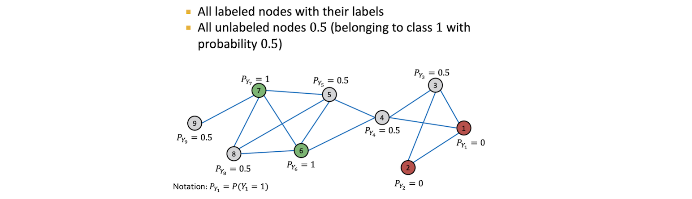
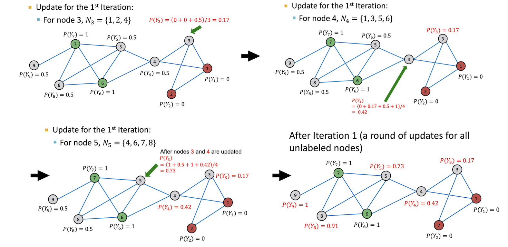
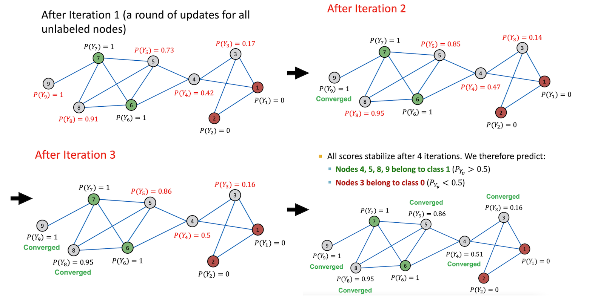

# Machine Learning with Graph

$\textcolor{red}{NOTE: \ The \ majority \ of \ the \ note \ page \ follows \ Prof. \ Jure \ Leskovec's \ CS224W \ 'Machine \ Learning \ With \ Graph' \ lectures.}$

# 1. Feature Engineering

## 1.1 Node-Level Features

Summary of centrality analysis: [Centrality algorithms overview](https://networkx.guide/algorithms/centrality-algorithms)

Important-based node features:

1. **Eigenvector centrality**
2. **Degree centrality**: the number of neighboring nodes
3. **Betweenness centrality**: a node is important if it lies on many shortest paths between other nodes.

$$ c_v = \sum_{s,t \ne v} \frac{\textrm{num of shortest paths between s, t containing v}}{\textrm{num of shortest paths between s, t}}.$$ 

4. **Closeness centrality**: a node is important if it has small shortest path lengths to all other nodes.

$$ c_v = \frac{1}{ \sum_{u \ne v} \textrm{shortest path length between u and v}}$$

5. Other centrality measurement: [PageRank](https://networkx.guide/algorithms/centrality-algorithms/pagerank/), [Katz centrality](https://networkx.guide/algorithms/centrality-algorithms/katz-centrality/)

### Reference 

* [Graph Analytics: Determining important nodes in a graph using Neo4j]: https://medium.com/data-science-in-your-pocket/graph-analytics-determining-important-nodes-in-a-graph-using-neo4j-bce0dc31c2c8
[[Mehul Gupta] Graph Analytics: Determining important nodes in a graph using Neo4j](https://medium.com/data-science-in-your-pocket/graph-analytics-determining-important-nodes-in-a-graph-using-neo4j-bce0dc31c2c8)
     

Structure-based features:
* **Clustering coefficient** 
* **Graphlet**

## 1.2 Link-Level Features

### 1.2.1 Distance-based feature

**Shortest path distance** between two nodes.

This metric however doesn't capture the degree of neighborhood overlap. The pair (B,H) has 2 shared neighboring nodes, but (B,E) and (A,B) only have 1 such node.

### 1.2.2 Local neighborhood overlap

Capture the number of neighboring nodes shared between nodes $u$ and $v$. Suppose we have a graph below and denote $N(v)$ as the neighbors of node $v$:

* **Common neighbors**: $|N(u) \cap N(v)|$, e.g. $|N(A) \cap N(B)| = |\lbrace C \rbrace|=1$.
* **Jaccard's coefficient**: $|N(u) \cap N(v)|/|N(u) \cup N(v)|$, e.g. $|N(A) \cap N(B)|/ |N(A) \cup N(B)|= | \lbrace C \rbrace |/| \lbrace C,D \rbrace |=1/2$.
* **Adamic-Adar index**: $\sum_{u \in \lbrace N(u) \cap N(v) \rbrace} \frac{1}{\log(k_u)}$, e.g. $\frac{1}{\log(k_C)}=\frac{1}{\log 4}$.

However, the local neighborhood overlap metric will be zero if two nodes have no nodes shared in common. Potentially these nodes may be connected in future.

### 1.2.3 Global neighborhood overlap

**Katz index**: the number of paths of **all lengths** between a pair of nodes.
* Use adjaceny matrix powers. If A is adjaceny matrix, $A^k_{uv}$ specifies the number of paths of length $k$ between node $u$ and $v$.
* Katz index:

$$S_{uv} = \sum^{\infty}_{k=0} \beta^{k} A^k_{uv}, \ \ \textrm{where } \beta = [0, 1].$$ 

* Katz index matrix can be computed in close-form:

$$\bf{S} = \sum^{\infty}_{k=0} \left( \bf{I} - \beta \bf{A}\right)^{-1} - \bf{I}. $$

Here we implemented the geometric series formula 

$$\sum^{\infty}_{k=0} \beta^k \bf{A}^k = \left( \bf{I} - \beta \bf{A}\right)^{-1} $$

## 1.3 Graph-Level Features

Kernel method: graph kernel is to measure similarity between two graphs.

Goal: Design graph feature vector $\phi(G)$:
* **Graphlet kernel**: graph is represented as **Bag-of-graphlets**. Computationally expansive.
* **Weisfeiler-Lehman kernel**: represented as **Bag-of-color** (apply k-step color refinement) and computationally efficient. The time complexity $O(n)$, $n$ is the number of edges.

# 2. Graph Representation Learning

**Goal**: Efficient task-independent feature learning for machine learning with graphs!

## 2.1 Node embedding

* Map nodes into an embedding space.
* Encode nodes so that similarity (e.g. dot product) among nodes in embedding space approximate similarity in graph.

### 2.1.1 Shallow encoder

* Simplest encoding approach: encoder **ENC** is just a embedding-**lookup**, $\textrm{ENC}(u) = z_u$ where $u \in V$. Directly optimize the embedding for **each node**.
* $\bf{Z}$ matrix, where each column vector $z_u$ denotes a node embedding vector, and the number of row denotes embedding dimensionality.

* Method: Deepwalk, Node2vec, but both don't capture structural similarity.
* Decoder: **DEC** maps from embeddings (based on node similarity) to the similarity score $\textrm{DEC}(z^T_u z_v)$.
* Objective: maximize $z^T_u z_v$ for node pairs (u, v) which are similar
$$\textrm{similarity}(u, v) \approx z^T_u z_v.$$

## 2.2 Node Classification

Messgae passing labels, similar nodes are connected (correlation).  

Two explanations for nodes in networks are correlated:
* social Homophily: The tendency of individuals to associate and bond with similar others
* Influence: Social connections can influence the individual characteristics of a person

Collective classification: assign labels to all nodes in the network. Three techniques:
* Relational classification
* Iterative classification
* Correct & Smooth

### 2.2.1 Relational classification

Prbabilistic relational classification: Propagate node labels across the network. Class probability $Y_v$ of node $v$ is a weighted average of class probabilities of its neighbors.

$$P(Y_v=c) = \frac{1}{\sum_{(u,v) \in E} A_{uv}}\sum_{(u,v) \in E} A_{uv}P(Y_u=c),$$
where $P(Y_v=c)$ is the probability of node $v$ having label $c$.

* For labeled nodes $v$, initialize label $Y_v$ with ground-truth label $Y^*_v$.
* For unlabeled nodes, initialize $Y_v= 0.5$.

* Iteratively update all nodes in a random order until convergence or until maximum number of iterations is reached.
     * For example, for the first iteration,
     
     * We continue the following iterations to update each node until the convergence:
     

* Challenges:
     * Convergence is not guaranteed
     * Model cannot use node feature information

### 2.2.2 Iterative classification

* Relational classifier does not use node attributes.
* Iterative classification: Classify node $v$ based on its attributes $f_v$ as well as labels $z_v$ of neighbor set $N_v$.

### 2.2.3 Loopy belief propagation 

## 3. Community Detection

The notion of community in a graph represents similarly to what it represents in the real world. Different social circles are examples of such communities. Analogously, in graphs, community represents a partition of a graph, ie a set of nodes.

### Markov Clustering

MCL algorithm is achieved by simulating a random walk on a graph until it reaches equilibrium. In the case of network data, the only task to perform is to compute the adjacency (or affinity) matrix A. The definition of such a matrix is $A_{ij}= 1$ if there is an edge from vertex i to vertex j, and 0 otherwise

By the adjacency matrix, one can obtain the Markov matrix, which is a matrix of probabilities representing the chances for a node reaching another one it is connected to. Then the random walk on the graph is simulated by alternating two operators called **expansion** and **inflation**:

* **Expansion** allows the random walker to take higher length paths. For instance taking a large number of steps from one node to the other.
* **Inflation** changes the transition probabilities by favouring more probable walks over less probable ones.

The combination of expansion and inflation will boost the probabilities of walks inside each cluster. Moreover it will reduce walks between the clusters.

* Pro: unlike many clustering algorithms that need the user to specify the expected number of clusters beforehand, sometimes mistakenly, the MCL algorithm provides a partition of the data into clusters that naturally arises from the graph topology itself.

* [Effective community detection with Markov Clustering]: https://towardsdatascience.com/effective-community-detection-with-markov-clustering-d5c6abee11b2
[[Mehul Gupta] Effective community detection with Markov Clustering](https://towardsdatascience.com/effective-community-detection-with-markov-clustering-d5c6abee11b2)
