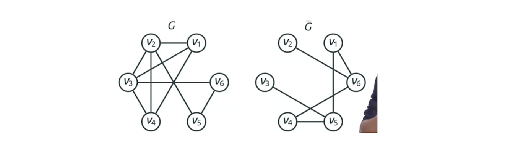

# Graph

## Vertex Degree

* The Degree of a vertex is the number of its incident edges.
* The degree of a graph is the maximum degree of its vertices.

* The Indegree of a vertex is the number of edges ending at $v$. 
* The Outdegree of a vertex is the number of edges leaving $v$.

## Complement Graph

The complement of a graph $G=(V, E)$ is a graph of $G=(V, \bar{E})$ where two graphs have same set of vertices $V$ and:
* Two vertices are connected in $\bar{G}$ if and only if they are NOT connected in $G$.
* $(u, v) \in E$ if and only if $(u, v) \not\in \bar{E}$.

## Walk, Path, Cycle

### Definition 

*  A walk in a graph is a sequence of edges, such that each edge starts in a vertex where the previous edge ended. Note that a walk contains the same edge several times
* The length of a walk is a number of edges in it. 
* A path is a walk where all edges are the distinct.
* A simple path is a path where all vertices are distinct

* A cycle in a graph is a path whose first and last vertices are the same. All edges in a cycle must also be distinct.
* A simple cycle is a cycle where all vertices are distinct, except for the first one which must be the same as the last one. 

### Example

* Walk: start from the $v_6$, $(e_1, e_2, e_4, e_5, e_3, e_1)$.
* Path: $(e_7, e_6, e_4, e_5) = (v_2, v_1, v_5, v_2, v_3)$. It's not a simple path, because we've visited $v_2$ twice.
* Simple path: $(e_7, e_6, e_2, e_3)=(v_2, v_1, v_5, v_4, v_3)$.
* Cycle: $(e_2, e_3, e_8, e_4, e_7, e_6)$.
* Simple cycle: $(e_5, e_4, e_2, e_3)$.

## Connectivity

* A graph is called Connected if there is a path between every pair of its vertices
* A connected component of a graph is a maximal connected subgraph of it. 

* $(v_1, v_2, v_3)$ are connected, they form a connected subgraph. But this is not a connected component because it's not maximal. 
* $(v_1, v_2, v_3, v_4, v_5, v_6)$ form a connected component.
* $(v_7, v_8)$ form the connected component. 
* The vertex $v_0$ itself forms the third connected component.

## Weight Graph

* A graph can also be weighted. So weighted graph gives a weight to every edge.
* The weight of your path then is just the sum of all edges on this path.
* The shortest path between two vertices is just the path of the minimum weight. 
* The distance between two vertices and the length of the shortest path between them.

## Graph Type

* Path graph, cycle graph

## Handshaking Lemma

* For any graph $G(V, E)$, the sum of degrees of all its nodes is twice the number of edges
$$ \sum_{v \in G} degree(v) = 2|E|$$
*  If a graph had an odd number of odd nodes, then the sum of degrees would be also odd.