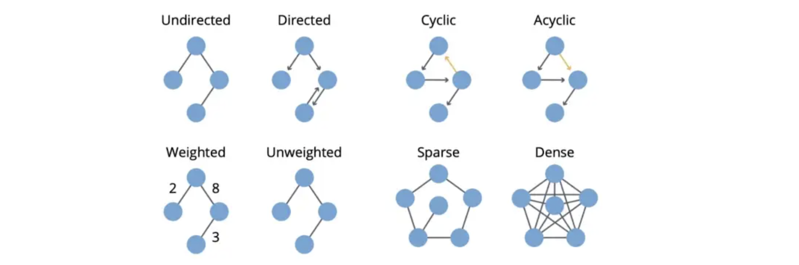

# Graph

Graphs (as a representation):

* Information/knowledge are organized and linked
* Software can be represented as a graph
* Similarity networks: Connect similar data points
* Relational structures: Molecules, Scene graphs, 3D shapes, Particle-based physics simulations

Networks (also known as Natural Graphs):

* Social networks: Society is a collection of 7+ billion individuals
* Communication and transactions: Electronic devices, phone calls, financial transactions
* Biomedicine: Interactions between genes/proteins regulate life
* Brain connections: Our thoughts are hidden in the connections between billions of neurons

* The order of a graph is the number of its vertices $|V|$. The size of a graph is the number of its edges $|E|$.
* The degree of a vertex is the number of edges that are adjacent to it. The neighbors of a vertex $v$ in a graph $G$ is a subset of vertex Vi induced by all vertices adjacent to $v$.
* The neighborhood graph (also known as an ego graph) of a vertex $v$ in a graph $G$ is a subgraph of $G$, composed of the vertices adjacent to $v$ and all edges connecting vertices adjacent to $v$.

## 1. Basic Properties

### 1.1 Vertex Degree

* The Degree of a vertex is the number of its incident edges.
* The degree of a graph is the maximum degree of its vertices.
* The Indegree of a vertex is the number of edges ending at $v$. 
* The Outdegree of a vertex is the number of edges leaving $v$.

### 1.2 Complement Graph

The complement of a graph $G=(V, E)$ is a graph of $G=(V, \bar{E})$ where two graphs have same set of vertices $V$ and:
* Two vertices are connected in $\bar{G}$ if and only if they are NOT connected in $G$.
* $(u, v) \in E$ if and only if $(u, v) \not\in \bar{E}$.

### 1.3 Walk, Path, Cycle

#### Definition 

*  A walk in a graph is a sequence of edges, such that each edge starts in a vertex where the previous edge ended. Note that a walk contains the same edge several times
* The length of a walk is a number of edges in it. 
* A path is a walk where all edges are the distinct.
* A simple path is a path where all vertices are distinct
* A cycle in a graph is a path whose first and last vertices are the same. All edges in a cycle must also be distinct.
* A simple cycle is a cycle where all vertices are distinct, except for the first one which must be the same as the last one. 

#### Example

* Walk: start from the $v_6$, $(e_1, e_2, e_4, e_5, e_3, e_1)$.
* Path: $(e_7, e_6, e_4, e_5) = (v_2, v_1, v_5, v_2, v_3)$. It's not a simple path, because we've visited $v_2$ twice.
* Simple path: $(e_7, e_6, e_2, e_3)=(v_2, v_1, v_5, v_4, v_3)$.
* Cycle: $(e_2, e_3, e_8, e_4, e_7, e_6)$.
* Simple cycle: $(e_5, e_4, e_2, e_3)$.

### 1.4 Connectivity

* A graph is called Connected if there is a path between any two vertices.
* A connected component of a graph is a maximal connected subgraph of it. 

* $(v_1, v_2, v_3)$ are connected, they form a connected subgraph. But this is not a connected component because it's not maximal. 
* $(v_1, v_2, v_3, v_4, v_5, v_6)$ form a connected component.
* $(v_7, v_8)$ form the connected component. 
* The vertex $v_0$ itself forms the third connected component.

### 1.5 Weight Graph

* A graph can also be weighted. So weighted graph gives a weight to every edge.
* The weight of your path then is just the sum of all edges on this path.
* The shortest path between two vertices is just the path of the minimum weight. 
* The distance between two vertices and the length of the shortest path between them.

## 1.6 Graph Type

* Path graph, cycle graph

## 1.7 Handshaking Lemma

* For any graph $G(V, E)$, the sum of degrees of all its nodes is twice the number of edges

$$ \sum_{v \in G} \textrm{degree}(v) = 2|E|$$

*  If a graph had an odd number of odd nodes, then the sum of degrees would be also odd.

## 2. Algorithmd in Graph

* [19 Graph Algorithms You Can Use Right Now]: https://memgraph.com/blog/graph-algorithms-list
[[Memgraph] 19 Graph Algorithms You Can Use Right Now](https://memgraph.com/blog/graph-algorithms-list)

* [Applications of the 20 Most Popular Graph Algorithms]: https://memgraph.com/blog/graph-algorithms-applications
[[Memgraph] Applications of the 20 Most Popular Graph Algorithms](https://memgraph.com/blog/graph-algorithms-applications)

* [10 Graph Algorithms Visually Explained]: https://towardsdatascience.com/10-graph-algorithms-visually-explained-e57faa1336f3
[[Vijini Mallawaarachchi] 10 Graph Algorithms Visually Explained](https://towardsdatascience.com/10-graph-algorithms-visually-explained-e57faa1336f3)

### 2.1 Community Detections

* [Getting Started with Community Detection in Graphs and Networks]: https://www.analyticsvidhya.com/blog/2020/04/community-detection-graphs-networks/
[[Vidhya Analytics - Prateek Joshi] Getting Started with Community Detection in Graphs and Networks](https://www.analyticsvidhya.com/blog/2020/04/community-detection-graphs-networks/)

### 2.2 Importance Node Ranking

* [Unveiling important nodes in a network]: https://towardsdatascience.com/unveiling-important-nodes-in-a-network-4992a2ea1cca
[[Kilver J. Campos] Unveiling important nodes in a network](https://towardsdatascience.com/unveiling-important-nodes-in-a-network-4992a2ea1cca)

### 2.3 Critical Node

* [Articulation Points (or Cut Vertices) in a Graph]: https://www.geeksforgeeks.org/articulation-points-or-cut-vertices-in-a-graph/
[[GeeksForGeek] Articulation Points (or Cut Vertices) in a Graph](https://www.geeksforgeeks.org/articulation-points-or-cut-vertices-in-a-graph/)
* [What is a fast algorithm for finding critical nodes?]: https://stackoverflow.com/questions/3678335/what-is-a-fast-algorithm-for-finding-critical-nodes
[[Stackoverflow] What is a fast algorithm for finding critical nodes?](https://stackoverflow.com/questions/3678335/what-is-a-fast-algorithm-for-finding-critical-nodes)

### 2.4 Critical Paths

* [Is there any algorithm which can find all critical paths in DAG?]: https://stackoverflow.com/questions/18450062/is-there-any-algorithm-which-can-find-all-critical-paths-in-dag
[[Stackoverflow] Is there any algorithm which can find all critical paths in DAG?](https://stackoverflow.com/questions/18450062/is-there-any-algorithm-which-can-find-all-critical-paths-in-dag)

## 3. Others

### 3.1 Diversity Measurement - Shannon Entropy

Shannon defined the entropy of a probability distribution as the expected value of the information content of a value drawn from that distribution.

* [Similarity-Sensitive Diversity]: https://dtunkelang.medium.com/similarity-sensitive-diversity-16a35d64f48c
[[Daniel Tunkelang] Similarity-Sensitive Diversity](https://dtunkelang.medium.com/similarity-sensitive-diversity-16a35d64f48c)

* [Cross-Entropy Cost Functions used in Classification]: https://www.geeksforgeeks.org/cross-entropy-cost-functions-used-in-classification/
[[Geeksforgeeks] Cross-Entropy Cost Functions used in Classification](https://www.geeksforgeeks.org/cross-entropy-cost-functions-used-in-classification/)