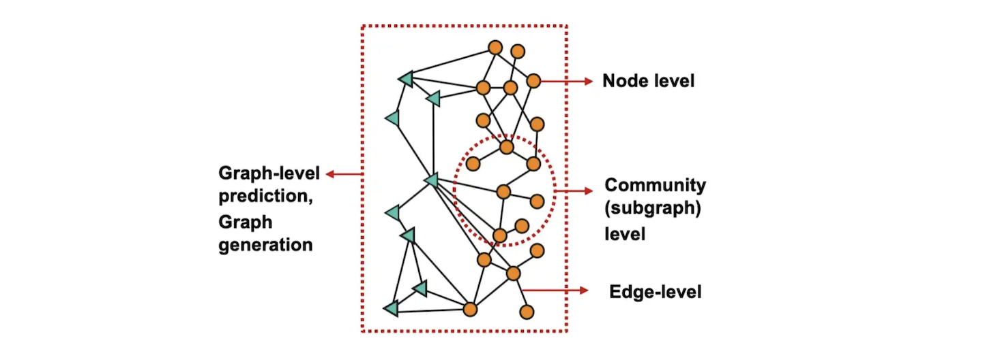
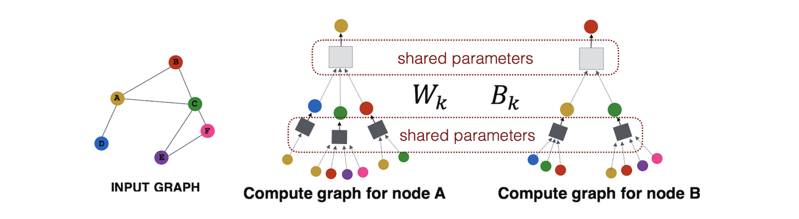
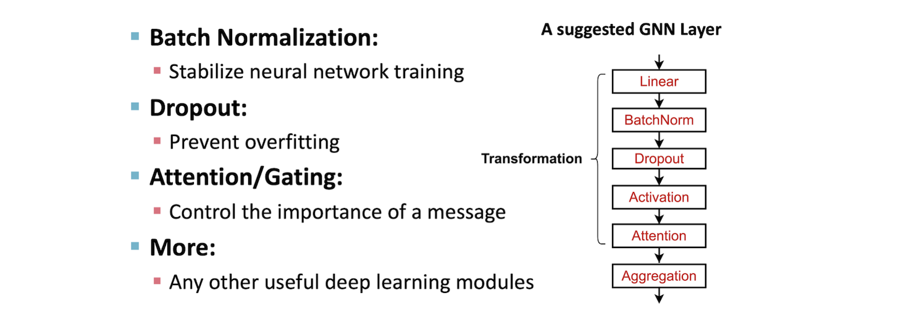
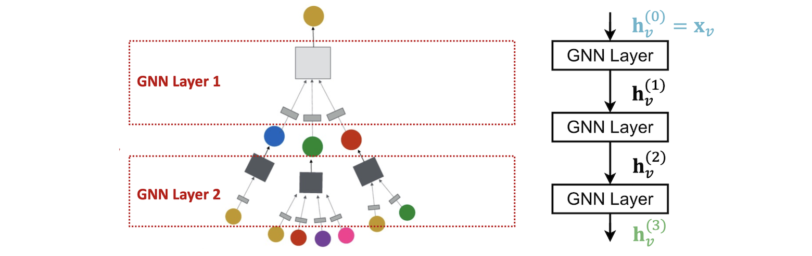

# Graph Neural Network

$\textcolor{red}{NOTE: \ The \ majority \ of \ the \ note \ page \ is \ based \ on \ Prof. \ Jure \ Leskovec's \ CS224W \ 'Machine \ Learning \ With \ Graphs' \ lectures.}$

* [Graph Neural Network and Some of GNN Applications: Everything You Need to Know]: https://neptune.ai/blog/graph-neural-network-and-some-of-gnn-applications
[[Amal Menzli] Graph Neural Network and Some of GNN Applications: Everything You Need to Know](https://neptune.ai/blog/graph-neural-network-and-some-of-gnn-applications)
* [Graph neural networks: A review of methods and applications]: https://arxiv.org/pdf/1812.08434.pdf
[[arxiv] Graph neural networks: A review of methods and applications](https://arxiv.org/pdf/1812.08434.pdf)

Tasks we will be able to solve:

1. **Node classification**: Predict a type of a given node
2. **Link prediction**: Predict whether two nodes are linked
3. **Graph classification**
4. **Community detection**: Identify densely linked clusters of nodes
5. **Network similarity**: How similar are two (sub)networks

## 1. Node Embedding

Goal: Map nodes to $d$-dimensional embeddings such that similar nodes in the graph are embedded close together 

###  Naive MLP approach fails for graphs

Modern deep learning toolbox (e.g. convolutional neural network) is designed for simple sequences & regular grids. However a network has an arbitrary size and complex topological structure (i.e., no spatial locality like grids)

We cannot naively feed graph into a deep neural net using adjacency matrix and features. Issues with this idea:
1. $O(|V|)$ parameters
2. Not applicable to graphs of different sizes; each graph is a "data point".
3. Sensitive to node ordering. "A->B->C" and "A->C->B" have different adjacency matrix.

## 2. Graph convolutional network

**Idea**: Node’s neighborhood defines a computation graph

### 2.1 Multiple layer deep model

Obtain nodes aggregation information (node embeddings) from their locoal network neighbors using neural networks.

Model can be of **arbitrary** depth:
* Nodes have embeddings at each layer:
* Layer-0 embedding of node $v$ is its **input** feature, $x_v$.
* Layer-k embedding gets information from nodes that are $k$ hops away.

Each grey box represents a neural network. They require aggregations to be order-invariant, like sum, average, maximum.

### 2.2 Basic approach for deep model

Forward propagation rule in GNNs: 

1. Initialize input as activation units $x_v$
2. Every layer in the network:
    * Average information from neighbors
    * Apply a neural network (Note: $h^k_v$ denotes the hidden representation of node $v$ at layer $k$)

    

    * Trainable weight matrices (i.e., what we learn):
         * $W_k$: weight matrix for **neighborhood aggregation**.
         * $B_k$: weight matrix for transforming hidden vector of node's **itself**.

3. The output $h^k_v$ is the embedding after layer-k of neighborhood aggregation.

We can feed these embeddings into any loss function and run SGD to train the weight parameters. 

### 2.3 Train a GNN

Node embedding $z_v$ is a function of input graph:
* Supervised setting: we want to minimize the loss $L$, 
      $$\min_{\Theta}L(y, f(z_v))$$
     * $y$: node label
     * $L$ could be $L_2$ if $y$ is real number, or cross entropy if $y$ is categorical
* Unsupervised setting:
     * No node label available
     * Use the graph structure as the supervision.

#### 2.3.1 Supervised Learning

Directly train the model for a supervised task. e.g., node classification, if the node is safe or toxic drug:

Use cross entropy loss

$$L = \sum_{v \in V} y_v \log \left( \sigma ( z^T_v \theta ) \right) +  (1 - y_v) \log \left(  1 - \sigma (z^T_v \theta) \right),$$

where $\theta$ is classification weight, $z_v$ is node embedding from encoder output.

### 2.3.2 Unsupervised Learning

Use only the graph structure: similar nodes have similar embeddings. Unsupervised loss function can be a loss based on node proximity in the graph, or random walks.

## 3. GNN Process

Recap of GNN:

The same aggregation parameters are **shared** for all nodes. The number of model parameters is sublinear in $|V|$ and we can generalize to **unseen** nodes.

### 3.1 A single GNN layer

A single GNN layer mainly includes two parts:

1. Message: each node compute a message
$$m^{(k)}_u = \textrm{MSG}^{(k)} \left( \bf{h}^{(k-1)}_u \right), \ u \in \lbrace N(v) \cup v\rbrace $$
e.g. a linear layer $\bf{m}^{(k)}_v=\bf{W}^{(k)} h^{(k-1)}_v$.

2. Aggregation: aggregate messages from neighbors, e.g. sum(.), mean(.), max(.) etc aggregator

$$ \bf{h}^{(k)}_v = \textrm{AGG}^{(k)} \left( \lbrace  \bf{m}^{(k)}_u, u \in  N(v) \rbrace , \bf{m}^{(k)}_v \right),$$

#### 3.1.1 Graph Convolutional Networks (GCN)

The simplest GCN has only three different operators:

* Graph convolution
* Linear layer
* Nonlinear activation

The operations are usually done in this order. Together, they make up one network layer. We can combine one or more layers to form a complete GCN.

$$ \bf{h}^{(k)}_v = \sigma \left( \bf{W}_k \sum_{u \in N(v)} \frac{h^{(k-1)}_u}{|N(v)|} + \bf{B}_k h^{(k-1)}_v  \right),$$

where the `AGG` function just simply takes weight average of neighbors.

##### Appendix: Difference between CNN and GNN

CNN can be seen as a special GNN with fixed neighbor size and ordering:

* The size of the filter is pre-defined for a CNN.
* CNN is not permutation equivariant. Switching the order of pixels will leads to different outputs.

$$ \bf{h}^{(k)}_v = \sigma \left( \sum_{u \in N(v)} \bf{W}^u_k \frac{h^{(k-1)}_u}{|N(v)|} + \bf{B}_k h^{(k-1)}_v  \right),$$

* The advantage of GNN is it processes arbitrary graphs with different degrees for each node.

$$ \bf{h}^{(k)}_v = \sigma \left( \bf{W}_k \sum_{u \in N(v)} \frac{h^{(k-1)}_u}{|N(v)|} + \bf{B}_k h^{(k-1)}_v  \right),$$

#### 3.1.2 GraphSAGE

GraphSAGE (Hamilton et al, NIPS 2017) is a representation learning technique for dynamic graphs. 

It can predict the embedding of a new node, without needing a re-training procedure. 

To do this, GraphSAGE uses inductive learning. It learns aggregator functions which can induce new node embedding, based on the features and neighborhood of the node.

$$ \bf{h}^{(k)}_v = \sigma \left( \left[ \bf{W}_k . \textrm{AGG} \left( \lbrace  h^{(k-1)}_u, u \in  N(v) \rbrace  \right) , \bf{B}_k h^{(k-1)}_v \right] \right).$$

Rather than summing two things together and losing track of them, we can use a general aggregation function, e.g. `Pool` or `LSTM` which keeps them separate by concatenating them [[Amal Menzli]][Graph Neural Network and Some of GNN Applications: Everything You Need to Know]. 

* [Youtube: Classical GNN Layers: GraphSAGE](https://www.youtube.com/watch?v=247Mkqj_wRM&list=PLoROMvodv4rPLKxIpqhjhPgdQy7imNkDn&index=21) (@11:47)

#### 3.1.3 Graph attention networks

$$ \bf{h}^{(k)}_v = \sigma \left( \sum_{u \in N(v)} \alpha_{vu} \bf{W}^{(k)} h^{(k-1)}_v \right),$$

where $\alpha_{vu}$ is the attention weights (importance) of node $u$'s message to $v$. In GCN/GraphSAGE, the weight is 

$\alpha_{vu} = \frac{1}{|N(v)|}.$

However, not all nodes' neighbors are equally important.

* [Youtube: Classical GNN Layers: GraphSAGE](https://www.youtube.com/watch?v=247Mkqj_wRM&list=PLoROMvodv4rPLKxIpqhjhPgdQy7imNkDn&index=21) (@15:55)

### 3.2 GNN Layer in practice 

Many modern deep learning modules can be incorporated into a GNN layer:

* [Youtube: Classical GNN Layers: GraphSAGE](https://www.youtube.com/watch?v=247Mkqj_wRM&list=PLoROMvodv4rPLKxIpqhjhPgdQy7imNkDn&index=21) (@31:07)

### 3.2.1 Stack GNN layers

[CS224W: Machine Learning with Graphs | 2021 | Lecture 7.3 - Stacking layers of a GNN](https://www.youtube.com/watch?v=ew1cnUjRgl4&list=PLoROMvodv4rPLKxIpqhjhPgdQy7imNkDn&index=22)

Connect GNN layers into a GNN:
* Stack layers sequentially
* Ways of adding skip connections

### 3.2.2 Over-smoothing problem

The over-smoothing problem: all the node embeddings converge to the same value.

* In a K-layer GNN, each node has a receptive field (the set of nodes that determine the embedding of a node of interest) of K-hop neighborhood.
* But for two nodes, receptive field overlap may quickly increase: The shared neighbors grows when we increase the number of hops (num of GNN layers)

* Therefore, unlike neural networks in other domains (CNN for image classification), adding more GNN layers do **NOT** always help
    * Step 1: Analyze the necessary receptive field to solve your problem. E.g., by computing the **diameter** of the graph
    * Step 2: Set number of GNN layers L to be a bit more than the receptive field we like. Do not set L to be **unnecessarily large**!

**Solution**: 
1. Make shallow GNN more expressive within each GNN layer: for example, each transformation/aggregation become a deep neural network rather than only one linear layer.
2. Add skip connections in GNNs.
