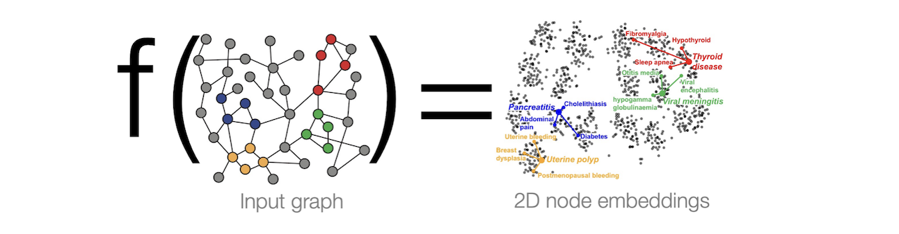

# Graph Neural Network

$\textcolor{red}{NOTE: \ This \ note \ page \ is \ based \ on \ Prof. \ Jure \ Leskovec's \ CS224W \ 'Machine \ Learning \ With \ Graphs' \ lectures.}$

## 1. Node Embedding

Goal: Map nodes to $d$-dimensional embeddings such that similar nodes in the graph are embedded close together 

Tasks we will be able to solve:
1. Node classification: Predict a type of a given node
2. Link prediction: Predict whether two nodes are linked
3. Community detection: Identify densely linked clusters of nodes
4. Network similarity: How similar are two (sub)networks

Modern deep learning toolbox is designed for simple sequences & grids. However a network has an arbitrary size and complex topological structure (i.e., no spatial locality like grids)

###  Naive MLP approach fails for graphs

We cannot naively feed graph into a deep neural net using adjacency matrix and features. Issues with this idea:
1. $O(|V|)$ parameters
2. Not applicable to graphs of different sizes; each graph is a "data point".
3. Sensitive to node ordering. "A->B->C" and "A->C->B" have different adjacency matrix.

## 2. Graph convolutional network

**Idea**: Node’s neighborhood defines a computation graph

### 2.1 Multiple layer deep model

Obtain nodes aggregation information (node embeddings) from their locoal network neighbors using neural networks.

Model can be of **arbitrary** depth:
* Nodes have embeddings at each layer:
* Layer-0 embedding of node $v$ is its **input** feature, $x_v$.
* Layer-k embedding gets information from nodes that are $k$ hops away.

### 2.2 Basic approach for deep model

* Average information from neighbors
* Apply a neural network (Note: $h^k_v$ denotes the hidden representation of node $v$ at layer $k$)

Trainable weight matrices (i.e., what we learn):
* $W_k$: weight matrix for **neighborhood aggregation**.
* $B_k$: weight matrix for transforming hidden vector of node's **itself**.

We can feed these embeddings into any loss function and run SGD to train the weight parameters. 

### 2.3 Train a GNN

Node embedding $z_v$ is a function of input graph:
* Supervised setting: we want to minimize the loss $L$, 
      $$\min_{\Theta}L(y, f(z_v))$$
     * $y$: node label
     * $L$ could be $L_2$ if $y$ is real number, or cross entropy if $y$ is categorical
* Unsupervised setting:
     * No node label available
     * Use the graph structure as the supervision.

#### 2.3.1 Supervised Learning

Directly train the model for a supervised task. e.g., node classification, if the node is safe or toxic drug:

* Use cross entropy loss
$$L = \sum_{v \in V} y_v \log \left( \sigma ( z^T_v \theta ) \right) +  (1 - y_v) \log \left(  1 - \sigma (z^T_v \theta) \right),$$

where $\theta$ is classification weight, $z_v$ is node embedding from encoder output.

### 2.3.2 Unsupervised Learning

## 3. GNN Process

The same aggregation parameters are shared for all nodes. The number of model parameters is sublinear in
$|V|$ and we can generalize to unseen nodes.

### 3.1 A single GNN layer

1. Message: each node compute a message
$$m^{(l)}_u = \textrm{MSG}^{(l)} \left( \bf{h}^{(l-1)}_u \right), \ u \in \lbrace N(v) \cup v\rbrace $$
e.g. a linear layer $\bf{m}^{(l)}_v=\bf{W}^{(l)} \bf{h}^{(l-1)}_v$.

2. Aggregation: aggregate messages from neighbors

$$ \bf{h}^{(l)}_v = \textrm{AGG}^{(l)} \left( \lbrace  \bf{m}^{(l)}_u, u \in  N(v) \rbrace , \bf{m}^{(l)}_v \right),$$
e.g. sum(.), mean(.), max(.) etc aggregator.