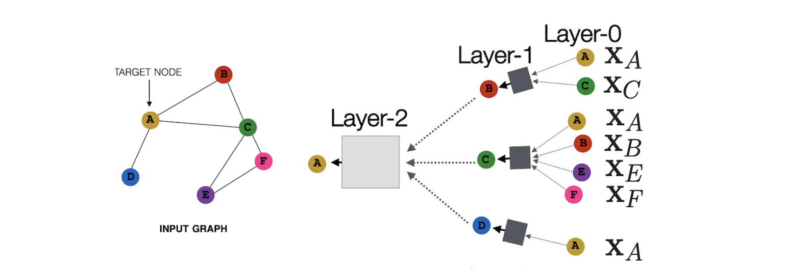

# Graph Neural Network

## Node Embedding

Goal: Map nodes to $d$-dimensional embeddings such that similar nodes in the graph are embedded close together 

Tasks we will be able to solve:
1. Node classification: Predict a type of a given node
2. Link prediction: Predict whether two nodes are linked
3. Community detection: Identify densely linked clusters of nodes
4. Network similarity: How similar are two (sub)networks

Modern deep learning toolbox is designed for simple sequences & grids. However a network has an arbitrary size and complex topological structure (i.e., no spatial locality like grids)

###  Naive MLP approach fails for graphs

We cannot naively feed graph into a deep neural net using adjacency matrix and features. Issues with this idea:
1. $O(|V|)$ parameters
2. Not applicable to graphs of different sizes; each graph is a "data point".
3. Sensitive to node ordering. "A->B->C" and "A->C->B" have different adjacency matrix.

## Graph convolutional network

**Idea**: Node’s neighborhood defines a computation graph

### Multiple Layer Deep Model

Obtain nodes aggregation information (node embeddings) from their locoal network neighbors using neural networks.

Model can be of **arbitrary** depth:
* Nodes have embeddings at each layer:
* Layer-0 embedding of node $v$ is its **input** feature, $x_v$.
* Layer-$k$ embedding gets information from nodes that are $k$ hops away.

Basic approach: 
* Average information from neighbors
* Apply a neural network

