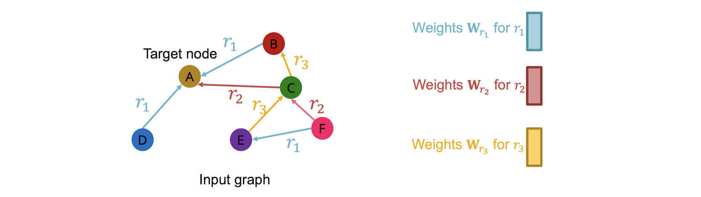

# Heterogeneous & Knowledge Graph

What if the graph has multiple relation types? 

Use different neural network weights for different relation types.

## Relational GCN (RGCN):

$$ \bf{h}^{(k)}_v = \sigma \left( \bf{W}_k \sum_{u \in N(v)} \frac{h^{(k-1)}_u}{|N(v)|} + \bf{B}_k h^{(k-1)}_v  \right),$$

