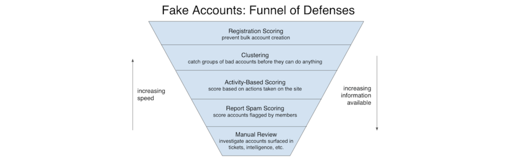
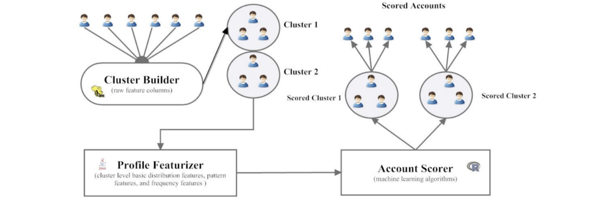

# Anti-Abuse

In social media, fake profiles can be used to carry out many different types of abuse: scraping, spamming, fraud, and phishing, among others. By preventing or promptly removing fake accounts on the site, we ensure that legitimate users are protected.

The challenges are: label, adversarial, trade-off between need to confidently block bad guys as soon as possible, but need more evidence. 

Spam [examples@LinkedIn](https://safety.linkedin.com/identifying-abuse): 

* Unsolicited commercial messages that are irrelevant or appear to have been sent out to a large group of people
* asked to click on an unrecognizable or suspicious link
* ask you for your login information
* a post on the homepage feed, which asks for personal information to get paid or win an item
* someone asking you to contact them outside of social media network.

A set of human-curated words and phrases that violated Terms of Service and Community Guidelines. Cons and solution see [here](https://github.com/HsiangHung/Machine_Learning_Note/tree/master/ML_application/Anti-Abuse#blacklist-of-words-and-phrases).

## Labeling

Options to fix labels (by [Fighting Abuse @ Scale - Jenelle Bray and Carlos Faham, LinkedIn](https://www.facebook.com/atscaleevents/videos/2078887542384339)):
* fix labels manually (not scale)
* fix labels automatically, semi-supervised learning (not trivial, miss new undetected attach pattern)
* fix labels manually in a targetd fashion (review false positive only)

A talk by [Deep Entity Classification: An abusive account detection framework](https://engineering.fb.com/2019/12/13/security/fighting-abuse-scale-2019/):
Use low-precision label to train embedding, and then with high-precision (by human) to train NN or GBDT.

## Metric

by [Fighting Abuse @ Scale - Jenelle Bray and Carlos Faham, LinkedIn](https://www.facebook.com/atscaleevents/videos/2078887542384339):

Online models, online rules, offline models that push restriction, manual restriction

### a. offline

Deploy many models -> each high precision (don't block good people) -> overall high recall

### b. online

* fake account remove percentage
* time-to-restrict
* number of user reports (long-term)
* downstream users' impact (less user dwell time)

## Feature Design

refer to [here](https://www.linkedin.com/pulse/how-easily-spot-fake-linkedin-accounts-melonie-dodaro/):

1. Attributes present at or around registration time — **Profile** Features: duplicate accounts, inaccurate information, fake profiles. e.g. fake photos, incomplete profiles and job titles, connections to all the same or all opposite gender people with fake looking profile pictures, fake name, poor spelling & grammar, suspicious work history. 

2. Attributes that develop over time — Connections with other users in the network, activity or **behaviour** patterns (graph): suspect connection requests, lack of engagement.

### LinkedIn

Over 660 million users, 303 million of whom are active monthly [source](https://venturebeat.com/2020/01/16/linkedin-is-using-ai-to-spot-and-remove-inappropriate-user-accounts/).

[Keeping LinkedIn professional by detecting and removing inappropriate profiles]: https://engineering.linkedin.com/blog/2020/keeping-linkedin-professional
[[Daniel Gorham] Keeping LinkedIn professional by detecting and removing inappropriate profiles](https://engineering.linkedin.com/blog/2020/keeping-linkedin-professional)

[Automated Fake Account Detection at LinkedIn]: https://engineering.linkedin.com/blog/2018/09/automated-fake-account-detection-at-linkedin
[[Jenelle Bray] Automated Fake Account Detection at LinkedIn](https://engineering.linkedin.com/blog/2018/09/automated-fake-account-detection-at-linkedin)

#### Fake account funnel

1. **Registration scoring**: For many types of abuse, attackers require a **large** number of fake accounts for the attack to be financially feasible. Every new user registration attempt is evaluated by a machine-learned model that gives an abuse risk score. Signup attempts with a low abuse risk score are allowed to register right away, while attempts with a high abuse risk score are prevented from creating an account. Attempts with **medium** risk scores are **challenged by our security measures to verify** that they are real people.

2. **Clustering**: Create clusters of accounts by grouping them based on shared attributes, and then find account clusters that show a statistically abnormal distribution of data, which is indicative of being created or controlled by a single bad actor. These are supervised machine learning models that **use features per cluster** instead of per member. The models score the clusters, then propagate the cluster label to individual accounts. This cluster approach allows us to catch more fake accounts quickly, faster than we could if we wait for them to start taking abusive actions on the site (see [here](https://github.com/HsiangHung/Machine_Learning_Note/tree/master/ML_application/Anti-Abuse#clustering) for more details).

3. **Activity-based models**: Our models require more information on these accounts’ **behavior** (types of bad behavior, like send spam inMail, illeagal post) to decide whether they are indeed fake.

4. **Human element**: Members' reports and manual review investigation.

#### Blacklist of words and phrases

A set of human-curated words and phrases that violated Terms of Service and Community Guidelines — to identify and remove potentially fraudulent accounts. However, the list tended to handle context works rather poorly. For instance, while the word “escort” was sometimes associated with prostitution, it was also used in contexts like a “security escort” or “medical escort.”. Blocklists only grow larger over time as more phrases are identified.

Linkedin [[Daniel Gorham]][Keeping LinkedIn professional by detecting and removing inappropriate profiles] identified problematic words responsible for high levels of **false positives** and sampled appropriate accounts from the member base containing these words. The accounts were then manually labeled and added to the training set, after which the model was trained and deployed in production. 

LinkedIn downsampled from the entire member base (660+ million) in order to obtain our “appropriate” labeled accounts to train text classifier. They used CNN to capture data that has “spatial” properties. For example, a CNN can easily learn that while the word “escort” may often be associated with inappropriate content, its meaning changes entirely when it is used in contexts like “security escort” or “medical escort.”

## Clustering 

The blog [[Preeti Hemant]][Detecting Suspicious Accounts in Online Social Networks] implements clustering method to create features, and use the clustering results to labeled individual account. The cluster detection pipeline is as follows (credit from [[Preeti Hemant]][Detecting Suspicious Accounts in Online Social Networks]):

1. **Cluster Builder**: this component takes the raw list of accounts and builds clusters of accounts along with their raw features. Then each individual account can be identified clusters.

2. **Profile Featurizer**: this module converts raw data for each cluster into a single numerical vector representing the cluster, extracting information from the raw features. The features could be

* Basic distribution features — Statistical measures for each column. Mean or quartiles for numerical features, number of unique values for categorial features
* Pattern features — Mapping of user-generated text to a categorical space (e.g. patterns in email addresses)
* Frequency features — Frequency of each feature value over all the individual accounts and their distribution over these frequencies. Clusters of legitimate accounts have some high-frequency and some low-frequency data, clusters of **malicious accounts** however, show **less variance** in their data frequencies.

3. **Account Scorer**: this component assigns the clustering aggregated features to individual account. We then used the generated features plus raw features to train the models and evaluate their performance on previously unseen data.

## Reference

[Detecting Suspicious Accounts in Online Social Networks]: https://towardsdatascience.com/detecting-suspicious-accounts-in-online-social-networks-48eabf4c75b6
[[Preeti Hemant] Detecting Suspicious Accounts in Online Social Networks](https://towardsdatascience.com/detecting-suspicious-accounts-in-online-social-networks-48eabf4c75b6)

