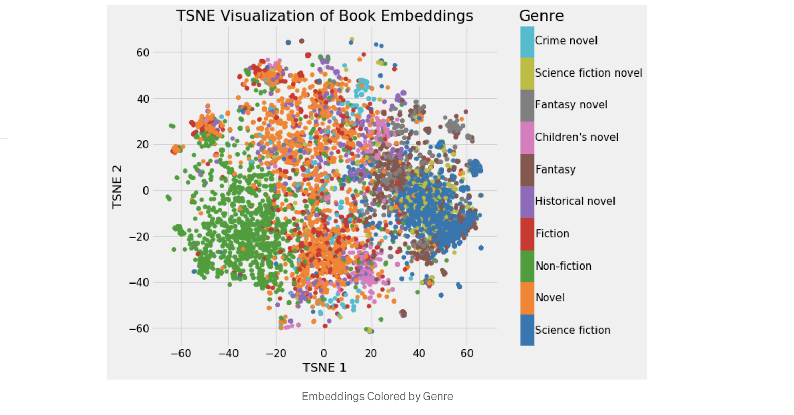

# Embedding 

One notably successful use of deep learning is embedding, a method used to represent discrete variables as continuous vectors, rather than using one-hot encoding [[Will Koehrsen]][Neural Network Embeddings Explained]. The main issue with one-hot encoding is that the transformation does not rely on any supervision. We can greatly improve embeddings by learning them using a neural network on a **supervised** task. 

[Google cloud: Overview: Extracting and serving feature embeddings for machine learning](https://cloud.google.com/solutions/machine-learning/overview-extracting-and-serving-feature-embeddings-for-machine-learning)


Neural network embeddings have 3 primary purposes:

1. Finding nearest neighbors in the embedding space. These can be used to make recommendations based on user interests or cluster categories.
2. As input to a machine learning model for a supervised task. see an article from Google cloud [Overview: Extracting and serving feature embeddings for machine learning](https://cloud.google.com/solutions/machine-learning/overview-extracting-and-serving-feature-embeddings-for-machine-learning).
3. For visualization of concepts and relations between categories.

[[Will Koehrsen]][Neural Network Embeddings Explained]'s article described taking all 37,000 book articles on Wikipedia and represent each one using only 50 numbers in a vector by neural network embeddings. 

For another example, if we have a vocabulary of 50,000 words used in a collection of movie reviews, we could learn **100**-dimensional embeddings for each word trained to predict the sentimentality of the reviews. Words in the vocabulary that are associated with positive reviews such as “brilliant” or “excellent” will come out closer in the embedding space because the network has learned these are both associated with positive reviews.

Figuring out how to create the supervised task to produce relevant representations is the toughest part of making embeddings. 

## An example 

In the Wikipedia book project [[Will Koehrsen]][Neural Network Embeddings Explained], the supervised learning task is set as predicting whether a given link to a Wikipedia page appears in the article for a book. 


The network Will used has **two** parallel embedding layers that **map the book and wikilink** to separate 50-dimensional vectors and a **dot product layer** that combines the embeddings into a single number for a prediction. The embeddings are the parameters, or weights, of the network that are adjusted during training to minimize the loss on the supervised task. The [code](https://github.com/HsiangHung/wikipedia-data-science/blob/master/notebooks/Book%20Recommendation%20System.ipynb) looks like

```Python
# Both inputs are 1-dimensional
book = Input(name = 'book', shape = [1])
link = Input(name = 'link', shape = [1])

embedding_size = 50

# Embedding the book (shape will be (None, 1, 50))
book_embedding = Embedding(name = 'book_embedding',
                           input_dim = len(book_index),
                           output_dim = embedding_size)(book)

# Embedding the link (shape will be (None, 1, 50))
link_embedding = Embedding(name = 'link_embedding',
                           input_dim = len(link_index),
                           output_dim = embedding_size)(link)

# Merge the layers with a dot product along the second axis (shape will be (None, 1, 1))
merged = Dot(name = 'dot_product', normalize = True, axes = 2)([book_embedding, link_embedding])

# Reshape to be a single number (shape will be (None, 1))
merged = Reshape(target_shape = [1])(merged)

# Output neuron
out = Dense(1, activation = 'sigmoid')(merged)
model = Model(inputs = [book, link], outputs = out)

# Minimize binary cross entropy
model.compile(optimizer = 'Adam', loss = 'binary_crossentropy', metrics = ['accuracy'])
```

In the embedding model, what we want is the embedding weights, the representation of the books and links as continuous vectors. The embeddings by themselves are not that interesting: they are simply vectors of numbers. However, we can query a book's vector and find the dot product of all the other books' to compute similarity.

One of the coolest parts about embeddings are that they can be used to visualize using dimension reduction technique to get the dimensions to 2 or 3, i.e. t-Distributed Stochastic Neighbor Embedding (TSNE).

Mapping 50-dimensions embeddings onto 2 dimensions using TSNE, we can visualize 37,000 books as 




We can clearly see groupings of books belonging to the same genre. It’s not perfect, but it’s still impressive that we can represent all books on Wikipedia using just 2 numbers that still capture the variability between genres.


## Reference


[Neural Network Embeddings Explained]: https://towardsdatascience.com/neural-network-embeddings-explained-4d028e6f0526
[[Will Koehrsen] Neural Network Embeddings Explained](https://towardsdatascience.com/neural-network-embeddings-explained-4d028e6f0526)

