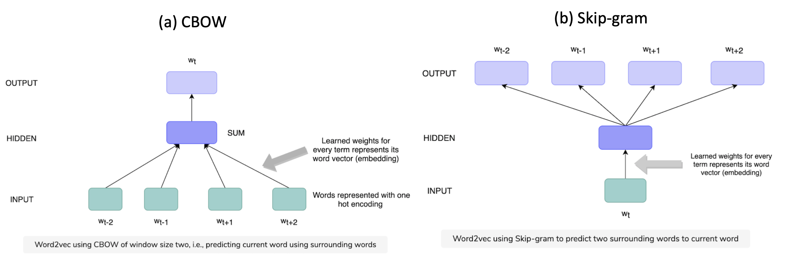

# Embedding 

One notably successful use of deep learning is embedding, a method used to represent categorical variables as continuous vectors, rather than using one-hot encoding and label encoding [[Will Koehrsen]][Neural Network Embeddings Explained], [[Matias Aravena Gamboa]][Learning embeddings for your machine learning model]. 

The main issue with one-hot encoding is that the transformation does not rely on any supervision and cause huge dimensions. The problem with LabelEncoding is that sometimes can bring a natural order on the different classes. We can greatly improve embeddings by learning them using a neural network on a **supervised** task. 


Neural network embeddings have 3 primary purposes:

1. Finding nearest neighbors in the embedding space. These can be used to make recommendations based on user interests or cluster categories.
2. As input to a machine learning model for a supervised task. see an article from Google cloud [Overview: Extracting and serving feature embeddings for machine learning](https://cloud.google.com/solutions/machine-learning/overview-extracting-and-serving-feature-embeddings-for-machine-learning).
3. For visualization of concepts and relations between categories.

[[Will Koehrsen]][Neural Network Embeddings Explained]'s article described taking all 37,000 book articles on Wikipedia and represent each one using only 50 numbers in a vector by neural network embeddings. 

For another example, if we have a vocabulary of 50,000 words used in a collection of movie reviews, we could learn **100**-dimensional embeddings for each word trained to predict the sentimentality of the reviews. Words in the vocabulary that are associated with positive reviews such as “brilliant” or “excellent” will come out closer in the embedding space because the network has learned these are both associated with positive reviews.


Figuring out how to create the supervised task to produce relevant representations is the toughest part of making embeddings. 

### An example 

In the Wikipedia book project [[Will Koehrsen]][Neural Network Embeddings Explained], the supervised learning task is set as predicting whether a given link to a Wikipedia page appears in the article for a book. 


In the network (**two-tower** neural network model), Will used has **two** parallel embedding layers that **map the book and wikilink** to separate 50-dimensional vectors and a **dot product layer** that combines the embeddings into a single number for a prediction. The embeddings are the parameters, or weights, of the network that are adjusted during training to minimize the loss on the supervised task. The [code](https://github.com/HsiangHung/wikipedia-data-science/blob/master/notebooks/Book%20Recommendation%20System.ipynb) looks like

```Python
# Both inputs are 1-dimensional
book = Input(name = 'book', shape = [1])
link = Input(name = 'link', shape = [1])

embedding_size = 50

# Embedding the book (shape will be (None, 1, 50))
book_embedding = Embedding(name = 'book_embedding',
                           input_dim = len(book_index),
                           output_dim = embedding_size)(book)

# Embedding the link (shape will be (None, 1, 50))
link_embedding = Embedding(name = 'link_embedding',
                           input_dim = len(link_index),
                           output_dim = embedding_size)(link)

# Merge the layers with a dot product along the second axis (shape will be (None, 1, 1))
merged = Dot(name = 'dot_product', normalize = True, axes = 2)([book_embedding, link_embedding])

# Reshape to be a single number (shape will be (None, 1))
merged = Reshape(target_shape = [1])(merged)

# Output neuron
out = Dense(1, activation = 'sigmoid')(merged)
model = Model(inputs = [book, link], outputs = out)

# Minimize binary cross entropy
model.compile(optimizer = 'Adam', loss = 'binary_crossentropy', metrics = ['accuracy'])
```

In the embedding model, what we want is the embedding weights, the representation of the books and links as continuous vectors. The embeddings by themselves are not that interesting: they are simply vectors of numbers. However, we can query a book's vector and find the dot product of all the other books' to compute similarity.

One of the coolest parts about embeddings are that they can be used to visualize using dimension reduction technique to get the dimensions to 2 or 3, i.e. t-Distributed Stochastic Neighbor Embedding (TSNE).

Mapping 50-dimensions embeddings onto 2 dimensions using TSNE, we can visualize 37,000 books as 


We can clearly see groupings of books belonging to the same genre. It’s not perfect, but it’s still impressive that we can represent all books on Wikipedia using just 2 numbers that still capture the variability between genres.


For business application, Twitter can build an embedding for their users based on their **organic feed interactions** and then use the embeddings **for ads serving.** Organic interactions are generally much greater in volume compared to ads interactions. This allows Twitter to learn user interests by organic feed interaction, capture it as embedding, and use it to **serve more relevant ads**. 

### a. Word Embedding


Word embeddings (like Word2vec), include 

1. CBOW: Continuous bag of words (CBOW) tries to predict the current word from its surrounding words by optimizing 

<a href="https://www.codecogs.com/eqnedit.php?latex=\textrm{Loss}&space;=&space;-&space;\log&space;\big(p(w_t|w_{t-n},&space;\cdots,&space;w_{t-1},&space;w_{t&plus;1},&space;\cdots,&space;w_{t&plus;n})&space;\big)" target="_blank"></a>

2. Skipgram: In this architecture, we try to predict surrounding words from the current word by optimizing 

<a href="https://www.codecogs.com/eqnedit.php?latex=\textrm{Loss}&space;=&space;-&space;\log&space;\big(p(w_{t-n},&space;\cdots,&space;w_{t-1},&space;w_{t&plus;1},&space;\cdots,&space;w_{t&plus;n}|w_t)&space;\big)" target="_blank"></a>

The architectures look like (credit from [Grokking the Machine Learning Interview: Embedding](https://www.educative.io/courses/grokking-the-machine-learning-interview/B8xpO2XGxXo))



One of the application is that we want to predict whether a user is interested in a particular document given the documents that they have previously read. 

One simple way of doing this is to represent the user by taking the mean of the Word2vec embeddings of document titles that they haved engaged with. Similarly, we can represent the document by the mean of its title term embeddings. We can simply take the dot product of these two vectors and use that in our ML model.

Another way to accomplish this task is to simply pass the user and the document embedding vector to a neural network to help with the learning task.

### b. Context-based embedding

Context-based embeddings look at neighboring terms at embedding generation time. This means that we have to provide contextual information (neighboring terms) to fetch embeddings for a term. In the Word2vec case, we don’t need any context information at the embeddings.

Two popular architectures used to generate word context-based embedding are:

1. Embeddings from **Language Models** (ELMo). The idea behind ELMO is to use the bi-directional LSTM model to capture the words that appear before and after the current word.

2. Bidirectional Encoder Representations from **Transformers (BERT)**. BERT uses an attention mechanism and is able to see all the words in the context.
 
### c. Visual embedding

**Auto-encoders** use neural networks consisting of both an encoder and a decoder; encoder learns to compress the raw image pixel data to a small dimension, whereas decoders decompresses it via a decoder to re-generate the same input image. Once we have trained the model, we only use the encoder (first N network layers) to generate embeddings for images.

CNN builds neural networks using a set of convolution, pooling, and fully connected layers to the softmax layer for the final classification task. It is supervised learning tasks for image classification. We can use the **penultimate layer** value (before softmax captures all image information in a vector) of a pre-trained model as our image embedding.

Applications of image embedding include finding images similar to a given image, or an image search problem where we want to find the best images for given text terms.

### d. Network/Relationship-based embedding

Embedding interactions as relationships in a graph or resulting in pairs. The previous books in wiki and links use the embedding. Other examples are: 

* (User, Pin) for Pinterest
* (User, Video) for YouTube
* (User, Tweet) for Twitter
* (Query, Webpage) for Search
* (Searcher, Webpage) for Search

These embedding tasks can vastly help in the retrieval and ranking tasks of recommendation, search, feed-based, and many other ML systems.

## Reference


[Learning embeddings for your machine learning model]: https://medium.com/spikelab/learning-embeddings-for-your-machine-learning-model-a6cb4bc6542e
[[Matias Aravena Gamboa] Learning embeddings for your machine learning model](https://medium.com/spikelab/learning-embeddings-for-your-machine-learning-model-a6cb4bc6542e)


[Neural Network Embeddings Explained]: https://towardsdatascience.com/neural-network-embeddings-explained-4d028e6f0526
[[Will Koehrsen] Neural Network Embeddings Explained](https://towardsdatascience.com/neural-network-embeddings-explained-4d028e6f0526)

