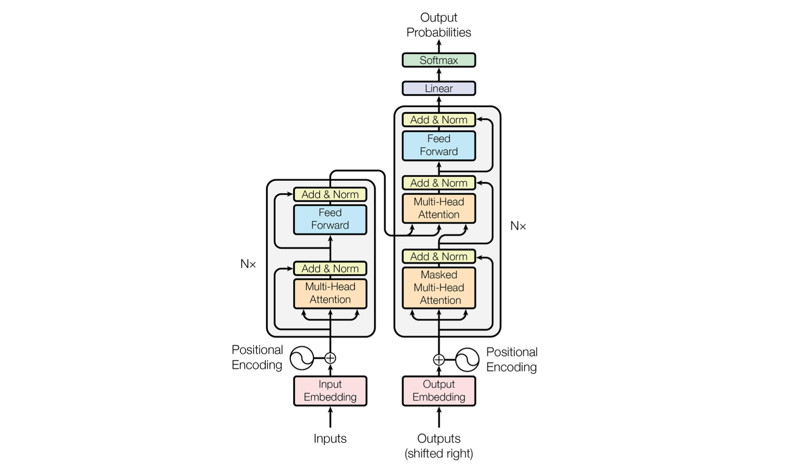

# Large Language Model

## What Was the First Large Language Model?

The first model that really caught people's attention was the GPT (Generative Pre-trained Transformer) model developed by OpenAI in 2018. The well-known ChatGPT is basically GPT-3.5.

The GPT model was one of the first language models to use the **transformer architecture**. This is a type of neural network that's great at understanding **long-range dependencies** in text data, which made it possible for the model to generate highly coherent and contextually relevant language output. With **117 million** parameters, the GPT model was a real game-changer for natural language processing.
Since then, we've seen the development of even larger and more impressive language models, like GPT-2, GPT-3, and BERT. [[Mostafa Ibrahim]][An Overview of Large Language Models (LLMs)]

## How Do Large Language Models Work?

The most well-known Large Language Model (LLM) architecture is the **transformer architecture**. 

A typical Transformer model consists of four main steps [[Mostafa Ibrahim]][An Overview of Large Language Models (LLMs)]:

### 1. Word Embedding 

To give another example, let's consider the words "cat" and "dog". These two words will usually be closer to each other when compared to another pair of words, such as "cat" and "burgers. In word embedding, these words would be represented as vectors that are located close to each other in the vector space.  

Creating word embeddings involves training a neural network on a large corpus of text data, such as news articles or books. During training, the network learns to predict the likelihood of a word appearing in a given context based on the words that come before and after it in a sentence. The vectors that are learned through this process capture the semantic relationships between different words in the corpus.

### 2. Positional Encoding

Positional encoding is all about helping the model figure out where words are in a sequence.  For example, when translating a sentence like "The cat is on the mat" to another language, it's crucial to know that "cat" comes before "mat".

### 3. Transformers

### 4.

* [An Overview of Large Language Models (LLMs)]: https://wandb.ai/mostafaibrahim17/ml-articles/reports/An-Overview-of-Large-Language-Models-LLMs---VmlldzozODA3MzQz
[[Mostafa Ibrahim] An Overview of Large Language Models (LLMs)](https://wandb.ai/mostafaibrahim17/ml-articles/reports/An-Overview-of-Large-Language-Models-LLMs---VmlldzozODA3MzQz)

## LLMs Comparison

* Context Length: Context length refers to the number of tokens a language model can process. The longer the context length, the more information and the richer the context the model has for generating a response [[LinkedIn, Arun Kesavan]][Understanding the Context Length Hitch with GPT Models].

| Model | parameter  | Context Length |  
| --- | --- | --- | 
| ChatGPT |  | 4,096 tokens | 
| GPT4 | | 32,768 tokens |
| Claude (Anthropic AI) | | 100,000 tokens | 
| CodeT5+ (Salesforce)   | | | 
| LLaMa 1 (7B, 13B, 33B, 65B) | | 2,000 tokens | 
| LLaMa 2 (7B, 13B, 34B, 70B) | | 4,000 tokens | 
| Flacon () | |  tokens | 
|Flan-T5 (80M, 250M, 780M, )| | |

* [Understanding the Context Length Hitch with GPT Models]: https://www.linkedin.com/pulse/understanding-context-length-hitch-gpt-models-arun-kesavan/
[[LinkedIn, Arun Kesavan] Understanding the Context Length Hitch with GPT Models](https://www.linkedin.com/pulse/understanding-context-length-hitch-gpt-models-arun-kesavan/)

## Fine-Tuning 

1. **Instruction fine-tuning**: Instruction fine-tuning, where **all** of the model's weights are updated is known as **full fine-tuning**. The process results in a **new version** of the model with **updated weights**. It is important to note that just like pre-training, full fine tuning requires enough memory and compute budget to store and process all the gradients, optimizers and other components that are being updated during training [[Coursera, Generative AI with Large Language Models] ][Week2 Instruction fine-tuning]. 

* [Week2 - Instruction fine-tuning]: https://www.coursera.org/learn/generative-ai-with-llms/lecture/exyNC/instruction-fine-tuning
[[Coursera, Generative AI with Large Language Models] Week2 - Instruction fine-tuning](https://www.coursera.org/learn/generative-ai-with-llms/lecture/exyNC/instruction-fine-tuning)

## LLaMa

LLaMa 2, an updated version of LlaMa 1, trained on a new mix of publicly available data. We also increased the size of the pretraining corpus by 40%, doubled the context length of the model, and adopted grouped-query attention (Ainslie et al., 2023). We are releasing variants of LLaMa 2 with 7B, 13B, and 70B parameters. See [Meta AI page](https://ai.meta.com/llama/)

We can perform inference of LLaMA model in pure C/C++ code. Intsall LLaMa 2 in M1/M2 chip Mac:
* [Tutorial: Install a Chat Large Language Model (LLM) on your M1/M2 Mac](https://www.youtube.com/watch?v=rStOK2FfyEY)
* [How to install LLaMA on Mac (llama.cpp)](https://agi-sphere.com/install-llama-mac/#Step_1_Install_Homebrew)

Fine-tuning on LLaMa 2:

* [Youtube - Tutorial on LLaMa 2 and How to Fine-tune It]: https://www.youtube.com/watch?v=ntJUXgaTJIM
[[Junling Hu] Youtube -  Tutorial on LLaMa 2 and How to Fine-tune It](https://www.youtube.com/watch?v=ntJUXgaTJIM)

