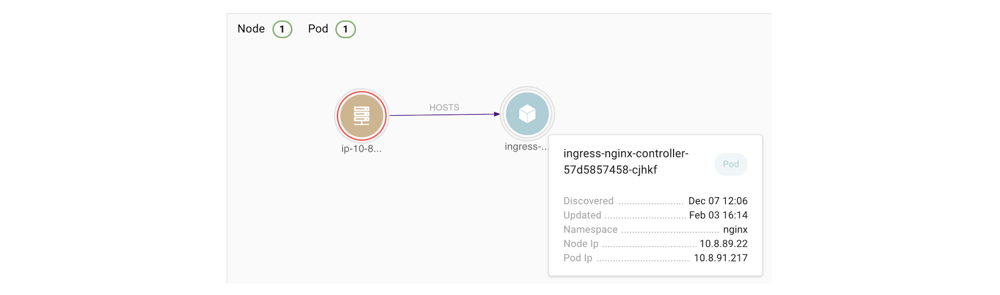
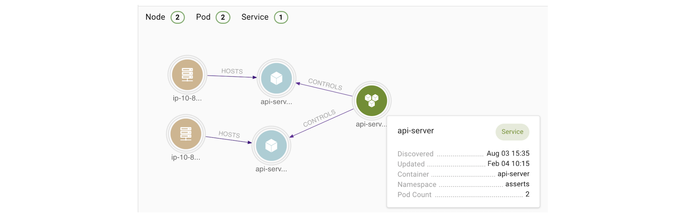

# Observability  

## Monitoring vs Observability

Monitoring is about tools that gather predefined sets of information about the state of each system element, while observability is about solutions that help us explore the monitoring output and discover problems we may not already know.

* [What is Data Observability?]: https://www.youtube.com/watch?v=jfg9wBJBtKk
[[Youtube] What is Data Observability?](https://www.youtube.com/watch?v=jfg9wBJBtKk)

## MELT Data

* [The Three Pillars of Observability]: https://www.oreilly.com/library/view/distributed-systems-observability/9781492033431/ch04.html
[[O'Reilly] The Three Pillars of Observability](https://www.oreilly.com/library/view/distributed-systems-observability/9781492033431/ch04.html)
* [Demystifying M.E.L.T. - the key data for business observability]: https://www.linkedin.com/pulse/demystifying-melt-key-data-business-observability-jillian-macmurchy
[[LinkedIn] Demystifying M.E.L.T. - the key data for business observability](https://www.linkedin.com/pulse/demystifying-melt-key-data-business-observability-jillian-macmurchy)

**Logs**, **metrics**, and **traces** are often known as the three pillars of observability (sometimes we generalize it as MELT, where E is event). While plainly having access to logs, metrics, and traces doesn’t necessarily make systems more observable, these are powerful tools that, if understood well, can unlock the ability to build better systems.

Traces and metrics are an abstraction built on top of logs that pre-process and encode information along two orthogonal axes, one being request-centric (trace), the other being system-centric (metric).

### Event Logs

Logs are important when engineers are in deep debugging mode, trying to understand a problem and troubleshoot code. 

An event log is an immutable, timestamped record of discrete events that happened over time. Event logs in general come in three forms but are fundamentally the same: a timestamp and a payload of some context.

### Metrics
Metrics are a numeric representation of data measured over intervals of time and are better suited to trigger alerts (time-series data). Modern monitoring systems like Prometheus and newer versions of Graphite represent every time series using a metric name as well as additional key-value pairs called labels.

A metric in Prometheus, as shown in Figure 4-1, is identified using both the metric name and the labels. The actual data stored in the time series is called a sample, and it consists of two components: a float64 value and a millisecond precision timestamp.

The biggest drawback with both application logs and application metrics is that they are system scoped, making it hard to understand anything else other than what’s happening inside a particular system. 

### Tracing
A trace is a representation of a series of causally related **distributed** events that encode the end-to-end request flow through a distributed system.

Applications often call multiple other applications depending on the task they’re trying to accomplish, and often process data in parallel. This means the call-chain can be inconsistent and have unreliable timing.

Traces are a representation of logs; the data structure of traces looks almost like that of an event log. A single trace can provide visibility into both the path traversed by a request as well as the structure of a request. The path of a request allows software engineers and SREs to understand the different services involved in the path of a request, and the structure of a request helps one understand the junctures and effects of asynchrony in the execution of a request.

Zipkin and Jaeger are two of the most popular OpenTracing-compliant open source **distributed** tracing solutions. (OpenTracing is a vendor-neutral spec and instrumentation libraries for distributed tracing APIs.)

### Event 
Events are a critical telemetry type for any observability solution. They’re valuable because they can be used to validate the occurrence of a particular action at a particular time and enable a fine-grained analysis in real time. However, events are often overlooked or can be confused with logs. What’s the difference? Events contain a higher level of abstraction than the level of detail provided by logs. **Logs record everything, whereas events are records of selected significant things**.

#### The Challenges of Tracing

Tracing is, by far, the hardest to retrofit into an existing infrastructure, because for tracing to be truly effective, every component in the path of a request needs to be modified to propagate tracing information. 

The second problem with tracing instrumentation is that it’s not sufficient for developers to instrument their code alone.

## Knowledge Graph in Observability

* [Observability Knowledge Graph]: https://www.asserts.ai/blog/observability-knowledge-graph/
[[Jia Xu] Observability Knowledge Graph](https://www.asserts.ai/blog/observability-knowledge-graph/)

In a nutshell, a knowledge graph is a directed labeled graph in which the nodes and edges have well-defined meanings. It’s a graph that uses entities and relationships to encode semantic information about specific topics. There are two popular graph data models: 
* RDF(Subject predicate Object)
* Property Graphs

For example, a node hosting a pod is a minimal property graph, in which there are two types of entities with a set of properties. There is also a “HOSTS” relationship between the Node entity and the Pod entity:

As another example, the following knowledge graph infers that a Node HOSTS a Pod and a Services CONTROLS a Pod:

To be clear, we understand that a graph is not a suitable data structure for encoding time series data. Nor is it practical to represent raw logs or traces. However, if we can extract entities and relationships from these data and form a graph, we can leverage it for the benefit of observability.

* A graph can easily visualize a **system topology** that crosses organizational boundaries.
* A graph can empower search with context, making it easy to explore and navigate all the **software and hardware components** in a cloud-scale application.
* A graph is a good choice for schema-free data integration. We can **define entities on the fly without any schema**. These entities then serve as an abstraction layer upon which we can answer semantic queries that require combining data from multiple sources.
* A graph provides **spatial correlation**, which supplements the temporal correlation and reduces the human cognitive load for troubleshooting.

With a knowledge graph, we can instead place contextualization at the center of observability.
