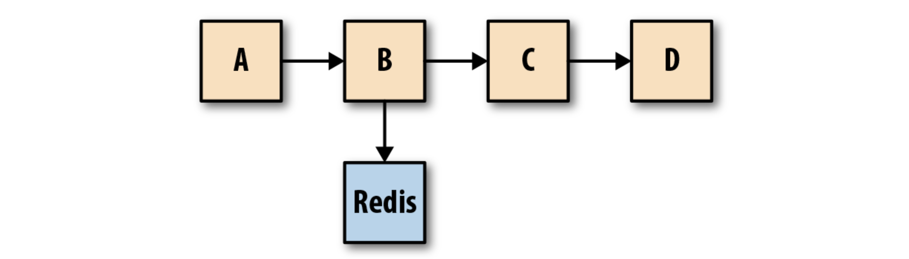
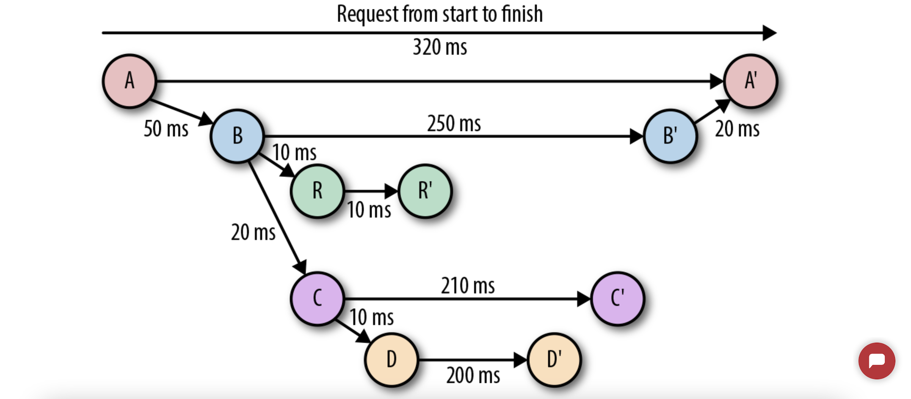

# Observability  

**Logs**, **metrics**, and **traces** are often known as the three pillars of observability (sometimes we generalize it as MELT, where E is event). While plainly having access to logs, metrics, and traces doesn’t necessarily make systems more observable, these are powerful tools that, if understood well, can unlock the ability to build better systems.

Traces and metrics are an abstraction built on top of logs that pre-process and encode information along two orthogonal axes, one being request-centric (trace), the other being system-centric (metric).

### Event Logs
An event log is an immutable, timestamped record of discrete events that happened over time. Event logs in general come in three forms but are fundamentally the same: a timestamp and a payload of some context.

### Metrics
Metrics are a numeric representation of data measured over intervals of time and are better suited to trigger alerts. Modern monitoring systems like Prometheus and newer versions of Graphite represent every time series using a metric name as well as additional key-value pairs called labels.

A metric in Prometheus, as shown in Figure 4-1, is identified using both the metric name and the labels. The actual data stored in the time series is called a sample, and it consists of two components: a float64 value and a millisecond precision timestamp.

The biggest drawback with both application logs and application metrics is that they are system scoped, making it hard to understand anything else other than what’s happening inside a particular system. 

### Tracing
A trace is a representation of a series of causally related distributed events that encode the end-to-end request flow through a distributed system.

Traces are a representation of logs; the data structure of traces looks almost like that of an event log. A single trace can provide visibility into both the path traversed by a request as well as the structure of a request. The path of a request allows software engineers and SREs to understand the different services involved in the path of a request, and the structure of a request helps one understand the junctures and effects of asynchrony in the execution of a request.

Zipkin and Jaeger are two of the most popular OpenTracing-compliant open source distributed tracing solutions. (OpenTracing is a vendor-neutral spec and instrumentation libraries for distributed tracing APIs.)

#### The Challenges of Tracing

Tracing is, by far, the hardest to retrofit into an existing infrastructure, because for tracing to be truly effective, every component in the path of a request needs to be modified to propagate tracing information. 

The second problem with tracing instrumentation is that it’s not sufficient for developers to instrument their code alone. 

* [The Three Pillars of Observability]: https://www.oreilly.com/library/view/distributed-systems-observability/9781492033431/ch04.html
[[O'Reilly] The Three Pillars of Observability](https://www.oreilly.com/library/view/distributed-systems-observability/9781492033431/ch04.html)

