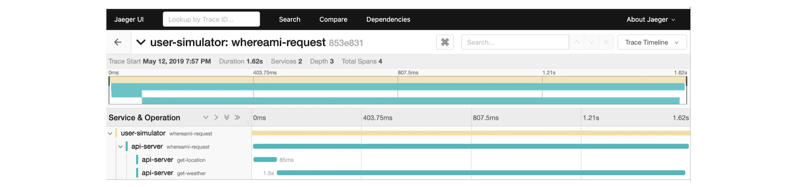

# Microservice Observability and Distributed Traces 

## 1. Business Transaction 

In the AppDynamics application model [[AppDynamics]][Business Transaction@AppDynamics], a business transaction (BT) represents an **end-to-end**, **cross-tier processing path** used to fulfill a request for a service provided by the application. 

It consists of **all** required services within your environment such as login, search, and checkout that are utilized to fulfill and respond to a user-initiated request. These transactions reflect the logical way users interact with your applications. 

For example, activities such as adding an item to a shopping cart and then checking out various applications, databases, third-party APIs, and web services.

In some blogs, we may see people define as transactions. For example, in Uzziah Eyee's blog [[Uzziah Eyee]][Microservices Observability with Distributed Tracing], a **Transaction** is an **end-to-end** request-response flow, i.e from making the user’s initial request to receiving the final weather response. A transaction often involves the interaction of multiple services.

Note, so a BT should be considered by an **end-to-end** request flow, and usually involves multiple services.

Various business customers have various definition on critical business concern. For example, a retail website may choose to focus on its **checkout** or **catalog** operation; whereas a financial services firms may focus on the **most-used APIs** provided for their mobile clients. By prioritizing your business goals early in the process, BTs are much easier to configure [[AppDynamics]][Business Transaction@AppDynamics].

**AppDynamics automatically discovers and maps business transactions for you**. For example, a business activity, such as `Add to Cart`, is tagged and traced across every component of your application and visualized on a topology map, helping you to better understand performance across an **entire application**. From a BT, we can identify:
* If there is a performance issue with a **service endpoint**
* Is the Edge service at fault? 
* If not, then identify which **downstream service** may be at fault?

### 1.1 Transaction entry and exit points

Typically, more than one tier participates in the processing of a BT. Outbound requests from an instrumented application tier are called **exit points**. Downstream tiers may, in turn, have exit points that invoke other services or backend requests (see [View Business Transactions@Appdynamics](https://docs.appdynamics.com/appd/22.x/22.3/en/application-monitoring/business-transactions/view-business-transactions)). 

App agents tag exit point calls with metadata describing the existing transaction. When an agent on a downstream tier detects an entry point that includes transaction metadata from another AppDynamics app agent, it treats the entry point as a continuation of the transaction initiated on the **upstream** tier. 

This linking of upstream exit points to downstream entry points is called **correlation**. Correlation maintains the client request context as it is processed by various tiers in your business application.

### 1.2 Sample BTs

As the first example, AppD has the fictional ACME online application exposes a **checkout** service at `http://acmeonline.example.com/checkout`, and a user request to the service triggers these distributed processing flow and actions [[AppDynamics]][Business Transaction@AppDynamics]:

1. The BT **entry point** at the originating tier is `/checkout` URI, which is mapped to a Servlet called `CheckoutServlet.`
2. The request results in the originating tier invoking the `createOrder` method on a downstream tier, the `ECommerce-Services` server.
3. The inventory tier application calls a **backend database**, which is an **exit point** for the BT. The request context is maintained across tiers, including calls to backend tiers.
4. Any user request on the entry point is similarly categorized as this `Checkout` BT. 

As the second example, another app enables a user to request weather information about their location [[Uzziah Eyee]][Microservices Observability with Distributed Tracing]:

1. First the request is handled by an api-service which translates the user’s **IP address** to a city name using a 3rd party `ip-service`. 
2. Then, it obtains the latest weather information for that city from another 3rd party `weather-service`. 
3. Finally, the weather information is returned to the user.

### Reference

* [Business Transaction@AppDynamics]: https://docs.appdynamics.com/appd/22.x/22.3/en/application-monitoring/business-transactions
[[AppDynamics] Business Transaction@AppDynamics](https://docs.appdynamics.com/appd/22.x/22.3/en/application-monitoring/business-transactions)

* [Microservices Observability with Distributed Tracing]: https://medium.com/swlh/microservices-observability-with-distributed-tracing-32ae467bb72a
[[Uzziah Eyee] Microservices Observability with Distributed Tracing](https://medium.com/swlh/microservices-observability-with-distributed-tracing-32ae467bb72a)

## 2. Distributed Trace

### 2.1 BTs and Traces

A BT can be recorded in a trace. It captures the work done by each service as a collection of Spans all sharing the same Trace ID. More granular **operations of a service** can be captured as Children Spans which have a `childOf` reference pointing to their parent Span. Hence the tuple (`TraceID`, `SpanID`, `ParentID`) sufficiently describes a Span’s position in a Trace so this is called the SpanContext [[Uzziah Eyee]][Microservices Observability with Distributed Tracing].

OpenTelemetry, is a widely popular observability framework for cloud-native software to distributed tracing. Currently, organizations can use OpenTelemetry to send collected telemetry data to a third-party system for analysis. By running [opentelemetry-demo repo](https://github.com/open-telemetry/opentelemetry-demo) repo (using docker), **Jaeger** provides a UI to visualize collected trace data in the backend. 

Using the above ip-weather api service, the Jaeger UI can visualize a trace as follows [[Uzziah Eyee]][Microservices Observability with Distributed Tracing]:

A recent global survey of 700 CIOs found that 86% of companies are now using cloud-native technologies and platforms, such as Kubernetes, microservices, and containers. With the rise of service-oriented architectures, however, it became harder to understand how specific transactions traveled through the various tiers of an application. If the organization was unable to identify the affected microservice, then it could not determine which team was responsible for addressing the issue [[Dynatrace]][What is distributed tracing and why does it matter?].

Distributed tracing now meets this need, allowing companies to better understand the performance issues affecting their microservices environments.

### 2.2 The difference between distributed tracing and logging

Before the advent of containers, Kubernetes, and microservices, gaining visibility into monolithic systems was simple. However, in distributed environment, distributed tracing provides comprehensive visibility into application performance across microservices and containers.

Log aggregation may give a snapshot of the activity within a collection of individual services, but the logs lack contextual metadata to provide the full picture of a request as it travels downstream through possibly millions of application dependencies. On its own, this method simply isn’t sufficient for troubleshooting in distributed systems.[[Dynatrace]][What is distributed tracing and why does it matter?]

In comparison, distributed tracing is the process of following a single transaction from endpoint to endpoint in context. 

### Reference

* [What is distributed tracing and why does it matter?]: https://www.dynatrace.com/news/blog/what-is-distributed-tracing/
[[Dynatrace] What is distributed tracing and why does it matter?](https://www.dynatrace.com/news/blog/what-is-distributed-tracing/)

* [Microservices Observability with Distributed Tracing]: https://medium.com/swlh/microservices-observability-with-distributed-tracing-32ae467bb72a
[[Uzziah Eyee] Microservices Observability with Distributed Tracing](https://medium.com/swlh/microservices-observability-with-distributed-tracing-32ae467bb72a)

## 3. Root Cause Analysis Using Traces

## 3.1 Troubleshoot BT Performance with Transaction Snapshots

[Troubleshoot Business Transaction Performance with Transaction Snapshots@Appdynamics](https://docs.appdynamics.com/appd/22.x/22.3/en/application-monitoring/business-transactions/troubleshoot-business-transaction-performance-with-transaction-snapshots)

AppDynamics monitors every execution of a business transaction in the instrumented environment, and the metrics reflect all such executions. For troubleshooting purposes, AppDynamics takes **snapshots** of specific instances of a transaction. A transaction snapshot gives you a **cross-tier view** of the processing flow for a single invocation of a transaction.

**Call drill downs** detail key information including **slowest methods**, **errors**, and **remote service calls** for the transaction execution on a tier. A drill down may include a partial or complete **call graph**. Call graphs reflect the code-level view of the processing of the BT on a particular tier. 

## Service Triage on BT and RCA

To conduct service triage on performance anomalies, you must first identify the root cause of the problem. 

## Reference

* [Business Transaction@AppDynamics]: https://docs.appdynamics.com/appd/22.x/22.3/en/application-monitoring/business-transactions
[[AppDynamics] Business Transaction@AppDynamics](https://docs.appdynamics.com/appd/22.x/22.3/en/application-monitoring/business-transactions)

* [What is distributed tracing and why does it matter?]: https://www.dynatrace.com/news/blog/what-is-distributed-tracing/
[[Dynatrace] What is distributed tracing and why does it matter?](https://www.dynatrace.com/news/blog/what-is-distributed-tracing/)

* [Microservices Observability with Distributed Tracing]: https://medium.com/swlh/microservices-observability-with-distributed-tracing-32ae467bb72a
[[Uzziah Eyee] Microservices Observability with Distributed Tracing](https://medium.com/swlh/microservices-observability-with-distributed-tracing-32ae467bb72a)

