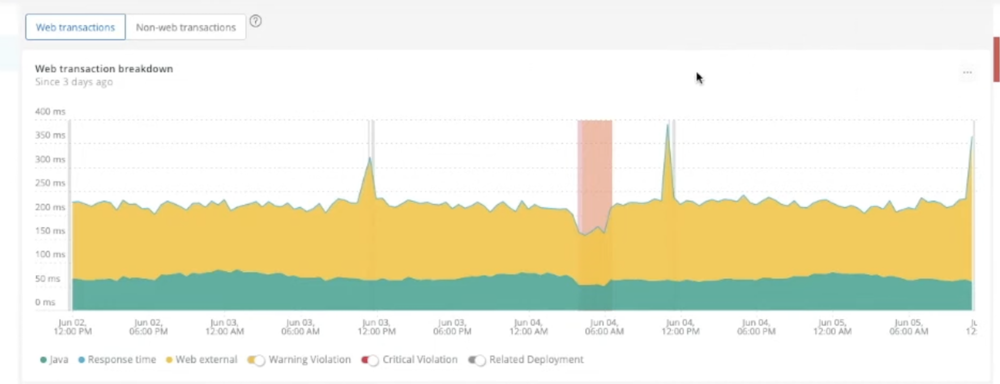

# Root Cause Analysis

RCA provides a systematic analysis process to identify problems within complex modern infrastructures accurately and quickly. It can also help with risk management and significantly reduce costs by helping teams identify the root of the problem before they have a domino impact on the system. [What Is Root Cause Analysis (RCA)?](https://www.splunk.com/en_us/data-insider/what-is-root-cause-analysis.html?utm_campaign=google_amer_en_search_generic_dynamic_audienceonly&utm_source=google&utm_medium=cpc&utm_content=dynamic_search&utm_term=&_bk=&_bt=641457582643&_bm=&_bn=g&_bg=144996249792&device=c&gclid=Cj0KCQiAn4SeBhCwARIsANeF9DI_vnK4iRxCFDv9aXEZe0qhcfzCLrFqrshSJqkxxbSqaG7_D78viBoaAvHWEALw_wcB)

## Root Cause Analysis (RCA) Process

In the following, we use an example from **New Relic** platform to show how to use distributed traces for troubleshooting. For reference, see:
* [New Relic:Backend Root Cause Analysis with Distributed Tracing](https://www.youtube.com/watch?v=r9ImAQ5J5h4)

### Use case

Say, we got our customers' complaint, the checkout services sometimes have high latency. We are going to have root cause analysis where is wrong.

1. Fetch the response time data in the past three days. Big spikes indicate high response time.

2. To further investigate, narrow down the anomaly spikes.

3. Inidcate separate transaction types contributing to the response time.

Then we can select the distributed traces corresponding to the api.

4. Now in the trace summary page. The upper plot shows distributed traces from service A to service Z during the time. We can select one of traces which has high latency:

5. This shows a trace. There are three services in the trace, and the most significant latency happens in "Getplan" service.

6. Further jump to spans. We can see the MySQL query spent majority times; and further look up what hostname is

