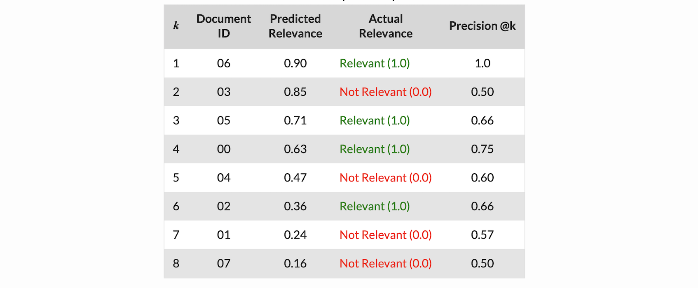

# Search Engine Optimization (SEO)

## Learning to Rank

Learning to Rank (LTR) is a class of techniques that apply supervised machine learning (ML) to solve ranking problems. The main difference between LTR and traditional supervised ML is explained by [Nikhil Dandekar](https://medium.com/@nikhilbd/intuitive-explanation-of-learning-to-rank-and-ranknet-lambdarank-and-lambdamart-fe1e17fac418):

* Traditional ML solves a prediction problem (classification or regression) on a single instance at a time. E.g. if you are doing spam detection on email, you will look at all the features associated with that email and classify it as spam or not. The aim of traditional ML is to come up with a class (spam or no-spam) or a single numerical score for that instance.
* LTR solves a ranking problem on a list of items. The aim of LTR is to come up with optimal ordering of those items. As such, LTR doesn't care much about the exact score that each item gets, but cares more about the relative ordering among all the items.

The most common application of LTR is search engine ranking. 


## LTR Models

The LTR models can be categorized as Pointwise, Pairwise and Listwise.


### A. RankNet

By the [Chris Burges' paper](https://www.microsoft.com/en-us/research/uploads/prod/2016/02/MSR-TR-2010-82.pdf), ranknet is a neural network model to optimize the following cross entropy:

<a href="https://www.codecogs.com/eqnedit.php?latex=C&space;=&space;-\bar{P}_{ij}\log{P_{ij}}-(1-\bar{P}_{ij})\log(1-P_{ij})" target="_blank"></a>

where P_ij is the **learned** probability of document di ranks higher than document dj, and \bar{P}_ij is the **known** probability di should be ranked higher than dj from training data.

During the RankNet training procedure, it was discovered that costs are not required to perform ranking. The only major requirement is the gradients (`λ`) of the cost with respect to the model score [[Educative-1]][What is Lambda rank?]. 

### B. LambdaNet
Two important enhancements have been achieved from RankNet to LambdaNet, see [note](https://everdark.github.io/k9/notebooks/ml/learning_to_rank/learning_to_rank.html#RankNet):

1. Training speed-up thanks to factorization of gradient calculation:

<a href="https://www.codecogs.com/eqnedit.php?latex=w_k&space;\to&space;w_k&space;&plus;\delta&space;w_k;&space;\&space;\delta&space;w_k&space;=&space;-\alpha&space;\sum_i&space;\lambda_i&space;\frac{\partial&space;s_i}{\partial&space;w_k}{}" target="_blank"></a>

2. Optimization towards a ranking metric (using NDCG):

<a href="https://www.codecogs.com/eqnedit.php?latex=\lambda_{ij}&space;=&space;\frac{\partial&space;C(s_i,&space;s_j)}{\partial&space;s_i}&space;=&space;\frac{-\sigma}{1&plus;e^{\sigma(s_i-s_j)}}|\Delta_{\textrm{NDCG}}|" target="_blank"></a>

Therefore, LambdaRank uses the idea of a new cost function for training a RankNet. This improves the RankNet by increasing the speed and accuracy of RankNet over experimental datasets[[Educative-1]][What is Lambda rank?].

### C. LambdaMART
LambdaMART is simply a LambdaNet but replaces the underlying neural network model with gradient boosting regression trees, see [note](https://everdark.github.io/k9/notebooks/ml/learning_to_rank/learning_to_rank.html#RankNet). [[Educative-2]][What is LambdaMART?]


[What is Lambda rank?]: https://www.educative.io/edpresso/what-is-lambda-rank
[[Educative-1] What is Lambda rank?](https://www.educative.io/edpresso/what-is-lambda-rank)

[What is LambdaMART?]: https://www.educative.io/edpresso/what-is-lambdamart
[[Educative-2] What is LambdaMART?](https://www.educative.io/edpresso/what-is-lambdamart)


## Data to Prepare

Most major search engines have a human-powered relevance measurement system which acts as an oracle for completeness and correctness. It also lets you measure how good you are relative to your competitors [[Quroa: How does Google measure the quality of their search results?]][How does Google measure the quality of their search results?]

1. Generate a sample of a few thousand search queries
2. Issue those search queries on your search engine 
3. Train a set of human raters to rate the quality of these results. 
4. Repeat the "extract results - rate results" step 

[How does Google measure the quality of their search results?]: https://www.quora.com/How-does-Google-measure-the-quality-of-their-search-results
[[Quroa: How does Google measure the quality of their search results?] How does Google measure the quality of their search results?](https://www.quora.com/How-does-Google-measure-the-quality-of-their-search-results)


## Metric to Evaluate 

A decent metric that captures this notion of correct order is the count of inversions in your ranking, the number of times a lower-rated result appears above a higher-rated one. 

### A. Mean reciprocal rank (MRR)

The mean reciprocal rank is the average of the reciprocal ranks of results for a sample of queries Q [[wiki: Mean reciprocal rank]](https://en.wikipedia.org/wiki/Mean_reciprocal_rank):

<a href="https://www.codecogs.com/eqnedit.php?latex=\textrm{MRR}&space;=&space;\frac{1}{|Q|}\sum^{|Q|}_{i=1}\frac{1}{\textrm{rank}_i}" target="_blank"></a>

where `rank_i` refers to the rank position of the **first** relevant document for the i-th query.

**Larger MRR better SEO**, and if none of the proposed results are correct, reciprocal rank is 0. 

Note that only the rank of the **first relevant answer** is considered, possible further relevant answers are ignored. If users are interested also in further relevant items, **mean average precision** is a potential alternative metric.

#### Example 1

For example, suppose we have the following three sample queries for a system that tries to translate English words to their plurals. In each case, the system makes three guesses, with the first one being the one it thinks is most likely correct  [[wiki: Mean reciprocal rank]](https://en.wikipedia.org/wiki/Mean_reciprocal_rank):

```
| Query |   Proposed Results   | Correct | Rank | Reciprocal rank
|  cat  |  catten, cati, cats  |   cats  |   3  |     1/3
| tori  | torii, tori, toruses |   tori  |   2  |     1/2
| virus | viruses, virii, viri | viruses |   1  |      1
```
Given those three samples, we could calculate the MRR as (1/3 + 1/2 + 1)/3 = 11/18 or about 0.61.

#### Example 2

If our search engine works perfectly, we will have 
```
| Query |   Proposed Results   | Correct | Rank | Reciprocal rank
|  cat  |  cats, catten, cati  |   cats  |   1  |      1
| tori  | tori, torii, toruses |   tori  |   1  |      1
| virus | viruses, virii, viri | viruses |   1  |      1
```
then the MRR = (1 + 1 + 1)/3 = 1. 


### B. Mean average precision (MAP)

Given a precision-recall curve, plotting precision `P(r)` as a function of recall `r`, average precision computes the average value of `p(r)` over the interval from `r=0` to `r=1` [[wiki: Mean average precision]][ Mean average precision]:

<a href="https://www.codecogs.com/eqnedit.php?latex=\textrm{AveP(q)}&space;=&space;\int^1_0&space;p(r)&space;dr" target="_blank"></a>

In the information retrieval, precision has different definitions. As defined by Wiki, precision is defined as the ratio of the retrived documents that are relevant to user’s query over the retrieved documents.

Mean average precision for a set of queries is the mean of the average precision scores for each query.

<a href="https://www.codecogs.com/eqnedit.php?latex=\textrm{MAP}&space;=&space;\frac{\sum^Q_{q=1}\textrm{AveP(q)}}{Q}" target="_blank"></a>

where Q is the number of queries.

#### Example B.1

supposed given a query, we have the following rank result (credit from [[Felipe Almeida]][Evaluation Metrics for Ranking problems: Introduction and Examples]):



The document labeled with green is relevant to query; we can regard as positives. Red ones regard as negatives. Then we have precision and recall are
```
Precision @1 = 1/(1+0) = 1;    Recall @1 = 1/(1+3) = 0.25.
Precision @3 = 2/(2+1) = 0.66; Recall @3 = 2/(2+2) = 0.5.
Precision @4 = 3/(3+1) = 0.75; Recall @4 = 3/(3+1) = 0.75.
Precision @8 = 4/(4+4) = 0.5;  Recall @8 = 4/(4+0) = 1.
```
Average Precision can be computed using

<a href="https://www.codecogs.com/eqnedit.php?latex=\textrm{AveP(q)}&space;=&space;\sum_k&space;\big(&space;\textrm{Recall}@k&space;-&space;\textrm{Recall}@(k-1)&space;\big)*&space;\textrm{Precision}@k" target="_blank"></a>

The article [[Felipe Almeida]][Evaluation Metrics for Ranking problems: Introduction and Examples] used the algrithm to calculate averge precision:
```Python
if document@rank k is relevant:
    correctPrediction += 1
    runningSum += correctPrediction/k

AP@k = runnungSum@k/CorrectPrediction@k
```
using the above, we have
```
At rank 1: RunningSum = 0 + 1/1 = 1; correctPrediciton = 1; AP@1 = 1
At rank 2: No change. wrong prediction.           
At rank 3: RunningSum = 1 + 2/3 = 1.8; correctPrediciton = 2; AP@3 = 1.8/2 = 0.9
At rank 4: RunningSum = 1.8 + 3/4 = 2.55; correctPrediciton = 3; AP@4 = 2.55/3 = 0.83
At rank 5: No change, wrong prediction.
At rank 6: RunningSum = 2.55 + 4/6 = 3.22; correctPrediciton = 4; AP@6 = 3.22/4 = 0.8
At rank 7: No change, wrong prediction.
At rank 8: No change, wrong prediction.
```
AP (Average Precision) is a metric that tells you how a single sorted prediction compares with the ground truth. MAP is to evaluate on a whole validation set, and defines as the sum the AP value for each example in a validation dataset and then divide by the number of examples (1 + 1 + 0.9 + 0.83 + 0.83 + 0.8 + ..)/8=0.97.

#### Example B.2

Suppose our SEO is perfect, i.e. all relevant documents rank the top 4, then we have 
```
At rank 1: RunningSum = 0 + 1/1 = 1; correctPrediciton = 1; AP@1 = 1
At rank 2: RunningSum = 1 + 2/2 = 2; correctPrediciton = 2; AP@2 = 1
At rank 3: RunningSum = 2 + 3/3 = 3; correctPrediciton = 3; AP@3 = 1
At rank 4: RunningSum = 3 + 4/4 = 4; correctPrediciton = 4; AP@4 = 1
At rank 5: No change, wrong prediction.
At rank 6: No change, wrong prediction.
At rank 7: No change, wrong prediction.
At rank 8: No change, wrong prediction.
```
then the MAP is given by 1.

#### Example B.3

The average precision given a query q @k items can be also written as [[Kyle Chung]][Introduction to Learning to Rank]

<a href="https://www.codecogs.com/eqnedit.php?latex=\textrm{AveP(q)}&space;=&space;\frac{1}{\sum^k_{i=1}r_i}\sum^k_{i=1}\textrm{Precision}@i(q)\times&space;r_i" target="_blank"></a>

Assuming we have two queries q1, q2 and have the following rank by model:

* q1 -> d1, d2
* q2 -> d3, d4, d5

and assuming only d2,d3,d5 are relevant document given their corresponding query. Then MAP is 

* AP of query 1: (1/1) × ((0/1)×0 + (1/2)×1)=1/2
* AP of query 2: (1/2) × ((1/1)×1 + (1/2)×0 + (2/3)×1)=5/6
* MAP: (1/2+5/6)/2≈67%

### C. Discounted cumulative gain (DCG)

Therefore, a pairwise error at positions 1 and 2 is much more severe than an error at positions 9 and 10, all other things being equal. Our algorithm needs to factor this potential gain (or loss) in DCG for each of the result pairs.

One advantage of DCG over other metrics is that it also works if document relevances are a real number. In other words, when each document is not simply relevant/non-relevant (as in the example), but has a relevance score instead [[Felipe Almeida]][Evaluation Metrics for Ranking problems: Introduction and Examples], [[Pranay Chandekar]][Evaluate your Recommendation Engine using NDCG].

<a href="https://www.codecogs.com/eqnedit.php?latex=\textrm{DCG@k}&space;=&space;\sum^k_{i=1}&space;\frac{2^{rel_i}-1}{\log(i&plus;1)}" target="_blank"></a>


Not all pairwise errors are created equal. Because we use DCG as our scoring function, it is critical that the algorithm gets the top results right. Therefore, a pairwise error at positions 1 and 2 is much more severe than an error at positions 9 and 10, all other things being equal. Our algorithm needs to factor this potential gain (or loss) in DCG for each of the result pairs.


**Higher** DCG, better IR. [[Pranay Chandekar]][Evaluate your Recommendation Engine using NDCG].

#### Example 


```
At rank 1: rel_1 = 1; DCG@1 = 1
At rank 2: No change. wrong prediction.
At rank 3: rel_3 = 1; DCG@3 = DCG@2 + 1/log(1+3) = 1 + 1/2 = 1.5.
At rank 4: rel_4 = 1; DCG@4 = DCG@3 + 1/log(1+4) = 1.93.
At rank 5: No change, wrong prediction.
At rank 6: rel_6 = 1; DCG@6 = DCG@5 + 1/log(1+6) = 2.29.
At rank 7: No change, wrong prediction.
At rank 8: No change, wrong prediction.
```

### D. Normalized Discounted Cumulative Gain (NDCG)

A way to make comparison across queries fairer is to normalize the DCG score by the maximum possible DCG at each threshold [[Felipe Almeida]][Evaluation Metrics for Ranking problems: Introduction and Examples], [[Pranay Chandekar]][Evaluate your Recommendation Engine using NDCG]

```
NDCG@k = DCG@k/IDCG@k
```


Where IDCG@k is the best possible value for DCG@k, i.e. the value of DCG for the best possible ranking of relevant documents at threshold k. 

**Note that in a perfect ranking algorithm, the DCG@k will be the same as the IDCG@p producing an nDCG = 1.0.**

#### Example D.1


The IDCG@k are (by perfect ranking):
```
At rank 1: rel_1 = 1; IDCG@1 = 1
At rank 2: rel_2 = 1; IDCG@2 = IDCG@1 + 1/log(1+2) = 1 + 0.63 = 1.63
At rank 3: rel_3 = 1; IDCG@3 = IDCG@2 + 1/log(1+3) = 1.63 + 1/2 = 2.13
At rank 4: rel_4 = 1; IDCG@4 = IDCG@3 + 1/log(1+4) = 2.13 + 0.43 = 2.56
rank 5- rank 8: IDCG are same since the perfect rank is that top 4 rank documents are all relevant.
```
#### Example D.2

* q1 -> d1, d2
* q2 -> d3, d4, d5
 
Assuming only d2,d3,d5 are relevant document given their corresponding query, and the document ranks are by model [[Kyle Chung]][Introduction to Learning to Rank]:

NDCG of q1:

<a href="https://www.codecogs.com/eqnedit.php?latex=\frac{0&plus;\frac{2^1-1}{\log_2{3}}}{\frac{2^1-1}{\log_2{2}}&plus;0}&space;=&space;\frac{1}{\log_2{3}}&space;=&space;0.631" target="_blank"></a>


NDCG of q2:

<a href="https://www.codecogs.com/eqnedit.php?latex=\frac{\frac{2^1-1}{\log_2{2}}&plus;0&plus;\frac{2^1-1}{\log_2{4}}}{\frac{2^1-1}{\log_2{2}}&plus;\frac{2^1-1}{\log_2{3}}&plus;0}&space;=&space;\frac{1.5}{1&plus;\frac{1}{\log_2{3}}}&space;=&space;0.92" target="_blank"></a>


### Reference

[Evaluation Metrics for Ranking problems: Introduction and Examples]: https://queirozf.com/entries/evaluation-metrics-for-ranking-problems-introduction-and-examples
[[Felipe Almeida] Evaluation Metrics for Ranking problems: Introduction and Examples](https://queirozf.com/entries/evaluation-metrics-for-ranking-problems-introduction-and-examples)


[Introduction to Learning to Rank]: https://everdark.github.io/k9/notebooks/ml/learning_to_rank/learning_to_rank.html#A-Digression:-What-is-Machine-Learning?
[[Kyle Chung] Introduction to Learning to Rank](https://everdark.github.io/k9/notebooks/ml/learning_to_rank/learning_to_rank.html#A-Digression:-What-is-Machine-Learning?)


[Evaluate your Recommendation Engine using NDCG]: https://towardsdatascience.com/evaluate-your-recommendation-engine-using-ndcg-759a851452d1
[[Pranay Chandekar] Evaluate your Recommendation Engine using NDCG](https://towardsdatascience.com/evaluate-your-recommendation-engine-using-ndcg-759a851452d1)


[Mean average precision]: https://en.wikipedia.org/wiki/Evaluation_measures_(information_retrieval)#Mean_average_precision
[[wiki: Mean average precision] Mean average precision](https://en.wikipedia.org/wiki/Evaluation_measures_(information_retrieval)#Mean_average_precision)


[Mean reciprocal rank]: https://en.wikipedia.org/wiki/Mean_reciprocal_rank
[[wiki: Mean reciprocal rank] Mean reciprocal rank](https://en.wikipedia.org/wiki/Mean_reciprocal_rank)


## A/B Testing for Search

There’s no single way to perform A/B testing for search. You have to decide whether the test will compare **click-through rate** (CTR), **mean reciprocal rank** (MRR) of clicks, **conversion rate**, **revenue**, or some other search success metric. You also have to determine how long to run each test, considering not only the need to establish statistical significance but also the possibility of a novelty effect. A/B testing search isn’t just a switch that you flip on — it’s a science [[Daniel Tunkelang]][A/B Testing for Search is Different].

A/B tests randomly assign users to treatment groups and compare the performance of the groups. But A/B tests for search have an important nuance: not all search queries are affected by the test. As we just discussed, some of the highest-ROI work on improving search succeeds by targeting only a small fraction of search queries.

To make this nuance concrete, let’s consider an A/B test that targets 10% of search queries with the goal of achieving a 5% conversion lift for those queries. That would translate into an overall 0.5% conversion lift for the site. A 0.5% conversion lift may not sound like a lot, but for a major retailer that translates into millions of dollars a year.

As we discussed earlier, the size of the improvement target determines how long the test has to run before you can evaluate its success with statistical significance. In our example, **establishing whether a test achieves a 5% conversion lift on 10% of queries takes far less time than establishing whether the test achieves a a 0.5% conversion lift on 100% of queries** — days as opposed to months. You can explore these numbers yourself using a nifty [online A/B testing calculator](https://vwo.com/tools/ab-test-duration-calculator/).


### Reference

[A/B Testing for Search is Different]: https://dtunkelang.medium.com/a-b-testing-for-search-is-different-f6b0f6f4d0f5
[[Daniel Tunkelang] A/B Testing for Search is Different](https://dtunkelang.medium.com/a-b-testing-for-search-is-different-f6b0f6f4d0f5)


## Amazon 

A talk from A9 search team by [Daria Sorokina - Amazon Search: The Joy of Ranking Products](https://www.youtube.com/watch?v=NLrhmn-EZ88&list=PLCsjIud8mFqzb_FAWTL9ewiNWHvNoDigM) in MLconf SF 2016 conference.

Set up your products for visibility and sales in Amazon wesbite search [[George Nguyen]][Amazon’s A9 product ranking algorithm: Your guide to Amazon SEO for maximum visibility], [[Chris Dunne]][Everything You Need To Know About Amazon’s A9 Algorithm]:
* Product detail page - keyword research is harvesting your advertising; include as many keywords as possible in product listing (namely, the title and bullet points).
* Product images & video -  Show your product from different angles and have a high enough resolution that shoppers can zoom in to thoroughly examine it.
* EBC/A+ EMC content - content formats may increase your sales by as much as 10%
* Price
* Availability
* Ratings and reviews - take care customer's bad reviews if needed. Amazon also rewards sellers that prioritize customer service
* Advertisements - Buying ads will not inherently boost your organic rankings. However, paid placements take up prime slots on the search results page, which can increase traffic to a product listing and drive sales
* Fulfillment method - If you have late or missed shipments, cancellations, etc., each thing dings your seller score


### Reference


[Amazon’s A9 product ranking algorithm: Your guide to Amazon SEO for maximum visibility]: https://searchengineland.com/amazons-a9-product-ranking-algorithm-beginners-guide-329801
[[George Nguyen] Amazon’s A9 product ranking algorithm: Your guide to Amazon SEO for maximum visibility](https://searchengineland.com/amazons-a9-product-ranking-algorithm-beginners-guide-329801)


[Everything You Need To Know About Amazon’s A9 Algorithm]: https://www.repricerexpress.com/amazons-algorithm-a9/
[[Chris Dunne] Everything You Need To Know About Amazon’s A9 Algorithm](https://www.repricerexpress.com/amazons-algorithm-a9/)


[How Does Amazon's Search Algorithm Work?]: https://www.omniaretail.com/blog/how-does-amazons-search-algorithm-work
[[Grace Baldwin] How Does Amazon's Search Algorithm Work?](https://www.omniaretail.com/blog/how-does-amazons-search-algorithm-work)


