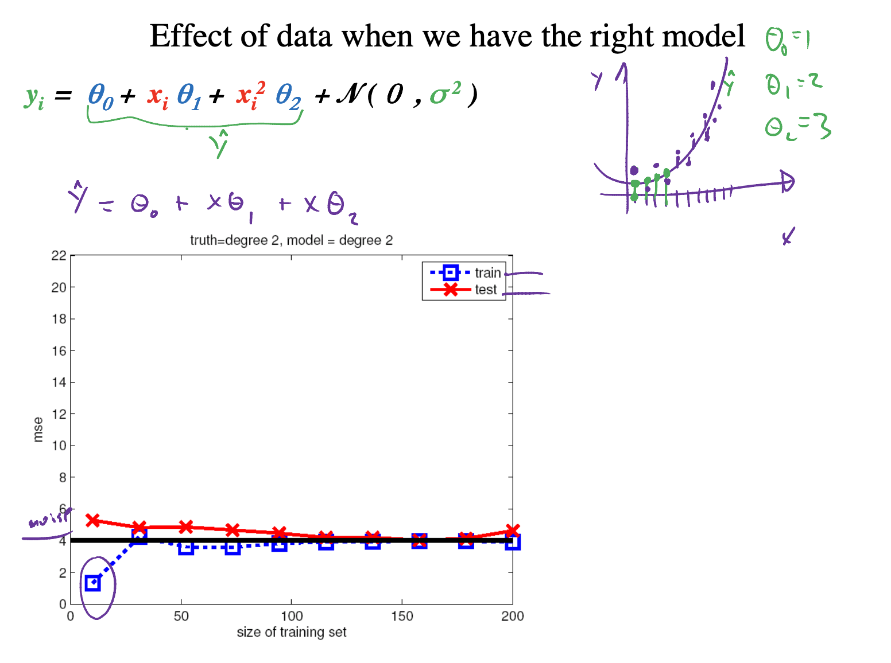
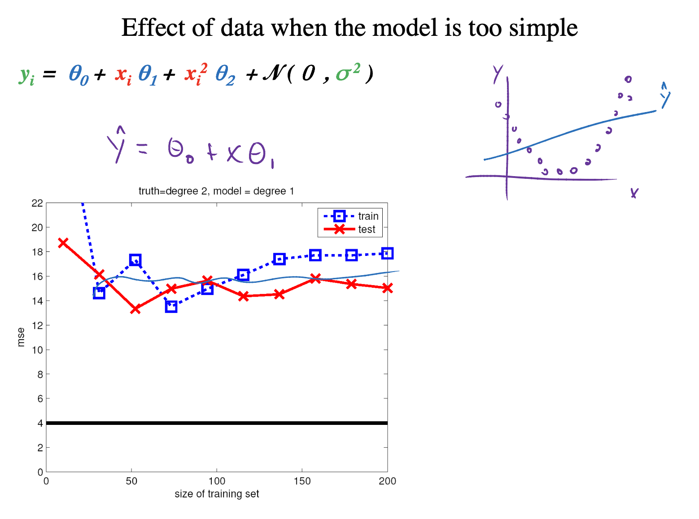
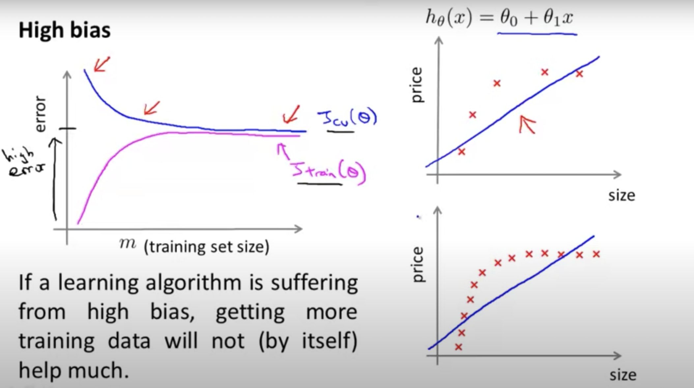
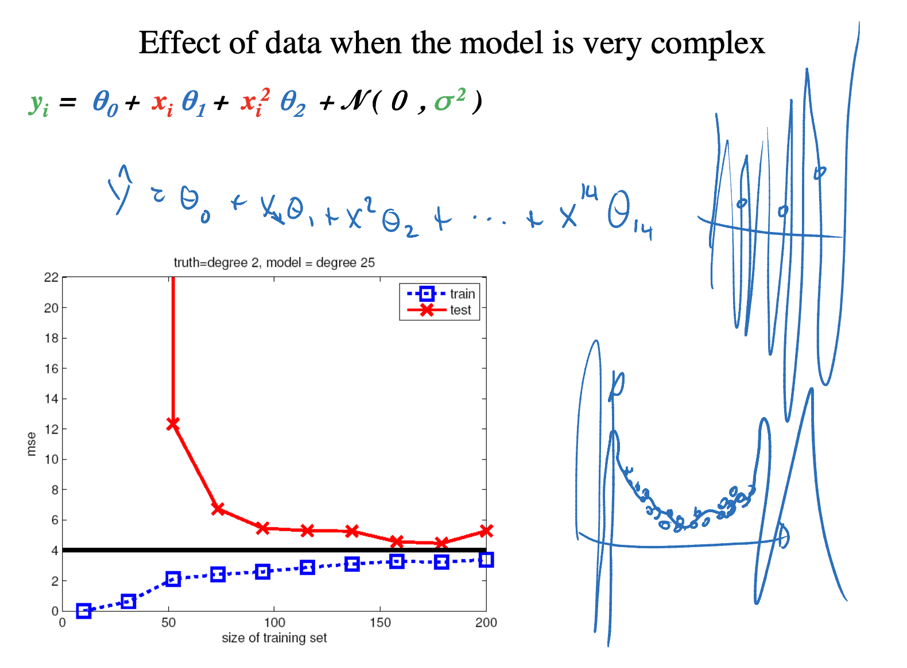
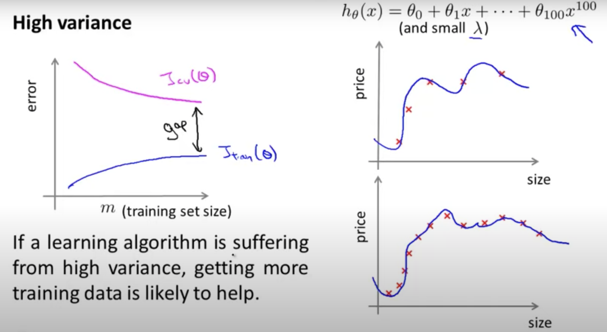
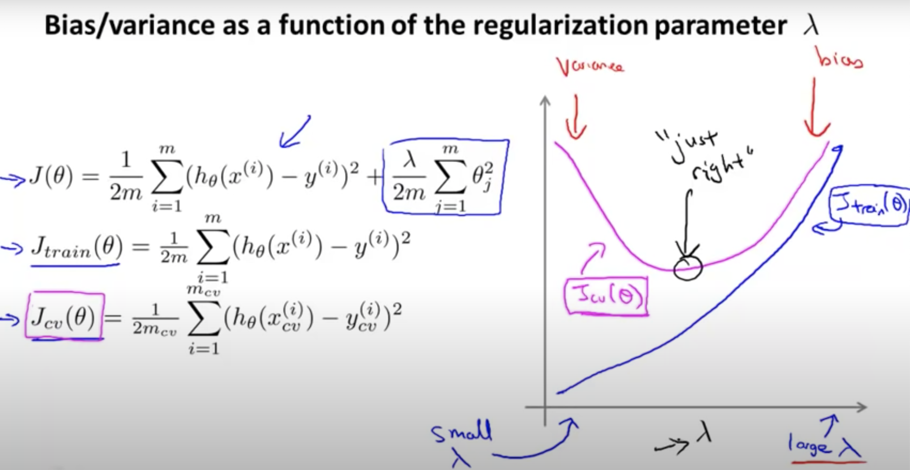
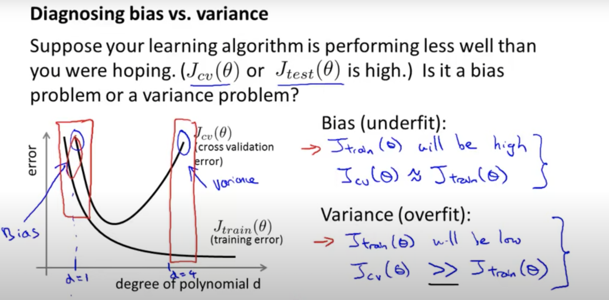

# Bias-Variance Tradeoff

## Final Model

Once you have discovered which model and model hyperparameters result in the best skill on your dataset, you’re ready to prepare a final model.
A final model is trained on all available data, e.g. the training and the test sets.

It is the model that you will use to make predictions on new data where you do not know the outcome. A problem with most final models is that they suffer variance in their predictions.

The bias-variance trade-off is a conceptual idea in applied machine learning to help understand the sources of error in models. 

Suppose we have a model such that given $\symbf{x}$, the prediction is:

$$\hat{y} = \hat{f}(\symbf{x}).$$

Then the expected value of squared difference btween the prediction $\hat{y}$ and actual value $y$, 

$$\mathbb{E}[(y-\hat{y})^2] = \mathbb{E}[\big(\hat{f}(X)+\epsilon -\hat{f}(X)\big)^2] = \mathbb{E}[\big(f(X)-\hat{f}(X)\big)^2] + \epsilon^2.$$

The first term is reducible erros: Bias + Variance and the second term is irreducible, i.e. Bayes error [[Cross Validated: What is Bayes Error in machine learning?]][What is Bayes Error in machine learning?]. The irreducible error is the lower bound error from a perfect model.

## Bias 

The bias is error from erroneous assumptions in the learning algorithm. High bias can cause an algorithm to miss the relevant relations between features and target outputs (**underfitting**) [[Quora: Yisong Yue]][What are the differences between Random Forest and Gradient Tree Boosting algorithms?].

Generally, **parametric algorithms** have a **high bias** making them fast to learn and easier to understand but generally less flexible [[Jason Brownlee]][Gentle Introduction to the Bias-Variance Trade-Off in Machine Learning]. In turn, they have **lower predictive performance**. In Blog [[Jason Brownlee]][Gentle Introduction to the Bias-Variance Trade-Off in Machine Learning], Jason interpreted Low-Bias/High-Bias as less/more assumptions about the form of the target function (i.e. $\hat{y} =f(\symbf{x})$). 

Examples of low-bias ML algorithms are **Decision Trees**, **k-Nearest Neighbors** and **Support Vector Machines**, where high-bias algorithms are **Linear Regression**, **Linear Discriminant Analysis** and **Logistic Regression** [[Deepanshu Bhalla]][UNDERSTANDING BIAS-VARIANCE TRADEOFF]. Note random forest and boosting are non-parametric; do not confuse the hyperparameters. The parameters in the parametrical models point to the assumptions regarding the data distribution. The post [[StachExchange: Are Random Forest and Boosting parametric or non-parametric?]][Are Random Forest and Boosting parametric or non-parametric?] has clearified the concept. Peter even further explain: In statistical sense, the model is parametric, if **parameters are learned** or **inferred** based on the **data**. A tree in this sense is nonparametric. Of course the tree depth is a parameter of the algorithm, but it is not inherently derived from the data, but rather an input parameter that has to be provided by the user.

## Variance

Obcn the other hand, the variance is error from sensitivity to small fluctuations in the training set. High variance can cause **overfitting**: modeling the random noise in the training data, rather than the intended outputs [[Jason Brownlee]][Gentle Introduction to the Bias-Variance Trade-Off in Machine Learning]. 

Low/High Variance suggests small/large changes to the estimate of the target function with changes to the training dataset.
Generally, nonparametric machine learning algorithms that have a lot of flexibility have a high variance. For example, **decision trees** have a high variance, that is even higher if the trees are not pruned before use. The high-bias models are usually **low-variance** models; examples include: **Linear Regression**, **Linear Discriminant Analysis** and **Logistic Regression**. On the other hand, examples of **high-variance** machine learning algorithms include: **Decision Trees**, **k-Nearest Neighbors** and **Support Vector Machines** [[Deepanshu Bhalla]][UNDERSTANDING BIAS-VARIANCE TRADEOFF].

## Learning Curve

We can plot learning curves: MSE (error) vs the size of training set on the a) right model b) underfitting and c) overfitting cases for machine learning diagnostic. Here I cited the lectures given by Prof. [Nando de Freitas's ML classes at UBC](https://www.youtube.com/watch?v=-ouQeu_ywfY&list=PLE6Wd9FR--Ecf_5nCbnSQMHqORpiChfJf&index=19) and [Prof. Andrew Ng's coursera courserses](https://www.youtube.com/watch?v=ISBGFY-gBug&list=PLLssT5z_DsK-h9vYZkQkYNWcItqhlRJLN&index=63). 

### a) Model about right

Both training test erros are low.

### b) Underfitting (High bias)
Both training test erros are high. More training data is not helpful to improve performance. 

### c) Overfitting (High Variance)
Training error is low but test erro is high. More training data could be helpful to improve performance.

## Measuring Bias and Variance

   The presentation [Bias-Variance in Machine
Learning](http://www.cs.cmu.edu/~wcohen/10-601/bias-variance.pdf) shows a way to measure bias and variance, separately. The mean sqaure error (MSE) for a given $\symbf{x}$ is written as

$$\mathbb{E}[(y-\hat{y})^2] = \mathbb{E}[\big(f(x)+\epsilon -\hat{y}\big)^2] = \mathbb{E}[(f-\hat{y}^2)] = \mathbb{E}[ (f-h)^2 + (h-\hat{y})^2].$$

Note $f(\symbf{x})$ denotes a possible best model, and the true target value from data, $y = f(\symbf{x}) + \varepsilon$, where $\varepsilon$ is the irreducible error. In other words, there are always irreducible errors we cannot interpret. Each learner gives predictions $\hat{y} \equiv h_D(\symbf{x})$, and $h\equiv \mathbb{E}_D[h_D(x)]$ is the long-term expectation of learners' predictions on $\symbf{x}$ averaged over more data from $D$.

So the MSE is

$$\mathbb{E}[(f-h)^2+(h-\hat{y})^2+2(f-h)(h-\hat{y})] = \mathbb{E}[(f-h)^2]+\mathbb{E}[(h-\hat{y})^2].$$

The first term is **Bias square**. If our model reaches the best possible model, then the first term is determined by the irreducible errors only and should be minimized, denoting that our model is low-bias. 

On the other hand, the second term descibes **Variance**. If it is small, it means that all various learners will gives $h_D(x)$ close to $h$, the long-term expectation, denoting low-variance.

## Bias-Variance Tradeoff by Hyperparameters Tuning

As we discussed above, parametric (linear) ML algorithms often have a high bias but a low variance, whereas
non-parametric (non-linear) algorithms often have a low bias but a high variance.

Tuning bias-variance tradeoff is hard, however. Increasing the bias will decrease the variance and increasing the variance will decrease the bias.

Below are two examples of configuring the bias-variance trade-off for specific algorithms: 

1. The $k$-nearest neighbors algorithm has low bias and high variance, but the trade-off can be changed by increasing the value of $k$ which increases the number of neighbors that contribute to the prediction and in turn increases the bias of the model 

2. The support vector machine algorithm has low bias and high variance, but the trade-off can be changed by increasing the $C$ parameter that influences the number of violations of the margin allowed in the training data which increases the bias but decreases the variance.

3. For linear regression and logistic regression, we can add regularization. By increasing the regularization strength, we move from high variance to low variance. However, in the large limit of the regularization strength, we reach high bias. The tradeoff should be chosen at best performance using cross validation dataset.

   The following is the example how regularization vs training/test errors (from Prof. Andrew Ng's coursera courserses)
   

Also, the learning curve can be used for model selection. A good example is that models will be over-complicated if we consider many polynomial terms, and over-simple if few terms. 

## Reference

[What is Bayes Error in machine learning?]: https://stats.stackexchange.com/questions/302900/what-is-bayes-error-in-machine-learning
[[Cross Validated: What is Bayes Error in machine learning?] What is Bayes Error in machine learning?](https://stats.stackexchange.com/questions/302900/what-is-bayes-error-in-machine-learning)

[UNDERSTANDING BIAS-VARIANCE TRADEOFF]: https://www.listendata.com/2017/02/bias-variance-tradeoff.html
[[Deepanshu Bhalla] UNDERSTANDING BIAS-VARIANCE TRADEOFF](https://www.listendata.com/2017/02/bias-variance-tradeoff.html)

[Gentle Introduction to the Bias-Variance Trade-Off in Machine Learning]: https://machinelearningmastery.com/gentle-introduction-to-the-bias-variance-trade-off-in-machine-learning/
[[Jason Brownlee] Gentle Introduction to the Bias-Variance Trade-Off in Machine Learning](https://machinelearningmastery.com/gentle-introduction-to-the-bias-variance-trade-off-in-machine-learning/)

[What are the differences between Random Forest and Gradient Tree Boosting algorithms?]: https://www.quora.com/What-are-the-differences-between-Random-Forest-and-Gradient-Tree-Boosting-algorithms
[[Quora: Yisong Yue] What are the differences between Random Forest and Gradient Tree Boosting algorithms?](https://www.quora.com/What-are-the-differences-between-Random-Forest-and-Gradient-Tree-Boosting-algorithms)

[Are Random Forest and Boosting parametric or non-parametric?]: https://stats.stackexchange.com/questions/147587/are-random-forest-and-boosting-parametric-or-non-parametric
[[StachExchange: Are Random Forest and Boosting parametric or non-parametric?] Are Random Forest and Boosting parametric or non-parametric?](https://stats.stackexchange.com/questions/147587/are-random-forest-and-boosting-parametric-or-non-parametric)

