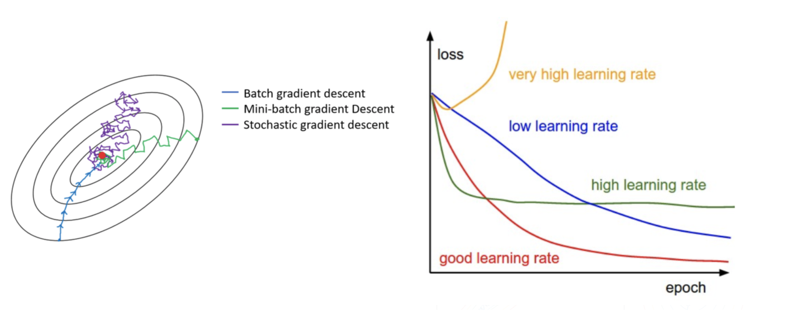
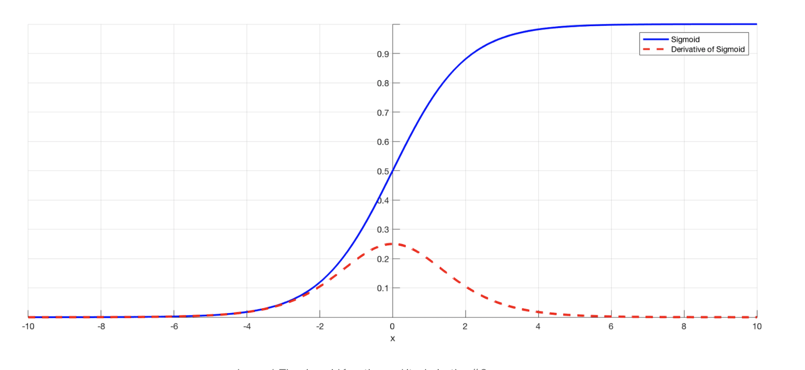
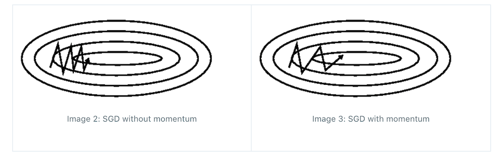
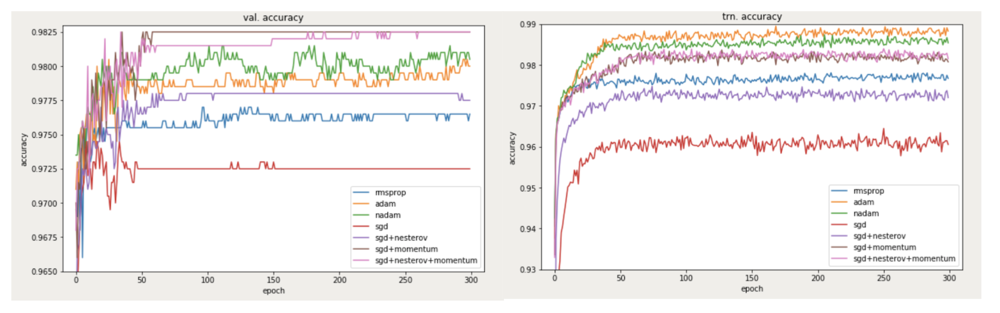

# Gradient Descent 

Parameters in gradient descent are updated as 

```
parameter = parameter - learning_rate * gradient
```

Table of Contents:

* [Batch, Stochastic, Mini-Batch](https://github.com/HsiangHung/Machine_Learning_Note/tree/master/ML_fundamentals/Gradient_Descent#batch-stochastic-mini-batch)
* [The Termination Condition For Gradient Descent?](https://github.com/HsiangHung/Machine_Learning_Note/tree/master/ML_fundamentals/Gradient_Descent#the-termination-condition-for-gradient-descent)
* [Local Minimum Trap](https://github.com/HsiangHung/Machine_Learning_Note/tree/master/ML_fundamentals/Gradient_Descent#local-minimum-trap)
* [Vanishing Gradient in Neural Networks](https://github.com/HsiangHung/Machine_Learning_Note/tree/master/ML_fundamentals/Gradient_Descent#vanishing-gradient-in-neural-networks)
* [Variants of Gradient Descent](https://github.com/HsiangHung/Machine_Learning_Note/tree/master/ML_fundamentals/Gradient_Descent#variants-of-gradient-descent)
    * [A. Momentum](https://github.com/HsiangHung/Machine_Learning_Note/tree/master/ML_fundamentals/Gradient_Descent#a-momentum)
    * [B. Adagrad (Adaptive Gradient Algorithm)](https://github.com/HsiangHung/Machine_Learning_Note/tree/master/ML_fundamentals/Gradient_Descent#b-adagrad-adaptive-gradient-algorithm)
    * [C. RMSProp (Root Mean Square Propagation)](https://github.com/HsiangHung/Machine_Learning_Note/tree/master/ML_fundamentals/Gradient_Descent#c-rmsprop-root-mean-square-propagation)
    * [D. Adam (Adaptive Moment Estimation)](https://github.com/HsiangHung/Machine_Learning_Note/tree/master/ML_fundamentals/Gradient_Descent#d-adam-adaptive-moment-estimation)
    * [E. Comparison Between Optimizers](https://github.com/HsiangHung/Machine_Learning_Note/tree/master/ML_fundamentals/Gradient_Descent#e-comparison-between-optimizers)


## Batch, Stochastic, Mini-Batch 

[[Sushant Patrikar]][Batch, Mini Batch & Stochastic Gradient Descent],[[Aditya Ananthram]][Optimizers be TensorFlow’s Appetizers], [[CrossValidated: Batch gradient descent versus stochastic gradient descent]][Batch gradient descent versus stochastic gradient descent], [[Z² Little]][Gradient Descent: Stochastic vs. Mini-batch vs. Batch vs. AdaGrad vs. RMSProp vs. Adam]

* **Batch**: Take the average of the gradients of all the training examples and then use that mean gradient to update our parameters. So that’s just one step of gradient descent in one epoch. (pseudo-code credit from [[Sebastian Ruder]][An overview of gradient descent optimization algorithms])

```Python
for i in range(nb_epochs):
  params_grad = evaluate_gradient(loss_function, data, params)
  params = params - learning_rate * params_grad
```

* **Stochastic**: If our dataset is very huge it is not an efficient way for using all examples in one epoch. stochastic gradient descent (SGD) just uses one example at a time to take a single step. SGD can update to the parameters more frequently, like real-time updating. Notice how the cost effectively takes steps towards the minimum point of cost but does not get there directly. It can also never actually reach the very point of minimum cost, it can only be circulating in its region. (pseudo-code credit from [[Sebastian Ruder]][An overview of gradient descent optimization algorithms])

```Python
for i in range(nb_epochs):
  np.random.shuffle(data)
  for example in data:
    params_grad = evaluate_gradient(loss_function, example, params)
    params = params - learning_rate * params_grad
```

* **Min-batch**: A mixture of Batch and SGD. The drawback is that it wanders around the minimum region but never converges (like SGD).

For Batch Gradient Descent, the algorithm traces a straight line towards the minimum. If the cost function is convex, then it converges to a global minimum and if the cost function is not convex, then it converges to a local minimum. The learning rate is typically held constant over here. (pseudo-code credit from [[Sebastian Ruder]][An overview of gradient descent optimization algorithms])

```Python
 for i in range(nb_epochs):
  np.random.shuffle(data)
  for batch in get_batches(data, batch_size=32):
    params_grad = evaluate_gradient(loss_function, batch, params)
    params = params - learning_rate * params_grad

```


Here is the post [[Jason Brownlee]][A Gentle Introduction to Mini-Batch Gradient Descent and How to Configure Batch Size] to discuss what value of batch size in Mini-Batch Gradient Descent. A good default for batch size might be 32, and 64,.... 

The comparison between the gradient descents can be illustrated below (credit from [[Z² Little]][Gradient Descent: Stochastic vs. Mini-batch vs. Batch vs. AdaGrad vs. RMSProp vs. Adam]):



## The Termination Condition For Gradient Descent?


Discussion about the termination condition for gradient descent: [[CrossValidated: How to define the termination condition for gradient descent?]][How can stochastic gradient descent avoid the problem of a local minimum?], [[Mathematics: Stopping criteria for gradient method]][Stopping criteria for gradient method]

* Determine the number of iterations we need to perform to achieve a desired error .
* Terminating when changes in parameter or changes in cost functions is small enough. 
* Terminating when gradient is small enough.


## Local Minimum Trap

If the cost function is convex, it has one global minimum. If not, gradient descent may trap in a local minimum.

Stochastic gradient descent has a much noisier error surface since you are evaluating each sample iteratively. So, here are some practical tips if you are using stochastic gradient descent [[CrossValidated: How can stochastic gradient descent avoid the problem of a local minimum?]][How can stochastic gradient descent avoid the problem of a local minimum?]:

1. Shuffle the training set before each epoch (or iteration in the "standard" variant)
2. Use an adaptive learning rate to "anneal" closer to the global minimum


However, stochastic gradient descent is more able to avoid local minimum because the landscape of batch loss function is different than the loss function of whole dataset. See the post: [How to get out of local minimums on stochastic gradient descent?](https://datascience.stackexchange.com/questions/44324/how-to-get-out-of-local-minimums-on-stochastic-gradient-descent)


Also, from [How to avoid falling into the “local minima” trap?](https://ai.stackexchange.com/questions/1362/how-to-avoid-falling-into-the-local-minima-trap), NietzscheanAI mentioned techniques to try and move a search out of the basin of attraction of local optima:

1. Probabalistically accepting worse solutions in the hope that this will jump out of the current basin (like Metropolis-Hastings acceptance in Simulated Annealing).
2. Maintaining a list of recently-encountered states (or attributes thereof) and not returning to a recently-encountered one (like Tabu Search).
3. Performing a random walk of a length determined by the current state of the search (an explicit 'Diversification strategy', e.g. as used in 'Reactive Tabu Search').


## Vanishing Gradient in Neural Networks

In nerual networks, we may face the vanishing gradients issue. For example, the derivative of sigmoid activation function looks like (credit from [[Chi-Feng Wang]][The Vanishing Gradient Problem])



For shallow network with only a few layers that use these activations, this isn’t a big problem. However, when more layers are used, it can cause the gradient to be too small for training to work effectively.

Gradients of neural networks are found using backpropagation. Simply put, backpropagation finds the derivatives of the network by moving layer by layer from the final layer to the initial one. By the chain rule, the derivatives of each layer are multiplied down the network (from the final layer to the initial) to compute the derivatives of the initial layers [[Chi-Feng Wang]][The Vanishing Gradient Problem].

However, when `n` hidden layers use an activation like the **sigmoid function**, `n` small derivatives are multiplied together. Thus, the gradient decreases exponentially as we propagate down to the initial layers.

The solutions include using **Relu activation**, **random initialization on parameters**, and **batch normalization**. 
see [here](https://github.com/HsiangHung/Machine_Learning_Note/tree/master/Deep_Learning#solution-to-vanishing-gradients).


## Variants of Gradient Descent

There are many variants of SGD. We will briefly introduce them in the following discussion and explain with the same notation in [[Sebastian Ruder]][An overview of gradient descent optimization algorithms] and [[Jaime Durán]][Everything You Need to Know about Gradient Descent Applied to Neural Networks]. [[Sushant Patrikar]][Batch, Mini Batch & Stochastic Gradient Descent], [[Priyankur Sarkar]][What is Gradient Descent For Machine Learning] also provide good introduction.

In the following, we designate the graident as (if $J$ is the cost function)

$$g_{t} = \frac{\partial J(\theta_{t})}{\partial \theta_{t}}.$$

For each step `t`, the model parameter is updated as

$$\theta_{t+1} = \theta_{t} + \Delta \theta_{t},$$

where $\Delta \theta_{t} = - \alpha g_{t}.$

### A. Momentum

During optimization, SGD used to oscillate across the slopes of the ravine while only making hesitant progress along the bottom towards the local optimum [[Sebastian Ruder]][An overview of gradient descent optimization algorithms]. Look the left image below (credit from [[Sebastian Ruder]][An overview of gradient descent optimization algorithms]). 



Momentum is a method that helps **accelerate** SGD in the relevant direction and dampens oscillations as can be seen in the right image above. Using the similar manner in [exponentially weighted average](https://github.com/HsiangHung/Machine_Learning_Note/tree/master/Time_Series#exponentially-weighted-average) and follow the notation from Andrew Ng's coursera class: [Exponentially weighted averages](https://www.coursera.org/learn/deep-neural-network/lecture/duStO/exponentially-weighted-averages), we can define the velocity and integrate into gradient descent

$$v_{t} = \beta v_{t-1} +(1-\beta) g_{t}.$$

The momentrum term $\beta$ is usually set to 0.9 or a similar value [[Sebastian Ruder]][An overview of gradient descent optimization algorithms]. Then models are updated as

$$\theta_{t+1} = \theta_{t} +\Delta \theta_t = \theta_t - \alpha v_{t}.$$

Note the blog [[Sebastian Ruder]][An overview of gradient descent optimization algorithms] implemented $v_{t} = \gamma v_{t-1} + g_{t}$ for momentum, and it is ok. But the Anrew's Ng's notation gaives more intuition. 


### B. Adagrad (Adaptive Gradient Algorithm)

Adagrad **modifies the general learning rate** at each time step `t` for every parameter θ based on the past gradients [[Sebastian Ruder]][An overview of gradient descent optimization algorithms], [[Roan Gylberth]][An Introduction to AdaGrad]

$$\Delta \theta_t = - \frac{\alpha}{\sqrt{ \sum^t_{\tau} (g_{\tau})^2 + \epsilon }} g_{t}.$$

<a href="https://www.codecogs.com/eqnedit.php?latex=\Delta&space;\theta_t&space;=&space;-&space;\frac{\alpha}{\sqrt{\sum^t_{\tau=1}(g_{\tau})^2&space;&plus;&space;\epsilon}}&space;g_{t}" target="_blank"></a>


### C. RMSProp (Root Mean Square Propagation)

RMSProp improves the latter by including the exponential moving average of the **squared gradient**:

$$\Delta \theta_{t} = - \alpha \Big( \frac{g_t}{\sqrt{s_t} + \epsilon} \Big),$$

where $s_{t} = \beta s_{t-1} + (1-\beta)g^2_t$.

The RMSProp also slow down relatively large gradients and speed up relatively small gradients by dividing the squared root of the velocity.


### D. Adam (Adaptive Moment Estimation)

Adam is another method that computes adaptive learning rates for each parameter. In addition to storing an exponentially decaying average of past squared gradients `vt` like Adadelta and RMSprop, Adam also keeps an exponentially decaying average of past gradients `mt`, similar to momentum [[Sebastian Ruder]][An overview of gradient descent optimization algorithms].  In simple words you can consider it to be RMSProp + momentum [[Jaime Durán]][Everything You Need to Know about Gradient Descent Applied to Neural Networks].

$$\Delta \theta_t = - \alpha \Big( \frac{v^{\textrm{corr}}_t}{\sqrt{s^{\textrm{corr}}_t} + \epsilon}\Big),$$

where $v_t = \beta_1 v_{t-1} + (1-\beta_1)g_t$ and $s_t = \beta_2 s_{t-1} + (1-\beta_2)g^2_t$.

The first is momentum-like, and the second is RMSprop. The supersrcipt "corr" represents "corrected" momentum and RSMprop:

$$v^{\textrm{corr}}_t = \frac{v_{t}}{(1-\beta^t_1)},$$

and 

$$s^{\textrm{corr}}_t = \frac{s_t}{(1-\beta^t_2)}.$$


The proposed default values are $\beta_1=0.9$, $\beta_2=0.999$ and $\epsilon=10^{-8}$.

### E. Comparison Between Optimizers

Thought the Adam optimizer seems to works better than others; SGD is a better generalized adapter than ADAM [[Data Science: Why not always use the ADAM optimization technique?]][Why not always use the ADAM optimization technique?].

There is often a value to using more than one method (an ensemble), because every method has a weakness. See the performance experiments below (credit from [[SALu]][SGD > Adam?? Which One Is The Best Optimizer: Dogs-VS-Cats Toy Experiment])

`val`: validation, `trn`: training.




## Reference


[Optimizers be TensorFlow’s Appetizers]: https://towardsdatascience.com/optimizers-be-deeps-appetizers-511f3706aa67
[[Aditya Ananthram] Optimizers be TensorFlow’s Appetizers](https://towardsdatascience.com/optimizers-be-deeps-appetizers-511f3706aa67)


[The Vanishing Gradient Problem]: https://towardsdatascience.com/optimizers-be-deeps-appetizers-511f3706aa67
[[Chi-Feng Wang] The Vanishing Gradient Problem](https://towardsdatascience.com/optimizers-be-deeps-appetizers-511f3706aa67)


[Batch gradient descent versus stochastic gradient descent]: https://stats.stackexchange.com/questions/49528/batch-gradient-descent-versus-stochastic-gradient-descent
[[CrossValidated: Batch gradient descent versus stochastic gradient descent] Batch gradient descent versus stochastic gradient descent](https://stats.stackexchange.com/questions/49528/batch-gradient-descent-versus-stochastic-gradient-descent)


[How to define the termination condition for gradient descent?]: https://stats.stackexchange.com/questions/33136/how-to-define-the-termination-condition-for-gradient-descent
[[CrossValidated: How to define the termination condition for gradient descent?] How to define the termination condition for gradient descent?](https://stats.stackexchange.com/questions/33136/how-to-define-the-termination-condition-for-gradient-descent)


[How can stochastic gradient descent avoid the problem of a local minimum?]: https://stats.stackexchange.com/questions/90874/how-can-stochastic-gradient-descent-avoid-the-problem-of-a-local-minimum
[[CrossValidated: How can stochastic gradient descent avoid the problem of a local minimum?] How can stochastic gradient descent avoid the problem of a local minimum?](https://stats.stackexchange.com/questions/90874/how-can-stochastic-gradient-descent-avoid-the-problem-of-a-local-minimum)


[Why not always use the ADAM optimization technique?]: https://datascience.stackexchange.com/questions/30344/why-not-always-use-the-adam-optimization-technique/30347
[[Data Science: Why not always use the ADAM optimization technique?] Why not always use the ADAM optimization technique?](https://datascience.stackexchange.com/questions/30344/why-not-always-use-the-adam-optimization-technique/30347)


[Everything You Need to Know about Gradient Descent Applied to Neural Networks]: https://medium.com/yottabytes/everything-you-need-to-know-about-gradient-descent-applied-to-neural-networks-d70f85e0cc14
[[Jaime Durán] Everything You Need to Know about Gradient Descent Applied to Neural Networks](https://medium.com/yottabytes/everything-you-need-to-know-about-gradient-descent-applied-to-neural-networks-d70f85e0cc14)


[A Gentle Introduction to Mini-Batch Gradient Descent and How to Configure Batch Size]: https://machinelearningmastery.com/gentle-introduction-mini-batch-gradient-descent-configure-batch-size/
[[Jason Brownlee] A Gentle Introduction to Mini-Batch Gradient Descent and How to Configure Batch Size](https://machinelearningmastery.com/gentle-introduction-mini-batch-gradient-descent-configure-batch-size/)


[Stopping criteria for gradient method]: https://math.stackexchange.com/questions/1618330/stopping-criteria-for-gradient-method
[[Mathematics: Stopping criteria for gradient method] Stopping criteria for gradient method](https://math.stackexchange.com/questions/1618330/stopping-criteria-for-gradient-method)


[What is Gradient Descent For Machine Learning]: https://www.knowledgehut.com/blog/data-science/gradient-descent-in-machine-learning
[[Priyankur Sarkar] What is Gradient Descent For Machine Learning](https://www.knowledgehut.com/blog/data-science/gradient-descent-in-machine-learning)


[An Introduction to AdaGrad]: https://medium.com/konvergen/an-introduction-to-adagrad-f130ae871827
[[Roan Gylberth] An Introduction to AdaGrad](https://medium.com/konvergen/an-introduction-to-adagrad-f130ae871827)


[SGD > Adam?? Which One Is The Best Optimizer: Dogs-VS-Cats Toy Experiment]: https://shaoanlu.wordpress.com/2017/05/29/sgd-all-which-one-is-the-best-optimizer-dogs-vs-cats-toy-experiment/
[[SALu] SGD > Adam?? Which One Is The Best Optimizer: Dogs-VS-Cats Toy Experiment](https://shaoanlu.wordpress.com/2017/05/29/sgd-all-which-one-is-the-best-optimizer-dogs-vs-cats-toy-experiment/)


[An overview of gradient descent optimization algorithms]: https://ruder.io/optimizing-gradient-descent/index.html#adam
[[Sebastian Ruder] An overview of gradient descent optimization algorithms](https://ruder.io/optimizing-gradient-descent/index.html#adam)


[Batch, Mini Batch & Stochastic Gradient Descent]: https://towardsdatascience.com/batch-mini-batch-stochastic-gradient-descent-7a62ecba642a
[[Sushant Patrikar] Batch, Mini Batch & Stochastic Gradient Descent](https://towardsdatascience.com/batch-mini-batch-stochastic-gradient-descent-7a62ecba642a)


[Gradient Descent: Stochastic vs. Mini-batch vs. Batch vs. AdaGrad vs. RMSProp vs. Adam]: https://xzz201920.medium.com/gradient-descent-stochastic-vs-mini-batch-vs-batch-vs-adagrad-vs-rmsprop-vs-adam-3aa652318b0d
[[Z² Little] Gradient Descent: Stochastic vs. Mini-batch vs. Batch vs. AdaGrad vs. RMSProp vs. Adam](https://xzz201920.medium.com/gradient-descent-stochastic-vs-mini-batch-vs-batch-vs-adagrad-vs-rmsprop-vs-adam-3aa652318b0d)