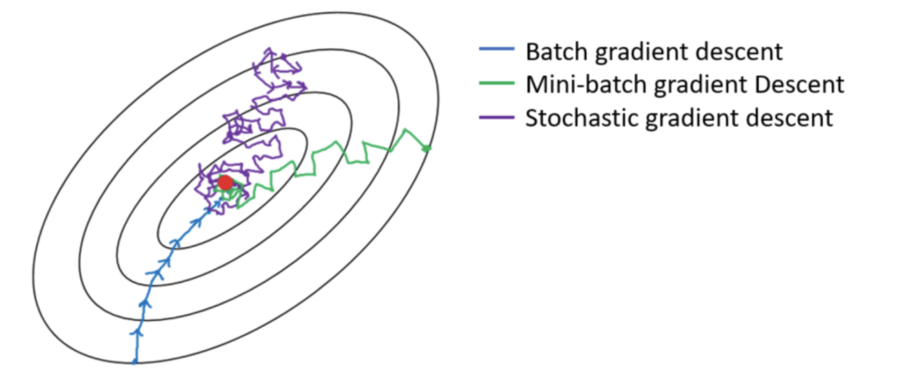

# Gradient Descent 

```
parameter = parameter - learning_rate * gradient
```

## Batch, Stochastic, Mini-Batch 

[[Sushant Patrikar]][Batch, Mini Batch & Stochastic Gradient Descent],[[Aditya Ananthram]][Optimizers be TensorFlow’s Appetizers], [[CrossValidated: Batch gradient descent versus stochastic gradient descent]][Batch gradient descent versus stochastic gradient descent], [[Z² Little]][Gradient Descent: Stochastic vs. Mini-batch vs. Batch vs. AdaGrad vs. RMSProp vs. Adam]

* **Batch**: Take the average of the gradients of all the training examples and then use that mean gradient to update our parameters. So that’s just one step of gradient descent in one epoch.

* **Stochastic**: If our dataset is very huge it is not an efficient way for using all examples in one epoch. Stochastic gradient descent (SGD) just uses one example at a time to take a single step. SGD can update to the parameters more frequently, like real-time updating. Notice how the cost effectively takes steps towards the minimum point of cost but does not get there directly. It can also never actually reach the very point of minimum cost, it can only be circulating in its region.

* **Min-batch**: A mixture of Batch and SGD. The drawback is that it wanders around the minimum region but never converges (like SGD).




## The Termination Condition For Gradient Descent?


Discussion about the termination condition for gradient descent: [[CrossValidated: How to define the termination condition for gradient descent?]][How can stochastic gradient descent avoid the problem of a local minimum?], [[Mathematics: Stopping criteria for gradient method]][Stopping criteria for gradient method]

* Determine the number of iterations we need to perform to achieve a desired error .
* Terminating when changes in parameter or changes in cost functions is small enough. 
* Terminating when gradient is small enough.


## Local Minimum Trap

If the cost function is convex, it has one global minimum. If not, gradient descent may trap in a local minimum.

Stochastic gradient descent has a much noisier error surface since you are evaluating each sample iteratively. So, here are some practical tips if you are using stochastic gradient descent [[CrossValidated: How can stochastic gradient descent avoid the problem of a local minimum?]][How can stochastic gradient descent avoid the problem of a local minimum?]:

1. Shuffle the training set before each epoch (or iteration in the "standard" variant)
2. Use an adaptive learning rate to "anneal" closer to the global minimum


## Reference


[Optimizers be TensorFlow’s Appetizers]: https://towardsdatascience.com/optimizers-be-deeps-appetizers-511f3706aa67
[[Aditya Ananthram] Optimizers be TensorFlow’s Appetizers](https://towardsdatascience.com/optimizers-be-deeps-appetizers-511f3706aa67)


[Batch gradient descent versus stochastic gradient descent]: https://stats.stackexchange.com/questions/49528/batch-gradient-descent-versus-stochastic-gradient-descent
[[CrossValidated: Batch gradient descent versus stochastic gradient descent] Batch gradient descent versus stochastic gradient descent](https://stats.stackexchange.com/questions/49528/batch-gradient-descent-versus-stochastic-gradient-descent)


[How to define the termination condition for gradient descent?]: https://stats.stackexchange.com/questions/33136/how-to-define-the-termination-condition-for-gradient-descent
[[CrossValidated: How to define the termination condition for gradient descent?] How to define the termination condition for gradient descent?](https://stats.stackexchange.com/questions/33136/how-to-define-the-termination-condition-for-gradient-descent)


[How can stochastic gradient descent avoid the problem of a local minimum?]: https://stats.stackexchange.com/questions/90874/how-can-stochastic-gradient-descent-avoid-the-problem-of-a-local-minimum
[[CrossValidated: How can stochastic gradient descent avoid the problem of a local minimum?] How can stochastic gradient descent avoid the problem of a local minimum?](https://stats.stackexchange.com/questions/90874/how-can-stochastic-gradient-descent-avoid-the-problem-of-a-local-minimum)


[Stopping criteria for gradient method]: https://math.stackexchange.com/questions/1618330/stopping-criteria-for-gradient-method
[[Mathematics: Stopping criteria for gradient method] Stopping criteria for gradient method](https://math.stackexchange.com/questions/1618330/stopping-criteria-for-gradient-method)


[Batch, Mini Batch & Stochastic Gradient Descent]: https://towardsdatascience.com/batch-mini-batch-stochastic-gradient-descent-7a62ecba642a
[[Sushant Patrikar] Batch, Mini Batch & Stochastic Gradient Descent](https://towardsdatascience.com/batch-mini-batch-stochastic-gradient-descent-7a62ecba642a)


[Gradient Descent: Stochastic vs. Mini-batch vs. Batch vs. AdaGrad vs. RMSProp vs. Adam]: https://xzz201920.medium.com/gradient-descent-stochastic-vs-mini-batch-vs-batch-vs-adagrad-vs-rmsprop-vs-adam-3aa652318b0d
[[Z² Little] Gradient Descent: Stochastic vs. Mini-batch vs. Batch vs. AdaGrad vs. RMSProp vs. Adam](https://xzz201920.medium.com/gradient-descent-stochastic-vs-mini-batch-vs-batch-vs-adagrad-vs-rmsprop-vs-adam-3aa652318b0d)