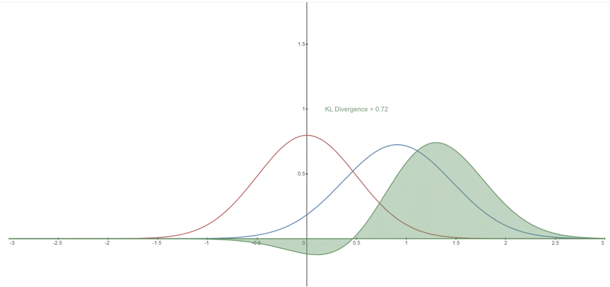

# Machine Learning Fundamentals 


This space is dedicated to some fundamental theory on Machine Learning.

Some recommended summary:

* Jin Yan, [Machine Learning Questions](https://yanjin.space/blog/2020/2020305.html)
* Knowledge hut, Machine learning series. e.g. [Support Vector Machines in Machine Learning](https://www.knowledgehut.com/blog/data-science/support-vector-machines-in-machine-learning)


## 1. Data Sparsity

**Rakshith Gowda Kodihalli** [[Quora: What is data sparsity?]][What is data sparsity?]: Any data which as very large zero value and very little no zero value then it is called sparse data. And the way in which data is saved is sparse matrix. The example is like:

| c1 | c2 | c3 | c4 | c5 |
| --- | --- | --- | --- | --- |
| 0 | 0 | 0 | 5 | 0 |
| 0 | 0 | 0 | 0 | 0 |
| 0 | 0 | 1 | 0 | 0 |
| 0 | 0 | 0 | 0 | 0 |
| 3 | 0 | 0 | 0 | 0 |
| 0 | 0 | 0 | 0 | 0 |

In this we can only save key ,value, location only for non zero elements:
`(c1, R5): 5`, `(c3, R3): 1`, `(c4, R1): 5`.

### How do you deal with training data with high sparsity?

**Tony Petrov**: Dimensionality reduction: PCA and SVD. It could also be the case that you’ve one-hot encoded variables which are better represented by embeddings.  **Information value scores** of each variable is important as high dimensionality data is bound to have a lot of collinear variables which will break most matrix based algorithms, also look at the p-values of each variable and remove the least important ones.

### Reference

* [What is data sparsity?]: https://www.quora.com/What-is-data-sparsity
[[Quora: What is data sparsity?] What is data sparsity?](https://www.quora.com/What-is-data-sparsity)
* [How do you deal with training data with high sparsity and large number of features (~1k) in machine learning?]: https://www.quora.com/How-do-you-deal-with-training-data-with-high-sparsity-and-large-number-of-features-1k-in-machine-learning
[[Quora: How do you deal with training data with high sparsity and large number of features (~1k) in machine learning?] How do you deal with training data with high sparsity and large number of features (~1k) in machine learning?](https://www.quora.com/How-do-you-deal-with-training-data-with-high-sparsity-and-large-number-of-features-1k-in-machine-learning)


## 2. Why only L1 and L2 regularization but not other norms?

The $L_q$ norms with $q < 1$ is not convex, so difficult to optimize [Cross Validated: Why do we only see $L_1$ and $L_2$ regularization but not other norms?
](https://stats.stackexchange.com/questions/269298/why-do-we-only-see-l-1-and-l-2-regularization-but-not-other-norms). L1 and L2 corresponds to Manhattan norm and Euclidean norm of complex numbers [wiki](https://en.wikipedia.org/wiki/Norm_(mathematics)). Other norm (credit from the book: [Statistical Learning with Sparsity](http://web.stanford.edu/~hastie/StatLearnSparsity/)):


## 3. L1/L_2 regularization distribution

$\textrm{L}_1$ and $\textrm{L}_2$ regularization correspond to the priors of MAP in Bayesian. See [here](https://github.com/HsiangHung/Machine_Learning_Note/tree/master/Bayesian_%26_MCMC#22-map). $\textrm{L}_2$ regularization is equivalent to **Gaussian** prior [[Cross Validated: Why is the L2 regularization equivalent to Gaussian prior?]][Why is the L2 regularization equivalent to Gaussian prior?], whereas $\textrm{L}_1$ corresponds to [Laplace prior](https://en.wikipedia.org/wiki/Laplace_distribution) (double exponential distribution).


The main intuitive difference between the $\textrm{L}_1$ and $\textrm{L}_2$ regularization is that $\textrm{L}_1$ regularization tries to estimate the **median** while the $\textrm{L}_2$ regularization tries to estimate the **mean** to avoid overfitting [[Dhaval Taunk]][L1 vs L2 Regularization: The intuitive difference]. Here is the intuition explanation: [L1 regression estimates median whereas L2 regression estimates mean?](https://stats.stackexchange.com/questions/34613/l1-regression-estimates-median-whereas-l2-regression-estimates-mean). The post [[Neelam Tyagi]][L2 and L1 Regularization in Machine Learning] has more comprehensive comparison.


Another difference between them is that $\textrm{L}_1$ regularization helps in **feature selection** by eliminating the features that are not important. This is helpful when the number of feature points are large in number [[Dhaval Taunk]][L1 vs L2 Regularization: The intuitive difference].

We all know why $\textrm{L}_1$ regularization has chance to surpress coefficient. The following gives a better picture and explanation (credit from [[Terence Parr]][The difference between L1 and L2 regularization]):


In (a), the min cost happens at $\beta_2 = 0$. But in (b), the min cost at finite $\beta_1$ and $\beta_2$.


### Reference

* [Why is the L2 regularization equivalent to Gaussian prior?]: https://stats.stackexchange.com/questions/163388/why-is-the-l2-regularization-equivalent-to-gaussian-prior
[[Cross Validated: Why is the L2 regularization equivalent to Gaussian prior?] Why is the L2 regularization equivalent to Gaussian prior?](https://stats.stackexchange.com/questions/163388/why-is-the-l2-regularization-equivalent-to-gaussian-prior)
* [L1 vs L2 Regularization: The intuitive difference]: https://medium.com/analytics-vidhya/l1-vs-l2-regularization-which-is-better-d01068e6658c
[[Dhaval Taunk] L1 vs L2 Regularization: The intuitive difference](https://medium.com/analytics-vidhya/l1-vs-l2-regularization-which-is-better-d01068e6658c)
* [L2 and L1 Regularization in Machine Learning]: https://www.analyticssteps.com/blogs/l2-and-l1-regularization-machine-learning
[[Neelam Tyagi] L2 and L1 Regularization in Machine Learning](https://www.analyticssteps.com/blogs/l2-and-l1-regularization-machine-learning)
* [The difference between L1 and L2 regularization]: https://explained.ai/regularization/L1vsL2.html
[[Terence Parr] The difference between L1 and L2 regularization](https://explained.ai/regularization/L1vsL2.html)


## 4. Entropy, Cross-Entropy, and KL-Divergence 

### 4.1 Entropy

Given probability distribution $p$, it tells us how unpredictable the probability distribution is.

$$H(p) = - \sum_i p_i \log p_i$$

Say, a fair coin, $p(H) = p(T) = 1/2$, then $H = \log 2$. But if $p(H) = 0.99$, then $H \sim \theta$, i.e. less uncertainty.

### 4.2 Cross-Entropy

Cross-Entropy is a function of both **true** probability distribution $p$ and **predicted** probability distribution $q$:

$$H(p, q) = - \sum_i p_i \log q_i$$


If our predictions are perfect, that is the predicted distribution is equal to the true distribution, then the cross-entropy is simply equal to entropy. But, if the distributions differ, then the cross-entropy will be greater than the entropy by some number of bits. This amount by which the cross-entropy exceeds the entropy is called the **Relative Entropy** or more commonly known as the **Kullback-Leibler Divergence (KL Divergence)**. (see [Aakarsh Yelisetty: Entropy, Cross-Entropy, and KL-Divergence Explained!](https://towardsdatascience.com/entropy-cross-entropy-and-kl-divergence-explained-b09cdae917a))


### 4.3 KL-Divergence

Kullback-Leibler Divergence measures information lost. 

```
Cross_entropy = Entropy + KL-divergence
```

In layman’s terms, the K-L divergence is a measure of how different a specific probability distribution is from a reference distribution [[Christiaan Defaux]][Kullback-Leibler Divergence for Machine Learning]. In the following, $D(K-L)$ is the divergence of $q$ from $p$:

$$D_{KL}(p||q) = \big(-\sum_i p_i \log q_i \big) - \big( -\sum_i p_i \log p_i \big) = \sum_i p_i \log \Big( \frac{p_i}{q_i}\Big)$$


The [blog: Kullback-Leibler Divergence Explained](https://www.countbayesie.com/blog/2017/5/9/kullback-leibler-divergence-explained) shows using KL divergence to minimize how much information loss we have when approximating a distribution. We can combine KL divergence with neural networks allows us to learn very complex approximating distribution for our data. A common approach to this is called a "Variational Autoencoder" which learns the best way to approximate the information in a data set.

The [blog: Intuitive Guide to Understanding KL Divergence](https://towardsdatascience.com/light-on-math-machine-learning-intuitive-guide-to-understanding-kl-divergence-2b382ca2b2a8) shows an example using KL-divergence to interpret approximation to a true distribution with the bionomial and uniform distribition.

In the following we visualize how KL divergence varies given a varying distribution P (blue) from a reference distribution Q. The screenshots are taken from the blog [Introduction to Diffusion Models for Machine Learning](https://www.assemblyai.com/blog/diffusion-models-for-machine-learning-introduction/#:~:text=More%20specifically%2C%20a%20Diffusion%20Model,with%20the%20same%20dimensionality%20as%20.) by Ryan O'Connor at AssemblyAI:





## 5. Convex Function

The strict definition (from [wiki](https://en.wikipedia.org/wiki/Convex_function)) of a convert function is

$$f(tx_1 + (1-t)x_2) \le tf(x_1) + (1-t)f(x_2), \ 0 < t < 1$$

Note, in a convex function, the local minimum global minimum. See the [proof](https://planetmath.org/localminimumofconvexfunctionisnecessarilyglobal).

## 6. Newton Method


It is a method for finding the root of a function, rather than its maxima or minima. This means that, if the problem satisfies the constraints of Newton’s method, we can find `x` for which `f(x)=0`. **NOT** `f'(x)=0`, as was the case for gradient descent. Therefore, we, apply Newton’s method on the **derivative** `f'(x)` of the cost function (`f''(x)`, second-order derivatives), not on the cost function itself [[Gabriele De Luca]][Gradient Descent vs. Newton’s Gradient Descent], [[Stack overflow: What is the difference between Gradient Descent and Newton's Gradient Descent?]][What is the difference between Gradient Descent and Newton's Gradient Descent?].

$$x_{n+1} = x_n + \frac{f^{\prime}(x_n)}{f^{\prime \prime}(x_n)}.$$


For multivariate, $f^{\prime \prime}(x)$ turns to the Hessian matrix. For example, in [[Cross Validated: Why is Newton's method not widely used in machine learning?]][Why is Newton's method not widely used in machine learning?], we assume $f=f(x,y)$, then

$$x_{n+1} = x_n - [\mathbf{H} f]^{-1}f^{\prime}(x_n).$$

### 6.1 Primary difference

1. The first difference lies in the fact that gradient descent is parametric according to the learning rate $\alpha$. Newton’s method isn’t parametric, which means that we can apply it without worrying for hyperparameter optimization. (A parametric version of Newton’s method also exists, in truth, but it only applies in cases for which we operate with a polynomial function with multiple roots.)

2. The second difference has to do with the cost function on which we apply the algorithm. Newton’s method has **stronger constraints in terms of the differentiability of the function than gradient descent**. If the second derivative of the function is undefined in the function’s root, then we can apply gradient descent on it but not Newton’s method.

3. The third difference consists of the behavior around stationary points. If gradient descent encounters a stationary point during iteration, the program continues to run, albeit the parameters don’t update. Newton’s method, however, we have $f^{\prime}(x) = f^{\prime \prime}(x) = 0$. The program that runs it would therefore terminate.


### 6.2 Why is Newton's method not widely used in machine learning?

The analytic expression for the second derivative is often complicated or intractable, requiring a lot of computation. Numerical methods for computing the second derivative also require a lot of computation, $O(N^2)$, where $N$ is the number of features. On the other hand, computing the gradient is only $O(N)$. But the next step to invert Hessian, which is $O(N^3)$. So while computing the Hessian is expensive, inverting it or solving least squares is often even worse.

Newton method attracts to saddle points and saddle points are common in machine learning. As an example in [[Cross Validated: Why is Newton's method not widely used in machine learning?]][Why is Newton's method not widely used in machine learning?], if 


$$f = f(x,y) = x^2-y^2$$

you see how the Newton method led you to the saddle point at $x = y = 0$. In contrast, the gradient descent method will not lead to the saddle point. The gradient is zero at the saddle point, but a tiny step out would pull the optimization away as you can see from the gradient above - its gradient on y-variable is negative.


### Reference

* [Kullback-Leibler Divergence for Machine Learning]: https://medium.com/@cdefaux/kullback-leibler-divergence-for-dummies-c3613bc80ad3
[[Christiaan Defaux] Kullback-Leibler Divergence for Machine Learning](https://medium.com/@cdefaux/kullback-leibler-divergence-for-dummies-c3613bc80ad3)
* [Why is Newton's method not widely used in machine learning?]: https://stats.stackexchange.com/questions/253632/why-is-newtons-method-not-widely-used-in-machine-learning
[[Cross Validated: Why is Newton's method not widely used in machine learning?] Why is Newton's method not widely used in machine learning?](https://stats.stackexchange.com/questions/253632/why-is-newtons-method-not-widely-used-in-machine-learning)
* [Gradient Descent vs. Newton’s Gradient Descent]: https://www.baeldung.com/cs/gradient-descent-vs-newtons-gradient-descent
[[Gabriele De Luca] Gradient Descent vs. Newton’s Gradient Descent](https://www.baeldung.com/cs/gradient-descent-vs-newtons-gradient-descent)
* [What is the difference between Gradient Descent and Newton's Gradient Descent?]: https://stackoverflow.com/questions/12066761/what-is-the-difference-between-gradient-descent-and-newtons-gradient-descent
[[Stack overflow: What is the difference between Gradient Descent and Newton's Gradient Descent?] What is the difference between Gradient Descent and Newton's Gradient Descent?](https://stackoverflow.com/questions/12066761/what-is-the-difference-between-gradient-descent-and-newtons-gradient-descent)

## 7. The Akaike Information Criterion

In plain words, AIC is a single number score that can be used to determine which of multiple models is most likely to be the best model for a given dataset. In other words, the Akaike Information Criterion (AIC) lets you test how well your model fits the data set without over-fitting it.

A lower AIC score is better.

### Reference

* [Introduction to AIC — Akaike Information Criterion]: https://towardsdatascience.com/introduction-to-aic-akaike-information-criterion-9c9ba1c96ced
[[Alexandre Zajic] Introduction to AIC — Akaike Information Criterion](https://towardsdatascience.com/introduction-to-aic-akaike-information-criterion-9c9ba1c96ced)

* [The Akaike Information Criterion]: https://towardsdatascience.com/the-akaike-information-criterion-c20c8fd832f2
[[Sachin Date] The Akaike Information Criterion](https://towardsdatascience.com/the-akaike-information-criterion-c20c8fd832f2)