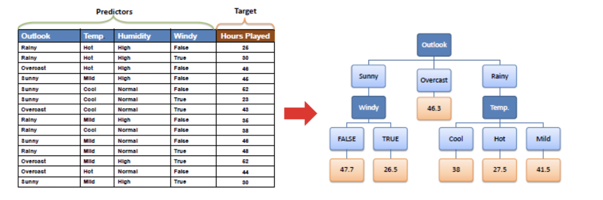
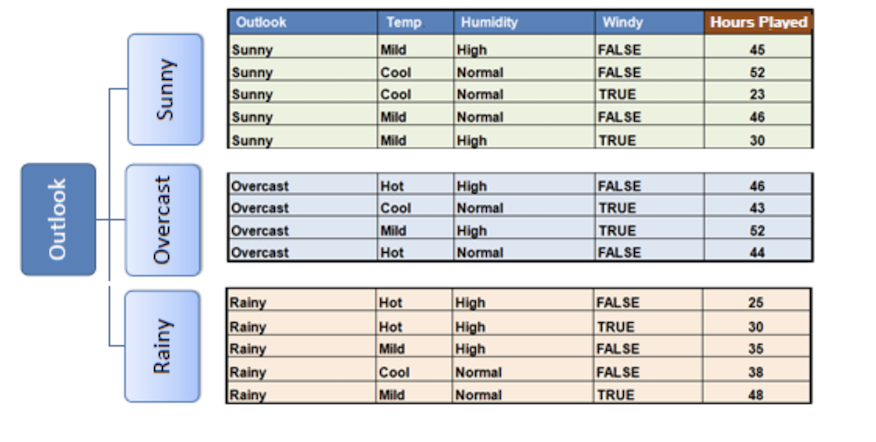
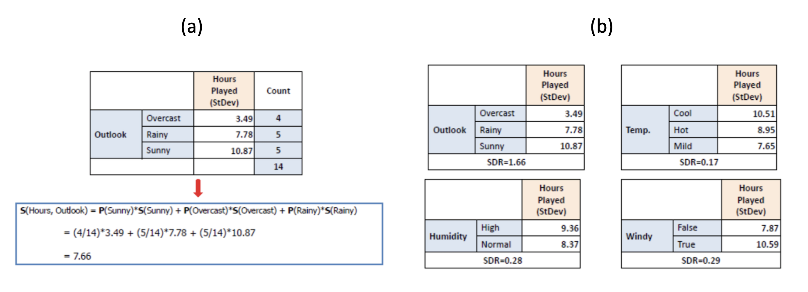

# Decision Tree - Regression

This article is dedicated to describe how a DT works in regreesion problems, followed by [[Saed Sayad]][Decision Tree - Regression]. 

Suppose we have a dataset like

where attributes (predictors) are `X = (outlook, temp, humidity, windy)`, and the target variable is `y = hours played`, which is continuous. Therefore it is a regression problem. We will explain how to create a regression model as shown above (on the right).

## Split Features Using Continuous Targets

For each split, we compute standard deviation (SD) for each attribute, and choose the attribute with maximal **Standard Deviation Reduction (SDR)** to split. The SD is computed for each attribute as 

$$S(X, y) = \sum_{c}P(c)S(c).$$

The processes are as folllows:

1. First, at root, we compute SD for target variables `hours played`. The average `hours play` (target) is 39.8 and the SD is 9.32.

2. Next we choose an attribute. Suppose we choose `overlook` to split, there are three categories: "overcast", "rainy", "sunny". After that, the data will be split as follows:
 

Then the SDR is computed `S("overlook", "hours played") = 9.32 - 7.66 = 1.66` (shown as below (a))  

3. Similarly, we compute SDR for other attributes, as shown in (b). Among these predictors, `outlook` attribute has maximal SDR, so we select `overlook` to split first.

## Coefficient of Variation

In [[Saed Sayad]][Decision Tree - Regression], the author mentioned using Coefficient of Variance (CV), to decide when to stop splitting in the DTR. CV is defined as SD/mean. 

Followed the above exmaple, after first split, in the `overlook = overcast` branch, CV is 8%, below threshold 10%. Therefore we can stop to split this branch.

## Reference

[Decision Tree - Regression]: https://www.saedsayad.com/decision_tree_reg.htm#:~:text=Decision%20tree%20builds%20regression%20or,decision%20nodes%20and%20leaf%20nodes.
[[Saed Sayad] Decision Tree - Regression](https://www.saedsayad.com/decision_tree_reg.htm#:~:text=Decision%20tree%20builds%20regression%20or,decision%20nodes%20and%20leaf%20nodes.)

