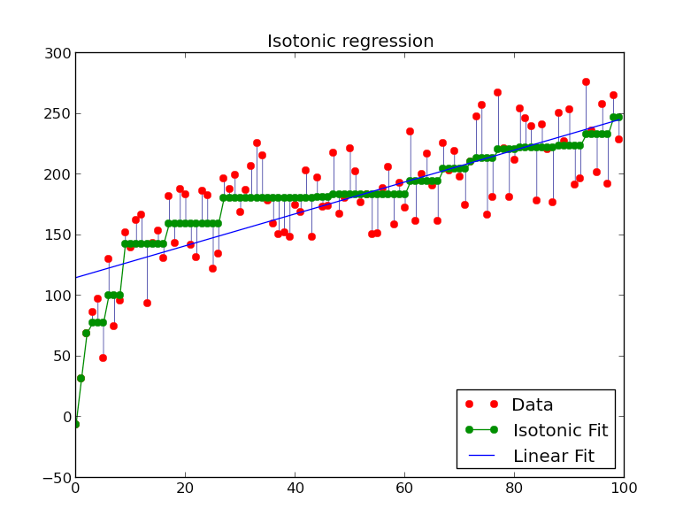
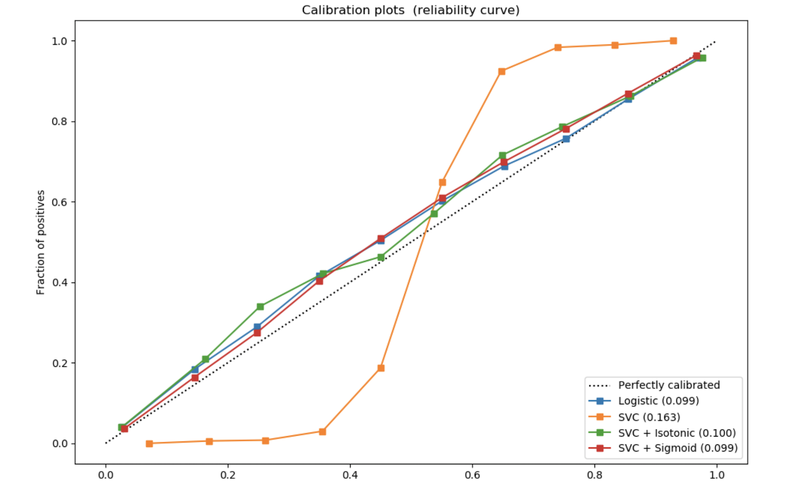

# Isotonic Regression

In machine learning, a classifier has outcome to predict, `p(y=1|X)`, the probability of finding a positive event, given data `X`. In reality, however, the predictive probability may be deviated away from the true positive probability, defined as `Pf` from data. To make the predictive probability more informational, we can perform probability calibration, building the map: `p(y=1|X) -> Pf`. In general there are two approaches: Platt's scaling and isotonic regression [[FastML]][Classifier calibration with Platt's scaling and isotonic regression]. Here we only focus on the later. 

The idea for the isotonic regression model is to fit a piecewise-constant non-decreasing function instead of logistic regression. Piecewise-constant non-decreasing means stair-step shaped. Here is an example (credit from sklearn):

We can see the linear regression just gives the above example in a linear fit. However, the isotonic regression shows a better fit the monotonic relationship. For classification, we show another example of usage of isotonic regression (credit from[sklearn: Probability Calibration curves](https://scikit-learn.org/stable/auto_examples/calibration/plot_calibration_curve.html#sphx-glr-auto-examples-calibration-plot-calibration-curve-py)):

This example describes predictive probability vs true positive probability. The model linear support-vector classifier (SVC) gives predictive probabilities, but they over-estimate 

2. Missing Completely at Random (MCAR): This form exists when the missing values are randomly distributed across all observations.  This form can be confirmed by partitioning the data into two parts: one set containing the missing values, and the other containing the non missing values.  After partitioning the data, the most popular test, called the **t-test**, is carried out in order to check **whether there exists any difference in the sample between the two data-sets** [[2]][Missing Values in Data].

3. Missing not at Random (MNAR): Two possible reasons are that the missing value depends on the hypothetical value (e.g. People with high salaries generally do not want to reveal their incomes in surveys) or missing value is dependent on some other variable’s value (e.g. Let’s assume that females generally don’t want to reveal their ages! Here the missing value in age variable is impacted by gender variable)

In the first two cases, it is safe to remove the data with missing values depending upon their occurrences, while in the third case removing observations with missing values can **produce bias** in the model.

# Reference

[Classifier calibration with Platt's scaling and isotonic regression]: http://fastml.com/classifier-calibration-with-platts-scaling-and-isotonic-regression/
[[FastML] Classifier calibration with Platt's scaling and isotonic regression](http://fastml.com/classifier-calibration-with-platts-scaling-and-isotonic-regression/)

[Missing Values in Data]: http://www.statisticssolutions.com/missing-values-in-data/
[[2] Missing Values in Data](http://www.statisticssolutions.com/missing-values-in-data/)

    
